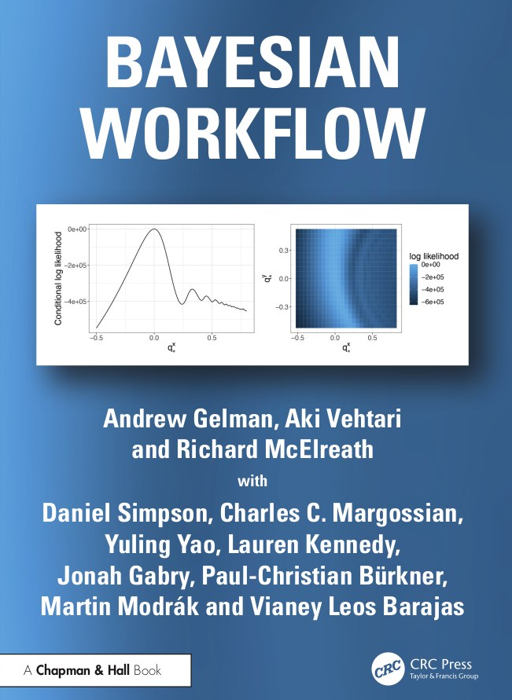

class: middle, center, title-slide

# Foundations of Data Science

Fall 2026

  
Prof. Gilles Louppe 
[g.louppe@uliege.be](mailto:g.louppe@uliege.be)

---

# Course hub

Instructions and materials are all available on GitHub [github.com/glouppe/dats0001-foundations-of-data-science](https://github.com/glouppe/dats0001-foundations-of-data-science):
- Schedule
- Slides and notebooks
- Project

---

# Main reference

.grid[
.kol-2-3[
Gelman, Vehtari, McElreath et al., [Bayesian Workflow](https://avehtari.github.io/Bayesian-Workflow/), Chapman & Hall/CRC, 2026.
- Electronic edition freely available for non-commercial use.
- Relevant chapters are pointed to from the lectures.
- Case studies are in R and Stan (we use Python for the course).
]
.kol-1-3[.width-100[]]
]

---

# Lectures

- Mondays, 1:30 PM
- Come with your laptop! 

---

# Case study

- Practice your data science skills through an end-to-end analysis. 
- Presentation/defense of your analysis and results. 

---

# Exam

Oral exam on theory covered in class.

---

# Evaluation

- Case study (40%)
- Oral exam (60%)

.alert[A minimum of 8/20 is required for each component. Below that, the lowest of the two grades becomes the final grade.]

---

# Use of AI tools

.success[AI assistants are .bold[allowed], without restriction.]

The rule is simple: everything you submit, you must be able to explain. Submitting an analysis you do not understand, because an assistant produced it, will be strongly penalized.

