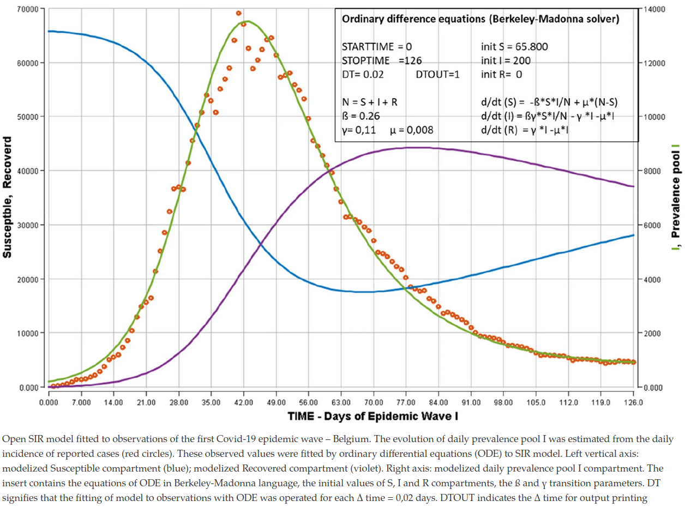
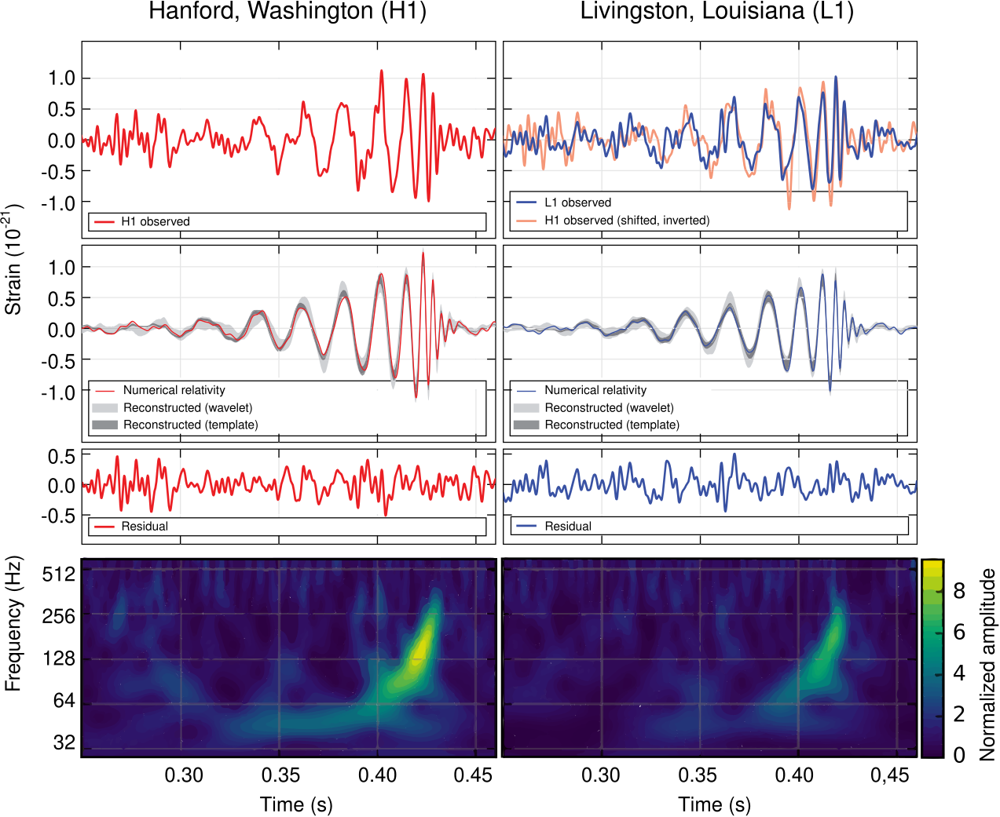
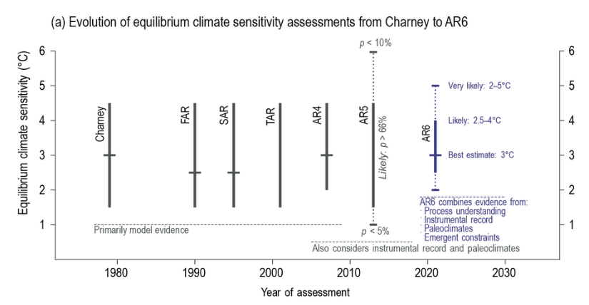
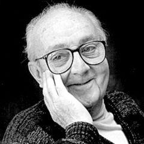
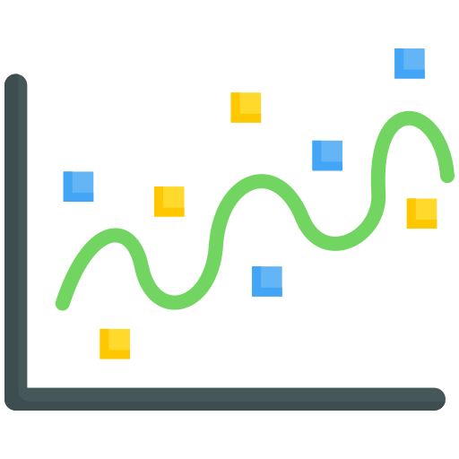
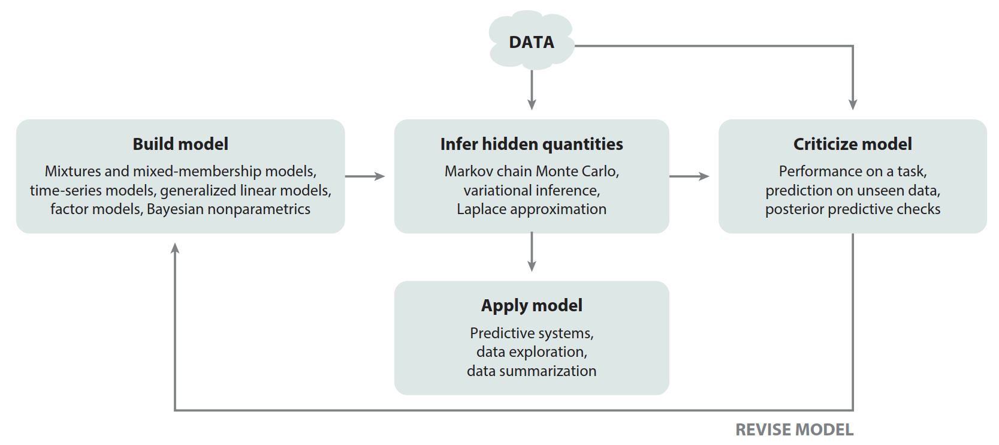
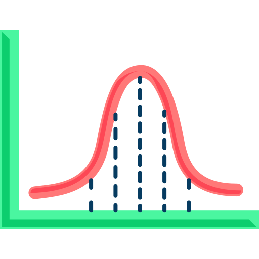
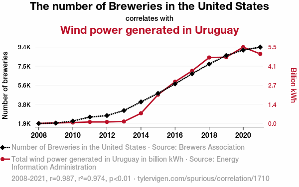
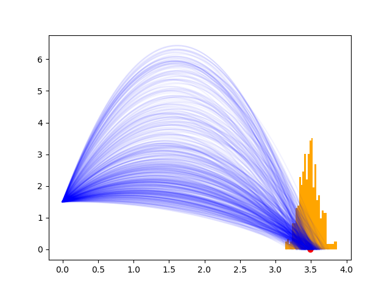
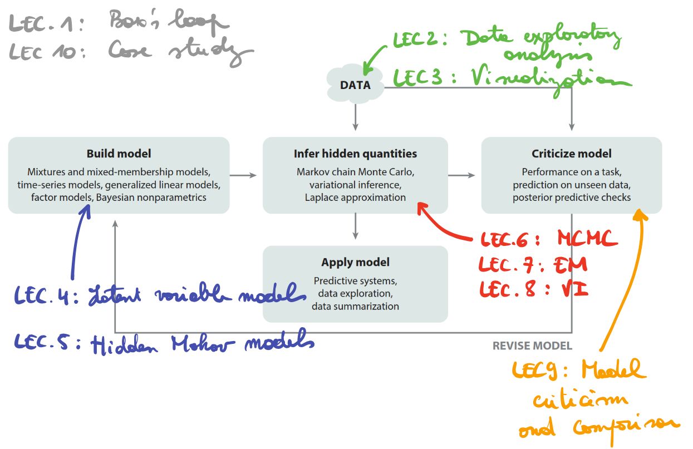

class: middle, center, title-slide

# Foundations of Data Science

Lecture 1: Build, compute, critique, repeat

  
Prof. Gilles Louppe 
[g.louppe@uliege.be](g.louppe@uliege.be)

???

- Raise your hand if you remember March 2020.
- You witnessed one of the largest real-time demonstrations of scientific modeling in human history. 
- Epidemiologists built models, made predictions, watched them fail, rebuilt them, and repeated. 
- That process you witnessed? That's what this entire course is about.

---

class: middle

## COVID-19 epidemiological models

.center.width-75[]

.center[Predictions of the first wave of COVID-19 in Belgium, 2020.  Many models failed to predict the peak and duration of the wave.]

???

- Build: Compartmental models (SIR, SEIR).
- Compute: Infection rate, peak and duration of the wave.
- Critique: Models failed to predict waves accurately.
- Repeat: Added behavioral changes, vaccination dynamics, variants.
- Impact: Informed public health policy worldwide.

---

class: middle 

## Gravitational wave detection 

.center.width-75[]

.center[First direct detection of gravitational waves, LIGO, 2015.  Many false alarms before the first confirmed detection.]

???

- Build: General relativity model describing gravitational waves as ripples in spacetime. Initial LIGO (2002-2010). 
- Compute: Searched for signals but found none due to noise / lack of sensitivity.
- Critique: Sensitivity insufficient, noise poorly characterized.
- Repeat: Advanced LIGO (2015-now), upgraded detectors, improved noise modeling.
- Impact: Nobel Prize 2017, opened new field of astronomy.

---

class: middle 

## Equilibrium climate sensitivity

.center.width-90[]

.center[What is the Earth's temperature increase if we double atmospheric CO2?  Over 40 years, uncertainty narrowed from 3°C range to 1.5°C range.]

???

- Build: Each IPCC report builds a model of equilibrium climate sensitivity (average global temperature increase if CO2 doubles).
- Compute: Estimate sensitivity from climate models and observations.
- Critique Each assessment identified limitations in previous estimates.
- Repeat: AR6 (assessment report 6, 2021) reduced uncertainty to 2.5-4°C from the long standing 1.5-4.5°C range.
- Impact: Informs climate policy worldwide.

---

class: middle

.avatars[]

# Box's loop

All models are wrong, but some are useful. -- George Box.

---

class: middle

.center.width-10[]

## What is data science?

Data science is the discipline of .bold[extracting knowledge] from data through the iterative application of the .bold[scientific method].

But how? 

???

Data science is not about tools, big datasets or statistics.

---

class: middle

.avatars[]

## Box's loop

.center.width-100[]

.center[Scientific inquiry as an iterative process: build, compute, critique, repeat. ]

.footnote[Credits: [Blei](https://www.cs.columbia.edu/~blei/fogm/2020F/readings/Blei2014.pdf), 2014.]

---

class: middle

.center.width-10[]

## Step 1: Build

The first step to understanding a phenomenon is to .bold[build a model] of it, as a simplified representation that captures its essential aspects.

- A model specifies assumptions about the data generating process.
- It encodes domain knowledge and constraints.
- It is formulated within an appropriate mathematical abstraction.
- It defines what you observe and what you do not observe but assume exists.

---

class: middle

.center.width-10[]

## Step 2: Compute

The next step is to .bold[compute] what the data tells you about the phenomenon of interest under the assumptions of your model.

- Fitting the model to data involves solving an optimization problem.
- Inference is used to answer questions about unobserved quantities.
- Prediction is used to answer questions about future or unseen data.

---

class: middle

.center.width-10[]

## Step 3: Critique

The third step is to .bold[critique] the model and its predictions, to assess whether they are consistent with the data and domain knowledge.

- Compare predictions to observed data.
- Identify model limitations and mismatches.
- Reject the model if it fails to capture key aspects of the data.

---

class: middle

.center.width-10[]

## Step 4: Repeat

What you learn from the critique step informs how to .bold[repeat] the process.

- Add complexity to the model to address its shortcomings.
- Simplify the model to improve interpretability.
- Change the model to explore alternative hypotheses.

---

class: middle

## Why this approach matters?

The Fourth paradigm (Hey et al, 2009) of science emphasizes the importance of data-intensive scientific discovery. However, data alone is not enough.

- Data without theory leads to spurious correlations.
- Theory without data leads to ungrounded speculation.
- Together, they enable .bold[robust scientific inquiry].

---

class: middle

.center.width-80[]
.center[Spurious correlation can easily mislead data analysis.]

---

class: middle

The scientific method, as embodied in Box's loop, provides a principled framework for data analysis. It contrasts with .bold[ad-hoc data analysis practices that often lead to unreliable results].

- Throw algorithms at data and see what sticks.
- Focus only on prediction accuracy.
- Treat models as black boxes.
- Stop at the first somewhat satisfactory result.

---

class: middle

Box's loop encourages
- transparent reasoning about assumptions,
- understanding mechanisms behind data, not just correlations,
- honest assessment of model limitations,
- continuous improvement and learning.

---

class: middle

## Today's example: Projectile motion

A ball is thrown and lands at some measured distance $x$. What can infer about the initial velocity $v$ and angle $\alpha$ of the throw?

.center.width-75[]

---

class: middle

Let's code! 

- Open a Jupyter notebook and follow along (or check `nb01.ipynb` after the lecture).
- Implement Box's loop step by step: 
  1. Build a simple physical model of projectile motion.
  2. Compute estimates of $v$ and $\alpha$ from data.
  3. Critique the model fit and predictions.
  4. Repeat by refining the model to account for more realistic factors.

---

class: middle

# DATS0001

---

# Outline

- Lecture 1: Build, compute, critique, repeat
- Lecture 2: Data and exploratory analysis
- Lecture 3: Visualization 
- Lecture 4: Latent variable models
- Lecture 5: Hidden Markov models 
- Lecture 6: Markov Chain Monte Carlo
- Lecture 7: Expectation-Maximization
- Lecture 8: Variational Inference
- Lecture 9: Model criticism and validation
- Lecture 10: Case study

---

class: middle

.center.width-100[]

---

class: middle

## My mission

Teach you how to think like a scientist in the age of data.

By the end of this course, you will be able to explore, model, and reason about data in a principled way, but also to communicate your findings effectively.

---

class: end-slide, center
count: false

The end.
