class: middle, center, title-slide

# Foundations of Data Science

Lecture 1: Build, compute, critique, repeat

  
Prof. Gilles Louppe 
[g.louppe@uliege.be](mailto:g.louppe@uliege.be)

???

- Raise your hand if you remember March 2020.
- You witnessed one of the largest real-time demonstrations of scientific modeling in human history. 
- Epidemiologists built models, made predictions, watched them fail, rebuilt them, and repeated. 
- That process you witnessed? That's what this entire course is about.

---

class: middle

## COVID-19 in Belgium

.center.width-60[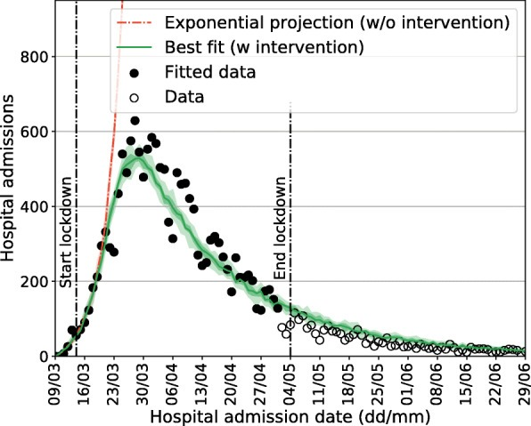]

.center[Belgian hospital admissions in 2020 (dots) and a model with lockdown (green).  Without the lockdown, the model projects exponential growth (red).]

.footnote[Credits: [Coletti et al.](https://doi.org/10.1186/s12879-021-06092-w), 2021 (CC BY 4.0).]

???

- Build: a model of the Belgian population, with age groups, social contacts and mobility, calibrated on daily hospital admissions.
- Compute: the first wave with the lockdown (green), and the exponential growth without it (red).
- Critique: after the gradual reopening from May 4, 2020, the model expected hospitalizations to rise again. They did not.
- Repeat: people had changed how they met (distance, masks, outdoor contacts). Models had to account for behaviour.
- Impact: Belgian modellers directly supported national and regional decisions throughout the pandemic.

---

class: middle

## Floods in the Vesdre valley

.grid[
.kol-1-2[.center.width-100[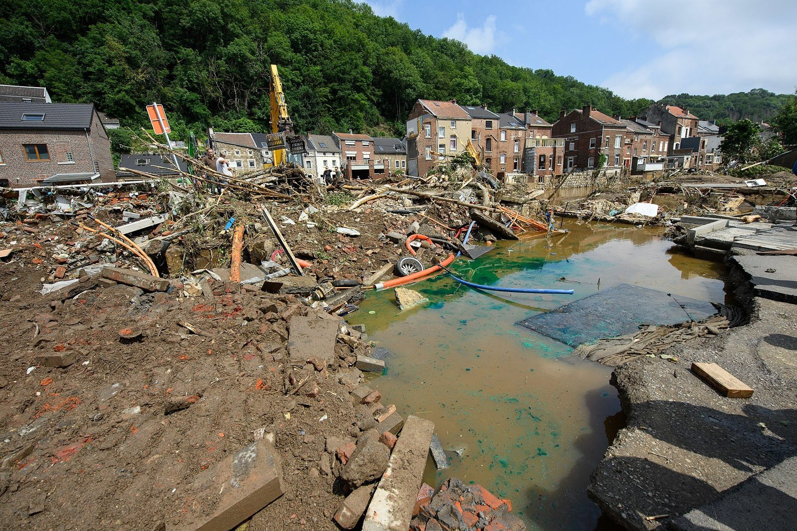]]
.kol-1-2[.center.width-100[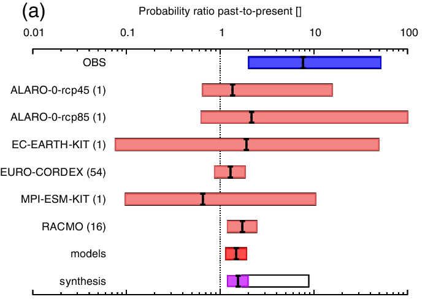]]
]

.center[Pepinster after the floods of July 2021, which killed 38 people in Belgium.  Climate change made such rainfall 1.2 to 9 times more likely (right).]

.footnote[Credits: Christophe Licoppe, [European Commission](https://commons.wikimedia.org/wiki/File:Visit_of_Ursula_von_der_Leyen,_President_of_the_European_Commission,_to_Rochefort_and_Pepinster_in_Belgium_12.jpg) (CC BY 4.0); [Tradowsky et al.](https://doi.org/10.1007/s10584-023-03502-7), 2023, Fig. 8a, cropped (CC BY 4.0).]

???

- Build: statistical models of extreme rainfall, and climate models of today's world and of a world 1.2°C cooler.
- Compute: how likely and how intense such rainfall is in each world.
- The plot: how many times more likely the event is today than in a 1.2°C cooler climate, for the wider region, according to observations (blue), each climate model (red), and their synthesis (bottom).
- Critique: models are first checked against observed rainfall; only those that pass are kept.
- Repeat: a rapid study within weeks of the floods, refined into a peer-reviewed analysis in 2023.
- Impact: over 200 deaths across Western Europe; such events will become more frequent with further warming.

---

class: middle

## Gravitational wave detection

.center.width-65[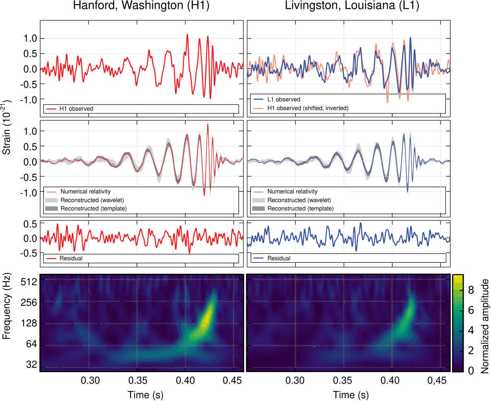]

.center[First direct detection of gravitational waves, LIGO, 2015.  The measured signal matches the waveform predicted by general relativity.]

.footnote[Credits: [Abbott et al.](https://doi.org/10.1103/PhysRevLett.116.061102), 2016 (CC BY 3.0).]

???

- Build: general relativity predicts the waveform of two merging black holes; detector noise is modelled too.
- Compute: match the data against predicted waveforms and infer the masses (36 and 29 solar masses) and distance (about 1.3 billion light-years).
- Critique: initial LIGO (2002-2010) detected nothing; fake signals were secretly injected to test the analysis.
- Repeat: Advanced LIGO, with more sensitive detectors and better noise models, detected the first signal on 14 September 2015.
- Impact: Nobel Prize 2017, and a new way to observe the universe.

---

class: middle

.avatars[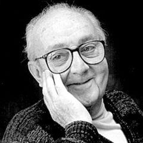]

# Box's loop

All models are wrong, but some are useful. -- George Box.

---

class: middle

.center.width-10[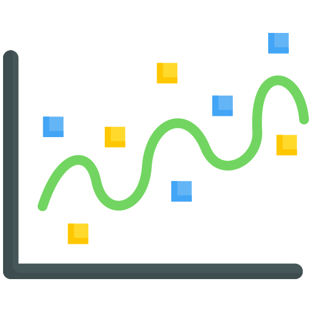]

## What is data science?

Data science is the discipline of .bold[extracting knowledge] from data through the iterative application of the .bold[scientific method].

But how? 

???

Data science is not about tools, big datasets or statistics.

---

class: middle

.avatars[]

## Box's loop

.center.width-100[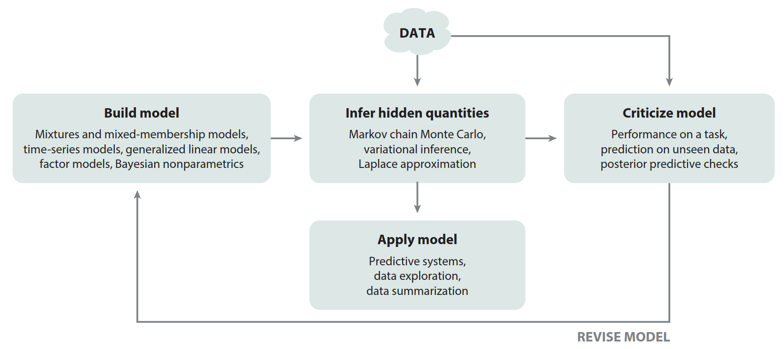]

.center[Scientific inquiry as an iterative process: build, compute, critique, repeat. ]

.footnote[Credits: [Blei](https://www.cs.columbia.edu/~blei/fogm/2020F/readings/Blei2014.pdf), 2014.]

---

class: middle

.center.width-10[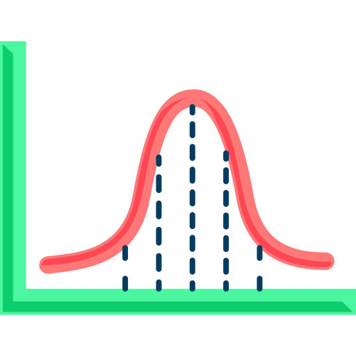]

## Step 1: Build

The first step to understanding a phenomenon is to .bold[build a model] of it, as a simplified representation that captures its essential aspects.

- A model specifies assumptions about the data generating process.
- It encodes domain knowledge and constraints.
- It is formulated within an appropriate mathematical abstraction.
- It defines what you observe and what you do not observe but assume exists.

---

class: middle

.center.width-10[]

## Step 2: Compute

The next step is to .bold[compute] what the data tells you about the phenomenon of interest under the assumptions of your model.

- Fitting the model to data involves solving an optimization problem.
- Inference runs the model backward, from observed data to the unobserved quantities that could have produced them.
- Prediction is used to answer questions about future or unseen data.

---

class: middle

.center.width-10[]

## Step 3: Critique

The third step is to .bold[critique] the model and its predictions, to assess whether they are consistent with the data and domain knowledge.

- Compare predictions to observed data.
- Identify model limitations and mismatches.
- Reject the model if it fails to capture key aspects of the data.

---

class: middle

.center.width-10[]

## Step 4: Repeat

What you learn from the critique step informs how to .bold[repeat] the process.

- Add complexity to the model to address its shortcomings.
- Simplify the model to improve interpretability.
- Change the model to explore alternative hypotheses.

---

class: middle

## The loop, in practice

.center.width-55[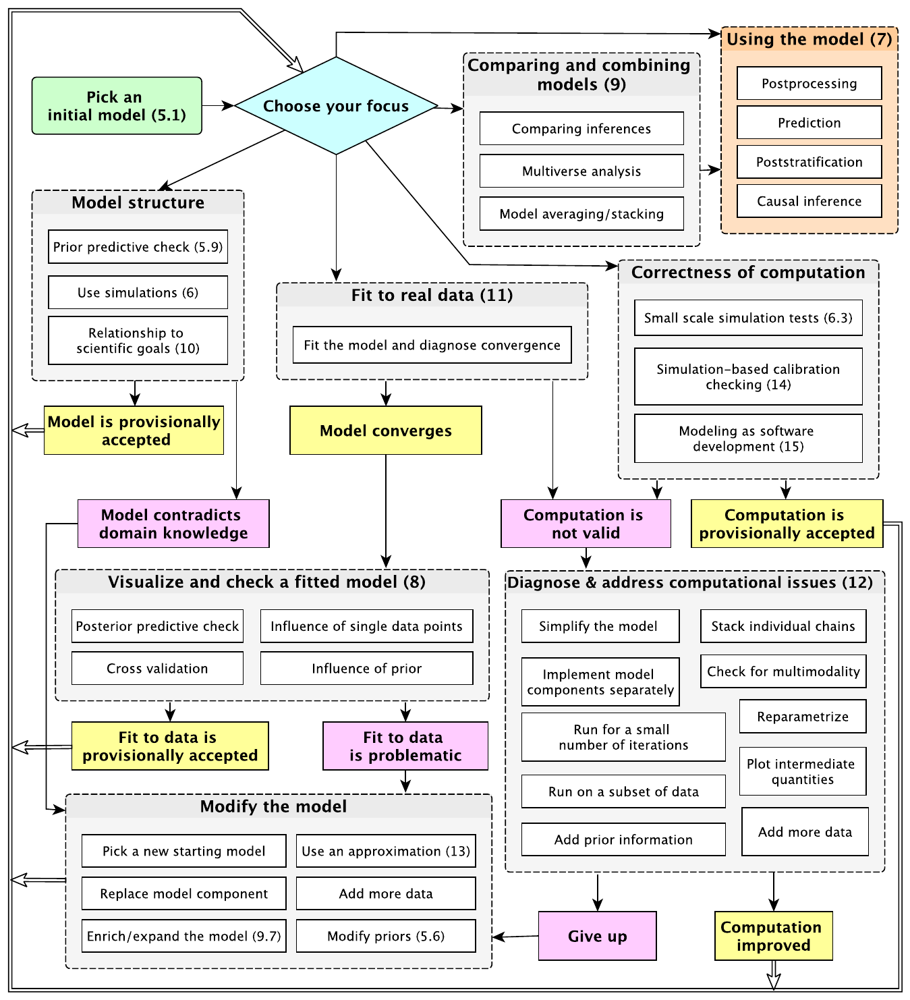]

.center[Bayesian workflow: the steps and paths an analysis may go through.]

.footnote[Credits: [Gelman, Vehtari, McElreath et al.](https://avehtari.github.io/Bayesian-Workflow/), Bayesian Workflow, 2026 (Figure 2.1).]

---

class: middle

## Why this approach matters?

The Fourth paradigm (Hey et al, 2009) of science emphasizes the importance of data-intensive scientific discovery. However, data alone is not enough.

- Data without theory leads to spurious correlations.
- Theory without data leads to ungrounded speculation.
- Together, they enable .bold[robust scientific inquiry].

---

class: middle

.center.width-80[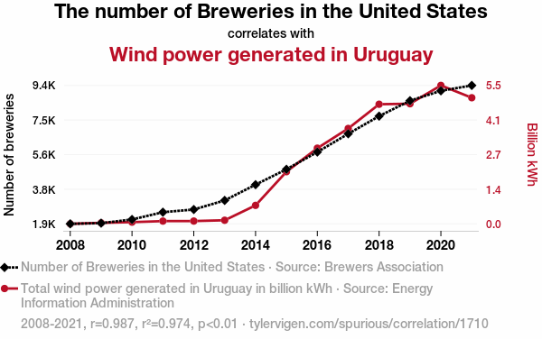]
.center[Spurious correlation can easily mislead data analysis.]

---

class: middle

.grid[
.kol-1-2.center[.width-80[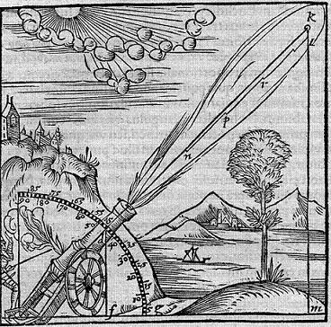]]
.kol-1-2.center[.width-100[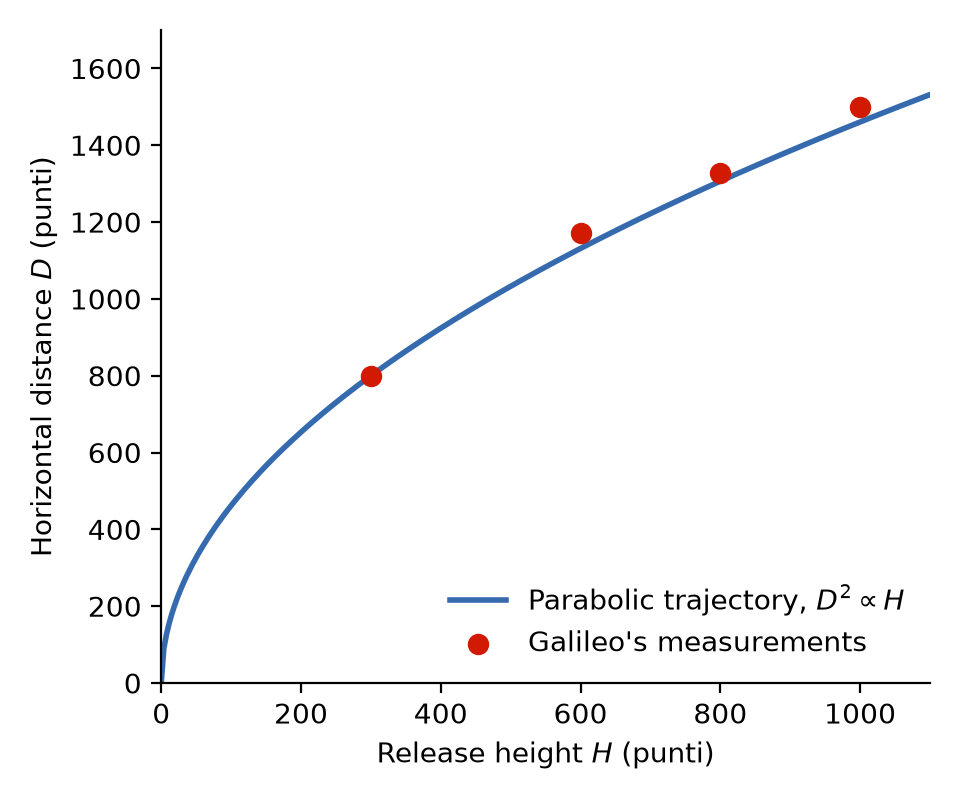]]
]

.center[Theory without data: the trajectory implied by Aristotelian physics (left),  against Galileo's measurements, consistent with a parabola (right).]

.footnote[Credits: [Santbech](https://commons.wikimedia.org/wiki/File:Santbech.JPG), 1561; Galileo's folio 116v data from [Breiland](https://doi.org/10.1088/1361-6404/ac93c6), 2022.]

---

class: middle

The scientific method, as embodied in Box's loop, provides a principled framework for data analysis. It contrasts with .bold[ad-hoc data analysis practices that often lead to unreliable results].

- Throw algorithms at data and see what sticks.
- Focus only on prediction accuracy.
- Treat models as black boxes.
- Stop at the first somewhat satisfactory result.

---

class: middle

Box's loop encourages
- transparent reasoning about assumptions,
- understanding mechanisms behind data, not just correlations,
- honest assessment of model limitations,
- continuous improvement and learning.

---

class: middle

## Today's example: Projectile motion

A ball is thrown and lands at some measured distance $x$. What can infer about the initial velocity $v$ and angle $\alpha$ of the throw?

.center.width-75[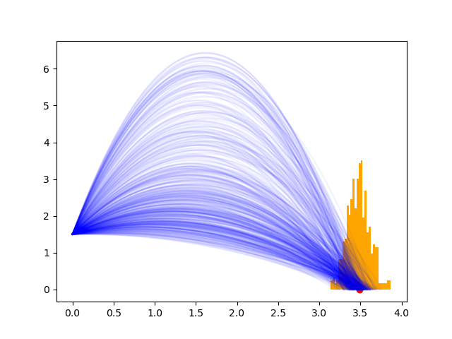]

---

class: middle

Let's code! 

- Open a Jupyter notebook and follow along (or check `nb01.ipynb` after the lecture).
- Implement Box's loop step by step: 
  1. Build a simple physical model of projectile motion.
  2. Compute estimates of $v$ and $\alpha$ from data.
  3. Critique the model fit and predictions.
  4. Repeat by refining the model to account for more realistic factors.

---

class: middle

# DATS0001

---

# Outline

- Lecture 1: Build, compute, critique, repeat
- Lecture 2: Data and exploratory analysis
- Lecture 3: Visualization 
- Lecture 4: Latent variable models
- Lecture 5: State-space models
- Lecture 6: Markov Chain Monte Carlo
- Lecture 7: Model criticism and validation
- Lecture 8: Expectation-Maximization
- Lecture 9: Variational Inference
- Lecture 10: Simulation-based inference
- Lecture 11: Case study

---

class: middle

.center.width-100[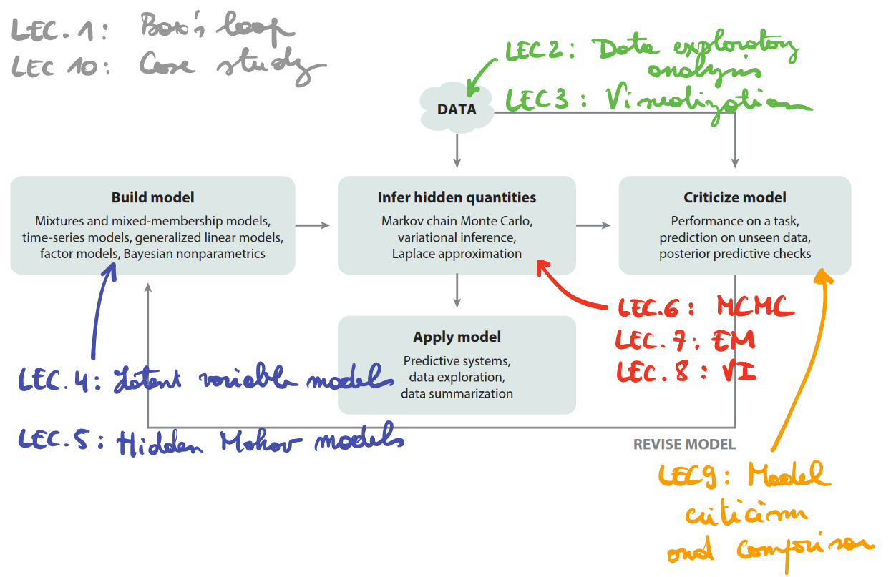]

---

class: middle

## My mission

Teach you how to think like a scientist in the age of data.

By the end of this course, you will be able to explore, model, and reason about data in a principled way, but also to communicate your findings effectively.

---

class: end-slide, center
count: false

The end.
