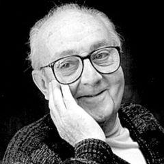
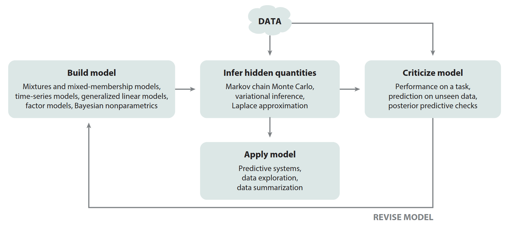

class: middle, center, title-slide

# Foundations of Data Science

Lecture 10: Case study

  
Prof. Gilles Louppe 
[g.louppe@uliege.be](g.louppe@uliege.be)

---

class: middle

.avatars[]

## Box's loop

.center.width-100[]

.center[Scientific inquiry as an iterative process: build, compute, critique, repeat. ]

.footnote[Credits: [Blei](https://www.cs.columbia.edu/~blei/fogm/2020F/readings/Blei2014.pdf), 2014.]

---

class: middle

## Case study: Estimating air pollution from satellite data

See `nb10-case-study.ipynb`.

---

class: end-slide, center
count: false

The end.
