class: middle, center, title-slide

# Foundations of Data Science

Lecture 2: Data and exploratory analysis

<br><br>
Prof. Gilles Louppe<br>
[g.louppe@uliege.be](g.louppe@uliege.be)

---

class: middle

# Data

---

class: middle

.center.width-10[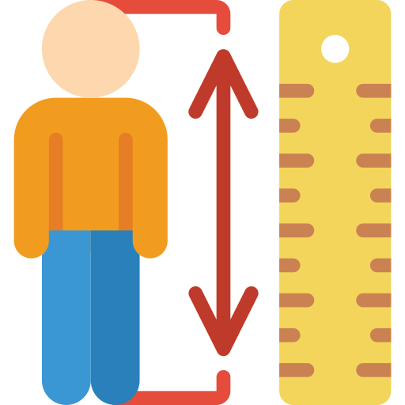]

## What is data?

Data are .bold[recorded observations] about the world.

They can take many forms, including numbers, text, images, and more. 

---

class: middle

Mathematically, data can be viewed as a function $f$ that maps real-world entities $\omega$ to measurable values $x$,
$$f : \Omega \to \mathcal{X},$$
where
- $\Omega$ is the sample space of possible states $\omega$ of the world,
- $\mathcal{X}$ is the measurement space of possible observations $x$.

---

class: middle

Examples&#58;
- Person's height: $\omega \in \\{ \text{all humans} \\} \to x \in \mathbb{R}^+$ (cm)
- Stock price: $\omega \in \\{ \text{market states} \\} \to x \in \mathbb{R}^+$ (USD)
- Image pixels: $\omega \in \\{ \text{light intensities} \\} \to x \in [0, 255]^3$ (RGB values)

---

class: middle

If the sample space $\Omega$ is equipped with a probability function $p$, then the data $x = f(\omega)$ can be viewed as a random variable with distribution induced by $p$, $$x \sim p(x) = \int_{\omega \in \Omega} p(\omega) \delta(x - f(\omega)) d\omega,$$ where $\delta$ is the Dirac delta function.

---

class: middle

The .bold[measurement process] is part of the data generation mechanism and can be modeled by extending the sample space to include measurement conditions $\theta$, $$f : \Omega \times \Theta \to \mathcal{X},$$ where $\Theta$ represents factors like instrument settings, environmental conditions, and observer effects. 

Measurements can introduce quantization (continuous to discrete), noise (random perturbations), and bias (systematic deviations).

---

class: middle

As before, if both $\Omega$ and $\Theta$ are equipped with a joint probability function $p$, then the data $x = f(\omega, \theta)$ can be viewed as a random variable with distribution induced by $p$, $$x \sim p(x) = \iint\_{\omega \in \Omega, \theta \in \Theta} p(\omega, \theta) \delta(x - f(\omega, \theta)) d\omega d\theta,$$ which now captures the variability introduced by both the underlying phenomena and the measurement process.

---

class: middle

## Data types

Atomic data are the indivisible units of information collected through measurements. It is often categorized based on its nature and the operations that can be performed on it.

- Numerical (continuous, discrete)
- Categorical (nominal, ordinal)

---

class: middle

Numerical data
- Continuous: $x \in \mathbb{R}$ (e.g., temperature), $x \in \mathbb{R}^+$ (e.g., height, weight)
- Discrete: $x \in \mathbb{Z}$ (e.g., counts)

---

class: middle

Categorical data
- Nominal: $x \in \mathcal{C} = \\{c\_1, c\_2, ..., c\_n \\}$ (e.g., colors, types, text characters) without intrinsic order
- Ordinal: $x \in \mathcal{C}$ with ordering relations $c\_1 \prec c\_2 \prec ... \prec c\_n$ (e.g., ratings, grades))

---

class: middle 

.center.width-10[]

```
Patient ID: 10847        # Categorical, Nominal 
Age: 34                  # Numerical, Discrete  
Height: 175.2 cm         # Numerical, Continuous
Blood type: O+           # Categorical, Nominal
Pain level: 7/10         # Categorical, Ordinal
Temperature: 38.1°C      # Numerical, Continuous
```

---

class: middle

## Data structures

A measurement $x$ can be a single atomic value or a composite structure made of multiple atomic values. Common data structures include:

- Tabular data
- Arrays and tensors
- Networks and graphs
- Sequences

---

class: middle

.grid[
.kol-1-2.center[Tabular data<br>.width-100[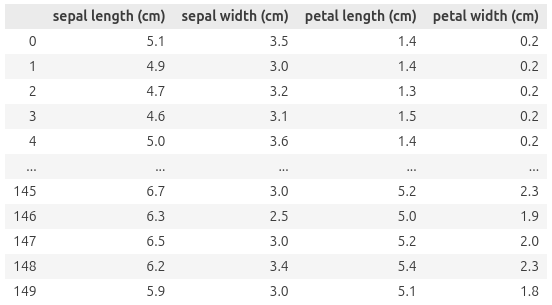]]
.kol-1-2.center[Arrays and tensors<br>.width-60[]]
]
.grid[
.kol-1-2.center[Networks and graphs<br>.width-70[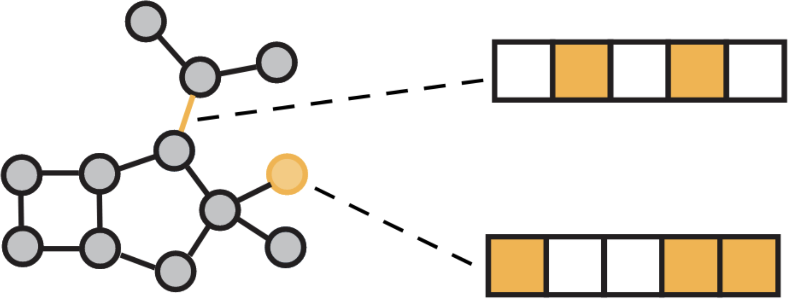]]
.kol-1-2.center[Sequences

`['F', 'l''o', 'w', 'e', 'r', 's']`]`
]

---

class: middle

Data frames $\mathbf{X}$ represents .bold[tabular collections] of $n$ records (rows) over $d$ variables/atomic measurements (columns),
$$\mathbf{X} = \begin{pmatrix}
x\_{11} & x\_{12} & \cdots & x\_{1d} \\\\
x\_{21} & x\_{22} & \cdots & x\_{2d} \\\\
\vdots & \vdots & \ddots & \vdots \\\\
x\_{n1} & x\_{n2} & \cdots & x\_{nd}
\end{pmatrix}.$$

Each entry $x\_{ij}$ corresponds to the value of variable $j$ for record $i$.

When all variables are numerical and continuous, $\mathbf{X}$ is a matrix $\mathbb{R}^{n \times d}$.

---

class: middle

Collections of homogeneous measurements can be represented as .bold[arrays] or .bold[tensors], where the position of each atomic value in the array is usually associated to spatial or temporal location.
- Images: 3d arrays $\mathbf{X} \in [0, 255]^{h \times w \times c}$ (height, width, channels).
- Videos: 4d arrays $\mathbf{X} \in [0, 255]^{t \times h \times w \times c}$ (time, height, width, channels).

---

class: middle

Data can also be organized as .bold[networks] or .bold[graphs] $G = (V, E)$, where entities are represented as nodes $V$ and relationships as edges $E$. Each may also have associated attributes, $x\_v$ for nodes and $x\_{uv}$ for edges.
- Molecular structures, where nodes represent atoms and edges represent bonds.
- Social networks, where nodes represent individuals and edges represent interactions or relationships.

---

class: middle

Finally, data can be structured as ordered .bold[sequences] $S = (x\_1, x\_2, ..., x\_T)$ indexed by time or position. Each element $x\_t$ can be atomic or composite.
- Time series: $S = (x\_1, x\_2, ..., x\_T)$ where $x\_t$ is a measurement at time $t$ (e.g., stock prices).
- Text: $S = (w\_1, w\_2, ..., w\_T)$ where $w\_t$ is the $t$-th word in a document.

---

class: middle

## Data quality 

Real-world data are often imperfect and may suffer from various .bold[quality issues] that can impact analysis and modeling. Common data quality issues include:
- Missing values
- Measurement errors

---

class: middle

.bold[Missing values] are common in real-world datasets and can arise from various factors such as non-response in surveys, sensor malfunctions, or data corruption. 

Let $\mathbf{X}\_\text{full} \in \mathbb{R}^{n \times d}$ be a complete data matrix and $\mathbf{M} \in \\{0, 1\\}^{n \times d}$ be the missing data indicator matrix, where $m\_{ij} = 1$ if entry $ij$ is observed and $m\_{ij} = 0$ if it is missing. The observed data can be represented as $\mathbf{X} = \mathbf{X}\_\text{full} \odot \mathbf{M}$, where $\odot$ denotes the element-wise product.

---

class: middle

The patterns of missingness can be modeled as part of the measurement process:
- Missing Completely at Random (MCAR): The probability of missingness is independent of both observed and unobserved data, $p(m\_{ij} = 0 | \mathbf{X}\_\text{full}) = p(m\_{ij} = 0)$.
- Missing at Random (MAR): The probability of missingness may depend on observed data but not on unobserved data, $p(m\_{ij} = 0 | \mathbf{X}\_\text{full}) = p(m\_{ij} = 0 | \mathbf{X}\_\text{obs})$. 
- Missing Not at Random (MNAR): The probability of missingness depends on unobserved data as well.

Each mechanism or assumption has implications for how to handle missing data during analysis.

---

class: middle

Example&#58;

Survey of $n=1000$ respondents, 30% refuse to answer income question.
- MCAR: Randomly selected respondents skip the question.
- MAR: Younger respondents are less likely to answer.
- MNAR: High earners refuse to answer.

Imputing missing values without considering the mechanism can lead to biased results.

---

class: middle

The measurement process can also introduce acquisition errors and produce observations that deviate significantly from regular measurements. These .bold[outliers] can arise from instrument malfunctions, data entry errors, or rare events.

---

class: middle

.center.width-50[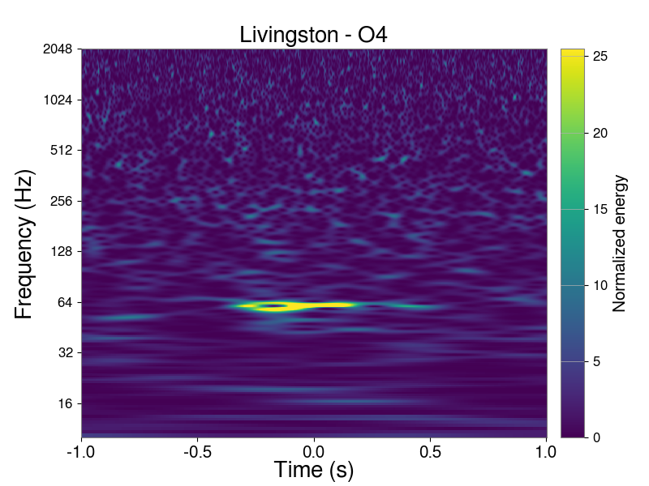]

Example&#58;

Glitches in gravitational wave detectors are outliers that can mimic true signals and complicate detection efforts. They can arise from environmental disturbances, instrumental artifacts, or other non-astrophysical sources.

---

class: middle

Treating outliers requires a model of the measurement process that either describe measurements under normal conditions or explicitly accounts for anomalies. .bold[Outliers should not be removed blindly] unless explicitly justified by the measurement model or domain knowledge.

---

class: middle

.center.width-10[]

Temperature readings in Liège:

```
20.1, 19.8, 20.3, 1000.0, 20.2, 19.9
```
The 1000.0 value is an outlier likely due to a sensor error.

```
19.2, 19.8, 20.3, 37.8, 20.2, 19.9
```
The 37.8 value is a rare but plausible measurement on a hot day.

---

class: middle

# Exploratory data analysis 

---

class: middle

.bold[Exploratory data analysis] (EDA) is the systematic examination of data to understand its structure, patterns and anomalies before formal modeling. It typically involves visual and quantitative techniques to summarize key characteristics of the data.

The goal is to generate hypotheses and inform modeling decisions, not to confirm preconceived notions.

---

class: middle, smaller

.center.width-10[]

As a guiding example, we consider the .bold[Palmer Archipelago penguins dataset], which contains measurements for three penguin species (Adelie, Chinstrap, Gentoo) across three islands (Biscoe, Dream, Torgersen). 

Switch to `nb02d-eda.ipynb` to follow along.

.footnote[Credits: [Horst et al.](https://allisonhorst.github.io/palmerpenguins/), 2020.]

---

class: middle

## Univariate analysis

Let consider a variable $j$ from a data frame $\mathbf{X} \in \mathbb{R}^{n \times d}$, represented as the vector $\mathbf{x}\_j = (x\_{1j}, x\_{2j}, ..., x\_{nj})^T$.

Univariate analysis focuses on understanding the distribution and characteristics of this single variable.

For numerical variables, common techniques include:
- Looking at the raw data: print values, scroll through them.
- Plotting the data: histograms reveal the distribution shape.
- Summarizing with statistics: mean, median, mode, variance, skewness, kurtosis.

For categorical variables:
- Counting occurrences of each category.

---

class: middle

.center[
.width-80[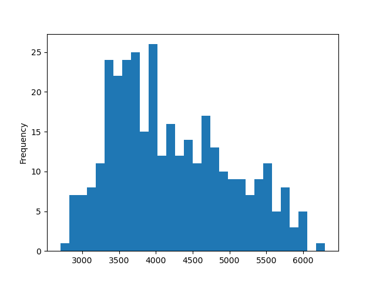]
]

.center[Numerical: Histograms of body mass for all penguins.]

---

class: middle

.center[
.width-80[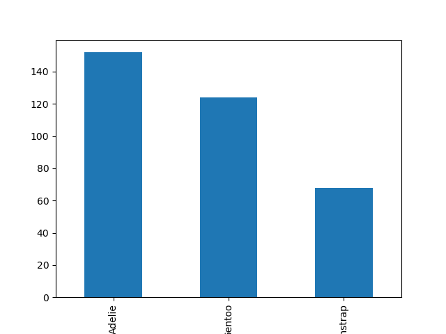]
]

.center[Categorical: Bar plot of species counts for all penguins.]

---

class: middle

## Bivariate analysis

Bivariate analysis examines the relationship between two variables $i$ and $j$ from a data frame $\mathbf{X} \in \mathbb{R}^{n \times d}$, represented as vectors $\mathbf{x}\_i$ and $\mathbf{x}\_j$.

Depending on the types of variables, different techniques are used:
- Pair plots for two numerical variables (scatter or 2d histogram).
- Multiple histograms for categorical vs numerical variables.
- Contingency tables for two categorical variables.
- Correlation coefficients (e.g., Pearson, Spearman) for numerical variables.

---

class: middle

.center.width-80[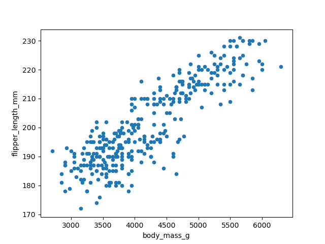]
.center[Numerical vs. numerical: Scatter plot of body mass vs flipper length.]

---

class: middle

.center.width-75[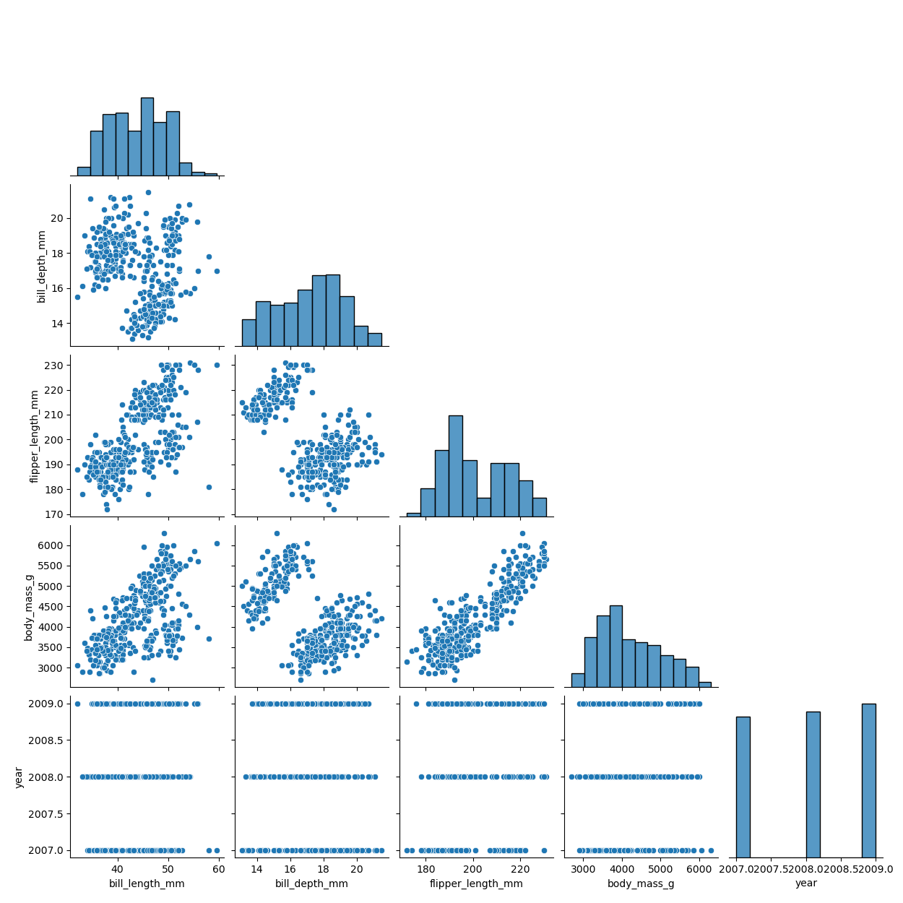]
.center[Pair plots of all numerical variables.]

---

class: middle

.center.width-80[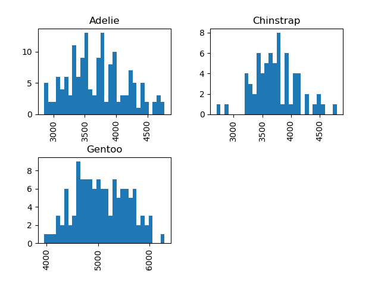]
.center[Categorical vs. numerical: Histograms of body mass by species.]

---

class: middle

.center[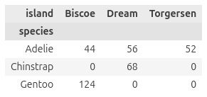]
.center[Categorical vs. categorical: Contingency table of species and island.]

---

class: middle

.bold[Correlation coefficients] can quantify the dependency between two numerical variables. They are useful but come with assumptions and limitations.

- Pearson correlation $$\rho\_{ij} = \frac{\text{cov}(\mathbf{x}\_i, \mathbf{x}\_j)}{\sigma\_{\mathbf{x}\_i} \sigma\_{\mathbf{x}\_j}}$$ measures linear relationships. It ignores non-linear dependencies.
- Spearman correlation is the Pearson correlation of the rank-transformed variables. It captures monotonic relationships.
- Correlation does not imply causation and can be affected by outliers.

---

class: middle

The .bold[mutual information] between two variables $\mathbf{x}\_i$ and $\mathbf{x}\_j$ measures the reduction in uncertainty about one variable given knowledge of the other, $$I(\mathbf{x}\_i; \mathbf{x}\_j) = \sum\_{x\_i} \sum\_{x\_j} p(x\_i, x\_j) \log \frac{p(x\_i, x\_j)}{p(x\_i)p(x\_j)},$$ where $p(x\_i, x\_j)$ is the joint probability distribution and $p(x\_i)$, $p(x\_j)$ are the marginal distributions.

Mutual information is a more general measure of dependency that captures any statistical relationship, not just linear or monotonic ones. However, it is harder to estimate accurately from finite samples.

---

class: middle

## Multivariate analysis

Multivariate analysis explores relationships among three or more variables in a data frame $\mathbf{X} \in \mathbb{R}^{n \times d}$.

Common techniques include:
- The same as bivariate analysis, but conditioning on a third variable (e.g., pair plots colored by species).
- Dimensionality reduction methods (e.g., PCA, t-SNE) to visualize high-dimensional data.
- Clustering algorithms (e.g., k-means, hierarchical clustering) to identify groups of similar records.

---

class: middle

.center.width-80[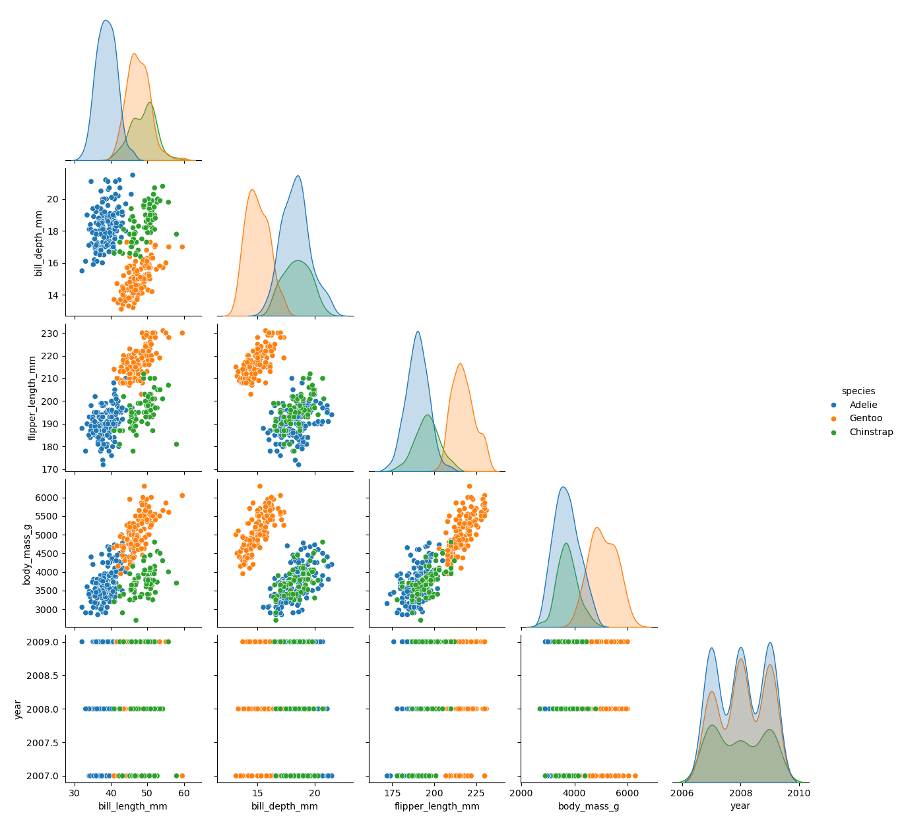]
.center[Pair plots of all numerical variables, colored by species.]

---

class: middle

.center.width-70[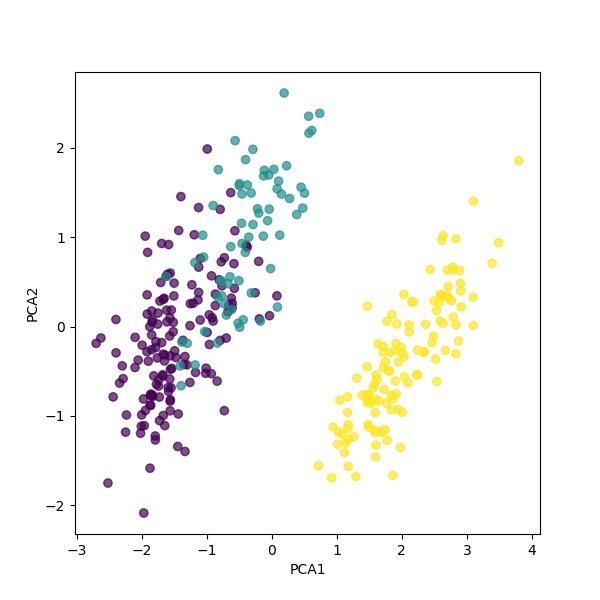]
.center[PCA projection of all numerical variables, colored by species.]

---

class: middle

## EDA within Box's loop

EDA is a crucial step in Box's loop for data analysis. It helps to understand the data, generate hypotheses, and .bold[inform modeling decisions].

- Distribution shapes can suggest appropriate model families.
- Relationships between variables can guide model structure.
- Insights about scale and variance can inform data transformations.

---

class: middle

After building a model and computing initial results, EDA can be used to critique the model fit and identify areas for improvement.

- Residual analysis can reveal patterns not captured by the model.
- Prediction errors may point to specific data subsets that are problematic.
- Unexpected patterns in the data can suggest new features or model revisions.

---

class: end-slide, center
count: false

The end.
