class: middle, center, title-slide

# Foundations of Data Science

Lecture 2: Data and exploratory analysis

<br><br>
Prof. Gilles Louppe<br>
[g.louppe@uliege.be](mailto:g.louppe@uliege.be)

---

class: middle

# Data

---

class: middle

.center.width-10[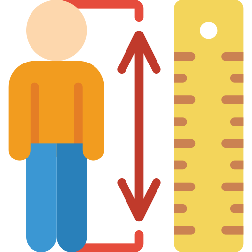]

## What is data?

Data are .bold[recorded observations] about the world.

They can take many forms, including numbers, text, images, and more. 

---

class: middle

## A running example

.grid[
.kol-1-2[.center.width-100[]]
.kol-1-2[.center.width-100[]]
]

We will follow one dataset through this lecture: the .bold[Palmer Archipelago penguins], 344 birds of three species measured on three islands between 2007 and 2009.

Someone stood in the cold, caught a penguin, measured its bill with a caliper and put it on a scale. What follows is about what such records are, and what they are not.

.footnote[Credits: [Horst et al.](https://allisonhorst.github.io/palmerpenguins/), 2020; artwork by @allison\_horst.]

---

class: middle

Mathematically, data can be viewed as a function $f$ that maps real-world entities $\omega$ to measurable values $\mathbf{x}$,
$$f : \Omega \to \mathcal{X},$$
where
- $\Omega$ is the sample space of possible states $\omega$ of the world,
- $\mathcal{X}$ is the measurement space of possible observations $\mathbf{x}$.

---

class: middle

Examples&#58;
- Penguin body mass: $\omega \in \\{ \text{penguins} \\} \to x \in \mathbb{R}^+$ (g)
- Stock price: $\omega \in \\{ \text{market states} \\} \to x \in \mathbb{R}^+$ (USD)
- Pixel colour: $\omega \in \\{ \text{scenes} \\} \to \mathbf{x} \in \\{0, \ldots, 255\\}^3$ (RGB values)

---

class: middle

If the sample space $\Omega$ carries a probability distribution $p(\omega)$, then $f$ turns a random state of the world into a random observation $\mathbf{x} = f(\omega)$. Its distribution is the one $f$ induces from $p$, called the .bold[data distribution] $p\_r(\mathbf{x})$, where $r$ stands for "real".

When $\mathcal{X}$ is continuous, it can be written as
$$p\_r(\mathbf{x}) = \int\_{\omega \in \Omega} p(\omega) \delta(\mathbf{x} - f(\omega)) d\omega,$$
where $\delta$ is the Dirac delta function. When $\mathcal{X}$ is discrete, $p\_r$ assigns probabilities rather than a density.

---

class: middle

## The measurement process

The measurement process is part of the data generation mechanism. We make it explicit by adding the measurement conditions $\xi \in \Xi$ (instrument settings, environmental conditions, observer effects) to the map,
$$f : \Omega \times \Xi \to \mathcal{X}.$$

Measurements can introduce quantization (continuous to discrete), noise (random perturbations), and bias (systematic deviations). If $\Omega \times \Xi$ carries a joint distribution $p(\omega, \xi)$, then
$$p\_r(\mathbf{x}) = \iint\_{\omega \in \Omega, \xi \in \Xi} p(\omega, \xi) \delta(\mathbf{x} - f(\omega, \xi)) d\omega d\xi,$$
which captures the variability of both the phenomenon and its measurement.

---

class: middle

Finally, not every entity ends up in the data. Writing $s = 1$ for "this measurement was recorded", what we observe is
$$p\_r(\mathbf{x}) = \iint\_{\omega \in \Omega, \xi \in \Xi} p(\omega, \xi \mid s = 1) \, \delta(\mathbf{x} - f(\omega, \xi)) \, d\omega \, d\xi.$$

The world enters through $p(\omega)$, the measurement through $\xi$, and the .bold[selection] through $s$. When the chance of being recorded depends on $\omega$ itself, $p\_r$ describes the entities that were recorded and not the population, however many of them there are.

???

Three sources of trouble, now visible at once: the world varies, the instrument distorts, and the sample is not a fair draw. Only the first two are usually modelled.

The examples that follow each put their own $\omega$, $f$ and $\xi$ in place; the third one, the survey, is where $s$ does the damage.

---

class: middle

.center.width-10[]

.italic[Example 1.] A penguin record.

- $\omega$: a penguin of the Palmer Archipelago.
- $f$: catching it at its nest, reading calipers and a ruler, weighing it in a bag, taking blood for the lab.
- $\xi$: the season, the observer, each instrument and the resolution it is read at.
- $s$: only breeding adults, caught at nests holding one egg.

The instruments are visible in the data: body masses are multiples of 25 g, bill lengths have one decimal, flipper lengths are whole millimetres.

.footnote[Credits: [Gorman et al.](https://doi.org/10.1371/journal.pone.0090081), 2014.]

---

class: middle, black-slide

.center.width-55[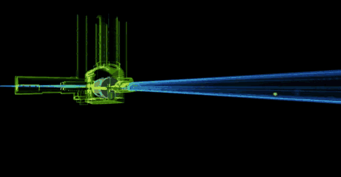]

.italic[Example 2.] A collision at the LHC.

- $\omega$: a bunch crossing, one of 40 million a second.
- $f$: the detector turning the crossing into electrical signals, and the reconstruction turning those into tracks and energies.
- $\xi$: the calibration, and the tens of collisions piled up in the same crossing.
- $s$: the .bold[trigger], which keeps some 3000 crossings a second and drops the rest.

.footnote[Credits: CERN.]

???

Run 3 rates: the hardware trigger keeps about 100 kHz, the software trigger about 3 kHz in ATLAS and 2.6 kHz in CMS.

The selection here is deliberate and documented, and physicists correct for it: the efficiency of the trigger is measured on known processes and divided out. Compare that with the next example, where nobody chose who would answer.

---

class: middle

.center.width-55[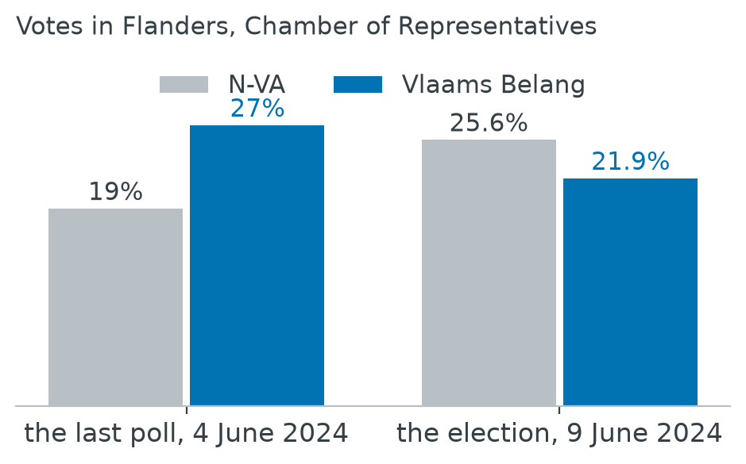]

.italic[Example 3.] An opinion in a survey.

- $\omega$: a voter, whose intention nobody can see.
- $f$: reaching them, reading a question, writing down the answer.
- $\xi$: the mode, the wording and the order of the questions, the day.
- $s$: who could be contacted, and who agreed to answer.

.footnote[Credits: [Le Grand Baromètre](https://www.rtbf.be/article/elections-2024-les-sondages-se-sont-ils-vraiment-trompes-11388084), 4 June 2024; results of the Chamber in Flanders.]

???
The chance of answering depends on $\omega$ itself, so $p\_r$ describes the people who answer and not the electorate. No sample size repairs it: this is .bold[selection bias].


Five days before the federal election, the last poll put Vlaams Belang above 27% in Flanders and the N-VA at 19%. On 9 June the N-VA came first, 25.6% against 21.9%.

Part of that gap is $s$, who answers a poll and who does not, and part is $\xi$, the day on which they are asked: one voter in five made up their mind in the last 24 to 48 hours, which no poll taken five days earlier can see.

The lesson is not that polls are useless, it is that a sample is only as good as the process that produced it, and that process is rarely a fair draw.

---

class: middle

.center.width-55[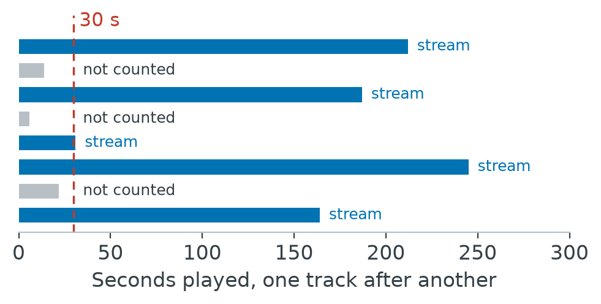]

.italic[Example 4.] A stream on Spotify.

- $\omega$: a listener, and what they actually like.
- $f$: logging every play, and counting a .bold[stream] after 30 seconds.
- $\xi$: the device, the playlist or recommendation that started the track.
- $s$: plays under 30 seconds are dropped.

These data exist to pay artists, in proportion to streams, and to profile listeners, for recommendations and advertising.

???

In March 2014, the band Vulfpeck released *Sleepify*, ten silent tracks of about 31 seconds, and asked fans to play it on repeat while they slept. It earned $19,655 in royalties from some 5.5 million plays before Spotify removed it seven weeks later. Once a measurement pays, people optimise the measurement.

The same streams train the recommender that chooses what is played next, so the platform measures behaviour that it also shapes. Anyone studying musical taste from these data inherits the payment rule, the recommender, and the filters.

---

class: middle

.center.width-55[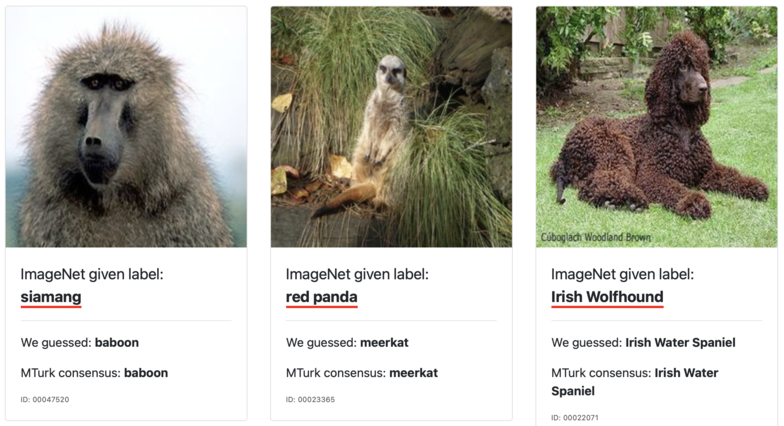]

.italic[Example 5.] A label in a dataset.

- $\omega$: an image, which exists before anyone labels it.
- $f$: a person looking at the image, applying the guidelines and clicking a category.
- $\xi$: the guidelines, the annotators and their fatigue, the interface, the rule that settles disagreement.
- $s$: which images were collected from the web, and which were kept.

.footnote[Credits: [Northcutt et al.](https://labelerrors.com), 2021; images from [ImageNet](https://doi.org/10.1109/CVPR.2009.5206848), Deng et al., 2009.]

???

In the figure, the label stored in ImageNet, struck through, and the one annotators give when asked again: 6% of that validation set is wrong.

Models are ranked on that set. 2916 errors were found and confirmed by hand in its 50000 images. Benchmarks are measurements too, with their own $\xi$, and half a point between two models can sit entirely inside it.

---

class: middle

## What to ask of any dataset

- Which entities could have entered the data, and which could not?
- What exactly was recorded, in which units and at what resolution?
- Under what conditions, by whom, with which instrument or protocol?
- What was dropped, defaulted, inferred or imputed along the way?
- Why were the data collected in the first place, and by whom?

.success[The answers are $f$, $\xi$ and $s$. They are rarely in the file: they live in the protocol, the codebook and the source code.]

???

This is the only moment of the course that looks at how data are made. Everything that follows, the models, the inference, the criticism, assumes that this question has been asked and answered.

---

class: middle

## Data types

Atomic data are the indivisible units of information collected through measurements. They are often categorized based on their nature and the operations that can be performed on it.

- Numerical (continuous, discrete)
- Categorical (nominal, ordinal)

---

class: middle

Numerical data
- Continuous: $x \in \mathbb{R}$ (e.g., temperature), $x \in \mathbb{R}^+$ (e.g., height, weight)
- Discrete: $x \in \mathbb{N}$ (e.g., counts), $x \in \mathbb{Z}$ (e.g., differences)

---

class: middle

Categorical data
- Nominal: $x \in \mathcal{C} = \\{c\_1, c\_2, ..., c\_K \\}$ (e.g., colors, types, text characters) without intrinsic order
- Ordinal: $x \in \mathcal{C}$ with ordering relations $c\_1 \prec c\_2 \prec ... \prec c\_K$ (e.g., ratings, grades)

---

class: middle 

.center.width-10[]

Example: one penguin record
```
species: Adelie          # Categorical, nominal
island: Torgersen        # Categorical, nominal
bill length: 39.1 mm     # Numerical, continuous
body mass: 3750 g        # Numerical, continuous
sex: male                # Categorical, nominal
year: 2007               # Numerical, discrete
```
No variable here is ordinal; a rating from 1 to 5, or a grade, would be.

---

class: middle

## Data structures

A measurement is either a single atomic value $x$, or a composite $\mathbf{x}$ made of several of them. Common composite structures include:
- Tabular data
- Arrays and tensors
- Sequences
- Networks and graphs

---

class: middle

.grid[
.kol-1-2.center[Tabular data<br>.width-100[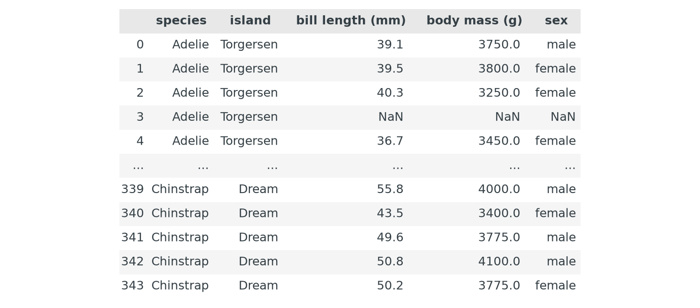]]
.kol-1-2.center[Arrays and tensors<br>.width-60[]]
]

<br>

.grid[
.kol-1-2.center[Sequences

`['P', 'e', 'n', 'g', 'u', 'i', 'n']`]
.kol-1-2.center[Networks and graphs<br>.width-70[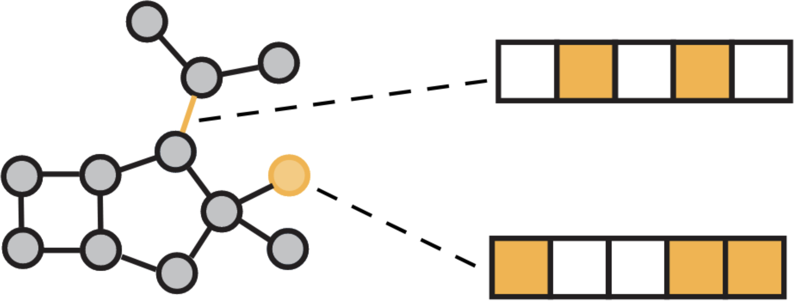]]
]

.footnote[Credits: Hannes Grobe, [Adelie penguin](https://commons.wikimedia.org/wiki/File:Pygoscelis_adeliae_hg.jpg) (CC BY-SA 2.5), cropped.]

---

class: middle

A data frame $\mathbf{X}$ represents a .bold[tabular collection] of $N$ records (rows) over $d$ variables/atomic measurements (columns),
$$\mathbf{X} = \begin{pmatrix}
x\_{11} & x\_{12} & \cdots & x\_{1d} \\\\
x\_{21} & x\_{22} & \cdots & x\_{2d} \\\\
\vdots & \vdots & \ddots & \vdots \\\\
x\_{n1} & x\_{n2} & \cdots & x\_{nd}
\end{pmatrix}.$$
Each entry $x\_{ij}$ corresponds to the value of variable $j$ for record $i$.

Variables are often heterogeneous (mixing numerical and categorical types). When all variables are numerical, the data frame can be viewed as a matrix $\mathbf{X} \in \mathbb{R}^{N \times d}$.

For the penguins, $N = 344$ records over $d = 8$ variables, four of them numerical.

---

class: middle

## Notation

.success[Bold marks an object holding more than one number. Plain marks a single one.]

- $\mathbf{x}$ is a measurement, $\mathcal{X}$ the space it lives in.
- $\mathbf{X} \in \mathbb{R}^{N \times d}$ is the data frame, with $N$ records indexed by $i$ and $d$ variables indexed by $j$.
- $\mathbf{x}\_i$ is a record, the $i$-th row of $\mathbf{X}$; $x\_{ij}$ is a single entry.

Later in the lecture, $\mathbf{x}\_j$ denotes the column of variable $j$: the index letter says whether a row or a column is meant.

---

class: middle

Collections of homogeneous measurements can be represented as .bold[arrays] or .bold[tensors] $\mathbf{x} \in \mathbb{R}^{d\_1 \times d\_2 \times \cdots \times d\_k}$, where the position of each atomic value in the array is usually associated to a spatial or temporal location.
- Images: 3d arrays $\mathbf{x} \in \\{0, \ldots, 255\\}^{h \times w \times c}$ (height, width, channels). The photo on the previous slide is such an array.
- Videos: 4d arrays $\mathbf{x} \in \\{0, \ldots, 255\\}^{t \times h \times w \times c}$ (time, height, width, channels).

---

class: middle

Data can also be structured as ordered .bold[sequences] $\mathbf{x} = (x\_1, x\_2, ..., x\_T)$ indexed by time or position. Each element is atomic here, but may itself be composite.
- Time series: $x\_t$ is a measurement at time $t$ (e.g., a stock price).
- Text: $x\_t$ is the $t$-th word in a document.

---

class: middle

Finally, data can be organized as .bold[networks] or .bold[graphs] $\mathbf{x} = (V, E)$, where entities are represented as nodes $V$ and relationships as edges $E$. Nodes and edges may carry their own attributes, $\mathbf{x}\_v$ and $\mathbf{x}\_{uv}$.
- Molecular structures, where nodes represent atoms and edges represent bonds.
- Social networks, where nodes represent individuals and edges represent interactions or relationships.

---

class: middle

.center.width-10[]

Follow the tutorials in `nb02a-tables.ipynb`, `nb02b-jax.ipynb`, and `nb02c-data-wrangling.ipynb` to practice working with arrays and data frames in Python.

---

class: middle

## Data quality 

Real-world data are often imperfect and may suffer from various .bold[quality issues] that can impact analysis and modeling. Common data quality issues include:
- Missing values
- Measurement errors
- Outliers

---

class: middle

.bold[Missing values] are common in real-world datasets and can arise from various factors such as non-response in surveys, sensor malfunctions, or data corruption. 

Let $\mathbf{X}\_\text{full}$ be the complete data and $\mathbf{M} \in \\{0, 1\\}^{N \times d}$ the missingness pattern, with $m\_{ij} = 1$ when entry $ij$ is observed and $m\_{ij} = 0$ when it is missing$^1$.

What we actually hold is the pair $(\mathbf{X}\_\text{obs}, \mathbf{M})$, where $\mathbf{X}\_\text{obs} = \\{ x\_{ij} : m\_{ij} = 1 \\}$ are the observed entries and $\mathbf{X}\_\text{mis} = \\{ x\_{ij} : m\_{ij} = 0 \\}$ the missing ones. A missing entry is not a zero, and no arithmetic can recover it.

.footnote[1: Rubin's convention is the opposite, 1 for missing.]

---

class: middle

.center.width-100[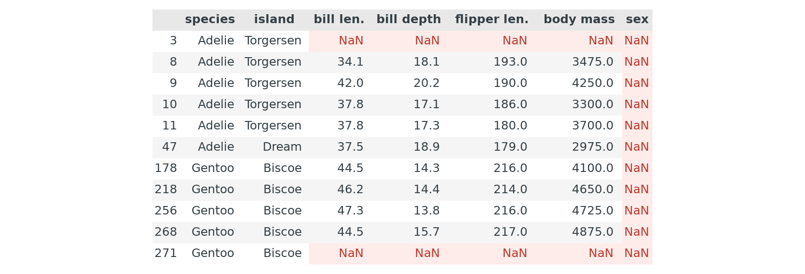]

.center[The 11 penguin records with missing entries&#58; two birds were never measured,<br> nine have no recorded sex.]

???

Whether these holes matter depends on the mechanism: a bird that escaped before being weighed is plausibly missing completely at random, but if the largest and strongest escaped most often, the same holes would be missing not at random.

---

class: middle

The pattern $\mathbf{M}$ is itself produced by the measurement process, and is modeled as such:
- Missing completely at random (MCAR): the pattern is independent of the data, $p(\mathbf{M} \mid \mathbf{X}\_\text{full}) = p(\mathbf{M})$.
- Missing at random (MAR): the pattern may depend on what is observed, but not on what is missing, $p(\mathbf{M} \mid \mathbf{X}\_\text{full}) = p(\mathbf{M} \mid \mathbf{X}\_\text{obs})$.
- Missing not at random (MNAR): the pattern depends on the missing entries themselves.

---

class: middle

Why the distinction matters&#58; what we can compute is
$$p(\mathbf{X}\_\text{obs}, \mathbf{M}) = \int p(\mathbf{X}\_\text{full}) p(\mathbf{M} \mid \mathbf{X}\_\text{full}) d\mathbf{X}\_\text{mis}.$$

Under MCAR or MAR, the second factor does not depend on the missing entries and, provided it shares no parameters with the first, it can be ignored: modelling the observed data is enough. Under MNAR it cannot be ignored, and the mechanism must be modeled jointly with the data.

---

class: middle

Example&#58;

Survey of $n=1000$ respondents, 30% do not answer the income question.
- MCAR: Randomly selected respondents skip the question.
- MAR: Younger respondents are less likely to answer.
- MNAR: High earners refuse to answer.

.alert[.bold[Imputing or discarding missing values] without making explicit the assumptions about the missingness mechanism can lead to biased results.]

---

class: middle

The measurement process can also introduce acquisition errors and produce observations that deviate significantly from regular measurements. These .bold[outliers] can arise from instrument malfunctions, data entry errors, or rare events.

---

class: middle

.center.width-50[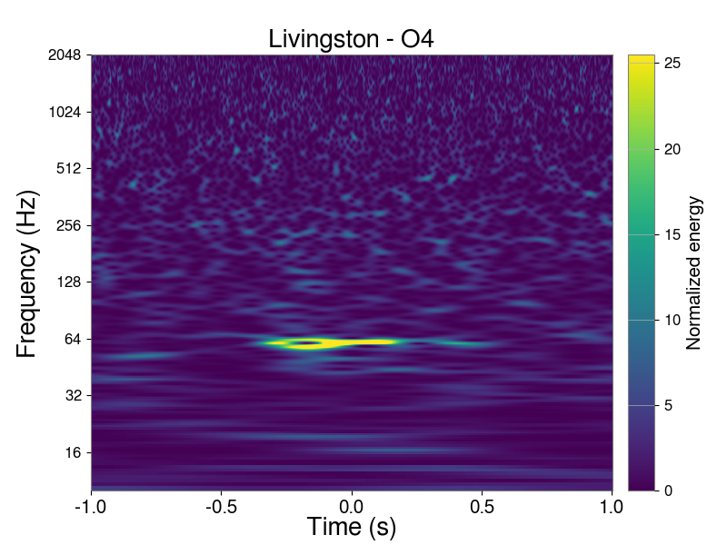]

.footnote[Credits: Omega scan of a power-line glitch at LIGO Livingston (O4), [Gravity Spy](https://gravityspy.org); data from [GWOSC](https://gwosc.org) (CC BY 4.0).]

Example&#58;

Glitches in gravitational wave detectors are outliers that can mimic true signals and complicate detection efforts. They can arise from environmental disturbances, instrumental artifacts, or other non-astrophysical sources.

???

Here powerline glitches are visible at 60 Hz, due to electromagnetic interference from electrical power systems.

---

class: middle

Treating outliers requires a model of the measurement process that either describes measurements under normal conditions or explicitly accounts for anomalies. 

Two models make this explicit&#58; a contamination mixture
$$p(\mathbf{x}) = (1 - \varepsilon) p\_\text{model}(\mathbf{x}) + \varepsilon p\_\text{bad}(\mathbf{x}),$$
which gives bad measurements their own distribution, or a heavy-tailed data model, which allows rare large deviations without special-casing them.

.alert[.bold[Outliers should not be removed blindly] unless explicitly justified by the measurement model or domain knowledge.]

---

class: middle

.center.width-10[]

Temperature readings in Liège:

```
20.1, 19.8, 20.3, 1000.0, 20.2, 19.9
```
The 1000.0 value is an outlier likely due to a sensor error.

```
19.2, 19.8, 20.3, 37.8, 20.2, 19.9
```
The 37.8 value is a rare but plausible measurement on a hot day.

---

class: middle

## Where this leaves us

Everything in this part is one picture of how the data came to be:
- the map $f$ from states of the world to measurements,
- the conditions $\xi$ under which measurements are taken,
- the pattern $\mathbf{M}$ of what ends up recorded,
- the data distribution $p\_r(x)$ that all of this induces.

---

class: middle

# Exploratory data analysis 

---

class: middle

.bold[Exploratory data analysis] (EDA) is the systematic examination of data to understand its structure, patterns and anomalies before formal modeling. It typically involves visual and quantitative techniques to summarize key characteristics of the data.

The goal is to generate hypotheses and inform modeling decisions, not to confirm preconceived notions.

---

class: middle

## What we are looking at

All we hold is $N$ records, the rows $\mathbf{x}\_i = (x\_{i1}, \ldots, x\_{id})$ of the data frame. Their .bold[empirical distribution] puts equal mass on each of them,
$$\hat{p}\_N(\mathbf{x}) = \frac{1}{N} \sum\_{i=1}^N \delta(\mathbf{x} - \mathbf{x}\_i).$$

Every plot and every statistic that follows is a functional of $\hat{p}\_N$: a histogram is a marginal, a scatter plot a joint, body mass by species a conditional, correlation and mutual information measure dependence, and PCA is a projection.

.alert[$\hat{p}\_N$ is not $p\_r$. It is what $N$ records show of it, and that gap is what the rest of the course is about.]

---

class: middle

.center.width-10[]

Back to the penguins, with the whole table in hand: 344 records, four numerical measurements, three species and three islands.

Switch to `nb02d-eda.ipynb` to follow along.

---

class: middle

## Univariate analysis

Let us consider a variable $j$ of the data frame. We write $x\_j$ for that variable as a random quantity, distributed under $p\_r$, and $\mathbf{x}\_j = (x\_{1j}, x\_{2j}, ..., x\_{Nj})^T$ for the column of values actually recorded.

Univariate analysis focuses on understanding the distribution and characteristics of this single variable.

For numerical variables, common techniques include:
- Looking at the raw data: print values, scroll through them.
- Plotting the data: histograms reveal the distribution shape.
- Summarizing with statistics: mean, median, mode, variance, skewness, kurtosis.

For categorical variables:
- Counting occurrences of each category.

---

class: middle

.center[
.width-80[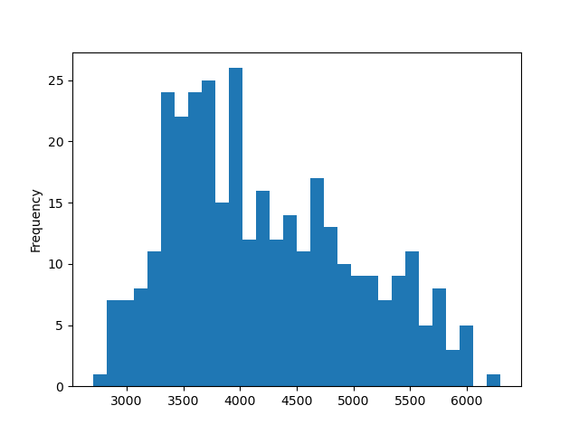]
]

.center[Numerical: Histogram of body mass for all penguins.<br>
.italic[One broad mode with a long right tail: perhaps not a single population.]]

---

class: middle

.center[
.width-80[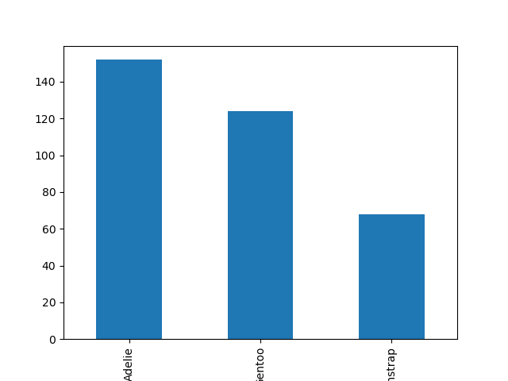]
]

.center[Categorical: Bar plot of species counts for all penguins.<br>
.italic[Unbalanced groups: 152 Adelie, 124 Gentoo, 68 Chinstrap.]]

---

class: middle

## Bivariate analysis

Bivariate analysis examines the relationship between two variables $j$ and $k$, from their recorded columns $\mathbf{x}\_j$ and $\mathbf{x}\_k$.

Depending on the types of variables, different techniques are used:
- Pair plots for two numerical variables (scatter or 2d histogram).
- Multiple histograms for categorical vs numerical variables.
- Contingency tables for two categorical variables.
- Correlation coefficients (e.g., Pearson, Spearman) for numerical variables.

---

class: middle

.center.width-80[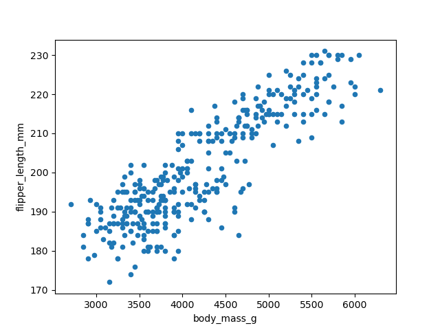]
.center[Numerical vs. numerical: Scatter plot of body mass vs flipper length.<br>
.italic[Mass grows with flipper length, close to linearly.]]

---

class: middle

.center.width-70[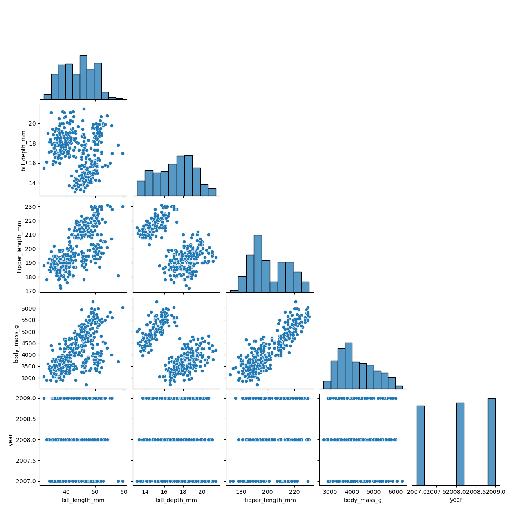]
.center[Pair plots of all numerical variables.<br>
.italic[Most panels show two or three clouds rather than one.]]

---

class: middle

.center.width-80[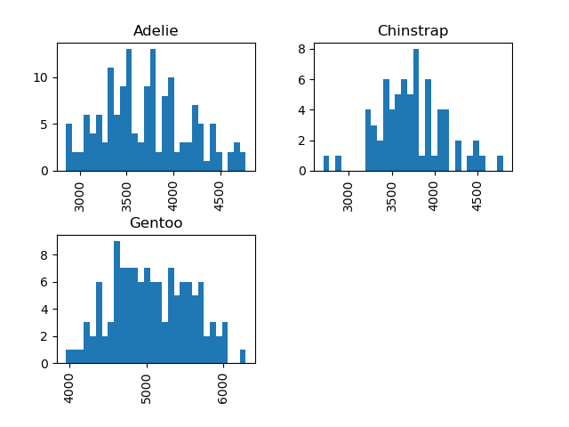]
.center[Categorical vs. numerical: Histograms of body mass by species.<br>
.italic[The right tail was Gentoo, at 5076 g on average against about 3700 g for the others.]]

---

class: middle

.center[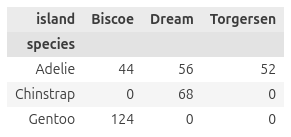]
.center[Categorical vs. categorical: Contingency table of species and island.<br>
.italic[Gentoo live only on Biscoe, Chinstrap only on Dream: species and island are dependent.]]

---

class: middle

.bold[Correlation coefficients] can quantify the dependency between two numerical variables. They are useful but come with assumptions and limitations.

- Pearson correlation measures linear relationships. Its empirical version reads
$$\hat{\rho}\_{jk} = \frac{\sum\_{i=1}^N (x\_{ij} - \bar{x}\_j)(x\_{ik} - \bar{x}\_k)}{\sqrt{\sum\_{i=1}^N (x\_{ij} - \bar{x}\_j)^2} \sqrt{\sum\_{i=1}^N (x\_{ik} - \bar{x}\_k)^2}},$$
an estimate of $\rho\_{jk} = \text{cov}(x\_j, x\_k) / (\sigma\_j \sigma\_k)$ under $p\_r$. It ignores non-linear dependencies.
- Spearman correlation is the Pearson correlation of the rank-transformed variables. It captures monotonic relationships.
- Correlation does not imply causation and can be affected by outliers.

???

Intuition behind Pearson: the ratio of the covariance to the product of standard deviations measures how much two variables co-vary relative to their individual variability. It captures linear relationships because covariance is a linear measure.

---

class: middle

The .bold[mutual information] between two variables $x\_j$ and $x\_k$ measures the reduction in uncertainty about one given knowledge of the other. For discrete variables,
$$I(x\_j; x\_k) = \sum\_{x\_j} \sum\_{x\_k} p\_r(x\_j, x\_k) \log \frac{p\_r(x\_j, x\_k)}{p\_r(x\_j)p\_r(x\_k)},$$
with integrals in place of the sums for continuous ones.

Mutual information captures any statistical relationship, not just linear or monotonic ones. It is a property of $p\_r$, however, which must itself be estimated from the $N$ records, and that is hard.

---

class: middle

## Multivariate analysis

Multivariate analysis explores relationships among three or more variables at once.

Common techniques include:
- The same as bivariate analysis, but conditioning on a third variable (e.g., pair plots colored by species).
- Dimensionality reduction methods (e.g., PCA, t-SNE) to visualize high-dimensional data.
- Clustering algorithms (e.g., k-means, hierarchical clustering) to identify groups of similar records.

The last two work on the numerical columns of $\mathbf{X}$.

---

class: middle

.center.width-70[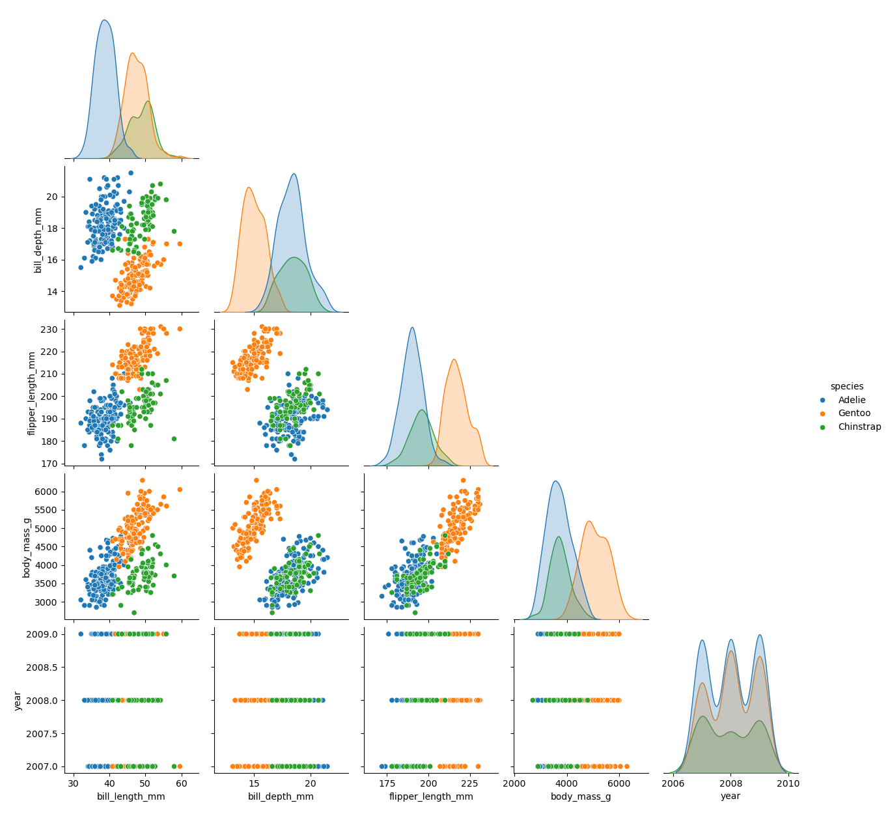]
.center[Pair plots of all numerical variables, colored by species.<br>
.italic[Colour by species and the clouds line up.]]

---

class: middle

.center.width-70[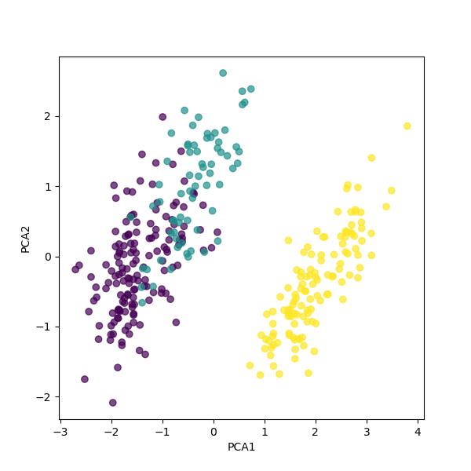]
.center[PCA projection of all numerical variables, colored by species.<br>
.italic[Two components are enough to separate the species.]]

---

class: middle

## From observations to hypotheses

The analysis of the penguins suggests four models:
- Body mass is not a single population, since the sample mixes three species (mixture models, Lecture 4).
- Body mass increases with flipper length (regression, Lecture 6).
- Species and island are dependent, and measurements differ from group to group (hierarchical models, Lecture 4).
- The four measurements are strongly correlated, so fewer dimensions may be enough to describe them (latent variable models, Lecture 4).

The plots establish none of this. They suggest models, which then have to be built, fitted and criticized.

---

class: middle

EDA does not stop once a model is built. In the critique step, the same plots come back on what the model gets wrong.

- Residuals reveal patterns the model does not capture.
- Prediction errors point to subsets of the data that are problematic.
- Unexpected patterns suggest new variables or a revised model.

Next lecture: how to draw all of these plots well.

---

class: end-slide, center
count: false

The end.
