class: middle, center, title-slide

# Foundations of Data Science

Lecture 3: Visualization

<br><br>
Prof. Gilles Louppe<br>
[g.louppe@uliege.be](mailto:g.louppe@uliege.be)


---

class: middle

## Two kinds of plots

.center.width-100[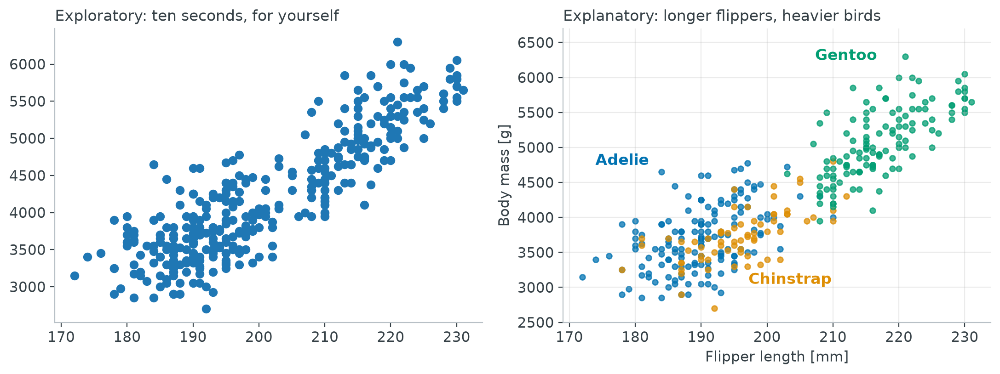]

- .bold[Exploratory]: for yourself, quickly and in numbers, to see (Lecture 2).
- .bold[Explanatory]: for others, few and polished, to carry one message.

???

The building blocks are the same, the standards are not. The same plots come back in Lecture 7, on what a model gets wrong.

---

class: middle

# Choosing the right plot

---

class: middle

## Start from the message

.center.width-75[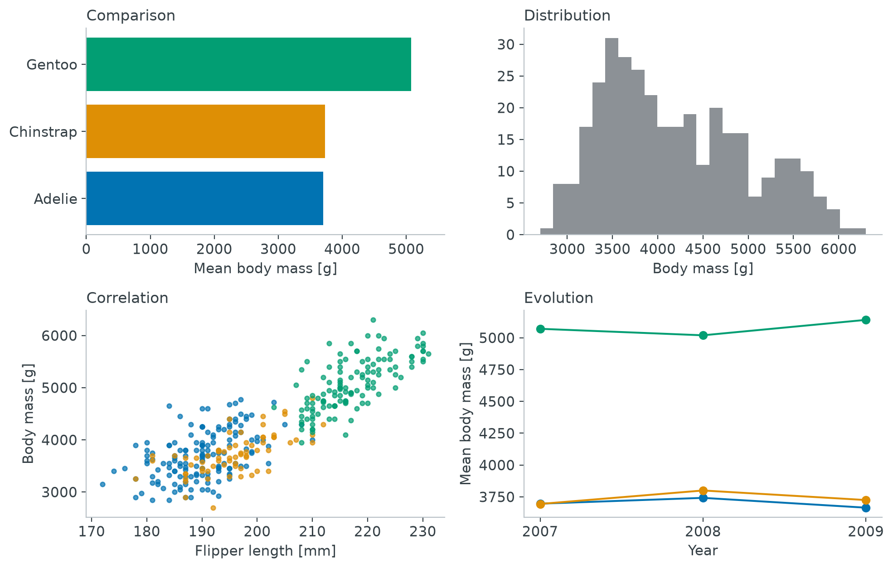]

Choose the graph from the question it answers, then the design from that question and the number of continuous variables.

.footnote[Credits: [Doumont](https://www.principiae.be/X0100.php), Trees, maps, and theorems, 2009.]

???

For subsets, either distinguish them within one panel, or juxtapose panels sharing identical scales.

---

class: middle

## What that gives

- .bold[Comparison]: horizontal bars, which must start at zero, or dots along a scale, which need not.
- .bold[Distribution]: every point along a scale; a histogram or a box plot when there are too many.
- .bold[Correlation]: a scatter plot, or an array of them beyond two variables.
- .bold[Evolution]: lines against the independent variable; different units go in different panels sharing a scale.

This is one opinionated but consistent take, not the only one.

---

class: center, middle, black-slide

<iframe width="600" height="400" src="https://www.youtube.com/embed/6lm4wJ1qm0w" frameborder="0" allowfullscreen></iframe>

Jean-Luc Doumont, "Choosing the right graph", 2017.

---

class: middle

# Encoding data with visual cues

---

class: middle

<span style="font-size: 5em;" class="center">14, 37, 75</span>

<br>

.question[In pairs, try to come up with as many representations/encodings of this "data" as possible.]

---

class: middle

## Anatomy of a plot

.center.width-70[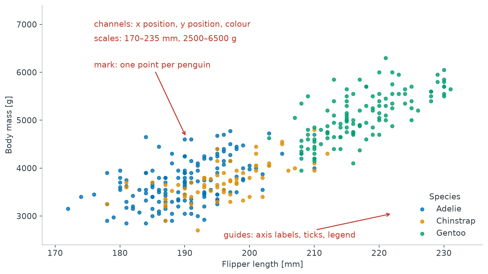]

.center[data → marks → channels → scales → coordinates → guides]

.footnote[The .bold[grammar of graphics]: Wilkinson, 1999; implemented in ggplot2, Vega-Lite, Altair and seaborn objects.]

???

The rest of the lecture takes these pieces in order.

---

class: middle

## Visual cues

Visual cues are elements of a visualization that encode data. They are expressed as marks and channels:
- A .bold[mark] is a geometric primitive such as points, lines, or areas.
- A .bold[channel] is an attribute of a mark that can be used to encode data, such as position, size, shape, or color.

<br><br>
.center.width-100[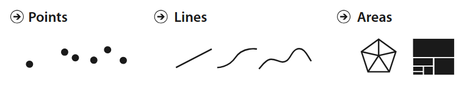<br>Marks are geometric primitives.]

.footnote[Credits: T. Munzner, "Visualization Analysis and Design", 2014.]

---

class: middle

.center.width-100[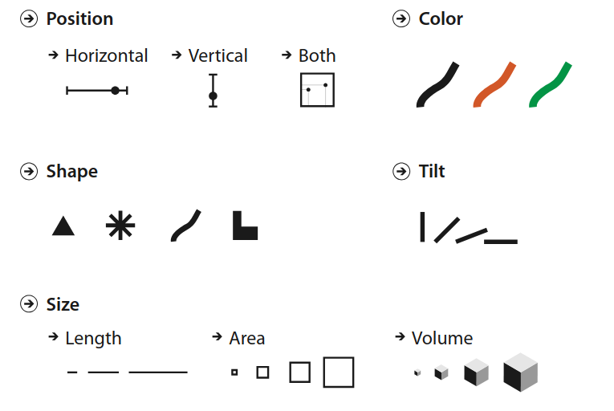<br>Visual channels control the appearance of marks.]

.footnote[Credits: T. Munzner, "Visualization Analysis and Design", 2014.]

---

class: middle

.center.width-100[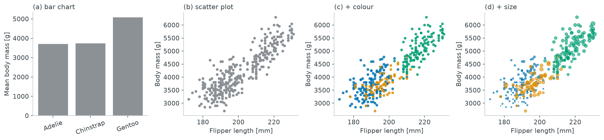]

(a) Bar charts encode data using line marks, controlled by a vertical position channel (height) and a horizontal position channel (category).
(b) Scatterplots encode data using point marks, controlled by two position channels (x and y).
(c) A third variable can be encoded using a color channel.
(d) A fourth variable can be encoded using a size channel (area of the point).

---

class: middle

## Overplotting

.center.width-100[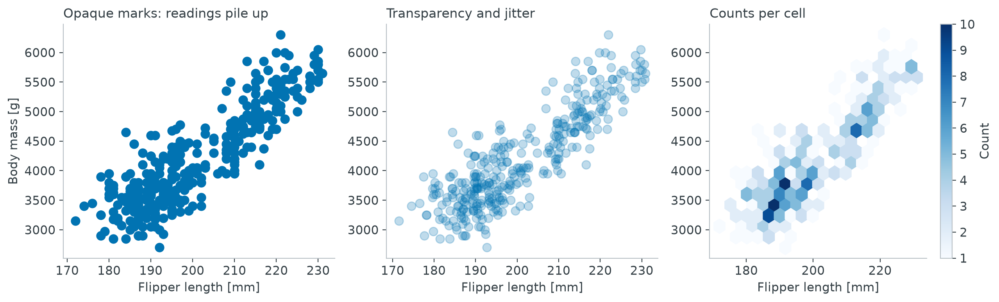]

Flipper lengths are whole millimetres, body masses multiples of 25 g, so identical readings stack. Transparency, jitter or binning give the density back.

---

class: middle

## Two principles

- .bold[Expressiveness]: show all the data facts, and only the data facts.
- .bold[Effectiveness]: encode them with the channels a reader decodes most accurately.

.footnote[Mackinlay, 1986.]

---

class: middle

## Perceptual hierarchy

Effectiveness is measurable: not all channels are read equally well.

.center.width-50[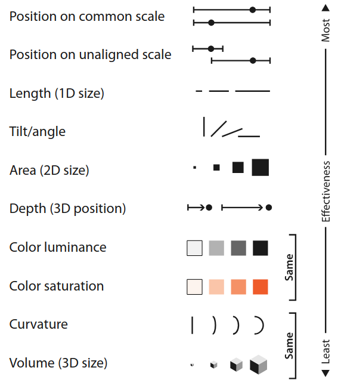]

.footnote[Credits: T. Munzner, "Visualization Analysis and Design", 2014.]

---

class: middle

Cleveland and McGill (1984) conducted experiments to evaluate the accuracy of visual channels for encoding quantitative data.

.center.width-80[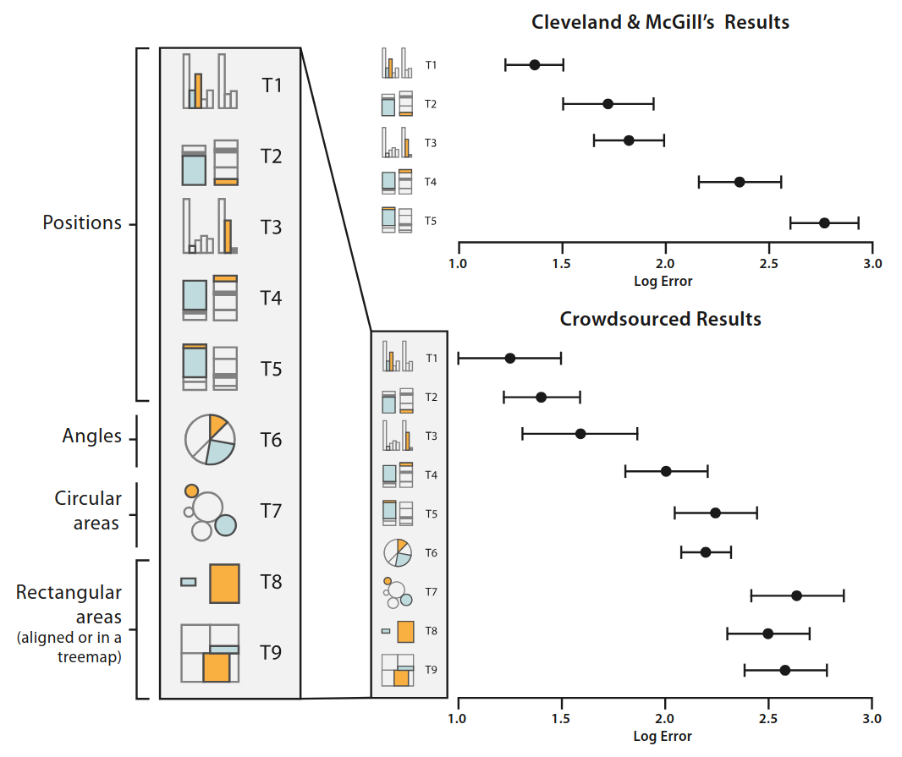]

.footnote[Credits: T. Munzner, "Visualization Analysis and Design", 2014.]

---

class: middle

.center.width-10[]

## Colors

Color is a powerful channel for encoding categorical and quantitative data.

The primary representation system is the Hue, Saturation, Value (HSV) model:
- .bold[Hue]: the type of color (e.g., red, green, blue), numerically represented as an angle on the color wheel (0-360 degrees).
- .bold[Saturation]: the intensity or purity of the color (from gray to full color), represented as a percentage (0-100%).
- .bold[Value]: the brightness of the color (from black to full brightness), represented as a percentage (0-100%).

---

class: middle

.center.width-100[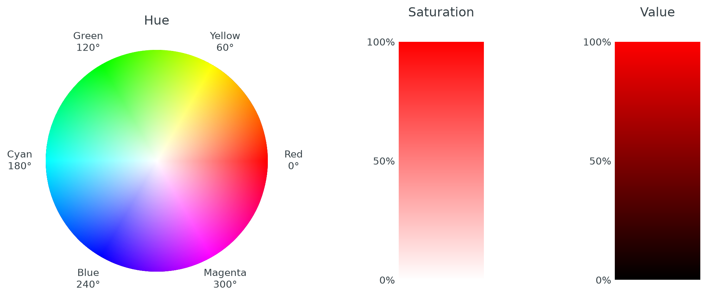]

---

class: middle

A colormap maps data values to colors. Three kinds, for three kinds of data:
- .bold[Sequential]: ordered data, light to dark within a single hue.
- .bold[Diverging]: ordered data with a meaningful midpoint, two hues.
- .bold[Categorical]: unordered groups, distinct colors.

.center.width-100[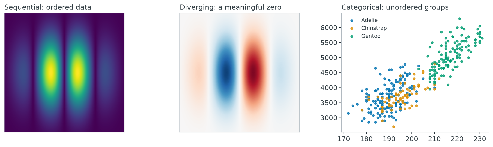]

---

class: middle

.center[
.width-45[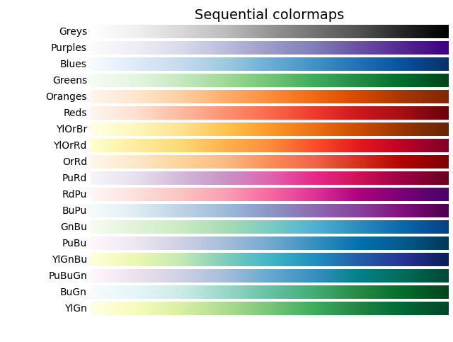]

.width-45[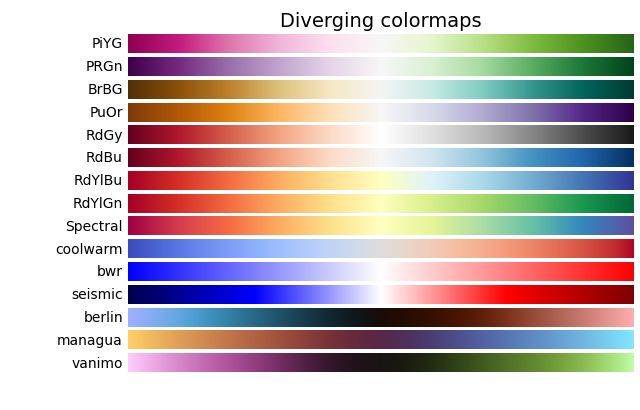]
.width-45[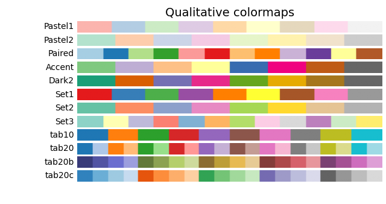]
]

.footnote[Credits: [Choosing colormaps in Matplotlib](https://matplotlib.org/stable/users/explain/colors/colormaps.html).]

---

class: middle

.center.width-10[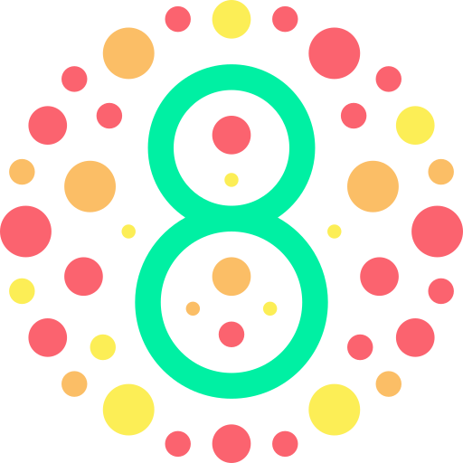]

.alert[Color vision deficiency affects approximately .bold[1 in 12 men] and .bold[1 in 200 women] worldwide. .bold[Never let colour alone carry what the reader must not miss]: keep the categories few, pick a colourblind-safe palette, and repeat the distinction with position, shape or a label.] 

---

class: middle

.center.width-75[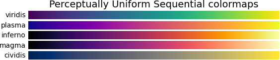]

Perceptually uniform colormaps ensure that equal steps in data are perceived as equal steps in color.

.footnote[Credits: [Choosing colormaps in Matplotlib](https://matplotlib.org/stable/users/explain/colors/colormaps.html).]

---

class: middle

.center.width-95[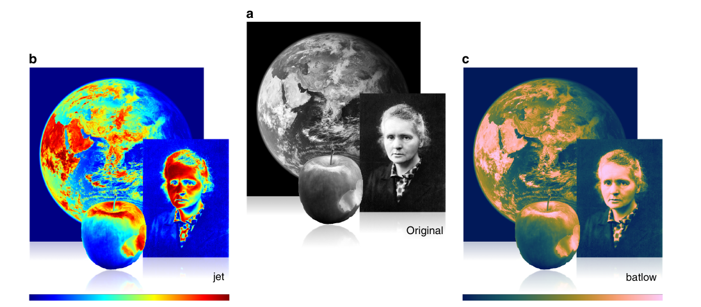]

.center[.bold[Rainbow colormaps invent structure.] The same images as they are (a),<br> in jet (b), and in a perceptually uniform map (c).]

.footnote[Credits: [Crameri, Shephard & Heron](https://doi.org/10.1038/s41467-020-19160-7), Nature Communications, 2020, Fig. 1 (CC BY 4.0).]

???

Jet adds edges and bands that are not in the data, and hides variation elsewhere. The trick of the figure: you already know what a face, the Earth and an apple look like, so the distortion is obvious. On data you have never seen, it passes unnoticed.

---

class: middle

Finally, colors can also be used to .bold[draw attention] to specific elements in a visualization, such as highlighting important data points or trends.

.center.width-90[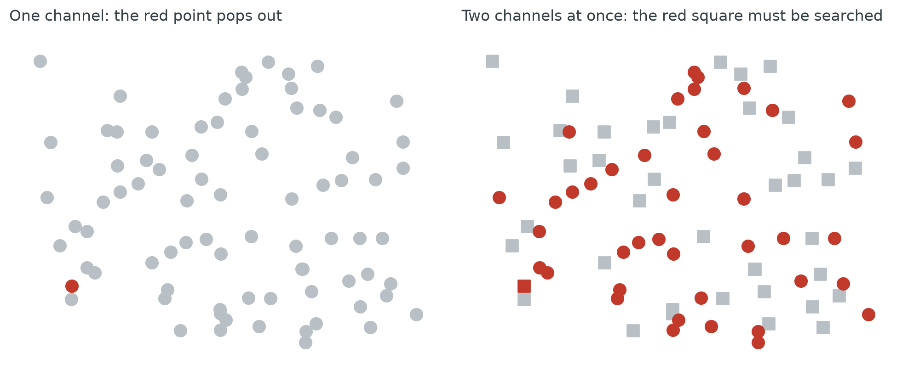]

.center[A single channel pops out at a glance; two channels at once must be searched.]

---

class: middle

## Small multiples

.center.width-100[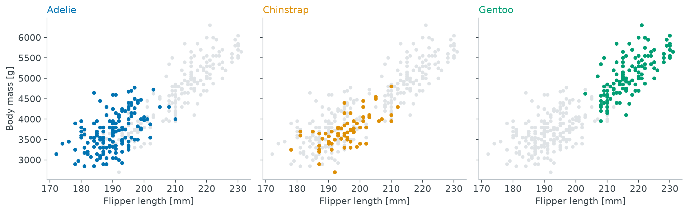]

Subsets can be told apart within one panel, by colour, or split into panels sharing their scales. Keeping the other points in grey gives each panel its reference.

---

class: middle

.center.width-10[]

## Scales and transformations

Sometimes, data spans several orders of magnitude or has a skewed distribution. In such cases, applying a transformation or using a different scale can improve the interpretability of the visualization.
- .bold[Linear scale]: preserves the original data values.
- .bold[Logarithmic scale]: useful for data spanning several orders of magnitude.
- .bold[Quantile scale]: divides data into bins holding equal numbers of records, useful for skewed distributions.

---

class: middle

.center.width-80[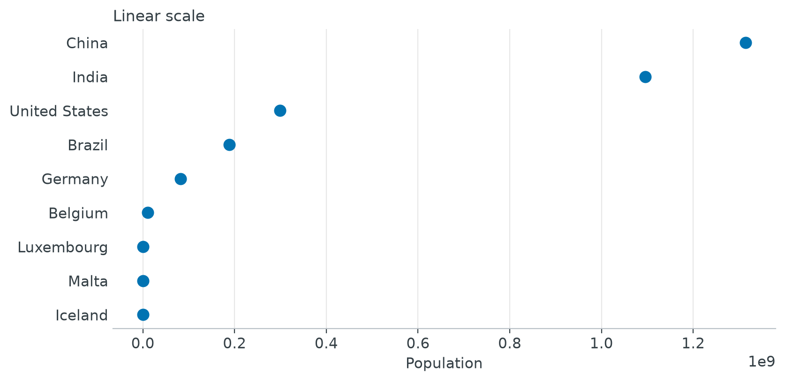]

.center[Linear scales can be dominated by large values, dwarfing smaller values and making it hard to see small variations.]

.footnote[Data: `data/countries.csv`.]

---

class: middle

.center.width-80[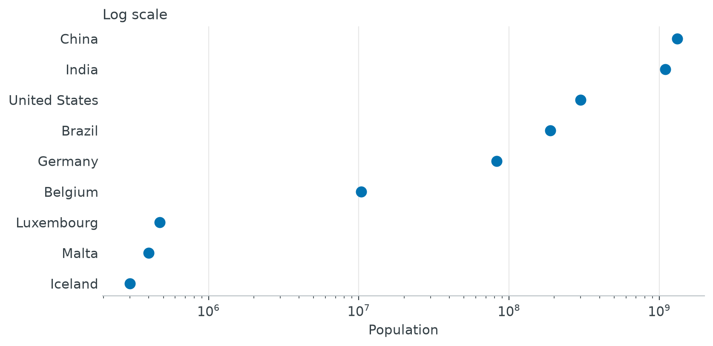]

.center[Showing data on a logarithmic scale can prevent large values from dominating the visualization and reveal patterns among smaller values.]

.center[It also hides absolute differences, cannot show zero or negative values,<br> and is read as linear by an audience that does not expect it.]

.footnote[Data: `data/countries.csv`.]

---

class: middle

## Binning is a choice

.center.width-100[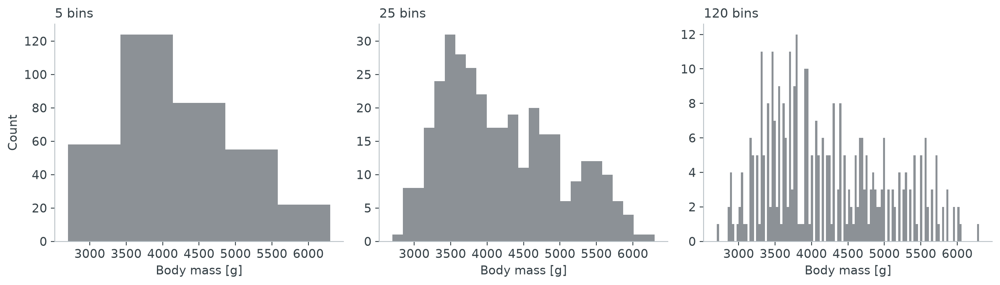]

The same 342 body masses. Too few bins hide the second group, too many show noise as structure. Bin width, like kernel bandwidth, belongs to the plot and not to the data.

---

class: middle

.center.width-10[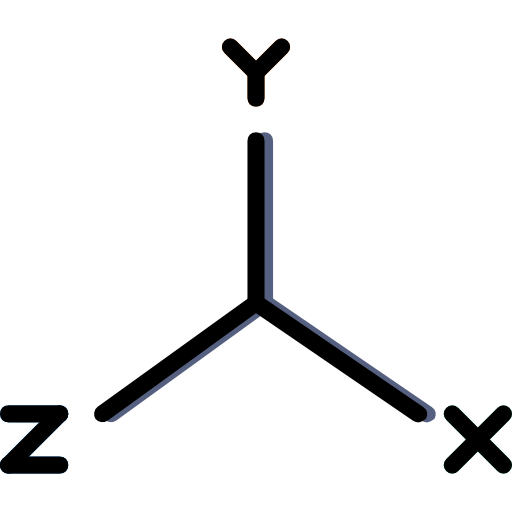]

## Coordinate systems

Before mapping (numerical) data to visual channels, it is important to choose an appropriate coordinate system as it affects the perception and effectiveness of the visualization.
- .bold[Cartesian coordinates]: intuitive and effective for most data types.
- .bold[Polar coordinates]: useful for cyclic data (e.g., time of day, seasons), but can distort perception of lengths.

---

class: middle, black-slide

.center.width-45[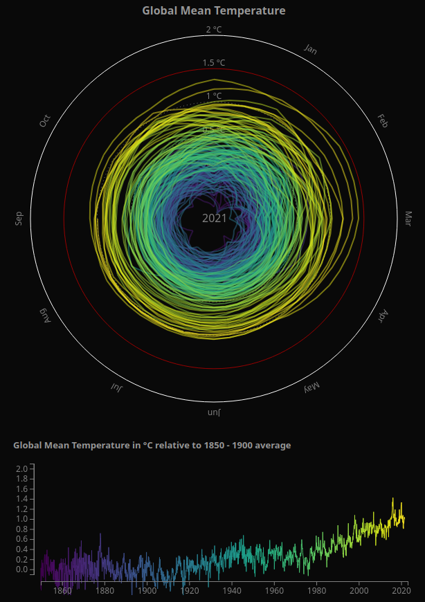]

.center[Climate spiral vs. line chart showing global mean temperature change over time.]

.footnote[Credits: [Open climate data](https://openclimatedata.net/climate-spirals/temperature-line-chart/), adapted from Ed Hawkins' climate spiral.]

---

class: middle

## Guides

.center.width-100[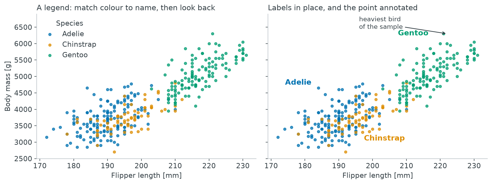]

A legend costs a lookup for every group. Labelling them in place, and annotating the one thing the reader should notice, costs nothing.

---

class: middle

## Show the uncertainty

.center.width-100[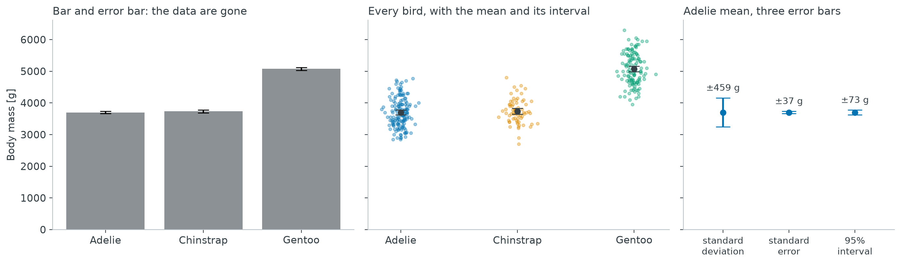]

A bar with an error bar shows a mean and a width, and hides everything else. Show the data, then the estimate and its interval.

.alert[An error bar means nothing until the caption says what it is: here the same Adelie mean carries ±459 g, ±37 g or ±73 g, depending on whether the bar is a standard deviation, a standard error or a 95% interval.]

---

class: middle

.center.width-65[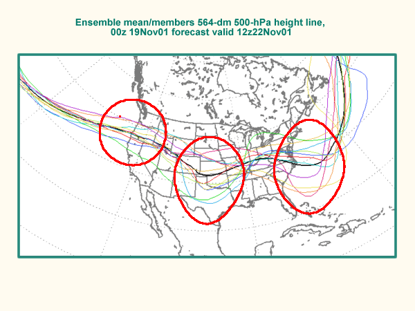]

.center[Ten forecasts of the same contour, three days ahead.<br> Too many lines on purpose&#58; the message is the spread.]

.footnote[Credits: NOAA/NCEP [Environmental Modeling Center](https://www.emc.ncep.noaa.gov/), 500 hPa ensemble forecast, 19 November 2001 (public domain).]

???

The annotation does the rest of the work, circling where the forecasts disagree.

From Lecture 7 on, the same holds for what a model predicts.

---

class: middle

# Anti-patterns 

---

class: middle

.center.width-60[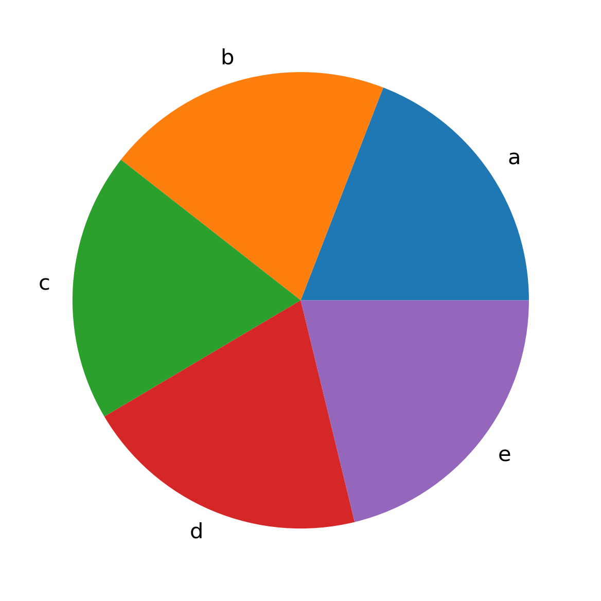]

.center[What category is the largest?]

---

class: middle

.center.width-60[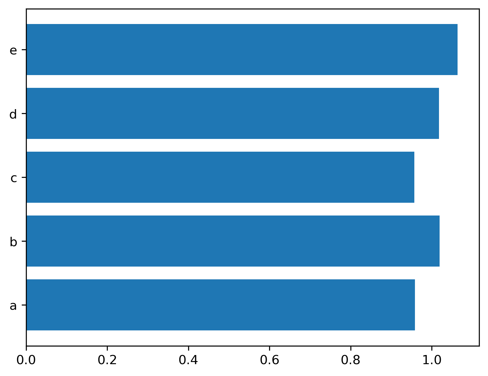]

.center[Same data! .bold[Lengths and positions are easier to compare] than angles and areas.]

???

A pie is readable for two or three slices adding up to a whole. Beyond that, it asks the reader to compare angles.

---


class: middle

.center.width-60[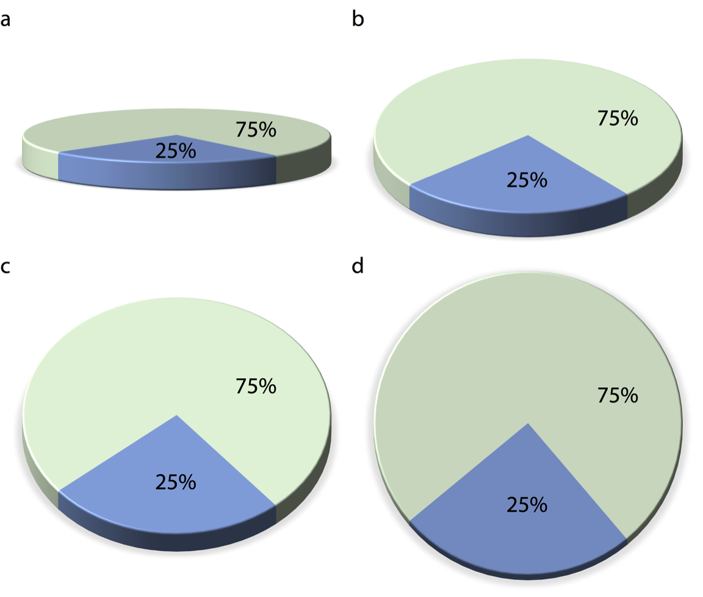]

.center[.bold[Do not go for 3D.] It distorts perception and adds unnecessary complexity.]

.footnote[Credits: Claus O. Wilke, [Fundamentals of Data Visualization](https://clauswilke.com/dataviz/), 2019.]

???

Worse than a pie chart? A 3D pie chart.

---

class: middle

.center.width-60[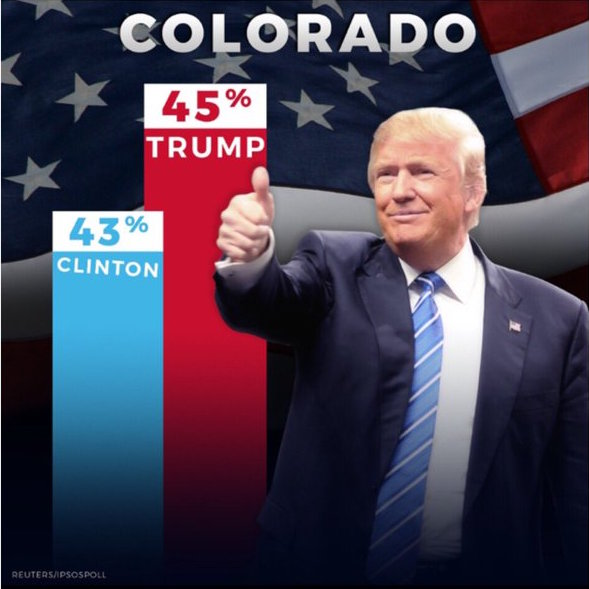]

.center[.bold[Do not exaggerate reality] by truncating axes or using misleading aspect ratios.]

.footnote[Credits: John Muyskens, [Most of Trump's charts skew the data](https://www.washingtonpost.com/graphics/politics/2016-election/trump-charts/), The Washington Post, 2016.]

???

The rule follows from the encoding: a bar encodes a value as a length, so cutting its baseline lies. A dot or a line encodes a position instead, and may show a narrow range: temperature anomalies of a degree need no axis starting at zero.

---

class: middle

.grid[
.kol-1-2[.center.width-65[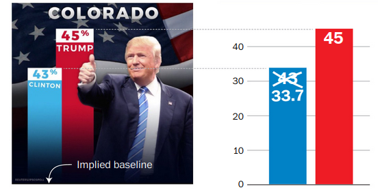]]
.kol-1-2[.center.width-65[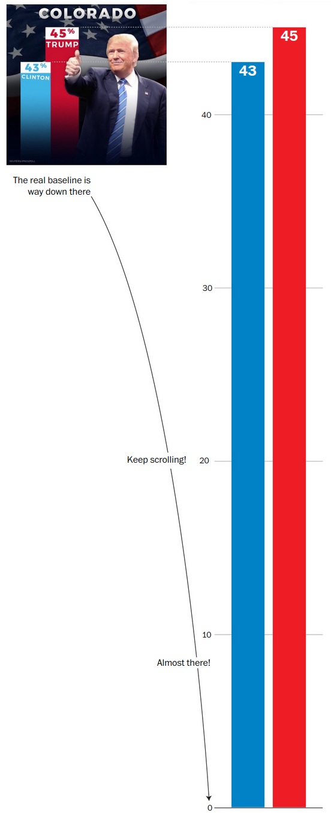]]
]

.footnote[Credits: John Muyskens, [Most of Trump's charts skew the data](https://www.washingtonpost.com/graphics/politics/2016-election/trump-charts/), The Washington Post, 2016.]


---

class: middle

.center[
.width-45[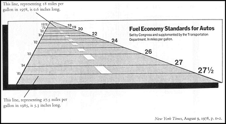] .width-45[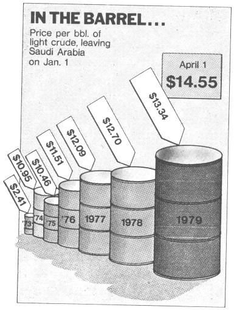]
]

.center[.bold[Do not lie.] Use visual channels that accurately represent the data.]

.footnote[Credits: David Giard, [Data visualization](https://davidgiard.com/data-visualization-part-3-graphical-integrity).]

---

class: middle

.center[<video controls preload="auto" height="480" width="640">
  <source src="./figures/lec3/dataink.mp4" type="video/mp4">
</video>]

.center[.bold[Maximize the data-ink ratio] by removing unnecessary elements.]

.footnote[Credits: Joey Cherdarchuk, [Data looks better naked](https://www.darkhorseanalytics.com/blog/data-looks-better-naked).]

???

Antoine de Saint-Exupéry: "Perfection is achieved, not when there is nothing more to add, but when there is nothing left to take away."

Up to a point: grid lines help read values off a scale, and a memorable chart is sometimes worth more ink (Bateman et al., 2010).

---

class: middle

.smaller.center[
```
   dataset   mean_x   mean_y     sd_x     sd_y         cor
      away 54.26610 47.83472 16.76982 26.93974 -0.06412835
  bullseye 54.26873 47.83082 16.76924 26.93573 -0.06858639
    circle 54.26732 47.83772 16.76001 26.93004 -0.06834336
      dino 54.26327 47.83225 16.76514 26.93540 -0.06447185
      dots 54.26030 47.83983 16.76774 26.93019 -0.06034144
   h_lines 54.26144 47.83025 16.76590 26.93988 -0.06171484
high_lines 54.26881 47.83545 16.76670 26.94000 -0.06850422
slant_down 54.26785 47.83590 16.76676 26.93610 -0.06897974
  slant_up 54.26588 47.83150 16.76885 26.93861 -0.06860921
      star 54.26734 47.83955 16.76896 26.93027 -0.06296110
   v_lines 54.26993 47.83699 16.76996 26.93768 -0.06944557
wide_lines 54.26692 47.83160 16.77000 26.93790 -0.06657523
   x_shape 54.26015 47.83972 16.76996 26.93000 -0.06558334
```
]

.center[.bold[Do not summarize the data without visualizing it.]<br> The Datasaurus dozen: 13 datasets with identical summary statistics.]

.footnote[Credits: [Matejka & Fitzmaurice](https://www.research.autodesk.com/publications/same-stats-different-graphs/), 2017.]

---

class: middle

.center.width-90[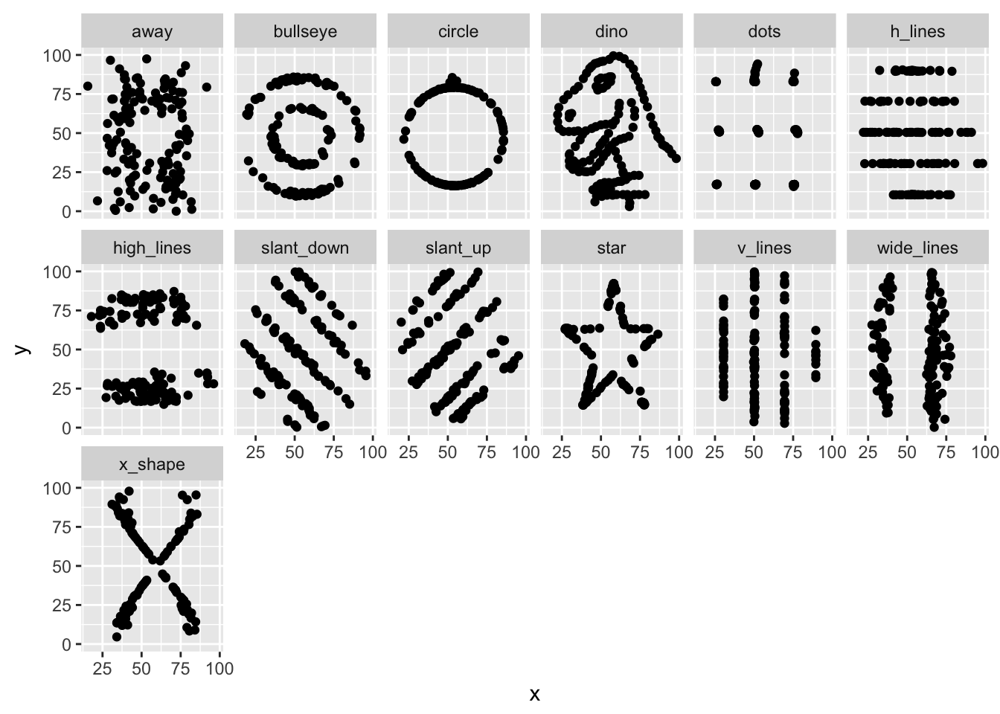]

.center[Summary statistics can be misleading. .bold[Always visualize the rawest data]!]

.footnote[Credits: [Matejka & Fitzmaurice](https://www.research.autodesk.com/publications/same-stats-different-graphs/), 2017.]

---

class: middle

.center.width-45[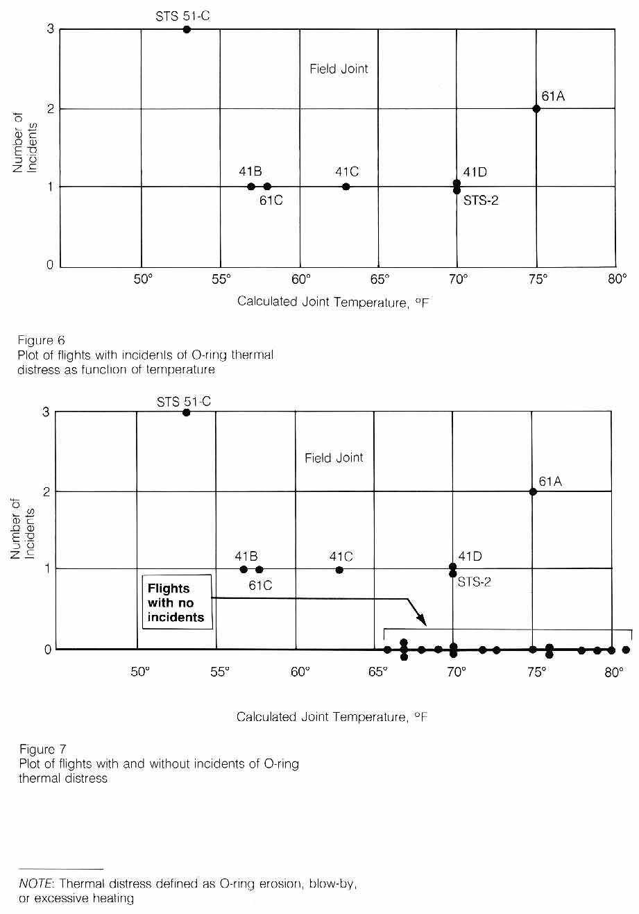]

.center[.bold[Do not plot a subset.] Above, only the flights that had damage; below, all of them.]

.footnote[Credits: [Report of the Presidential Commission on the Space Shuttle Challenger Accident](https://www.nasa.gov/history/rogersrep/v1ch6.htm), 1986, Vol. 1, p. 146.]

???

Challenger launched at 31°F, far colder than any flight on this chart. In the upper panel there is no pattern to see; in the lower one, every flight below 65°F had damage. The data existed, and the plot that showed it was made after the accident.

---

class: middle

# Wrap-up exercise

---

class: middle

.center.width-10[]

Let us discuss the following examples. For each of them, identify what is good and what could be improved.

(All plots are taken from MSc theses of previous years. Author names have been removed to protect the innocent.)

---

class: middle

.center.width-100[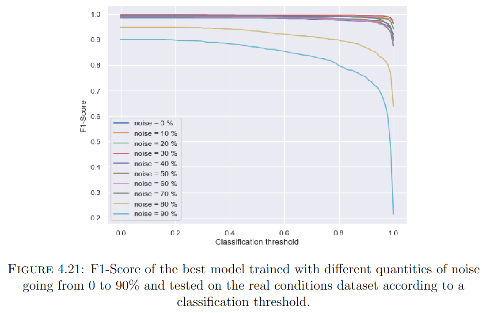]

???

- Good: lines for an evolution against a continuous variable, axes labelled with their quantities, and a caption that states the setup.
- Colour: noise is an ordered variable encoded with ten categorical colours. A sequential colormap would make the order readable, and would survive colour vision deficiency.
- Guides: a ten-entry legend sends the eye back and forth. Label a few curves in place, or keep only 0%, 50% and 90%.
- Eight curves overlap at the top: the story is the collapse near threshold 1. Zoom on 0.85–1.0, or spread that region with a scale on 1 − threshold.
- The grey panel and heavy grid are default ink that no one reads.
- The y axis starts at 0.2, which is fine: these are positions, not lengths.
- Nothing shows how uncertain each curve is, though F1 is estimated on a finite test set.

---

class: middle

.center.width-85[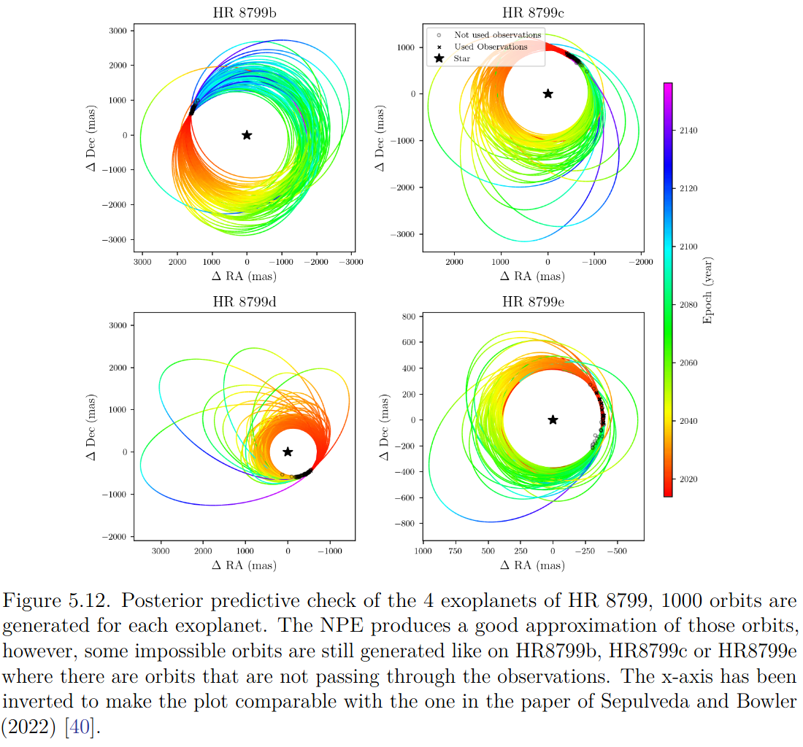]

???

- Good: small multiples, one panel per planet, a sequential colormap for an ordered variable (epoch), a single shared colorbar, and a legend for the marks given once.
- The four panels use four different ranges, from 800 to 3000 mas, so they cannot be compared at a glance. Juxtaposed panels should share their scales.
- The colormap is a rainbow: equal steps in time are not equal steps in colour. Viridis or plasma would be read correctly.
- A thousand opaque orbits per panel saturate the centre. Transparency, or a band showing the bulk with a few sampled orbits on top.
- The legend sits inside a panel and covers data.
- The caption names the message, the impossible orbits, but the figure never points at them. Annotate one.
- Inverting the x axis to match the literature is a good decision, and the caption says so.

---

class: middle

.center.width-60[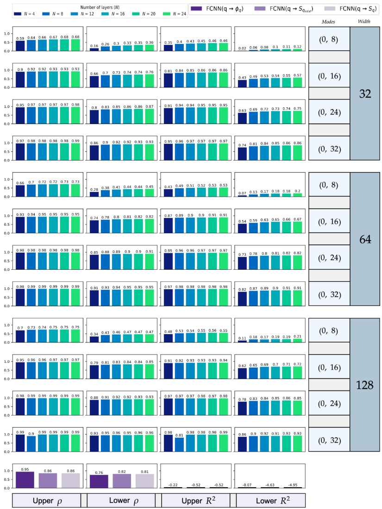]

???

- This is an exploratory plot published as an explanatory one. As a private sweep it is defensible: everything is there, and the author knows what to look for. As a figure in a thesis it fails, because the reader is given 72 panels and no message.
- Once every value is printed, the bars carry nothing: it is a table drawn as a chart. A table for exact numbers, a heatmap for the pattern.
- The question is presumably "does depth or width help?". Lines of the metric against N, one panel per width, answer it directly.
- Comparison across panels is impossible: the eye jumps between distant axes, and the negative values (−0.22, −8.07) are squashed by the 0–1 range.
- Two legends sit far from what they label, and the text is unreadable at this size.
- What it gets right: a consistent layout, and an ordered quantity (the number of layers) encoded with a sequential palette.


---

class: middle

## Key takeaways

- Start from the message: comparison, distribution, correlation or evolution.
- Encode it with the channels read most accurately: position and length first.
- Pick scales, coordinates and colours that do not distort what the data say.
- Avoid the classics: 3D, bars cut off from zero, colour as the only cue.

A good plot answers a question, and does not let the reader misread the answer.

---

class: end-slide, center
count: false

The end.
