class: middle, center, title-slide

# Foundations of Data Science

Lecture 4: Latent variable models

  
Prof. Gilles Louppe 
[g.louppe@uliege.be](mailto:g.louppe@uliege.be)

---

class: middle

.center.width-40[]

Lecture 2 closed on four hypotheses, and three of them are for today: body mass is not a single population but a mixture of species, measurements differ from group to group, and the four measurements are correlated enough that fewer numbers may describe them.

.question[What if we had not been given the species labels? Which unobserved quantities would explain what we see?]

---

class: middle

# Probabilistic modeling of data

---

class: middle

.bold[Recap from Lecture 2.] A measurement is what a process produces from an entity $\omega \in \Omega$ (a penguin) under measurement conditions $\xi \in \Xi$ (the scale, the observer, the day),
$$f : \Omega \times \Xi \to \mathcal{X}.$$
Neither $\omega$ nor $\xi$ is observed, only $\mathbf{x} = f(\omega, \xi)$.

Given a distribution $p(\omega, \xi)$ over entities and conditions, $f$ induces the .bold[data distribution]
$$p\_r(\mathbf{x}) = \iint p(\omega, \xi) \, \delta(\mathbf{x} - f(\omega, \xi)) \, d\omega \, d\xi,$$
which is what a model has to account for, and $\theta$ stays free for the parameters of that model.

???

The entities and the conditions are the first latent variables of the course, although we never call them that: they are unobserved, and they explain the variability of what we record. Today we put some of them back into the model, as $\mathbf{z}$.

---

class: middle

A .bold[parametric probabilistic model] encodes assumptions about how data are generated. It is specified by a parametric family 
$$\mathcal{P} = \\{ p(\mathbf{x} \mid \theta) : \theta \in \Theta \\},$$
where $p(\mathbf{x} \mid \theta)$ is a probability distribution over $\mathcal{X}$, $\theta$ are parameters, and $\Theta$ is the parameter space.

---

class: middle

.alert[$p(\mathbf{x} \mid \theta)$ is not the data distribution $p\_{r}(\mathbf{x})$, only a model of it! A .italic[true] parameter exists only if $p\_r$ belongs to the family $\mathcal{P}$.]

???

Two cases where a true parameter does make sense. First, data simulated from the model itself: `nb01` draws data at a chosen $\theta^\*$ and checks that the estimate recovers it. Second, fields where the parameters are quantities of nature, a particle mass or a coupling constant, and the family is taken to be right: there, $\theta^\*$ is what the experiment is after.

For the penguins, $\mathcal{P}$ is a convenient description and nothing more: no value of $(\mu, \sigma^2)$ makes the Gaussian equal to the real distribution of body masses.

---

class: middle

.center.width-10[]

Example: Body masses of penguins could be modeled as
$$p(x \mid \mu, \sigma^2) = \mathcal{N}(x \mid \mu, \sigma^2),$$
where the parameters are $\theta = (\mu, \sigma^2)$, with $\mu \in \mathbb{R}$ and $\sigma^2 > 0$.

This would assume
- body masses cluster around a central value $\mu$,
- variability is symmetric and controlled by $\sigma^2$,
- extreme values are rare (body masses are normally distributed).

---

class: middle

.center.width-80[]

---

class: middle

## Frequentist inference

In the Frequentist framework, $\theta$ is treated as an unknown but fixed quantity to be estimated from observed data $\mathbf{x}\_\text{obs}$. The data are assumed to be generated from the model for some unknown parameter value $\theta^\*$,
$$\mathbf{x}\_\text{obs} \sim p(\mathbf{x} \mid \theta^\*).$$

Fitting the model to data consists in finding a point estimate $\hat{\theta}$ of $\theta^\*$ (or a confidence region thereof) that best explains the observed data.

This $\theta^\*$ lives inside the model: it is the parameter of the member of $\mathcal{P}$ the data are assumed to come from. If the family contains no such member, $\hat{\theta}$ estimates the parameter of the member closest to $p\_r$.

???

Closest in the Kullback-Leibler sense: maximum likelihood converges to the $\theta$ minimizing $\text{KL}(p\_r \| p(\cdot \mid \theta))$, whether or not the family contains $p\_r$. Estimating something remains well defined; calling it true does not.

---

class: middle

## Bayesian inference

In the Bayesian framework, $\theta$ is treated as a random variable with prior distribution $p(\theta)$ encoding beliefs about plausible parameter values before observing any data.

A .bold[Bayesian model] therefore specifies a joint distribution over data and parameters,
$$p(\mathbf{x}, \theta) = p(\mathbf{x} \mid \theta) p(\theta),$$
where 
- $p(\mathbf{x} \mid \theta)$ is the likelihood,
- $p(\theta)$ is the prior over parameters.

---

class: middle

Fitting a Bayesian model to observed data $\mathbf{x}\_\text{obs}$ consists in computing the posterior distribution of the parameters given the data. Using Bayes' rule,
$$p(\theta \mid \mathbf{x}\_\text{obs}) = \frac{p(\mathbf{x}\_\text{obs} \mid \theta) p(\theta)}{p(\mathbf{x}\_\text{obs})}.$$

Where the Frequentist framework estimates a single value $\hat{\theta}$, the Bayesian framework infers a distribution over $\Theta$: how plausible each member of $\mathcal{P}$ is, in light of the data and of the prior.

Depending on the structure of the model, this computation may be easy, difficult, or even intractable.

???

The posterior lives inside the model just as $\theta^\*$ does: it is conditional on the family $\mathcal{P}$ and on the prior, and says nothing about what lies outside them. As the data grow, it concentrates on the member of $\mathcal{P}$ closest to $p\_r$, the same limit the maximum likelihood estimate reaches, and on $\theta^\*$ when the family contains $p\_r$.

Note also what each framework is uncertain about. A confidence region is a statement about the procedure, over repeated data sets; the posterior is a statement about $\theta$, for the data set at hand.

---

class: middle

## Prior predictive checks

Often, the forward model $p(\mathbf{x} \mid \theta)$ is understood, but the prior $p(\theta)$ is more subjective and harder to justify.

The consequences of prior choices in the context of the generative model can be assessed through .bold[prior predictive checks], which involve simulating data from the model using only the prior distributions, without conditioning on any observed data.

---

class: middle

The prior predictive distribution is given by
$$p(\mathbf{x}) = \int p(\mathbf{x} \mid \theta) p(\theta) d\theta.$$

This distribution defines the data that we expect to observe under the model assumptions encoded in the prior. It should be examined to ensure that it aligns with domain knowledge and expectations about the data.

---

class: middle

.center.width-65[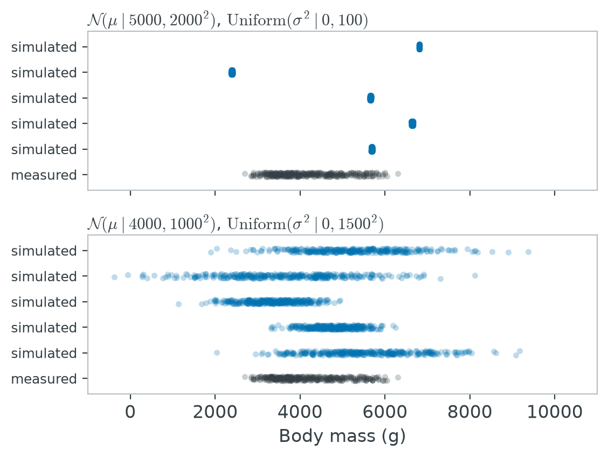]

.center[Five colonies of 342 penguins simulated from the prior (top), and from a wider  prior on $\sigma^2$ (bottom), against the penguins actually measured.]

???

$\text{Uniform}(\sigma^2 \mid 0, 100)$ caps $\sigma$ at 10 g, so every simulated colony weighs the same to within a few grams, while real penguins spread over some 800 g. A pooled histogram of many draws would have hidden this, since its width comes from the prior on $\mu$; simulating whole datasets shows it at once.

The repair is not subtle, and that is the point: a prior predictive check is cheap, and it catches this before any data are touched.

---

class: middle

# Latent variable models

---

class: middle

## Joint distribution

A .bold[latent variable model] is a probabilistic model that assumes unobserved (latent) variables $\mathbf{z}$ that mediate the relationship between observed data $\mathbf{x}$ and model parameters $\theta$.

It specifies a joint distribution over observed variables, latent variables, and parameters,
$$p(\mathbf{x}, \mathbf{z}, \theta) = p(\mathbf{x} \mid \mathbf{z}, \theta) p(\mathbf{z} \mid \theta) p(\theta),$$
where $\mathbf{x}$ is the observed data, $\mathbf{z}$ are the latent variables, and $\theta$ are the parameters.

---

class: middle

More generally, for a dataset of $N$ observations $\\{ \mathbf{x}\_1, \ldots, \mathbf{x}\_N \\}$, a latent variable model specifies a joint distribution
$$p(\mathbf{x}\_{1:N}, \mathbf{z}\_{1:N}, \theta) = \left( \prod\_{i=1}^N p(\mathbf{x}\_i \mid \mathbf{z}\_i, \theta) p(\mathbf{z}\_i \mid \theta) \right) p(\theta),$$
where $\mathbf{z}\_i$ are the latent variables associated with observation $\mathbf{x}\_i$.

The factorization assumes that each observation $\mathbf{x}\_i$ is mediated by its own latent variable $\mathbf{z}\_i$, and that observations are conditionally independent given their latent variables and the parameters. All are governed by shared parameters $\theta$.

---

class: middle

## Marginal likelihood

The latent variables are not observed. Integrating them out gives the likelihood of the data alone,
$$p(\mathbf{x} \mid \theta) = \int p(\mathbf{x} \mid \mathbf{z}, \theta) p(\mathbf{z} \mid \theta) \, d\mathbf{z},$$
or, for $N$ conditionally independent observations,
$$p(\mathbf{x}\_{1:N} \mid \theta) = \prod\_{i=1}^N \int p(\mathbf{x}\_i \mid \mathbf{z}\_i, \theta) p(\mathbf{z}\_i \mid \theta) \, d\mathbf{z}\_i.$$

This integral is where the difficulty of latent variable models lies: it is what maximum likelihood maximizes, and it is the normalizer of the posterior over the latent variables,
$$p(\mathbf{z} \mid \mathbf{x}, \theta) = \frac{p(\mathbf{x} \mid \mathbf{z}, \theta) p(\mathbf{z} \mid \theta)}{p(\mathbf{x} \mid \theta)}.$$

???

Both examples of this lecture are among the rare cases where the integral is available in closed form: a Gaussian integral for probabilistic PCA, a finite sum over the $K$ components for a mixture. Elsewhere there is none, and much of the second half of the course is built around this: EM (L8) and variational inference (L9) attack the integral, while MCMC (L6) samples the posterior without ever computing its normalizer.

---

class: middle

## Graphical model representation

Latent variable models can be represented using graphical models, where nodes represent variables (observed, latent, or parameters) and edges represent (possible) dependencies between them.

The graphical model illustrates the structure of the factorization of the joint distribution and the flow of the generative process.

---

class: middle

.center.width-50[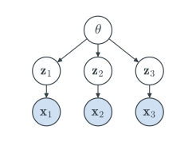]

$$p(\mathbf{x}\_{1:3}, \mathbf{z}\_{1:3}, \theta) = \left( \prod\_{i=1}^3 p(\mathbf{x}\_i \mid \mathbf{z}\_i) p(\mathbf{z}\_i \mid \theta) \right) p(\theta)$$

Shaded nodes represent observed variables, unshaded nodes represent latent variables or parameters.

Here $\mathbf{x}\_i$ depends on $\theta$ only through $\mathbf{z}\_i$. In general, $\theta$ may also point directly at $\mathbf{x}\_i$.

---

class: middle

.center.width-50[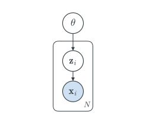]

.center[Plate notation can be used to compactly represent  repeated structures in the graphical model.] 

.success[$\mathbf{z}\_i$ is .bold[local], $\theta$ is .bold[global].]

???

Here, the plate around $\mathbf{x}\_i$ and $\mathbf{z}\_i$ indicates that these variables are repeated $N$ times, for $i = 1, \ldots, N$.

The split is what the later algorithms exploit: EM (L8) and variational inference (L9) alternate between the local variables, one update per observation, and the global ones, shared across the data.

---

class: middle

## Hyperparameters

Conditional distributions in a latent variable model may depend on additional parameters called .bold[hyperparameters], denoted $\alpha, \beta, \ldots$. These are assumed to be fixed nonrandom quantities$^1$.

For instance, the prior distribution of parameters may depend on hyperparameters,
$$p(\theta \mid \alpha),$$
or the prior distribution of latent variables may depend on hyperparameters,
$$p(\mathbf{z} \mid \theta, \beta).$$

.footnote[1: Estimating hyperparameters from data is possible; this is empirical Bayes, discussed in Lecture 8.]

---

class: middle

.center.width-50[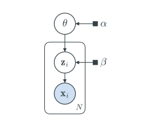]

.center[Small squares denote fixed hyperparameters.]

---

class: middle

## Inference

Fitting a latent variable model to observed data $\mathbf{x}\_\text{obs}$ consists in computing the posterior distribution of latent variables and parameters given the data. Using Bayes' rule,
$$p(\mathbf{z}, \theta \mid \mathbf{x}\_\text{obs}) = \frac{p(\mathbf{x}\_\text{obs} \mid \mathbf{z}, \theta) p(\mathbf{z} \mid \theta) p(\theta)}{p(\mathbf{x}\_\text{obs})}.$$

The posterior distribution is used to examine the particular hidden structure that is manifested in the observed data. It can also be used to make predictions about new, unseen data, through the posterior predictive distribution,
$$p(\mathbf{x}\_\text{new} \mid \mathbf{x}\_\text{obs}) = \iint p(\mathbf{x}\_\text{new} \mid \mathbf{z}, \theta) p(\mathbf{z}, \theta \mid \mathbf{x}\_\text{obs}) \, d\mathbf{z} \, d\theta.$$

???

Here $\mathbf{z}$ is the latent variable of the new observation, drawn from the model: only the parameters are informed by the data already seen.

The denominator $p(\mathbf{x}\_\text{obs})$ is the marginal likelihood one level up, with the parameters integrated out too: $p(\mathbf{x}\_\text{obs}) = \int p(\mathbf{x}\_\text{obs} \mid \theta) p(\theta) \, d\theta$.

---

class: middle

Latent variables appear wherever the quantity that matters cannot be recorded:
- .bold[Astronomy]: the distance of a star, behind a noisy parallax (Example 4).
- .bold[Engineering]: the position and velocity of a vehicle, behind its sensors (state-space models, Lecture 5).
- .bold[Education]: the ability of a student, behind right and wrong answers (item response theory).
- .bold[Genetics]: the ancestral populations a genome is mixed from, behind its alleles (admixture models, the same structure as the topic models below).
- .bold[Epidemiology]: how many people are actually infected, behind the cases a health system reports.

???

The last one is the COVID story of Lecture 1: reported cases are a filtered, delayed view of an epidemic nobody observes directly.

---

class: middle

## Example 1: (Probabilistic) PCA 

In probabilistic PCA, each observation $\mathbf{x}\_i \in \mathbb{R}^d$ is assumed to be generated from a lower-dimensional latent variable $\mathbf{z}\_i \in \mathbb{R}^m$ through a linear transformation plus Gaussian noise.

.center.width-50[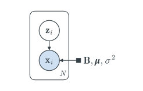]

---

class: middle

The joint distribution $p(\mathbf{z}, \mathbf{x} \mid \mathbf{B}, \boldsymbol{\mu}, \sigma^2)$ factorizes as $p(\mathbf{z}) p(\mathbf{x} \mid \mathbf{z}, \mathbf{B}, \boldsymbol{\mu}, \sigma^2)$, where
- $p(\mathbf{z}) = \mathcal{N}(\mathbf{z} \mid \mathbf{0}, \mathbf{I})$ assumes latent variables are standard Gaussian,
- $p(\mathbf{x} \mid \mathbf{z}, \mathbf{B}, \boldsymbol{\mu}, \sigma^2) = \mathcal{N}(\mathbf{x} \mid \mathbf{B}\mathbf{z} + \boldsymbol{\mu}, \sigma^2 \mathbf{I})$ assumes a linear Gaussian observation model, with $\mathbf{B} \in \mathbb{R}^{d \times m}$ the loading matrix, $\boldsymbol{\mu} \in \mathbb{R}^d$ the mean vector, and $\sigma^2$ the noise variance.

Therefore, using Gaussian identities, the joint distribution is Gaussian and can be written as
$$p(\mathbf{z}, \mathbf{x} \mid \mathbf{B}, \boldsymbol{\mu}, \sigma^2) = \mathcal{N}\left(\begin{bmatrix} \mathbf{z} \\\\ \mathbf{x} \end{bmatrix} \bigg| \begin{bmatrix} \mathbf{0} \\\\ \boldsymbol{\mu} \end{bmatrix}, \begin{bmatrix} \mathbf{I} & \mathbf{B}^T \\\\ \mathbf{B} & \mathbf{B}\mathbf{B}^T + \sigma^2 \mathbf{I} \end{bmatrix}\right).$$

---

class: middle

The posterior distribution $p(\mathbf{z} \mid \mathbf{x}, \mathbf{B}, \boldsymbol{\mu}, \sigma^2)$ is also Gaussian,
$$p(\mathbf{z} \mid \mathbf{x}, \mathbf{B}, \boldsymbol{\mu}, \sigma^2) = \mathcal{N}(\mathbf{z} \mid \boldsymbol{\mu}\_{z \mid x}, \boldsymbol{\Sigma}\_{z \mid x}),$$
where
- $\boldsymbol{\mu}\_{z \mid x} = \mathbf{B}^T (\mathbf{B}\mathbf{B}^T + \sigma^2 \mathbf{I})^{-1} (\mathbf{x} - \boldsymbol{\mu})$ is the posterior mean,
- $\boldsymbol{\Sigma}\_{z \mid x} = \mathbf{I} - \mathbf{B}^T (\mathbf{B}\mathbf{B}^T + \sigma^2 \mathbf{I})^{-1} \mathbf{B}$ is the posterior covariance.

---

class: middle

When $\sigma^2 \to 0$, and writing the posterior in the equivalent form $\boldsymbol{\mu}\_{z \mid x} = (\mathbf{B}^T\mathbf{B} + \sigma^2 \mathbf{I})^{-1} \mathbf{B}^T (\mathbf{x} - \boldsymbol{\mu})$ and $\boldsymbol{\Sigma}\_{z \mid x} = \sigma^2 (\mathbf{B}^T\mathbf{B} + \sigma^2 \mathbf{I})^{-1}$,
- $\boldsymbol{\mu}\_{z \mid x} \to (\mathbf{B}^T\mathbf{B})^{-1} \mathbf{B}^T (\mathbf{x} - \boldsymbol{\mu})$. If the columns of $\mathbf{B}$ are orthonormal, this is $\mathbf{B}^T (\mathbf{x} - \boldsymbol{\mu})$, the PCA projection of $\mathbf{x}$ onto the subspace spanned by the columns of $\mathbf{B}$.
- $\boldsymbol{\Sigma}\_{z \mid x} \to \mathbf{0}$, so the posterior collapses to a point mass at that projection.

.alert[Probabilistic PCA recovers classical PCA in the limit of vanishing noise!]

---

class: middle

The parameters $\theta = (\mathbf{B}, \boldsymbol{\mu}, \sigma^2)$ can be estimated from data $\mathbf{x}\_{1:N}$ by maximum (marginal) likelihood,
$$(\hat{\mathbf{B}}, \hat{\boldsymbol{\mu}}, \hat{\sigma}^2) = \arg\max\_{\mathbf{B}, \boldsymbol{\mu}, \sigma^2} \prod\_{i=1}^N p(\mathbf{x}\_i \mid \mathbf{B}, \boldsymbol{\mu}, \sigma^2),$$
where $p(\mathbf{x} \mid \mathbf{B}, \boldsymbol{\mu}, \sigma^2) = \int p(\mathbf{x} \mid \mathbf{z}, \mathbf{B}, \boldsymbol{\mu}, \sigma^2) p(\mathbf{z}) d\mathbf{z}$ is the marginal likelihood.

Since the joint distribution is Gaussian, the marginal likelihood is also Gaussian,
$$p(\mathbf{x} \mid \mathbf{B}, \boldsymbol{\mu}, \sigma^2) = \mathcal{N}(\mathbf{x} \mid \boldsymbol{\mu}, \mathbf{B}\mathbf{B}^T + \sigma^2 \mathbf{I}).$$

This is a point estimate of $\theta$, not a posterior over it: the latent variables $\mathbf{z}\_i$ are integrated out, the parameters are not.

---

class: middle

Therefore, writing $\boldsymbol{\Sigma} = \mathbf{B}\mathbf{B}^T + \sigma^2 \mathbf{I}$, maximum likelihood estimation reduces to
$$\begin{aligned}
(\hat{\mathbf{B}}, \hat{\boldsymbol{\mu}}, \hat{\sigma}^2) &= \arg\max\_{\mathbf{B}, \boldsymbol{\mu}, \sigma^2} \prod\_{i=1}^N \mathcal{N}(\mathbf{x}\_i \mid \boldsymbol{\mu}, \boldsymbol{\Sigma}) \\\\
&= \arg\min\_{\mathbf{B}, \boldsymbol{\mu}, \sigma^2} \sum\_{i=1}^N (\mathbf{x}\_i - \boldsymbol{\mu})^T \boldsymbol{\Sigma}^{-1} (\mathbf{x}\_i - \boldsymbol{\mu}) + N \log |\boldsymbol{\Sigma}| \\\\
&= \arg\min\_{\mathbf{B}, \boldsymbol{\mu}, \sigma^2} N \\, \text{tr}(\boldsymbol{\Sigma}^{-1} \mathbf{S}) + N \log |\boldsymbol{\Sigma}|,
\end{aligned}$$
where $\mathbf{S} = \frac{1}{N} \sum\_{i=1}^N (\mathbf{x}\_i - \boldsymbol{\mu})(\mathbf{x}\_i - \boldsymbol{\mu})^T$ is the sample covariance matrix.

The solution can be derived in closed form, yielding
- $\hat{\boldsymbol{\mu}} = \frac{1}{N} \sum\_{i=1}^N \mathbf{x}\_i$ (the sample mean),
- $\hat{\mathbf{B}} = \mathbf{U}\_m (\boldsymbol{\Lambda}\_m - \hat{\sigma}^2 \mathbf{I})^{1/2} \mathbf{R}$, where $\mathbf{U}\_m$ holds the top $m$ eigenvectors of $\mathbf{S}$, $\boldsymbol{\Lambda}\_m$ the corresponding eigenvalues, and $\mathbf{R}$ is an arbitrary rotation matrix,
- $\hat{\sigma}^2 = \frac{1}{d - m} \sum\_{j=m+1}^d \lambda\_j$, where $\lambda\_j$ are the eigenvalues of $\mathbf{S}$.

Since $\mathbf{R}$ is free, $\mathbf{B}$ is identified only up to a rotation: the model pins down the latent subspace, not the coordinates within it.

???

The rotation is why the latent coordinates of probabilistic PCA should not be read one by one, unlike the components of PCA, which the choice $\mathbf{R} = \mathbf{I}$ recovers.

Intuitive explanation for the solution:
- $\hat{\mu}$ is the sample mean because it minimizes the squared deviations from the mean. This appears in the log-likelihood as the term $(x\_i - \mu)^T \Sigma^{-1} (x\_i - \mu)$.
- $\hat{B}$ is related to the top $m$ eigenvectors of $S$ because these directions capture the most variance in the data. The term $\text{tr}(\Sigma^{-1} S)$ in the log-likelihood encourages $\Sigma$ to align with the directions of high variance in $S$.
- $\hat{\sigma}^2$ is the average of the remaining eigenvalues because it represents the isotropic noise variance that accounts for the variance not captured by the top $m$ components. The term $\log |\Sigma|$ in the log-likelihood penalizes overly complex models, leading to a balance between fitting the data and maintaining a reasonable noise level.

---

class: middle

.center.width-80[]

---

class: middle

.center.width-10[]

Deriving PCA from a latent variable model provides a .bold[probabilistic interpretation of PCA projections as the most likely latent variables that could have generated the observed data]. 

It also enables direct extensions such as
- Independent Component Analysis (ICA), which assumes non-Gaussian latent variables,
- Factor Analysis, which assumes a more general noise covariance structure,
- Bayesian PCA, which places a prior distribution over the hyperparameters.

---

class: middle

## Example 2: Mixture models

Mixture models assume that data are generated from a mixture of several underlying distributions, each corresponding to a different cluster or component.

.center.width-50[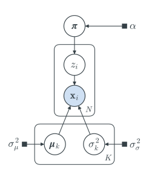]

---

class: middle

For a Gaussian mixture model with $K$ components, each observation $\mathbf{x}\_i \in \mathbb{R}^d$ is assumed to be generated by first selecting a component $z\_i \in \\{1, \ldots, K\\}$ according to a categorical distribution, then sampling $\mathbf{x}\_i$ from a Gaussian distribution associated with that component.

The parameters are $\theta = (\boldsymbol{\pi}, \boldsymbol{\mu}\_{1:K}, \sigma^2\_{1:K})$, where $\boldsymbol{\pi}$ holds the mixture weights. The joint distribution $p(\theta, z\_{1:N}, \mathbf{x}\_{1:N} \mid \alpha, \sigma^2\_\mu, \sigma^2\_\sigma)$ factorizes as 
$$p(\boldsymbol{\pi} \mid \alpha) \prod\_{k=1}^K p(\boldsymbol{\mu}\_k \mid \sigma^2\_\mu) p(\sigma^2\_k \mid \sigma^2\_\sigma) \prod\_{i=1}^N p(z\_i \mid \boldsymbol{\pi}) p(\mathbf{x}\_i \mid z\_i, \boldsymbol{\mu}\_{z\_i}, \sigma^2\_{z\_i}),$$
where
- $p(\boldsymbol{\pi} \mid \alpha) = \text{Dirichlet}(\boldsymbol{\pi} \mid \alpha)$ is the prior over mixture weights,
- $p(\boldsymbol{\mu}\_k \mid \sigma^2\_\mu) = \mathcal{N}(\boldsymbol{\mu}\_k \mid \mathbf{0}, \sigma^2\_\mu \mathbf{I})$ is the prior over component means,
- $p(\sigma^2\_k \mid \sigma^2\_\sigma) = \text{Lognormal}(\sigma^2\_k \mid 0, \sigma^2\_\sigma)$ is the prior over component variances,
- $p(z\_i \mid \boldsymbol{\pi}) = \text{Categorical}(z\_i \mid \boldsymbol{\pi})$ is the distribution over components,
- $p(\mathbf{x}\_i \mid z\_i, \boldsymbol{\mu}\_{z\_i}, \sigma^2\_{z\_i}) = \mathcal{N}(\mathbf{x}\_i \mid \boldsymbol{\mu}\_{z\_i}, \sigma^2\_{z\_i} \mathbf{I})$ is the Gaussian observation model.

---

class: middle

Computing the posterior distribution $p(\theta, z\_{1:N} \mid \mathbf{x}\_{1:N}, \alpha, \sigma^2\_\mu, \sigma^2\_\sigma)$ amounts to solving a clustering problem, where each component corresponds to a cluster and the latent variables $z\_i$ indicate cluster membership of each observation.

The posterior is typically intractable. Sampling from it is the subject of Lecture 6 (MCMC), approximating it by a simpler distribution that of Lecture 9 (variational inference); Lecture 8 (EM) settles instead for a point estimate of $\theta$, with the $z\_i$ integrated out.

A mixture is also identified only up to a permutation of its components: relabelling them leaves the distribution unchanged, so the posterior has $K!$ equivalent modes.

???

Label switching is why a sampler exploring the posterior of a mixture visits several equivalent modes, and why averaging the draws of $\boldsymbol{\mu}\_k$ across them is meaningless. We come back to this multimodality in L6.

Again, deriving clustering from a latent variable model provides a probabilistic interpretation of cluster assignments as the most likely latent variables that could have generated the observed data. It provides a principled narrative with explicit assumptions rather than a mere algorithmic recipe.

---

class: middle

.center.width-80[]

---

class: middle

## Example 3: Mixed membership models

Nested sets of latent variables can also be used to model more complex generative structures. 

---

class: middle

For instance, in mixed membership models of text documents (.bold[latent Dirichlet allocation]), each document is assumed to be generated from a mixture of topics, where each topic is characterized by a distribution over words.

.center.width-50[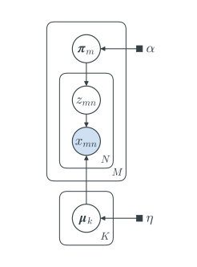]

???

Counting here is local to the example: $M$ documents, $N$ words within a document, $K$ topics.

- $\boldsymbol{\pi}\_m$ are the topic proportions of document $m$, drawn once per document,
- $z\_{mn}$ is the topic assignment of word $n$ in document $m$,
- $x\_{mn}$ is the observed word,
- $\boldsymbol{\mu}\_k$ is the distribution over words of topic $k$.

The nesting is the point: a mixture inside each document, with the topics shared across all of them.

---

class: middle

Posterior inference in mixed membership models can be used to discover the underlying topics in a corpus of documents and to infer the topic proportions for each document.

???

Again, deriving topic modeling from a latent variable model provides a probabilistic interpretation of topics and document-topic proportions as the most likely latent variables that could have generated the observed data.

---

class: middle

.center.width-100[]

.footnote[Credits: [Blei](https://www.eecis.udel.edu/~shatkay/Course/papers/UIntrotoTopicModelsBlei2011-5.pdf), 2011.]

---

class: middle

.center.width-100[]

.footnote[Credits: [Blei](https://www.eecis.udel.edu/~shatkay/Course/papers/UIntrotoTopicModelsBlei2011-5.pdf), 2011.]

---

class: middle

## Example 4: How far are the stars?

Gaia measured the .bold[parallax] of 1.47 billion stars: the angle that the radius of Earth's orbit subtends at the star, which shrinks as the star gets further away,
$$\varpi = \frac{1}{r}.$$
The units make it exact: $\varpi$ in milliarcseconds (a thousandth of an arcsecond) and $r$ in kiloparsecs (about 3260 light-years).

.center.width-65[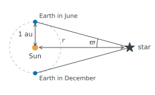]

.center[Not to scale.]

???

An arcsecond is 1/3600 of a degree, so a milliarcsecond is a very small angle: at 1 kpc it is what a two-euro coin subtends from 5000 km away.

Gaia is an ESA satellite that scanned the whole sky repeatedly from 2014 to 2025. Its distances underpin much of what we now know about the Galaxy.

---

class: middle

Distances are what turn a catalogue of angles and brightnesses into physics:
- how bright a star looks depends on how bright it really is and on how far away it is; the distance separates the two, and how bright it really is tells its mass and its age,
- how fast it drifts across the sky, an angle per year, becomes a speed in kilometres per second, which is how the mass of the Galaxy, dark matter included, is weighed,
- the catalogue stops being a picture of the sky and becomes a three-dimensional map.

???

The first one is the distance modulus, $M = m - 5 \log\_{10}(r / 10\\,\text{pc})$, and the diagram it feeds is the Hertzsprung-Russell diagram, the workhorse of stellar physics.

Everything downstream inherits the uncertainty on $r\_i$, which is the reason to want a posterior rather than a number.

---

class: middle

.center.width-65[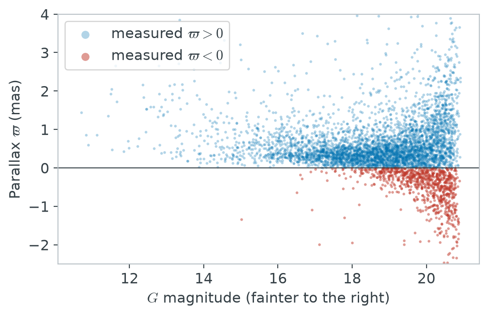]

.center[A random sample of 5000 stars from Gaia DR3. For 82% of them $\varpi\_i / \sigma\_i < 5$,  and for the 17% below the line $1/\varpi\_i$ is not even a distance.]

.footnote[Data: ESA/Gaia/DPAC, Gaia DR3.]

???

A negative parallax is not a broken measurement: it is a noisy measurement of a small positive angle. Keeping only the stars with a good parallax, or inverting those alone, quietly restricts the sample to the nearby ones.

So the naive estimate is useless for most of the catalogue. The rest of the example is about what these noisy measurements are still worth, one by one and all together.

---

class: middle

.bold[Geometry.] The parallax of a star at distance $r\_i$ is exactly $1/r\_i$. No modelling freedom here: it is what a parallax is.

.bold[The instrument.] Gaia reports an estimate of that angle, with an uncertainty $\sigma\_i$ computed star by star. Modelling its errors as unbiased and Gaussian gives
$$p(\varpi\_i \mid r\_i, \sigma\_i) = \mathcal{N}(\varpi\_i \mid 1/r\_i, \sigma\_i^2),$$
which is why a measured parallax can be negative while a distance cannot.

.bold[The Galaxy.] Stars are not spread evenly: a shell at distance $r$ has a volume growing like $r^2$, and their density thins out with distance, modelled as an exponential of scale length $L$,
$$p(r\_i \mid L) = \frac{r\_i^2}{2L^3} \exp(-r\_i / L), \qquad r\_i > 0.$$
That scale length is unknown too, and belongs to the Galaxy rather than to any star, so it gets a vague prior of its own, $p(L) = \text{Uniform}(L \mid 0, 5)$.

???

The real instrument is messier still: Gaia's parallaxes carry a small systematic offset, of the order of $-17$ microarcseconds, which careful work corrects for before anything else. Another piece of domain knowledge, and another term in the model.

The $2L^3$ normalizes the prior. This exponentially decreasing space density prior is from Bailer-Jones (2015).

---
class: middle

.center.width-50[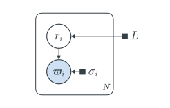]

Everything unobserved is inferred at once,
$$p(r\_{1:N}, L \mid \varpi\_{1:N}, \sigma\_{1:N}) \propto p(L) \prod\_{i=1}^N p(\varpi\_i \mid r\_i, \sigma\_i) \, p(r\_i \mid L),$$
a posterior over $N+1$ unknowns. Two questions are worth asking of it.

???

Nothing here is specific to astronomy. A noisy sensor measuring a quantity you want, plus what you know about where that quantity usually lies, is the same model: a GPS fix against a map, a delivery time against the times of every other delivery, a rating against the ratings of everyone else.
---
class: middle

.bold[What do the stars say about the Galaxy?] Integrating out every distance leaves the length scale alone,
$$p(L \mid \varpi\_{1:N}, \sigma\_{1:N}) \propto p(L) \prod\_{i=1}^N \int p(\varpi\_i \mid r\_i, \sigma\_i) \, p(r\_i \mid L) \, dr\_i,$$
the marginal likelihood of the catalogue, times the prior.

One parallax constrains $L$ almost not at all: a single noisy angle is compatible with nearly any value. Five thousand of them together are not.

???

The integral is the one written earlier in the lecture, now read as a function of the unknown it depends on. Each factor is one-dimensional, so a grid per star is enough, and the product runs over the catalogue.
---
class: middle

.center.width-65[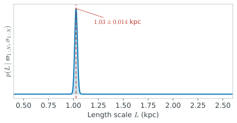]

.center[The stellar density thins out along these lines of sight with a scale length  of $1.03 \pm 0.014$ kpc: a measurement of the shape of the Galaxy.]

???

This is what makes $L$ worth inferring rather than fixing: it is not a knob, it is a number about the Galaxy, and the posterior says how well 5000 stars pin it down, to about 1.4%.

Fitted direction by direction rather than over the whole sky, the same posterior maps how the disk thins out around us, which is what the published catalogue does.

The value sits near the 1.35 kpc used by Bailer-Jones (2015), which is reassuring, but it is also the answer to a caricature: one length scale for the whole sky, and no correction for the fact that Gaia only sees the stars bright enough to be detected. With 50 stars instead of 5000 the posterior would be 0.11 kpc wide, and no one would call it a measurement.
---
class: middle

.bold[And where is each star?] The distance of star $i$ comes from the same posterior, with $L$ and the other distances integrated out,
$$p(r\_i \mid \varpi\_{1:N}, \sigma\_{1:N}) \propto \int p(\varpi\_i \mid r\_i, \sigma\_i) \, p(r\_i \mid L) \, p(L \mid \varpi\_{1:N}, \sigma\_{1:N}) \, dL.$$

When that parallax is precise, it decides the answer on its own. When it is not, the distance comes mostly from what the whole catalogue has established about where stars sit.
---
class: middle

.center.width-65[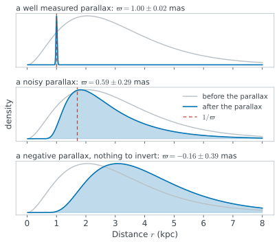]

.center[Three stars of the sample: how likely each distance is  before the parallax is used (grey), and after (blue).]

???

Even the 82% of stars whose parallax is too noisy to invert come out with a distance, and still contribute to the estimate of $L$.

The two curves of a panel are densities on the same scale, but the scale differs from panel to panel: the spike of the first star reaches 20 per kpc, the other two about 0.3.

Top: the parallax is precise, so the posterior collapses onto $1/\varpi$ and the grey curve makes no difference. Middle: the parallax is noisy, and the posterior sits between $1/\varpi$ and the larger distances where most stars are; it is genuinely narrower than the grey curve, 1.4 kpc against 1.8.

Bottom: a negative parallax does not point at a distance, it only rules out the near ones. Its likelihood is a ramp rather than a bump: nearly zero at 1 kpc, then 0.27, 0.65 and 0.87 of its limiting value at 2, 4 and 8 kpc, since the closest the model can come to a negative angle is $1/r \to 0$. Multiplying the grey curve by that ramp cuts its near side and leaves the far tail almost untouched, so the posterior moves outwards, from a mode of 2.1 to 3.1 kpc, while its width hardly changes, 1.77 kpc against 1.78. The panel shows it: the blue curve is no lower and no flatter than the grey one, only further out.
---

class: middle

.center.width-10[]

Every term of this model came from somewhere: the geometry from the definition of a parallax, the error model from the instrument, the prior from the way stars fill the Galaxy.

.bold[A model is an argument about how the data came to be], not a stack of convenient distributions. Each assumption can be named, defended, and attacked.

.footnote[Credits: [Bailer-Jones et al.](https://doi.org/10.3847/1538-3881/abd806), 2021.]

???

Attack this one. A single length scale ignores that the Galaxy is a disk seen from inside and that dust hides the distant stars: the published catalogue therefore fits the prior direction by direction, from a three-dimensional model of the Galaxy. And the sample is not a fair draw from the population, since Gaia only sees what is bright enough, which bends $\hat{L}$.

That is the critique step of Box's loop, and the kind of assumption Lecture 7 puts to the test.

---

class: end-slide, center
count: false

The end.

---

class: middle

## Cheat sheet for Gaussian models (Särkkä, 2013)

If $\mathbf{x}$ and $\mathbf{y}$ have the joint Gaussian distribution 
$$
\begin{aligned}
p\left(\begin{matrix}
\mathbf{x} \\\\
\mathbf{y} 
\end{matrix}\right) = \mathcal{N}\left( \left(\begin{matrix}
\mathbf{x} \\\\
\mathbf{y} 
\end{matrix}\right) \bigg\vert \left(\begin{matrix}
\mathbf{a} \\\\
\mathbf{b} 
\end{matrix}\right), \left(\begin{matrix}
\mathbf{A} & \mathbf{C} \\\\
\mathbf{C}^T & \mathbf{B}
\end{matrix}\right) \right),
\end{aligned}
$$
then the marginal and conditional distributions of $\mathbf{x}$ and $\mathbf{y}$ are given by
$$
\begin{aligned}
p(\mathbf{x}) &= \mathcal{N}(\mathbf{x}|\mathbf{a}, \mathbf{A}) \\\\
p(\mathbf{y}) &= \mathcal{N}(\mathbf{y}|\mathbf{b}, \mathbf{B}) \\\\
p(\mathbf{x}|\mathbf{y}) &= \mathcal{N}(\mathbf{x}|\mathbf{a}+\mathbf{C}\mathbf{B}^{-1}(\mathbf{y}-\mathbf{b}), \mathbf{A}-\mathbf{C}\mathbf{B}^{-1}\mathbf{C}^T) \\\\
p(\mathbf{y}|\mathbf{x}) &= \mathcal{N}(\mathbf{y}|\mathbf{b}+\mathbf{C}^T\mathbf{A}^{-1}(\mathbf{x} - \mathbf{a}) , \mathbf{B}-\mathbf{C}^T\mathbf{A}^{-1}\mathbf{C}).
\end{aligned}
$$

---

class: middle

If the random variables $\mathbf{x}$ and $\mathbf{y}$ have Gaussian probability distributions
$$
\begin{aligned}
p(\mathbf{x}) &= \mathcal{N}(\mathbf{x}|\mathbf{m}, \mathbf{P}) \\\\
p(\mathbf{y}|\mathbf{x}) &= \mathcal{N}(\mathbf{y}|\mathbf{H}\mathbf{x}+\mathbf{u}, \mathbf{R}),
\end{aligned}
$$
then the joint distribution of $\mathbf{x}$ and $\mathbf{y}$ is Gaussian with
$$
\begin{aligned}
p\left(\begin{matrix}
\mathbf{x} \\\\
\mathbf{y} 
\end{matrix}\right) = \mathcal{N}\left( \left(\begin{matrix}
\mathbf{x} \\\\
\mathbf{y} 
\end{matrix}\right) \bigg\vert \left(\begin{matrix}
\mathbf{m} \\\\
\mathbf{H}\mathbf{m}+\mathbf{u} 
\end{matrix}\right), \left(\begin{matrix}
\mathbf{P} & \mathbf{P}\mathbf{H}^T \\\\
\mathbf{H}\mathbf{P} & \mathbf{H}\mathbf{P}\mathbf{H}^T + \mathbf{R} 
\end{matrix}\right) \right).
\end{aligned}
$$

