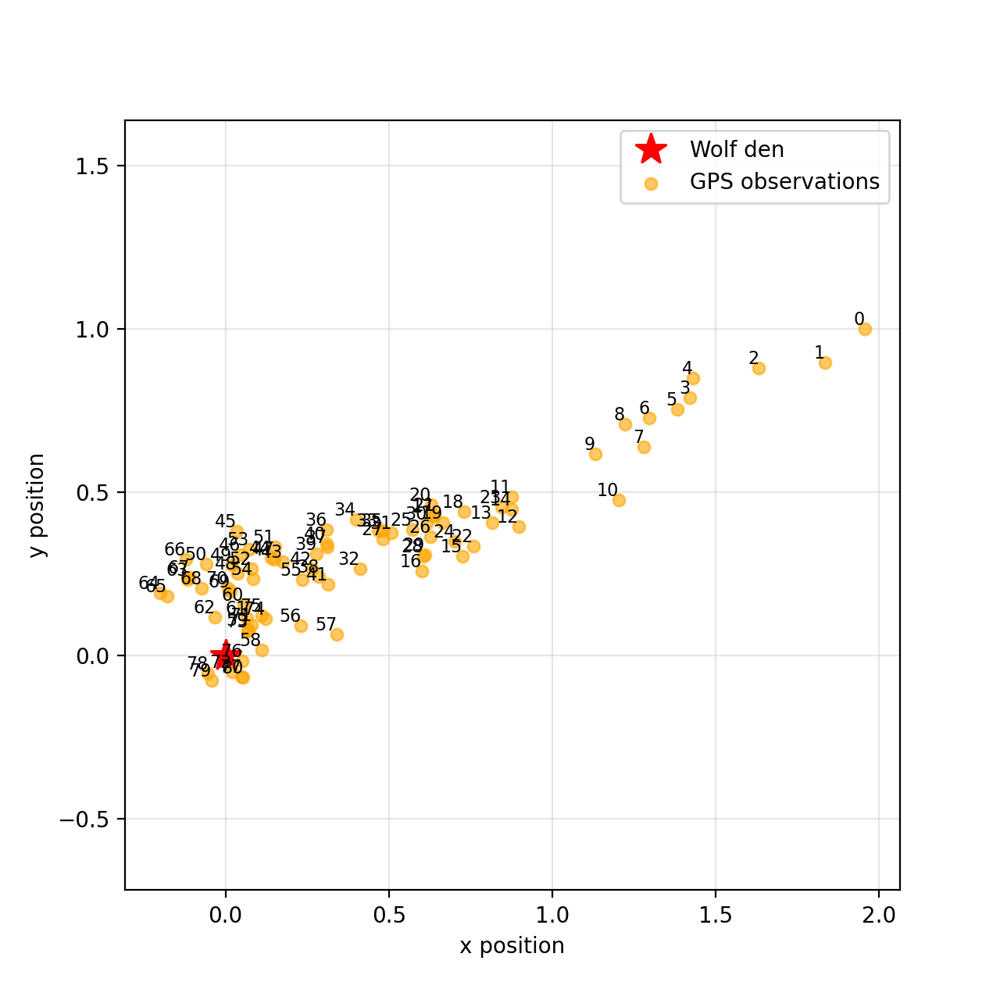
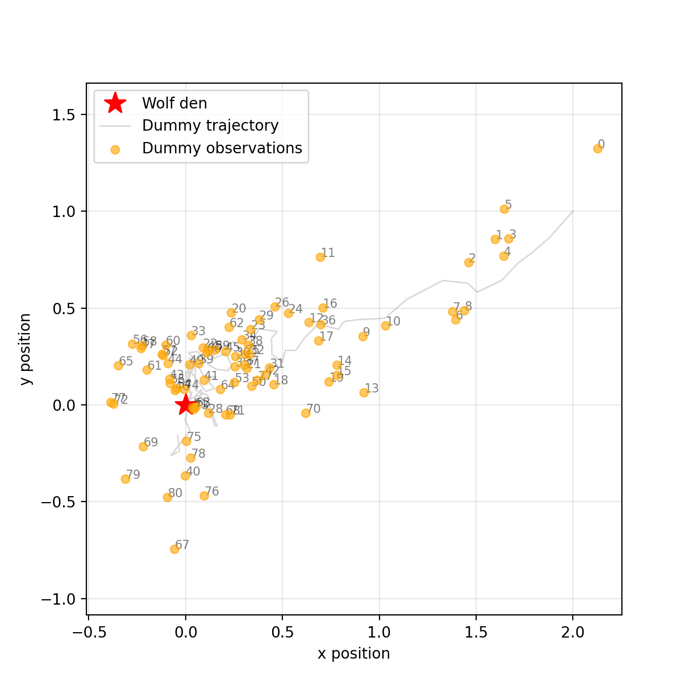
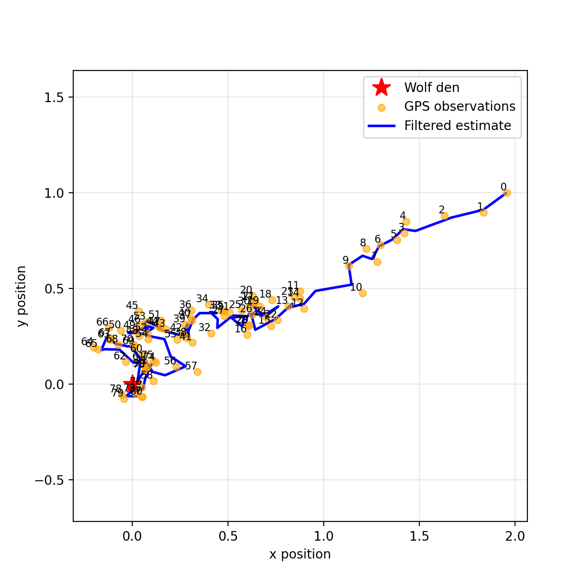
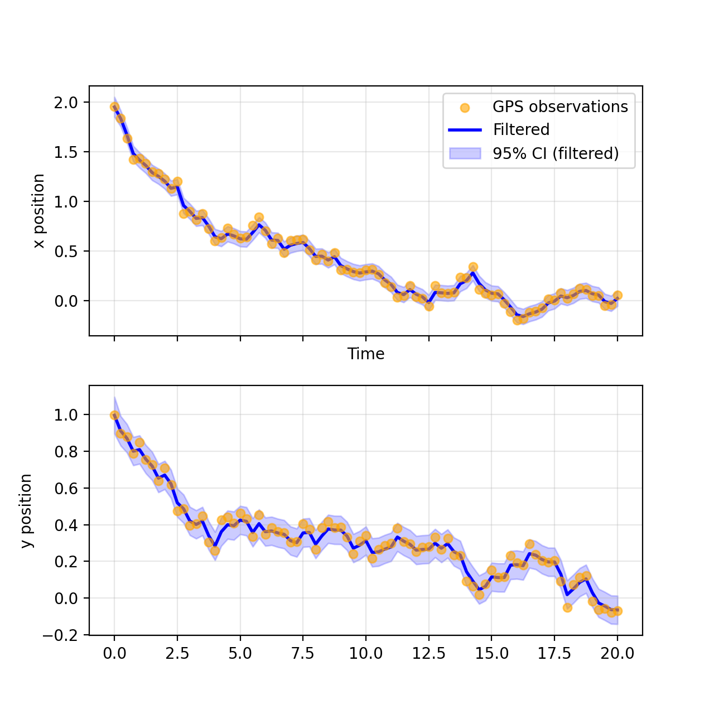
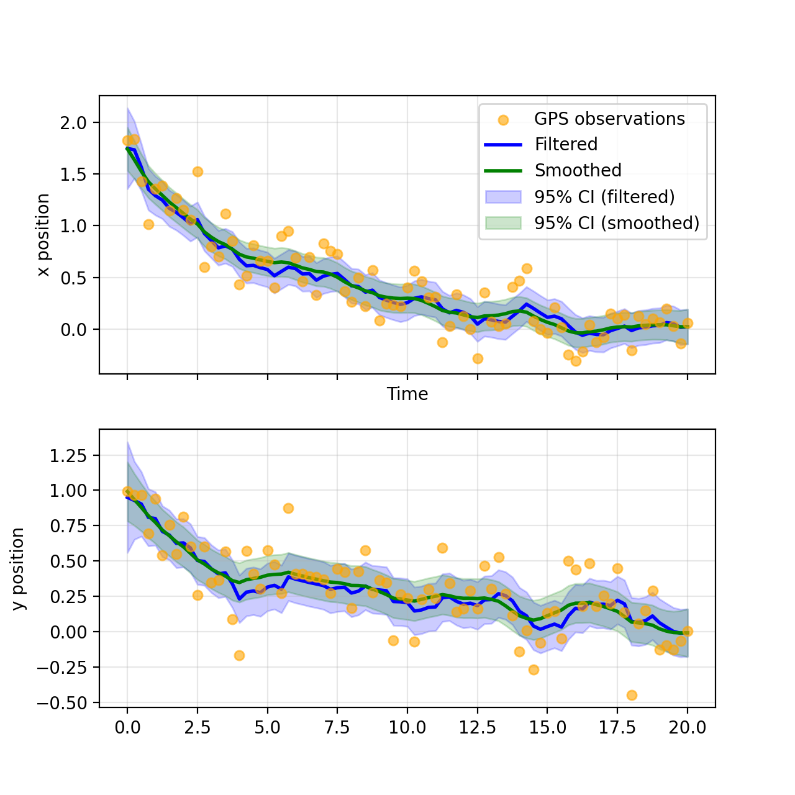
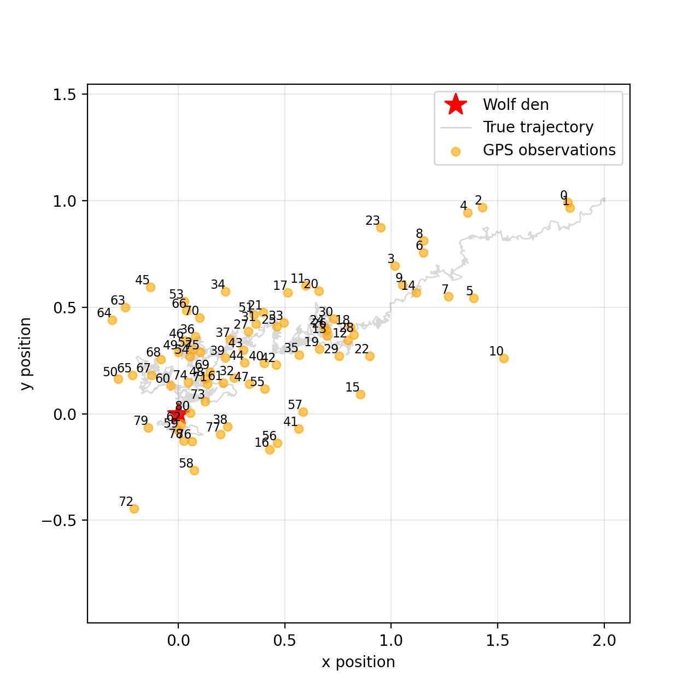

class: middle, center, title-slide

# Foundations of Data Science

Lecture 5: State-space models

  
Prof. Gilles Louppe 
[g.louppe@uliege.be](g.louppe@uliege.be)

???

- Add data assimilation

- Brownian motion: more simply, it is a gaussian process
- The SDE is an Ito SDEs
- Application: Black-Scholes model 

- EnKF? Unscented KF? 

---

class: middle

.center.width-70[]
.center[Today's case study: .bold[tracking] the location of a wolf  over time using noisy GPS observations.]

---

class: middle

# Discrete-time models

---

class: middle

.center[]

## Static latent variable models 

We previously defined latent variable models as probabilistic models that explain observed data $x$ in terms of unobserved (latent) variables $z$ and parameters $\theta$, $$p(x, z, \theta) = p(x | z, \theta) p(z | \theta) p(\theta).$$

---

class: middle

.center.width-10[]

What if the system evolves over time and we have a sequence of observations $x\_{1:T} = (x\_1, \ldots, x\_T)$ collected at discrete time steps $t = 1, \ldots, T$?
 
---

class: middle

## State-space models

To model a dynamical system, we can first assume a discretization of time and introduce a sequence of latent variables $z\_t$ that represent the state of the system at each time step $t$.

In this context, a .bold[state-space model] is a latent variable model that explains a sequence $x\_{1:T} = (x\_1, \ldots, x\_T)$ of observations in terms of a sequence $z\_{1:T} = (z\_1, \ldots, z\_T)$ of latent variables.

---

class: middle

.center[]

In a Markovian state-space model, the latent variables form a Markov chain $$p(z\_t | z\_{1:t-1}) = p(z\_t | z\_{t-1}),$$ where the conditional distribution $p(z\_t | z\_{t-1})$ is called the .bold[transition model].

The observations are conditionally independent given the latent variables, $$p(x\_t | x\_{1:t-1}, z\_{1:t}) = p(x\_t | z\_t),$$ where the conditional distribution $p(x\_t | z\_t)$ is called the .bold[observation model].

---

class: middle

.center.width-10[]

## Example

We want to track the location of a wild animal (e.g., a wolf) over time using noisy GPS observations.

Assumptions:
- The animal has a home location (den, nest) at $\mu \in \mathbb{R}^2$.
- The animal moves according to a random walk with drift towards the home location. 
- The GPS observations are noisy measurements of the animal's true location.
- Time is discretized regularly every $\Delta t$ time units.

---

class: middle

.center[]

State-space model:
- States $z\_t \in \mathbb{R}^2$ represent the true location of the animal at time $t$. They evolve as a random walk with drift towards the home location $\mu$.
$$
p(z\_t | z\_{t-1}) = \mathcal{N}(z\_t | z\_{t-1} - \kappa (z\_{t-1} - \mu) \Delta t, \sigma^2 \Delta t I),
$$
where $\kappa > 0$ is the strength of attraction to the home location and $\sigma^2$ is the variance of the random walk.
- Observations $x\_t \in \mathbb{R}^2$ represent noisy GPS measurements of the animal's location at time $t$. They relate to the states via
$$
p(x\_t | z\_t) = \mathcal{N}(x\_t | z\_t, R),
$$
where $R$ is the observation noise covariance.

---

class: middle

.center.width-70[]
.center[Example of trajectory and observations  generated from the discrete-time state-space model ($\Delta t=0.25$).]

---

class: middle

## Inference in state-space models

Given a state-space model and a sequence of observations $x\_{1:T}$, we are typically interested in solving one or more of the following inference problems:

- Prediction: $p(z\_{t+k} | x\_{1:t})$ for $k \geq 1$.
- Filtering: $p(z\_t | x\_{1:t})$.
- Smoothing: $p(z\_t | x\_{1:T})$.

---

class: middle

## Bayes filter

The Bayes filter is a recursive algorithm for estimating the filtering distributions $p(z\_t | x\_{1:t})$ as 
$$p(z\_t | x\_{1:t}) = \frac{p(x\_t | z\_t) \int p(z\_t | z\_{t-1}) p(z\_{t-1} | x\_{1:t-1}) dz\_{t-1}}{p(x\_t | x\_{1:t-1})},$$
for $t = 1, 2, \ldots, T$, with the base case $p(z\_1 | x\_1) = \frac{p(x\_1 | z\_1) p(z\_1)}{p(x\_1)}$.

---

class: middle

.italic[Proof.] The filtering distribution can be derived in two steps:

1. Prediction: Push the filtering distribution from the previous time step through the transition model to obtain a prediction of the current state. That is,
   $$p(z\_t | x\_{1:t-1}) = \int p(z\_t | z\_{t-1}) p(z\_{t-1} | x\_{1:t-1}) dz\_{t-1}.$$
2. Update: Condition on the new observation to obtain the filtering distribution,
   $$p(z\_t | x\_{1:t}) = \frac{p(x\_t | z\_t) p(z\_t | x\_{1:t-1})}{p(x\_t | x\_{1:t-1})},$$
   where the marginal likelihood $p(x\_t | x\_{1:t-1})$ is given by
   $$p(x\_t | x\_{1:t-1}) = \int p(x\_t | z\_t) p(z\_t | x\_{1:t-1}) dz\_t.$$

---

class: middle

Once we have computed the filtering distributions $p(z\_t | x\_{1:t})$ for $t = 1, \ldots, T$, we can compute the .bold[prediction distributions] $p(z\_{t+k} | x\_{1:t})$ for $k \geq 1$ using the prediction step of the Bayes filter iteratively,
$$p(z\_{t+k} | x\_{1:t}) = \int p(z\_{t+k} | z\_{t+k-1}) p(z\_{t+k-1} | x\_{1:t}) dz\_{t+k-1},$$
for $k = 1, 2, \ldots$.

---

class: middle

## Bayes smoother

The Bayes smoother computes the smoothing distributions $p(z\_t | x\_{1:T})$ for $t = 1, \ldots, T$ using the filtering distributions $p(z\_t | x\_{1:t})$ and the transition model $p(z\_t | z\_{t-1})$. It consists of a backward recursion,
$$p(z\_t | x\_{1:T}) = p(z\_t | x\_{1:t}) \int \frac{p(z\_{t+1} | z\_t) p(z\_{t+1} | x\_{1:T})}{p(z\_{t+1} | x\_{1:t})} dz\_{t+1},$$
for $t = T-1, T-2, \ldots, 1$, with the base case $p(z\_T | x\_{1:T}) = p(z\_T | x\_{1:T})$ (from the filtering step, instead of the backward recursion).

---

class: middle

.italic[Proof.] The joint distribution $p(z\_t, z\_{t+1} | x\_{1:T})$ can be computed as
$$\begin{aligned}
p(z\_t, z\_{t+1} | x\_{1:T}) &= p(z\_t | z\_{t+1}, x\_{1:T}) p(z\_{t+1} | x\_{1:T}) \\\\
&= p(z\_t | z\_{t+1}, x\_{1:t}) p(z\_{t+1} | x\_{1:T}) \\\\
&= \frac{p(z\_{t+1} | z\_t) p(z\_t | x\_{1:t})}{p(z\_{t+1} | x\_{1:t})} p(z\_{t+1} | x\_{1:T}),
\end{aligned}$$
where we used the conditional independence properties of the state-space model.

Marginalizing over $z\_{t+1}$ gives the desired result,
$$\begin{aligned}
p(z\_t | x\_{1:T}) &= \int p(z\_t, z\_{t+1} | x\_{1:T}) dz\_{t+1} \\\\
&= p(z\_t | x\_{1:t}) \int \frac{p(z\_{t+1} | z\_t) p(z\_{t+1} | x\_{1:T})}{p(z\_{t+1} | x\_{1:t})} dz\_{t+1}. 
\end{aligned}$$

---

class: middle

.center.width-10[]

Although the Bayes filter and Bayes smoother provide a general framework for inference in state-space models, they are .bold[rarely tractable in practice] as they involve integrals that are difficult to compute.

Further assumptions on the transition and observation models are required for closed-form solutions.

---

class: middle

## Linear Gaussian state-space models

A linear Gaussian state-space model (LGSSM) is a state-space model where both the transition and observation models are linear Gaussian. That is,
$$\begin{aligned}
p(z\_t | z\_{t-1}) &= \mathcal{N}(z\_t | A z\_{t-1}, Q), \\\\
p(x\_t | z\_t) &= \mathcal{N}(x\_t | H z\_t, R),
\end{aligned}$$
where $A$ is the state transition matrix, $Q$ is the process noise covariance, $H$ is the observation matrix, and $R$ is the observation noise covariance.

.success[If the prior distribution $p(z\_1)$ is also Gaussian, then all filtering, prediction, and smoothing distributions are Gaussian.]

---

class: middle

The .bold[Kalman filter] provides a closed-form expression for the filtering distributions in linear Gaussian state-space models.

At each time step $t$, $p(z\_t | x\_{1:t}) = \mathcal{N}(z\_t | m\_t, P\_t)$ is Gaussian with mean $m\_t$ and covariance $P\_t$. 
These parameters can be computed recursively by adapting the Bayes filter equations to the linear Gaussian case.

---

class: middle

.italic[Proof.] By recursion, assume that at time step $t-1$, the filtering distribution is Gaussian, $p(z\_{t-1} | x\_{1:t-1}) = \mathcal{N}(z\_{t-1} | m\_{t-1}, P\_{t-1})$, with the base case $p(z\_1 | x\_1) = \mathcal{N}(z\_1 | m\_1, P\_1)$.

For the prediction step, we have
$$\begin{aligned}
p(z\_t | x\_{1:t-1}) &= \int p(z\_{t-1} | x\_{1:t-1}) p(z\_t | z\_{t-1}) dz\_{t-1} \\\\
&= \int \mathcal{N}(z\_{t-1} | m\_{t-1}, P\_{t-1}) \mathcal{N}(z\_t | A z\_{t-1}, Q) dz\_{t-1} \\\\
&= \int \mathcal{N}\left(\begin{pmatrix} z\_{t-1} \\\\ z\_t \end{pmatrix} | \begin{bmatrix} m\_{t-1} \\\\ A m\_{t-1} \end{bmatrix}, \begin{bmatrix} P\_{t-1} & P\_{t-1} A^T \\\\ A P\_{t-1} & A P\_{t-1} A^T + Q \end{bmatrix}\right) dz\_{t-1} \\\\
&= \mathcal{N}(z\_t | m^-\_t, P^-\_t),
\end{aligned}$$
where $m^-\_t = A m\_{t-1}$ and $P^-\_t = A P\_{t-1} A^T + Q$.

---

class: middle

For the update step, we join the prediction distribution with the observation model,
$$\begin{aligned}
p\left(\begin{pmatrix} z\_t \\\\ x\_t \end{pmatrix} | x\_{1:t-1} \right) &= p(z\_t | x\_{1:t-1}) p(x\_t | z\_t) \\\\
&= \mathcal{N}\left(\begin{pmatrix} z\_t \\\\ x\_t \end{pmatrix} | \begin{bmatrix} m^-\_t \\\\ H m^-\_t \end{bmatrix}, \begin{bmatrix} P^-\_t & P^-\_t H^T \\\\ H P^-\_t & H P^-\_t H^T + R \end{bmatrix}\right).
\end{aligned}$$

Therefore, the filtering distribution is given by the conditional distribution
$$p(z\_t | x\_{1:t-1}, x\_t) = p(z\_t | x\_{1:t}) = \mathcal{N}(z\_t | m\_t, P\_t),$$
where
$$\begin{aligned}
m\_t &= m^-\_t + K\_t (x\_t - H m^-\_t), \\\\
P\_t &= (I - K\_t H) P^-\_t,
\end{aligned}$$
and $K\_t = P^-\_t H^T (H P^-\_t H^T + R)^{-1}$ is the Kalman gain and represents the weight given to the new observation.

???

Intuition:

Mean update:
- $H m^-\_t$ is the predicted observation based on the predicted state.
- $x\_t - H m^-\_t$ is the innovation or measurement residual, i.e., the difference between the actual observation and the predicted observation.
- The Kalman gain $K\_t$ determines how much we adjust our prediction based on the new observation.

Covariance update:
- If the observation noise $R$ is small compared to the prediction uncertainty $P^-\_t$, then $K\_t$ approaches $H^{-1}$ (if $H$ is invertible), and we rely heavily on the new observation.
- Conversely, if $R$ is large, then $K\_t$ approaches zero, and we rely more on our prediction. 

---

class: middle

.center.width-70[]
.center[Mean estimate of the wolf's trajectory using the Kalman filter.]

---

class: middle

.center.width-70[]
.center[Filtering distribution at each time step using the Kalman filter.]

---

class: middle

The smoothing distributions $p(z\_t | x\_{1:T}) = \mathcal{N}(z\_t | m^s_t, P^s_t)$ are also Gaussian with mean $m^s_t$ and covariance $P^s_t$.

The parameters can be computed recursively using the .bold[Rauch-Tung-Striebel smoother] equations (proof omitted for brevity),
$$\begin{aligned}
C\_t &= P\_t A^T (P^-\_{t+1})^{-1}, \\\\
m^s\_t &= m\_t + C\_t (m^s\_{t+1} - m^-\_{t+1}), \\\\
P^s\_t &= P\_t + C\_t (P^s\_{t+1} - P^-\_{t+1}) C\_t^T,
\end{aligned}$$
for $t = T-1, T-2, \ldots, 1$, with the base case $m^s\_T = m\_T$ and $P^s\_T = P\_T$.

???

XXX Check Sarkka's book for the full derivation. Consider adding it for completeness.

---

class: middle

.center.width-70[]
.center[Mean estimate of the wolf's trajectory using the Kalman smoother.]

---

class: middle

.center.width-70[]
.center[Smoothing distribution at each time step using the Kalman smoother.]

---

class: middle

## Hidden Markov models

A hidden Markov model (HMM) is a state-space model where all  variables are discrete and the transition and observation models are categorical distributions. That is,
$$\begin{aligned}
p(z\_t=j | z\_{t-1}=i) &= A\_{i, j}, \\\\
p(x\_t=k | z\_t=j) &= B\_{j, k},
\end{aligned}$$
where $A$ is the state transition matrix and $B$ is the observation matrix.

.success[If the prior distribution $p(z\_1)$ is also categorical, then all filtering, prediction, and smoothing distributions are categorical and can be computed exactly by enumeration.]

---

class: middle

Example&#58; Wolf behavior modeling

- States $z\_t \in \{1, ..., K\}$ represent the behavior of the animal at time $t$ (e.g., resting, foraging, traveling).
- Observations $x\_t \in \{1, ..., M\}$ represent discrete measurements related to the animal's behavior (e.g., GPS speed categories, activity levels).
- Transition model $p(z\_t | z\_{t-1})$ captures the probabilities of switching between different behaviors.
- Observation model $p(x\_t | z\_t)$ captures the probabilities of observing certain measurements given the animal's behavior.

---

class: middle

The .bold[forward algorithm] provides a closed-form expression for the filtering distributions in hidden Markov models.

At each time step $t$, $p(z\_t | x\_{1:t})$ is categorical with parameters $\alpha\_t(j) = p(z\_t=j | x\_{1:t})$. These parameters can be computed recursively using the forward algorithm equations
$$\alpha\_t \propto O\_t A^T \alpha\_{t-1},$$
for $t = 1, 2, \ldots, T$, with the base case $\alpha\_1 \propto O\_1 \pi$, where $\pi$ are the parameters of the prior distribution $p(z\_1)$ and $O\_t$ is a diagonal matrix with entries $B\_{:, x\_t}$ (the $x\_t$-th column of $B$). The proportionality constant is obtained by normalizing $\alpha\_t$ so that its entries sum to 1.

---

class: middle

The smoothing distributions $p(z\_t | x\_{1:T})$ are also categorical with parameters $\gamma\_t(j) = p(z\_t=j | x\_{1:T})$. The parameters can be computed recursively using the .bold[backward algorithm] equations
$$\beta\_t \propto A O\_{t+1} \beta\_{t+1},$$
for $t = T-1, T-2, \ldots, 1$, with the base case $\beta\_T = 1$, where $1$ is a vector of ones. The proportionality constant is obtained by normalizing $\beta\_t$ so that its entries sum to 1.

The smoothing parameters are then given by $\gamma\_t \propto \alpha\_t \odot \beta\_t$, where $\odot$ denotes the element-wise product.

---

class: middle

.success[Both linear Gaussian state-space models and hidden Markov models are special cases of state-space models where exact inference is tractable.]

.alert[However, they are limited in their expressiveness and may not capture the complexity of real-world dynamical systems.]

---

class: middle

# Continuous-time models

---

class: middle

.center.width-10[]

We have so far assumed that time is discretized regularly with a fixed time step $\Delta t$ and that both the transition and observation models are defined at these discrete time steps.

However, 
- physical processes are often more naturally modeled in .bold[continuous time];
- observations may be collected at .bold[irregular time intervals], triggered by events rather than a clock, or at multiple time scales.

---

class: middle

## From discrete to continuous time

In discrete-time state-space models, we considered transition models of the form $p(z\_t | z\_{t-1})$ that describe how the state evolves from one time step to the next.
For additive transitions and additive noise, this can be expressed as
$$z\_t = z\_{t-1} + f(z\_{t-1}) \Delta t + w\_t,$$
where $f$ is a deterministic function and $w\_t$ is random noise. 

Shuffling the terms, we get
$$\frac{z\_t - z\_{t-1}}{\Delta t} = f(z\_{t-1}) + \frac{w\_t}{\Delta t},$$ which, in the limit as $\Delta t \to 0$, gives us a continuous-time model
$$\frac{dz(t)}{dt} = f(z(t)) + \frac{dw(t)}{dt},$$
where $z(t)$ is the state at time $t$ and $w(t)$ is continuous-time noise.

---

class: middle

Omitting $\frac{dw(t)}{dt}$ (for now), we get a .bold[deterministic] dynamical system described by an .bold[ordinary differential equation] (ODE)
$$\frac{dz(t)}{dt} = f(z(t)).$$

The solution of this ODE with initial condition $z(0) = z\_0$ is given by
$$z(t) = z\_0 + \int\_0^t f(z(\tau)) d\tau.$$

---

class: middle

## Example: Exponential decay to an equilibrium point

$$\frac{dz(t)}{dt} = -\kappa (z(t) - \mu),$$
where $\kappa > 0$ is the rate of decay and $\mu$ is the equilibrium point.

- If $z(0) > \mu$, then $z(t)$ decreases towards $\mu$ as $t$ increases.
- If $z(0) < \mu$, then $z(t)$ increases towards $\mu$ as $t$ increases.
- Solution: $$z(t) = \mu + (z(0) - \mu) e^{-\kappa t}.$$

.alert[This is deterministic: given $z(0)$, the state $z(t)$ is fully determined for all $t \geq 0$!]

???

The decay is 'exponential' because the difference $z(t) - \mu$ decreases exponentially fast.

... although the system approaches the equilibrium point $\mu$ asymptotically, it never actually reaches it in finite time.

---

class: middle

## Brownian motion

To add stochasticity to the ODE, we need a continuous-time stochastic process that can model random noise.

We can model the noise term $w(t)$ as a standard Brownian motion (Wiener process) $B(t)$, which has the following properties:
- $B(0) = 0$.
- $B(t)$ has independent increments: for $0 \leq s < t$, $B(t) - B(s) \sim \mathcal{N}(0, t-s)$.
- $B(t)$ is continuous in $t$.

---

class: middle

Adding Brownian motion to the ODE, we get a .bold[stochastic differential equation] (SDE)
$$\frac{dz(t)}{dt} = f(z(t)) + \frac{dB(t)}{dt},$$
where $\frac{dB(t)}{dt}$ is an informal notation for white noise.

More rigorously, Brownian motion is nowhere differentiable and the notation $\frac{dB(t)}{dt}$ is only symbolic. The SDE can instead be defined in differential form as
$$dz(t) = f(z(t)) dt + dB(t).$$

???

The "differential form" means that the change in $z(t)$ over an infinitesimal time interval $dt$ is given by the sum of a deterministic term $f(z(t), t) dt$ and a stochastic term $dB(t)$.

---

class: middle

For more generality, we can extend $f(z(t))$ to depend on time $t$ as well, leading to a time-inhomogeneous SDE
$$dz(t) = f(z(t), t) dt + dB(t).$$

We can also introduce a .bold[diffusion term] $g(z(t), t)$ to scale the noise, leading to the SDE
$$dz(t) = f(z(t), t) dt + g(z(t), t) dB(t).$$

In this form, the SDE describes the infinitesimal change in the state $z(t)$ over an infinitesimal time interval $dt$.
- The drift term $f(z(t), t) dt$ represents the deterministic change in the state.
- The diffusion term $g(z(t), t) dB(t)$ represents the stochastic change in the state due to Brownian motion.

???

Teaser: this equation is the basis of modern generative models such as .bold[diffusion models] used in image synthesis (e.g., DALL-E 2, Stable Diffusion).

---

class: middle

## Example: Ornstein-Uhlenbeck process

Recall our animal movement example in discrete time:
$$z\_t = z\_{t-1} - \kappa (z\_{t-1} - \mu) \Delta t + w\_t,$$
where $w\_t \sim \mathcal{N}(0, \sigma^2 \Delta t I)$.

In continuous time, this becomes the SDE
$$dz(t) = -\kappa (z(t) - \mu) dt + \sigma dB(t),$$
where $\kappa > 0$ is the strength of attraction to the home location $\mu$ and $\sigma$ is the diffusion coefficient.

This process is known as the .bold[Ornstein-Uhlenbeck process], which describes a mean-reverting behavior with Gaussian noise.

.success[The discrete-time model is the Euler-Maruyama discretization of the OU process with step size $\Delta t$!]

---

class: middle

.center.width-70[]
.center[Example of continuous trajectory generated from the Ornstein-Uhlenbeck process. (This is the true trajectory used throughout the lecture.)]

---

class: middle

## Observations in continuous time

In continuous-time state-space models, the observation model can be defined as a conditional distribution $p(x({t\_i}) | z(t\_i))$ at any (continuous) time point $t\_i$.

This is similar to the discrete-time case, except that observations can be collected at .bold[irregular time intervals] $t\_1 < t\_2 < \ldots < t\_N$ rather than at fixed time steps.

---

class: middle

## Linear Gaussian continuous-time state-space models

Linear Gaussian continuous-time state-space models are continuous-time analogs of linear Gaussian state-space models.

They are defined by linear SDEs for the state dynamics and linear Gaussian observation models,
$$\begin{aligned}
dz(t) &= A z(t) dt + Q^{1/2} dB(t), \\\\
x(t\_i) &\sim \mathcal{N}(x(t\_i) | H z(t\_i), R),
\end{aligned}$$
where $A$ is the state transition matrix, $Q$ is the process noise covariance, $H$ is the observation matrix, and $R$ is the observation noise covariance.

---

class: middle

Filtering and smoothing distributions $p(z(t\_i) | x(t\_{1:i}))$ and $p(z(t) | x(t\_{1:N}))$ can be computed exactly using continuous-time analogs of the Kalman filter and Rauch-Tung-Striebel smoother.

Both now correspond to stochastic processes over continuous time rather than sequences over discrete time steps.

---

class: middle

## When to use continuous vs discrete time?

.bold[Continuous-time] is natural when:
- Observations at irregular intervals
- Physical/mechanistic interpretation important
- Parameters have continuous-time meaning (rates, time constants)

.bold[Discrete-time] is practical when:
- Regular sampling
- Computational simplicity preferred
- No strong mechanistic model

.italic[Common approach: Model in continuous time for interpretability, discretize for computation.]

---

class: end-slide, center
count: false

The end.
