class: middle, center, title-slide

# Foundations of Data Science

Lecture 5: State-space models

  
Prof. Gilles Louppe 
[g.louppe@uliege.be](mailto:g.louppe@uliege.be)

---

class: middle

.center.width-70[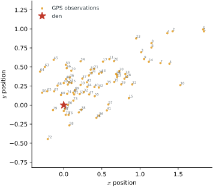]
.center[Today's case study: .bold[tracking] the location of a wolf  over time from noisy GPS observations, here simulated.]

---

class: middle

.center.width-70[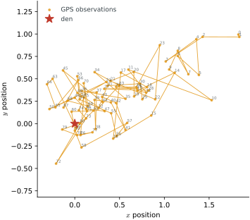]
.center[The same observations, joined in the order they were recorded.]

???

Joining the dots takes each GPS fix at face value. The path zigzags back and forth between consecutive fixes, with jumps far larger than the wolf moves in one time step: the zigzags are the noise of the GPS. A model of how a wolf moves, and of how the GPS errs, separates the two.

---

class: middle

# Discrete-time models

---

class: middle

.center.width-50[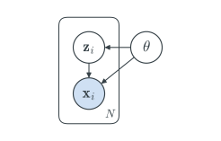]

## Static latent variable models

A latent variable model explains $N$ observations $\mathbf{x}\_i$ with local latent variables $\mathbf{z}\_i$ and global parameters $\theta$,
$$p(\mathbf{x}\_{1:N}, \mathbf{z}\_{1:N}, \theta) = p(\theta) \prod\_{i=1}^N p(\mathbf{x}\_i | \mathbf{z}\_i, \theta) p(\mathbf{z}\_i | \theta).$$

---

class: middle

.center.width-10[]

What if the system evolves over time and we have a sequence of observations $\mathbf{x}\_{1:T} = (\mathbf{x}\_1, \ldots, \mathbf{x}\_T)$ collected at discrete time steps $t = 1, \ldots, T$?

---

class: middle

## State-space models

To model a dynamical system, we can first assume a discretization of time and introduce a sequence of latent variables $\mathbf{z}\_t$ that represent the state of the system at each time step $t$.

In this context, a .bold[state-space model] is a latent variable model that explains a sequence $\mathbf{x}\_{1:T} = (\mathbf{x}\_1, \ldots, \mathbf{x}\_T)$ of observations in terms of a sequence $\mathbf{z}\_{1:T} = (\mathbf{z}\_1, \ldots, \mathbf{z}\_T)$ of latent variables. Each latent variable now depends on the previous one: the plate becomes a chain.

---

class: middle

.center.width-50[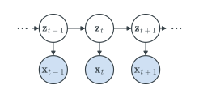]

In a Markovian state-space model, the latent variables form a Markov chain $$p(\mathbf{z}\_t | \mathbf{z}\_{1:t-1}) = p(\mathbf{z}\_t | \mathbf{z}\_{t-1}),$$ where the conditional distribution $p(\mathbf{z}\_t | \mathbf{z}\_{t-1})$ is called the .bold[transition model].

The observations are conditionally independent given the latent variables, $$p(\mathbf{x}\_t | \mathbf{x}\_{1:t-1}, \mathbf{z}\_{1:t}) = p(\mathbf{x}\_t | \mathbf{z}\_t),$$ where the conditional distribution $p(\mathbf{x}\_t | \mathbf{z}\_t)$ is called the .bold[observation model].

---

class: middle

.center.width-10[]

.italic[Example.] We want to track the location of a wild animal (e.g., a wolf) over time using noisy GPS observations.

Assumptions:
- The animal has a home location (den, nest) at $\boldsymbol{\mu} \in \mathbb{R}^2$.
- The animal moves according to a random walk with drift towards the home location. 
- The GPS observations are noisy measurements of the animal's true location.
- Time is discretized regularly every $\Delta t$ time units.

---

class: middle

State-space model:
- States $\mathbf{z}\_t \in \mathbb{R}^2$ represent the true location of the animal at time $t$. They evolve as a random walk with drift towards the home location $\boldsymbol{\mu}$.
$$
p(\mathbf{z}\_t | \mathbf{z}\_{t-1}) = \mathcal{N}(\mathbf{z}\_t | \mathbf{z}\_{t-1} - \kappa (\mathbf{z}\_{t-1} - \boldsymbol{\mu}) \Delta t, \sigma^2 \Delta t \mathbf{I}),
$$
where $\kappa > 0$ is the strength of attraction to the home location and $\sigma^2$ is the variance of the random walk.
- Observations $\mathbf{x}\_t \in \mathbb{R}^2$ represent noisy GPS measurements of the animal's location at time $t$. They relate to the states via
$$
p(\mathbf{x}\_t | \mathbf{z}\_t) = \mathcal{N}(\mathbf{x}\_t | \mathbf{z}\_t, \mathbf{R}),
$$
where $\mathbf{R}$ is the observation noise covariance.

---

class: middle

.center.width-70[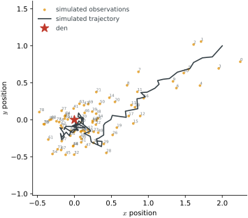]
.center[Example of trajectory and observations  generated from the discrete-time state-space model ($\Delta t=0.25$).]

---

class: middle

## Inference in state-space models

Given a state-space model and a sequence of observations $\mathbf{x}\_{1:T}$, we are typically interested in solving one or more of the following inference problems:

- Prediction: $p(\mathbf{z}\_{t+k} | \mathbf{x}\_{1:t})$ for $k \geq 1$.
- Filtering: $p(\mathbf{z}\_t | \mathbf{x}\_{1:t})$.
- Smoothing: $p(\mathbf{z}\_t | \mathbf{x}\_{1:T})$.

.center.width-80[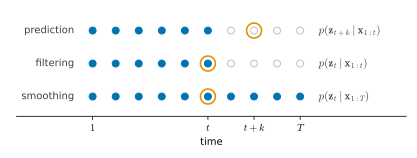]

---

class: middle

## Bayes filter

The Bayes filter is a recursive algorithm that computes the filtering distributions $p(\mathbf{z}\_t | \mathbf{x}\_{1:t})$ as 
$$p(\mathbf{z}\_t | \mathbf{x}\_{1:t}) = \frac{p(\mathbf{x}\_t | \mathbf{z}\_t) \int p(\mathbf{z}\_t | \mathbf{z}\_{t-1}) p(\mathbf{z}\_{t-1} | \mathbf{x}\_{1:t-1}) d\mathbf{z}\_{t-1}}{p(\mathbf{x}\_t | \mathbf{x}\_{1:t-1})},$$
for $t = 2, \ldots, T$, with the base case $p(\mathbf{z}\_1 | \mathbf{x}\_1) = \frac{p(\mathbf{x}\_1 | \mathbf{z}\_1) p(\mathbf{z}\_1)}{p(\mathbf{x}\_1)}$.

---

class: middle

.italic[Proof.] The filtering distribution can be derived in two steps:

1. Prediction: Push the filtering distribution from the previous time step through the transition model to obtain a prediction of the current state. That is,
   $$p(\mathbf{z}\_t | \mathbf{x}\_{1:t-1}) = \int p(\mathbf{z}\_t | \mathbf{z}\_{t-1}) p(\mathbf{z}\_{t-1} | \mathbf{x}\_{1:t-1}) d\mathbf{z}\_{t-1}.$$
2. Update: Condition on the new observation to obtain the filtering distribution,
   $$p(\mathbf{z}\_t | \mathbf{x}\_{1:t}) = \frac{p(\mathbf{x}\_t | \mathbf{z}\_t) p(\mathbf{z}\_t | \mathbf{x}\_{1:t-1})}{p(\mathbf{x}\_t | \mathbf{x}\_{1:t-1})},$$
   where the marginal likelihood $p(\mathbf{x}\_t | \mathbf{x}\_{1:t-1})$ is given by
   $$p(\mathbf{x}\_t | \mathbf{x}\_{1:t-1}) = \int p(\mathbf{x}\_t | \mathbf{z}\_t) p(\mathbf{z}\_t | \mathbf{x}\_{1:t-1}) d\mathbf{z}\_t.$$

---

class: middle

.center.width-80[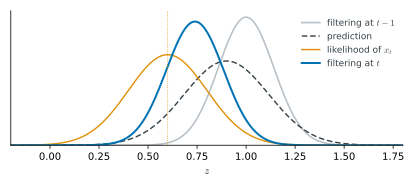]

.center[One step of the Bayes filter, in one dimension. The prediction spreads the previous filtering distribution; the update pulls it towards the new observation.]

???

The numbers are illustrative. The updated distribution sits between the prediction and the observation, closer to whichever is more precise, and it is narrower than both.

---

class: middle

Once we have computed the filtering distributions $p(\mathbf{z}\_t | \mathbf{x}\_{1:t})$ for $t = 1, \ldots, T$, we can compute the .bold[prediction distributions] $p(\mathbf{z}\_{t+k} | \mathbf{x}\_{1:t})$ for $k \geq 1$ using the prediction step of the Bayes filter iteratively,
$$p(\mathbf{z}\_{t+k} | \mathbf{x}\_{1:t}) = \int p(\mathbf{z}\_{t+k} | \mathbf{z}\_{t+k-1}) p(\mathbf{z}\_{t+k-1} | \mathbf{x}\_{1:t}) d\mathbf{z}\_{t+k-1},$$
for $k = 1, 2, \ldots$.

---

class: middle

## Bayes smoother

The Bayes smoother computes the smoothing distributions $p(\mathbf{z}\_t | \mathbf{x}\_{1:T})$ for $t = 1, \ldots, T$ using the filtering distributions $p(\mathbf{z}\_t | \mathbf{x}\_{1:t})$ and the transition model $p(\mathbf{z}\_t | \mathbf{z}\_{t-1})$. It consists of a backward recursion,
$$p(\mathbf{z}\_t | \mathbf{x}\_{1:T}) = p(\mathbf{z}\_t | \mathbf{x}\_{1:t}) \int \frac{p(\mathbf{z}\_{t+1} | \mathbf{z}\_t) p(\mathbf{z}\_{t+1} | \mathbf{x}\_{1:T})}{p(\mathbf{z}\_{t+1} | \mathbf{x}\_{1:t})} d\mathbf{z}\_{t+1},$$
for $t = T-1, T-2, \ldots, 1$, starting from $p(\mathbf{z}\_T | \mathbf{x}\_{1:T})$, the filtering distribution at $t = T$.

---

class: middle

.italic[Proof.] The joint distribution $p(\mathbf{z}\_t, \mathbf{z}\_{t+1} | \mathbf{x}\_{1:T})$ can be computed as
$$\begin{aligned}
p(\mathbf{z}\_t, \mathbf{z}\_{t+1} | \mathbf{x}\_{1:T}) &= p(\mathbf{z}\_t | \mathbf{z}\_{t+1}, \mathbf{x}\_{1:T}) p(\mathbf{z}\_{t+1} | \mathbf{x}\_{1:T}) \\\\
&= p(\mathbf{z}\_t | \mathbf{z}\_{t+1}, \mathbf{x}\_{1:t}) p(\mathbf{z}\_{t+1} | \mathbf{x}\_{1:T}) \\\\
&= \frac{p(\mathbf{z}\_{t+1} | \mathbf{z}\_t) p(\mathbf{z}\_t | \mathbf{x}\_{1:t})}{p(\mathbf{z}\_{t+1} | \mathbf{x}\_{1:t})} p(\mathbf{z}\_{t+1} | \mathbf{x}\_{1:T}),
\end{aligned}$$
where we used the conditional independence properties of the state-space model.

Marginalizing over $\mathbf{z}\_{t+1}$ gives the desired result,
$$\begin{aligned}
p(\mathbf{z}\_t | \mathbf{x}\_{1:T}) &= \int p(\mathbf{z}\_t, \mathbf{z}\_{t+1} | \mathbf{x}\_{1:T}) d\mathbf{z}\_{t+1} \\\\
&= p(\mathbf{z}\_t | \mathbf{x}\_{1:t}) \int \frac{p(\mathbf{z}\_{t+1} | \mathbf{z}\_t) p(\mathbf{z}\_{t+1} | \mathbf{x}\_{1:T})}{p(\mathbf{z}\_{t+1} | \mathbf{x}\_{1:t})} d\mathbf{z}\_{t+1}. 
\end{aligned}$$

---

class: middle

.center.width-10[]

.alert[In general, the integrals of the Bayes filter and smoother have no closed form.]

Two classes of models are exceptions:
- linear Gaussian models, where the integrals are Gaussian (Kalman filter and smoother);
- hidden Markov models, where they are finite sums (forward-backward algorithm).

???

Other models need approximate inference, by sampling (L6) or optimization (L9).

---

class: middle

## Linear Gaussian state-space models

A linear Gaussian state-space model (LGSSM) is a state-space model where both the transition and observation models are linear Gaussian. That is,
$$\begin{aligned}
p(\mathbf{z}\_t | \mathbf{z}\_{t-1}) &= \mathcal{N}(\mathbf{z}\_t | \mathbf{A} \mathbf{z}\_{t-1} + \mathbf{b}, \mathbf{Q}), \\\\
p(\mathbf{x}\_t | \mathbf{z}\_t) &= \mathcal{N}(\mathbf{x}\_t | \mathbf{H} \mathbf{z}\_t, \mathbf{R}),
\end{aligned}$$
where $\mathbf{A}$ is the state transition matrix, $\mathbf{b}$ an offset, $\mathbf{Q}$ the process noise covariance, $\mathbf{H}$ the observation matrix, and $\mathbf{R}$ the observation noise covariance.

If the prior distribution $p(\mathbf{z}\_1)$ is also Gaussian, then all filtering, prediction, and smoothing distributions are Gaussian.

.info[The wolf model is the case
$$\mathbf{A} = (1 - \kappa \Delta t) \mathbf{I}, \quad \mathbf{b} = \kappa \Delta t \\, \boldsymbol{\mu}, \quad \mathbf{Q} = \sigma^2 \Delta t \\, \mathbf{I}, \quad \mathbf{H} = \mathbf{I}.$$]

---

class: middle

The .bold[Kalman filter] provides a closed-form expression for the filtering distributions in linear Gaussian state-space models.

At each time step $t$, $p(\mathbf{z}\_t | \mathbf{x}\_{1:t}) = \mathcal{N}(\mathbf{z}\_t | \mathbf{m}\_t, \mathbf{P}\_t)$ is Gaussian with mean $\mathbf{m}\_t$ and covariance $\mathbf{P}\_t$. 
These parameters can be computed recursively by adapting the Bayes filter equations to the linear Gaussian case.

---

class: middle

.italic[Proof.] By recursion, assume that at time step $t-1$, the filtering distribution is Gaussian, $p(\mathbf{z}\_{t-1} | \mathbf{x}\_{1:t-1}) = \mathcal{N}(\mathbf{z}\_{t-1} | \mathbf{m}\_{t-1}, \mathbf{P}\_{t-1})$, with the base case $p(\mathbf{z}\_1 | \mathbf{x}\_1) = \mathcal{N}(\mathbf{z}\_1 | \mathbf{m}\_1, \mathbf{P}\_1)$.

For the prediction step, we have
$$\begin{aligned}
p(\mathbf{z}\_t | \mathbf{x}\_{1:t-1}) &= \int p(\mathbf{z}\_{t-1} | \mathbf{x}\_{1:t-1}) p(\mathbf{z}\_t | \mathbf{z}\_{t-1}) d\mathbf{z}\_{t-1} \\\\
&= \int \mathcal{N}(\mathbf{z}\_{t-1} | \mathbf{m}\_{t-1}, \mathbf{P}\_{t-1}) \mathcal{N}(\mathbf{z}\_t | \mathbf{A} \mathbf{z}\_{t-1} + \mathbf{b}, \mathbf{Q}) d\mathbf{z}\_{t-1} \\\\
&= \int \mathcal{N}\left(\begin{pmatrix} \mathbf{z}\_{t-1} \\\\ \mathbf{z}\_t \end{pmatrix} | \begin{bmatrix} \mathbf{m}\_{t-1} \\\\ \mathbf{A} \mathbf{m}\_{t-1} + \mathbf{b} \end{bmatrix}, \begin{bmatrix} \mathbf{P}\_{t-1} & \mathbf{P}\_{t-1} \mathbf{A}^T \\\\ \mathbf{A} \mathbf{P}\_{t-1} & \mathbf{A} \mathbf{P}\_{t-1} \mathbf{A}^T + \mathbf{Q} \end{bmatrix}\right) d\mathbf{z}\_{t-1} \\\\
&= \mathcal{N}(\mathbf{z}\_t | \mathbf{m}^-\_t, \mathbf{P}^-\_t),
\end{aligned}$$
where $\mathbf{m}^-\_t = \mathbf{A} \mathbf{m}\_{t-1} + \mathbf{b}$ and $\mathbf{P}^-\_t = \mathbf{A} \mathbf{P}\_{t-1} \mathbf{A}^T + \mathbf{Q}$.

---

class: middle

For the update step, we join the prediction distribution with the observation model,
$$\begin{aligned}
p\left(\begin{pmatrix} \mathbf{z}\_t \\\\ \mathbf{x}\_t \end{pmatrix} | \mathbf{x}\_{1:t-1} \right) &= p(\mathbf{z}\_t | \mathbf{x}\_{1:t-1}) p(\mathbf{x}\_t | \mathbf{z}\_t) \\\\
&= \mathcal{N}\left(\begin{pmatrix} \mathbf{z}\_t \\\\ \mathbf{x}\_t \end{pmatrix} | \begin{bmatrix} \mathbf{m}^-\_t \\\\ \mathbf{H} \mathbf{m}^-\_t \end{bmatrix}, \begin{bmatrix} \mathbf{P}^-\_t & \mathbf{P}^-\_t \mathbf{H}^T \\\\ \mathbf{H} \mathbf{P}^-\_t & \mathbf{H} \mathbf{P}^-\_t \mathbf{H}^T + \mathbf{R} \end{bmatrix}\right).
\end{aligned}$$

Therefore, the filtering distribution is given by the conditional distribution
$$p(\mathbf{z}\_t | \mathbf{x}\_{1:t-1}, \mathbf{x}\_t) = p(\mathbf{z}\_t | \mathbf{x}\_{1:t}) = \mathcal{N}(\mathbf{z}\_t | \mathbf{m}\_t, \mathbf{P}\_t),$$
where
$$\begin{aligned}
\mathbf{m}\_t &= \mathbf{m}^-\_t + \mathbf{K}\_t (\mathbf{x}\_t - \mathbf{H} \mathbf{m}^-\_t), \\\\
\mathbf{P}\_t &= (\mathbf{I} - \mathbf{K}\_t \mathbf{H}) \mathbf{P}^-\_t,
\end{aligned}$$
and $\mathbf{K}\_t = \mathbf{P}^-\_t \mathbf{H}^T (\mathbf{H} \mathbf{P}^-\_t \mathbf{H}^T + \mathbf{R})^{-1}$ is the Kalman gain and represents the weight given to the new observation.

???

Intuition:

Mean update:
- $\mathbf{H} \mathbf{m}^-\_t$ is the predicted observation based on the predicted state.
- $\mathbf{x}\_t - \mathbf{H} \mathbf{m}^-\_t$ is the innovation or measurement residual, i.e., the difference between the actual observation and the predicted observation.
- The Kalman gain $\mathbf{K}\_t$ determines how much we adjust our prediction based on the new observation.

Kalman gain:
- If the observation noise $\mathbf{R}$ is small compared to the prediction uncertainty $\mathbf{P}^-\_t$, then $\mathbf{K}\_t$ approaches $\mathbf{H}^{-1}$ (if $\mathbf{H}$ is invertible), and we rely heavily on the new observation.
- Conversely, if $\mathbf{R}$ is large, then $\mathbf{K}\_t$ approaches zero, and we rely more on our prediction. 

---

class: middle

.center.width-70[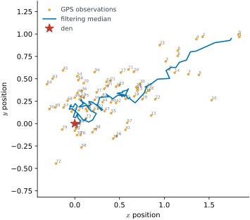]
.center[The median of the filtering distribution at each time step.]

---

class: middle

.center.width-70[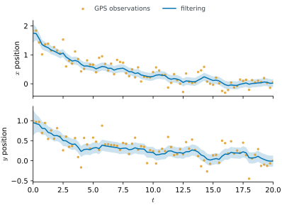]
.center[The filtering distribution at each time step: median and 5-95% band.]

---

class: middle

The smoothing distributions $p(\mathbf{z}\_t | \mathbf{x}\_{1:T}) = \mathcal{N}(\mathbf{z}\_t | \mathbf{m}^s\_t, \mathbf{P}^s\_t)$ are also Gaussian with mean $\mathbf{m}^s\_t$ and covariance $\mathbf{P}^s\_t$.

The parameters can be computed recursively using the .bold[Rauch-Tung-Striebel smoother] equations,
$$\begin{aligned}
\mathbf{C}\_t &= \mathbf{P}\_t \mathbf{A}^T (\mathbf{P}^-\_{t+1})^{-1}, \\\\
\mathbf{m}^s\_t &= \mathbf{m}\_t + \mathbf{C}\_t (\mathbf{m}^s\_{t+1} - \mathbf{m}^-\_{t+1}), \\\\
\mathbf{P}^s\_t &= \mathbf{P}\_t + \mathbf{C}\_t (\mathbf{P}^s\_{t+1} - \mathbf{P}^-\_{t+1}) \mathbf{C}\_t^T,
\end{aligned}$$
for $t = T-1, T-2, \ldots, 1$, with the base case $\mathbf{m}^s\_T = \mathbf{m}\_T$ and $\mathbf{P}^s\_T = \mathbf{P}\_T$.

---

class: middle

.italic[Proof.] Combining the filtering distribution $p(\mathbf{z}\_t | \mathbf{x}\_{1:t}) = \mathcal{N}(\mathbf{z}\_t | \mathbf{m}\_t, \mathbf{P}\_t)$ with the transition model $p(\mathbf{z}\_{t+1} | \mathbf{z}\_t)$ gives a Gaussian joint,
$$p(\mathbf{z}\_t, \mathbf{z}\_{t+1} | \mathbf{x}\_{1:t}) = p(\mathbf{z}\_t | \mathbf{x}\_{1:t}) p(\mathbf{z}\_{t+1} | \mathbf{z}\_t) = \mathcal{N}\left(\begin{pmatrix} \mathbf{z}\_t \\\\ \mathbf{z}\_{t+1} \end{pmatrix} | \begin{bmatrix} \mathbf{m}\_t \\\\ \mathbf{m}^-\_{t+1} \end{bmatrix}, \begin{bmatrix} \mathbf{P}\_t & \mathbf{P}\_t \mathbf{A}^T \\\\ \mathbf{A} \mathbf{P}\_t & \mathbf{P}^-\_{t+1} \end{bmatrix}\right).$$

Given $\mathbf{z}\_{t+1}$, the later observations $\mathbf{x}\_{t+1:T}$ carry no further information on $\mathbf{z}\_t$ (Markov property). Conditioning the joint on $\mathbf{z}\_{t+1}$ gives
$$p(\mathbf{z}\_t | \mathbf{z}\_{t+1}, \mathbf{x}\_{1:T}) = \mathcal{N}(\mathbf{z}\_t | \mathbf{m}\_t + \mathbf{C}\_t (\mathbf{z}\_{t+1} - \mathbf{m}^-\_{t+1}), \mathbf{P}\_t - \mathbf{C}\_t \mathbf{P}^-\_{t+1} \mathbf{C}\_t^T).$$

---

class: middle

Multiplying by the smoothing distribution $p(\mathbf{z}\_{t+1} | \mathbf{x}\_{1:T}) = \mathcal{N}(\mathbf{z}\_{t+1} | \mathbf{m}^s\_{t+1}, \mathbf{P}^s\_{t+1})$, computed at the previous step of the recursion, gives the joint
$$\begin{aligned}
p(\mathbf{z}\_{t+1}, \mathbf{z}\_t | \mathbf{x}\_{1:T}) &= p(\mathbf{z}\_{t+1} | \mathbf{x}\_{1:T}) p(\mathbf{z}\_t | \mathbf{z}\_{t+1}, \mathbf{x}\_{1:T}) \\\\
&= \mathcal{N}\left(\begin{pmatrix} \mathbf{z}\_{t+1} \\\\ \mathbf{z}\_t \end{pmatrix} | \begin{bmatrix} \mathbf{m}^s\_{t+1} \\\\ \mathbf{m}^s\_t \end{bmatrix}, \begin{bmatrix} \mathbf{P}^s\_{t+1} & \mathbf{P}^s\_{t+1} \mathbf{C}\_t^T \\\\ \mathbf{C}\_t \mathbf{P}^s\_{t+1} & \mathbf{P}^s\_t \end{bmatrix}\right),
\end{aligned}$$
where
$$\begin{aligned}
\mathbf{m}^s\_t &= \mathbf{m}\_t + \mathbf{C}\_t (\mathbf{m}^s\_{t+1} - \mathbf{m}^-\_{t+1}), \\\\
\mathbf{P}^s\_t &= \mathbf{P}\_t - \mathbf{C}\_t \mathbf{P}^-\_{t+1} \mathbf{C}\_t^T + \mathbf{C}\_t \mathbf{P}^s\_{t+1} \mathbf{C}\_t^T = \mathbf{P}\_t + \mathbf{C}\_t (\mathbf{P}^s\_{t+1} - \mathbf{P}^-\_{t+1}) \mathbf{C}\_t^T.
\end{aligned}$$

Its marginal over $\mathbf{z}\_t$ is the smoothing distribution $\mathcal{N}(\mathbf{z}\_t | \mathbf{m}^s\_t, \mathbf{P}^s\_t)$.

???

The conditioning and the averaging are the two formulas of the Gaussian cheat sheet at the end of Lecture 4. The full derivation is in Särkkä & Svensson (2023), Ch 12.

---

class: middle

.center.width-70[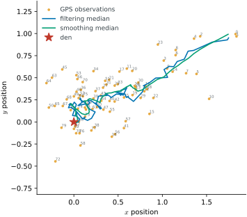]
.center[The median of the smoothing distribution at each time step.]

---

class: middle

.center.width-70[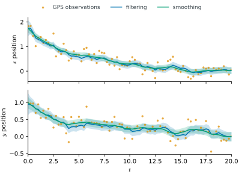]
.center[The smoothing distribution at each time step: median and 5-95% band.]

---

class: middle

## Hidden Markov models

A .bold[hidden Markov model] (HMM) is a state-space model whose states are discrete, $z\_t \in \\{1, \ldots, K\\}$, with transition probabilities
$$p(z\_t = j \mid z\_{t-1} = i) = \mathbf{A}\_{i, j},$$
and any observation model $p(x\_t \mid z\_t = j)$ for each state $j$. It is a mixture model whose component switches over time.

.italic[Example.] The behavior of a wolf (resting, foraging, traveling) as the state, its speed as the observation. $\mathbf{A}$ says how often the wolf switches from one behavior to another.

---

class: middle

With discrete states, the integrals of the Bayes filter and smoother become sums over the $K$ states.
1. Forward pass, the Bayes filter. For $t = 1, \ldots, T$,
$$p(z\_t = j \mid x\_{1:t}) \propto p(x\_t \mid z\_t = j) \sum\_{i=1}^K \mathbf{A}\_{i, j} \\, p(z\_{t-1} = i \mid x\_{1:t-1}),$$
where the sum is the prior $p(z\_1 = j)$ at $t = 1$.
2. Backward pass, the Bayes smoother. For $t = T-1, \ldots, 1$,
$$p(z\_t = i \mid x\_{1:T}) = p(z\_t = i \mid x\_{1:t}) \sum\_{j=1}^K \frac{\mathbf{A}\_{i, j} \\, p(z\_{t+1} = j \mid x\_{1:T})}{p(z\_{t+1} = j \mid x\_{1:t})},$$
where $p(z\_{t+1} = j \mid x\_{1:t}) = \sum\_{i} \mathbf{A}\_{i, j} \\, p(z\_t = i \mid x\_{1:t})$.

Together, the two passes form the .bold[forward-backward algorithm]. Each costs $K^2 T$ operations.

???

The literature writes the same algorithm with $\alpha\_t(j) = p(z\_t = j \mid x\_{1:t})$ and a backward variable $\beta\_t(i) \propto p(x\_{t+1:T} \mid z\_t = i)$, computed by $\beta\_t(i) \propto \sum\_j \mathbf{A}\_{i, j} \\, p(x\_{t+1} \mid z\_{t+1} = j) \\, \beta\_{t+1}(j)$ from $\beta\_T = 1$; the smoothing distribution is then $p(z\_t = j \mid x\_{1:T}) \propto \alpha\_t(j) \\, \beta\_t(j)$. Both forms give the same result.

In matrix form, $\boldsymbol{\alpha}\_t \propto \mathbf{O}\_t \mathbf{A}^T \boldsymbol{\alpha}\_{t-1}$, with $\mathbf{O}\_t$ the diagonal matrix of $p(x\_t \mid z\_t = j)$.

---

class: middle

.italic[Example.] A wolf switches between $K = 3$ behaviors, resting, foraging and traveling, and we observe its speed $x\_t$.
- The transition matrix keeps each behavior for a while,
$$\mathbf{A} = \begin{bmatrix} 0.95 & 0.04 & 0.01 \\\\ 0.03 & 0.93 & 0.04 \\\\ 0.02 & 0.06 & 0.92 \end{bmatrix}.$$
- The speed is Gaussian given the behavior,
$$p(x\_t \mid z\_t = j) = \mathcal{N}(x\_t \mid \mu\_j, \sigma\_j^2), \quad \boldsymbol{\mu} = (0.1, 0.7, 1.6), \quad \boldsymbol{\sigma} = (0.15, 0.3, 0.4).$$
- The wolf starts at rest, $p(z\_1 = 1) = 1$.

We simulate $T = 200$ steps from this model, then run the forward-backward algorithm on the speeds alone.

???

Row $i$ of $\mathbf{A}$ gives the probabilities of the next behavior when the current one is $i$. The diagonal entries make each behavior last about $1 / (1 - \mathbf{A}\_{i,i})$ steps on average: 20 steps of rest, 14 of foraging, 12 of travel.

The speed distributions overlap, foraging especially: a single speed does not tell the behavior, a sequence of them does.

---

class: middle

.center.width-80[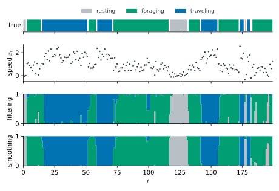]

.center[A simulated wolf switching between three behaviors, observed through its speed.  Its most probable state is right 94% of the time filtering, 97% smoothing.]

???

Smoothing uses the whole sequence: a single slow speed in the middle of a long run of travel is read as noise, which the filter, seeing only the past, cannot do as well.

---

class: middle

## Learning the parameters

So far, the parameters $\theta = (\kappa, \sigma, \mathbf{R}, \boldsymbol{\mu})$ of the wolf model were taken as known. The Bayes filter also gives their likelihood. At each step, the update normalizes by
$$p(\mathbf{x}\_t \mid \mathbf{x}\_{1:t-1}, \theta) = \int p(\mathbf{x}\_t \mid \mathbf{z}\_t, \theta) \\, p(\mathbf{z}\_t \mid \mathbf{x}\_{1:t-1}, \theta) \\, d\mathbf{z}\_t.$$
The product of these normalizers is the marginal likelihood of the data,
$$p(\mathbf{x}\_{1:T} \mid \theta) = \prod\_{t=1}^T p(\mathbf{x}\_t \mid \mathbf{x}\_{1:t-1}, \theta).$$

It can be maximized over $\theta$, or combined with a prior $p(\theta)$ into a posterior.

???

For a linear Gaussian model, each factor is Gaussian, $p(\mathbf{x}\_t \mid \mathbf{x}\_{1:t-1}, \theta) = \mathcal{N}(\mathbf{x}\_t \mid \mathbf{H} \mathbf{m}^-\_t, \mathbf{H} \mathbf{P}^-\_t \mathbf{H}^T + \mathbf{R})$, so one pass of the Kalman filter evaluates the likelihood.

Maximizing it is the frequentist inference of Lecture 4; sampling the posterior is Lecture 6; EM (Lecture 8) is another way to maximize it.

---

class: middle

.center.width-80[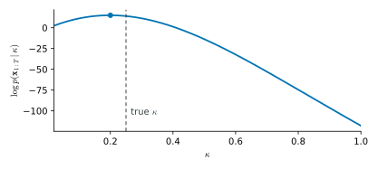]

$$\log p(\mathbf{x}\_{1:T} \mid \kappa) = \sum\_{t=1}^T \log p(\mathbf{x}\_t \mid \mathbf{x}\_{1:t-1}, \kappa)$$

.center[The log-likelihood of the GPS observations, as a function of $\kappa$.  It peaks at 0.20; the data were simulated with $\kappa = 0.25$.]

???

The other parameters are fixed at their true values. The gap between 0.20 and 0.25 is sampling variability: another simulated sequence would give another maximum. A confidence interval or a posterior for $\kappa$ quantifies it, as in Lecture 4.

---

class: middle

# Continuous-time models

---

class: middle

.center.width-10[]

So far, time advanced in fixed steps $\Delta t$, at which the transition and observation models were defined.

We now model the state in .bold[continuous time]. Physical processes are naturally described by rates of change. Observations often arrive at irregular times, triggered by events or collected at several time scales.

---

class: middle

## From discrete to continuous time

In discrete-time state-space models, we considered transition models of the form $p(\mathbf{z}\_t | \mathbf{z}\_{t-1})$ that describe how the state evolves from one time step to the next.
For additive transitions and additive noise, this can be expressed as
$$\mathbf{z}\_t = \mathbf{z}\_{t-1} + f(\mathbf{z}\_{t-1}) \Delta t + \mathbf{w}\_t,$$
where $f$ is a deterministic function and $\mathbf{w}\_t$ is random noise. 

Shuffling the terms, we get
$$\frac{\mathbf{z}\_t - \mathbf{z}\_{t-1}}{\Delta t} = f(\mathbf{z}\_{t-1}) + \frac{\mathbf{w}\_t}{\Delta t},$$ which, in the limit as $\Delta t \to 0$, gives us a continuous-time model
$$\frac{d\mathbf{z}(t)}{dt} = f(\mathbf{z}(t)) + \frac{d\mathbf{w}(t)}{dt},$$
where $\mathbf{z}(t)$ is the state at time $t$ and $\mathbf{w}(t)$ is continuous-time noise.

---

class: middle

Without the noise, we get a .bold[deterministic] system, an .bold[ordinary differential equation] (ODE),
$$\frac{d\mathbf{z}(t)}{dt} = f(\mathbf{z}(t)).$$

.italic[Example 1.] Exponential decay to an equilibrium point $\mu$,
$$\frac{dz(t)}{dt} = -\kappa (z(t) - \mu), \quad \text{with solution} \quad z(t) = \mu + (z(0) - \mu) e^{-\kappa t}.$$

.center.width-80[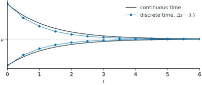]

???

The solution of an ODE with initial condition $\mathbf{z}\_0$ satisfies $\mathbf{z}(t) = \mathbf{z}\_0 + \int\_0^t f(\mathbf{z}(\tau)) d\tau$. It has a closed form only in simple cases, such as this one.

The state moves towards $\mu$ from either side, and is fully determined by $z(0)$. The decay is exponential because the difference $z(t) - \mu$ shrinks exponentially fast; the state approaches $\mu$ without reaching it in finite time.

The discrete steps, $z\_t = z\_{t-1} - \kappa (z\_{t-1} - \mu) \Delta t$, decay slightly faster than the curve: each step follows the slope at the start of its interval, and $1 - \kappa \Delta t < e^{-\kappa \Delta t}$. Here $\kappa = 0.8$ and $\Delta t = 0.5$.

---

class: middle

.italic[Example 2.] The .bold[Lorenz system] is a chaotic ODE in three variables,
$$\frac{dz\_1}{dt} = s (z\_2 - z\_1), \quad \frac{dz\_2}{dt} = z\_1 (r - z\_3) - z\_2, \quad \frac{dz\_3}{dt} = z\_1 z\_2 - b z\_3.$$

.center.width-100[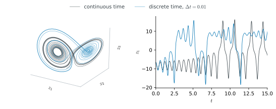]

.center[The two trajectories part after about one time unit.]

???

With $s = 10$, $r = 28$ and $b = 8/3$. Lorenz (1963) derived these equations as a crude model of convection in the atmosphere, and found that two nearby starting points end up far apart. This is why weather forecasts lose their skill after one to two weeks, and why data assimilation keeps correcting them with observations.

Here the discretization error plays the role of the perturbation: chaos amplifies it until the two trajectories have nothing in common, while both stay on the attractor.

A computer cannot draw a continuous path either. The grey curve comes from a high-order solver (DOP853) at a relative tolerance of $10^{-12}$, whose error stays negligible over these 8 time units. A plain Euler scheme, even with a step of $10^{-4}$, would itself part from the true trajectory before $t = 15$.

---

class: middle

## Brownian motion

To add stochasticity to the ODE, we need a continuous-time stochastic process that can model random noise.

We can model the noise term $\mathbf{w}(t)$ as a standard Brownian motion (Wiener process) $W(t)$, which has the following properties:
- $W(0) = 0$.
- For $0 \leq s < t$, the increment $W(t) - W(s) \sim \mathcal{N}(0, t-s)$.
- Increments over disjoint intervals are independent.
- $W(t)$ is continuous in $t$.

A vector $\mathbf{W}(t)$ has independent Brownian components.

---

class: middle

Adding Brownian motion to the ODE, scaled by a .bold[diffusion term] $g$, gives a .bold[stochastic differential equation] (SDE),
$$d\mathbf{z}(t) = f(\mathbf{z}(t)) \\, dt + g(\mathbf{z}(t)) \\, d\mathbf{W}(t).$$
Over an infinitesimal interval $dt$, the drift $f \\, dt$ is the deterministic change of the state, and the diffusion $g \\, d\mathbf{W}$ its random change.

Brownian motion is nowhere differentiable, so the white noise $d\mathbf{W}(t)/dt$ is only symbolic. The differential form avoids it.

???

The differential form needs a choice of stochastic integral to have a meaning; the standard one is Itô's. Both $f$ and $g$ may also depend on $t$.

Teaser: this equation is the basis of modern generative models such as .bold[diffusion models] used in image synthesis (e.g., DALL-E 2, Stable Diffusion).

---

class: middle

.italic[Example 2, with noise.] The Lorenz system becomes the SDE
$$d\mathbf{z} = f(\mathbf{z}) \\, dt + \sigma \\, d\mathbf{W}.$$

.center.width-100[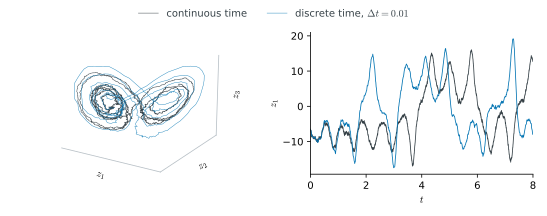]

.center[In continuous and in discrete time, driven by the same Brownian motion.]

???

The discrete model sees the noise only summed over each step, $\mathbf{w}\_t = \sigma (\mathbf{W}(t) - \mathbf{W}(t - \Delta t))$. Here $\sigma = 3$.

There is no exact way to simulate this SDE. The grey curve uses Euler-Maruyama with a step of $10^{-4}$, 250 times finer than the discrete model, on the same Brownian path.

---

class: middle

.italic[Example 3.] The wolf model in continuous time is Example 1 in two dimensions, towards the home location $\boldsymbol{\mu}$, with noise,
$$d\mathbf{z}(t) = -\kappa (\mathbf{z}(t) - \boldsymbol{\mu}) \\, dt + \sigma \\, d\mathbf{W}(t),$$
where $\kappa > 0$ is the strength of the attraction and $\sigma$ the diffusion coefficient. This SDE is the .bold[Ornstein-Uhlenbeck process].

The discrete-time model of Part I,
$$\mathbf{z}\_t = \mathbf{z}\_{t-1} - \kappa (\mathbf{z}\_{t-1} - \boldsymbol{\mu}) \Delta t + \mathbf{w}\_t, \quad \mathbf{w}\_t \sim \mathcal{N}(\mathbf{0}, \sigma^2 \Delta t \\, \mathbf{I}),$$
is its Euler-Maruyama discretization with step $\Delta t$.

---

class: middle

.center.width-70[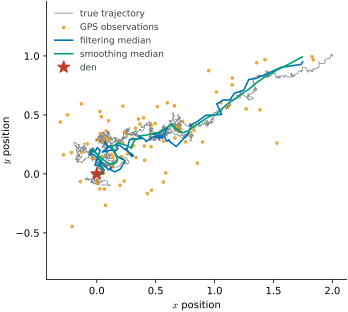]
.center[The true trajectory behind the GPS observations: an Ornstein-Uhlenbeck process,  simulated on a fine grid and observed every 0.25 time units.]

???

The discrete-time model of Part I is an approximation of the process that generated the data. The next slide makes it exact.

---

class: middle

The OU process can be discretized exactly, even at irregular observation times $t\_1 < t\_2 < \ldots$. With $\Delta\_i = t\_i - t\_{i-1}$,
$$p(\mathbf{z}(t\_i) \mid \mathbf{z}(t\_{i-1})) = \mathcal{N}\left(\boldsymbol{\mu} + e^{-\kappa \Delta\_i} (\mathbf{z}(t\_{i-1}) - \boldsymbol{\mu}), \\, \frac{\sigma^2}{2\kappa} \left(1 - e^{-2\kappa \Delta\_i}\right) \mathbf{I}\right).$$

This is a linear Gaussian transition, with $\mathbf{A}\_i = e^{-\kappa \Delta\_i} \mathbf{I}$ and $\mathbf{b}\_i = (1 - e^{-\kappa \Delta\_i}) \boldsymbol{\mu}$. The Kalman filter and smoother apply unchanged, with matrices that change with the time step. The figures of this lecture use it, at $\Delta = 0.25$.

???

For a small $\Delta\_i$, $e^{-\kappa \Delta\_i} \approx 1 - \kappa \Delta\_i$ and the variance is close to $\sigma^2 \Delta\_i$: the Euler-Maruyama model of Part I.

Any linear SDE $d\mathbf{z} = \mathbf{F} \mathbf{z} \\, dt + \mathbf{L} \\, d\mathbf{W}$ discretizes the same way, with $\mathbf{A}\_i = e^{\mathbf{F} \Delta\_i}$ (Särkkä & Svensson 2023).

---

class: middle

## When to use continuous vs discrete time?

Continuous time suits observations at irregular intervals, mechanistic models, and parameters that are rates or time constants.

Discrete time suits regular sampling and models without a mechanistic interpretation, and is simpler to compute with.

A common approach is to model in continuous time, for interpretability, and to discretize for computation.

---

class: middle

# Application: weather forecasting

---

class: middle

.center.width-50[]

Weather forecasting is a state-space model:
- the state $\mathbf{z}\_t$ is the atmosphere on a three-dimensional grid (temperature, wind, pressure, humidity), about $10^9$ numbers;
- the transition model $p(\mathbf{z}\_t | \mathbf{z}\_{t-1})$ is the physics of the atmosphere, discretized in time with steps of a few minutes;
- the observations $\mathbf{x}\_t$ come from satellites, weather stations, balloons and aircraft, tens of millions every day, through an observation model $p(\mathbf{x}\_t | \mathbf{z}\_t)$.

???

At ECMWF, the global model runs at about 9 km, with 137 levels in the vertical: of the order of $10^9$ grid points. A satellite measures radiances: the observation model maps the temperature and humidity of the state to what the instrument sees.

---

class: black-slide
background-image: url(figures/lec5/atmosphere.jpg)
background-size: cover

.overlay[The state $\mathbf{z}\_t$: one snapshot of the atmosphere, over the whole planet.]

.footnote[Data: [ERA5](https://doi.org/10.1002/qj.3803) reanalysis, 10 m wind speed, March 21, 2021.]

---

class: black-slide
background-image: url(figures/lec5/satellite.gif)
background-size: cover

.overlay[The observations $\mathbf{x}\_t$: sparse, noisy, and often indirect.]

.footnote[Animation: [ESA/ATG medialab](https://www.esa.int/ESA_Multimedia), Sentinel-1.]

---

class: middle

Forecasting centres run the Bayes filter continuously: every 12 hours, they update the forecast with the latest observations, then predict. This cycle is called .bold[data assimilation]. On the Lorenz system, with only $z\_1$ observed:

.center.width-100[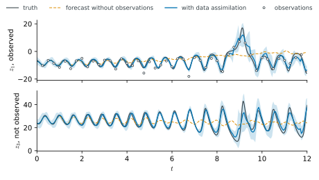]

.center[With data assimilation, the forecast tracks $z\_3$, then predicts after $t = 12$.  Without observations, it spreads over the attractor.]

???

The figure uses an ensemble Kalman filter with 40 members: each member is propagated through the model, and the update uses the covariance estimated from the members. Observations come every 0.25 time units, with a noise standard deviation of 2. Both curves are ensemble medians, with bands from the 5th to the 95th percentile. Over the second half, the error of the median on $z\_3$ is 2.3 with assimilation and 9.6 without. On the left, the 40 members of each ensemble at $t = 12$, with the true state as a star. After $t = 12$, there are no more observations: the assimilated ensemble only runs forward, and gives the prediction $p(\mathbf{z}\_{t+k} \mid \mathbf{x}\_{1:t})$. Its band widens again, as chaos amplifies the uncertainty left at $t = 12$.

At the scale of the atmosphere, the Kalman filter cannot be used as is: with $10^9$ numbers in the state, $\mathbf{P}\_t$ would have $10^{18}$ entries. Forecasting centres combine ensembles, as in the figure, with variational methods, which optimize the state over a 12-hour window (4D-Var at ECMWF). Chaos is also why forecasts are issued as ensembles, of about 50 members.

The same machinery produces reanalyses, the best estimate of the past atmosphere, such as ERA5 from 1940 to today. The RMI runs its own model over Belgium, nested in the global forecasts.

---

class: middle

On the real atmosphere, the transition model can be a machine-learning forecaster such as GenCast, and the filter an ensemble of states updated with each new observation (a particle filter):

.center.width-100[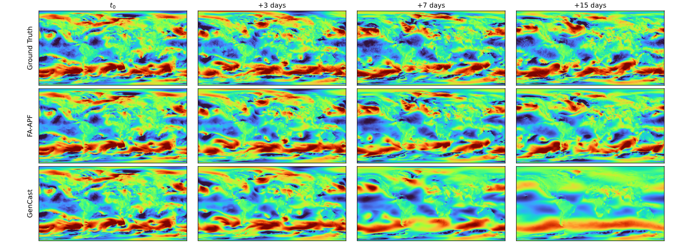]

.center[10 m zonal wind: truth (ERA5), filter with observations, forecast alone.  Without observations, the forecast drifts away within a week.]

.footnote[Credits: [Savary et al](https://arxiv.org/abs/2605.20028), ICML 2026.]

???

GenCast, from Google DeepMind, samples the next state of the atmosphere given the current one: it was built to forecast, and has never seen an observation. In the filter, each member of the ensemble is moved forward by GenCast and conditioned on the new observations, without retraining. The rows show the ensemble means after 3, 7 and 15 days.

---

class: end-slide, center
count: false

The end.
