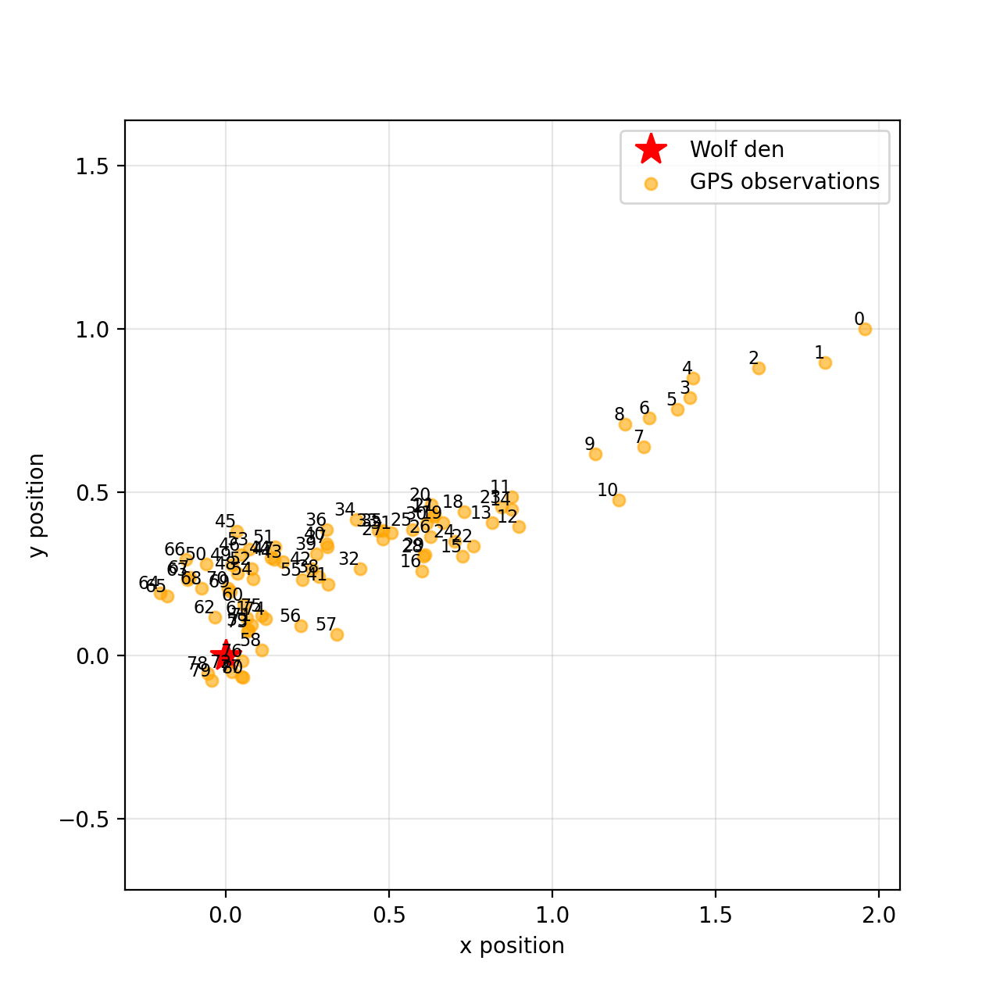
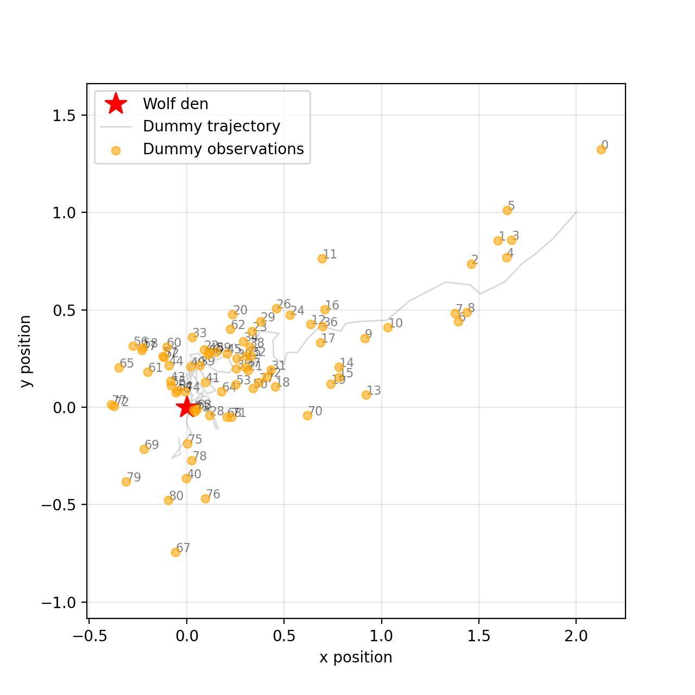
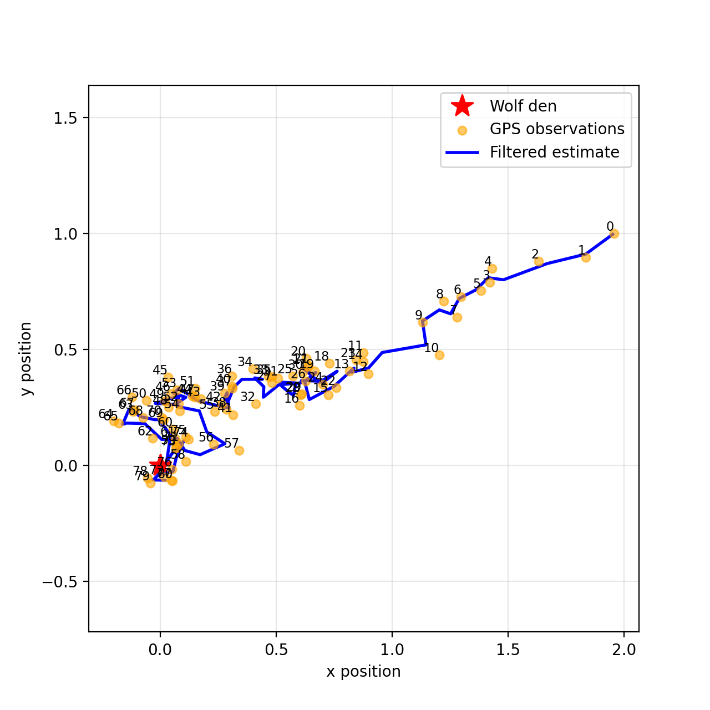
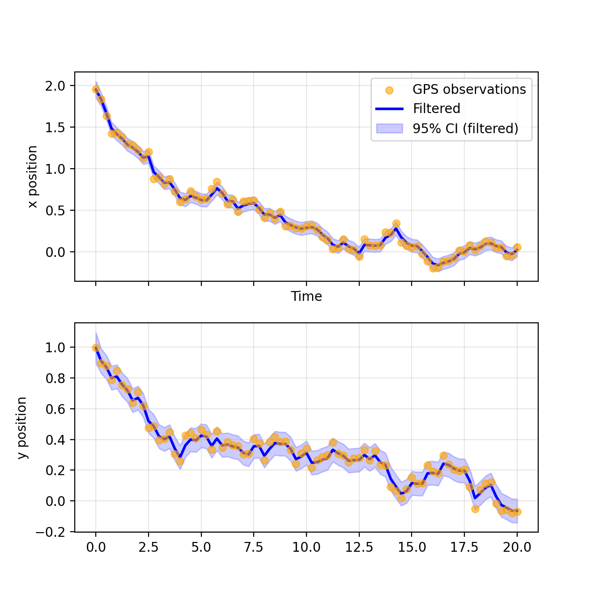
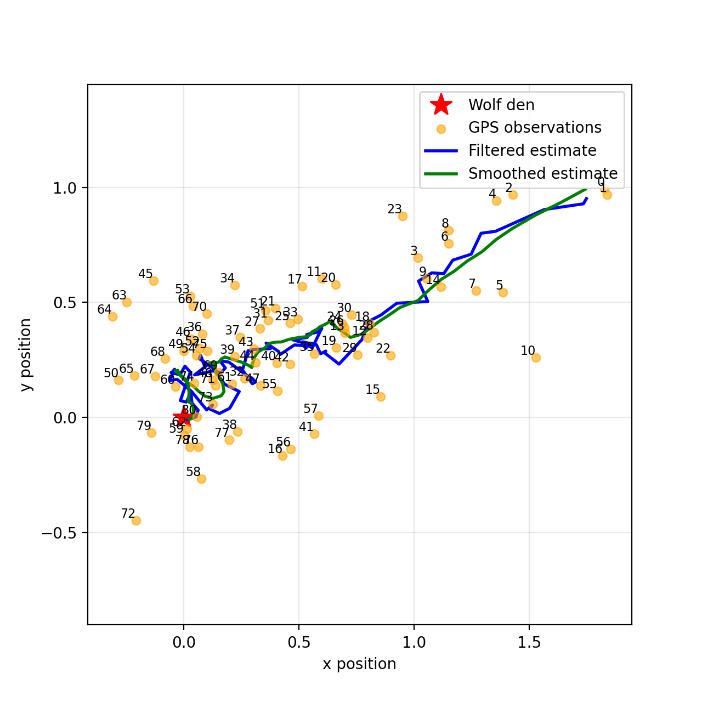
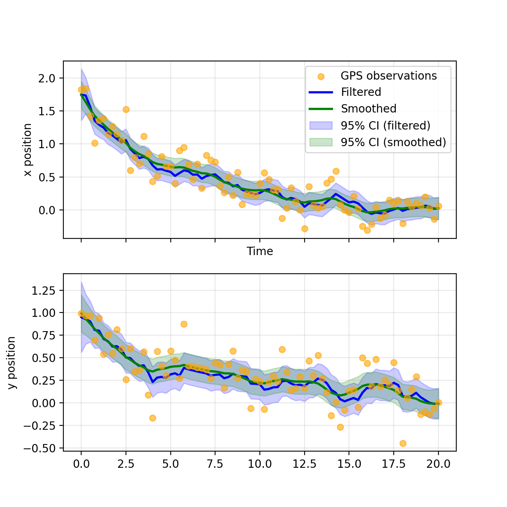
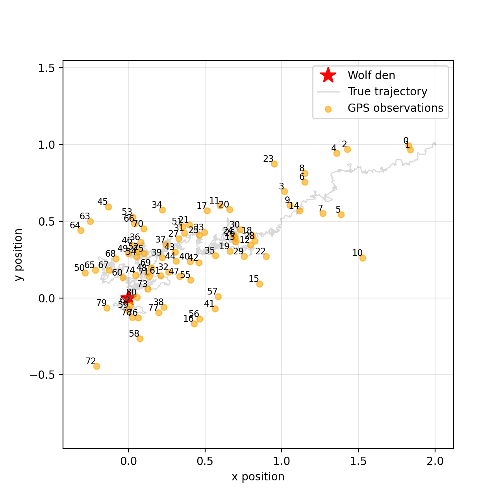

class: middle, center, title-slide

# Foundations of Data Science

Lecture 5: State-space models

  
Prof. Gilles Louppe 
[g.louppe@uliege.be](mailto:g.louppe@uliege.be)

---

class: middle

.center.width-70[]
.center[Today's case study: .bold[tracking] the location of a wolf  over time using noisy GPS observations.]

---

class: middle

# Discrete-time models

---

class: middle

.center[]

## Static latent variable models 

We previously defined latent variable models as probabilistic models that explain observed data $\mathbf{x}$ in terms of unobserved (latent) variables $\mathbf{z}$ and parameters $\theta$, $$p(\mathbf{x}, \mathbf{z}, \theta) = p(\mathbf{x} | \mathbf{z}, \theta) p(\mathbf{z} | \theta) p(\theta).$$

---

class: middle

.center.width-10[]

What if the system evolves over time and we have a sequence of observations $\mathbf{x}\_{1:T} = (\mathbf{x}\_1, \ldots, \mathbf{x}\_T)$ collected at discrete time steps $t = 1, \ldots, T$?
 
---

class: middle

## State-space models

To model a dynamical system, we can first assume a discretization of time and introduce a sequence of latent variables $\mathbf{z}\_t$ that represent the state of the system at each time step $t$.

In this context, a .bold[state-space model] is a latent variable model that explains a sequence $\mathbf{x}\_{1:T} = (\mathbf{x}\_1, \ldots, \mathbf{x}\_T)$ of observations in terms of a sequence $\mathbf{z}\_{1:T} = (\mathbf{z}\_1, \ldots, \mathbf{z}\_T)$ of latent variables.

---

class: middle

.center[]

In a Markovian state-space model, the latent variables form a Markov chain $$p(\mathbf{z}\_t | \mathbf{z}\_{1:t-1}) = p(\mathbf{z}\_t | \mathbf{z}\_{t-1}),$$ where the conditional distribution $p(\mathbf{z}\_t | \mathbf{z}\_{t-1})$ is called the .bold[transition model].

The observations are conditionally independent given the latent variables, $$p(\mathbf{x}\_t | \mathbf{x}\_{1:t-1}, \mathbf{z}\_{1:t}) = p(\mathbf{x}\_t | \mathbf{z}\_t),$$ where the conditional distribution $p(\mathbf{x}\_t | \mathbf{z}\_t)$ is called the .bold[observation model].

---

class: middle

.center.width-10[]

## Example

We want to track the location of a wild animal (e.g., a wolf) over time using noisy GPS observations.

Assumptions:
- The animal has a home location (den, nest) at $\boldsymbol{\mu} \in \mathbb{R}^2$.
- The animal moves according to a random walk with drift towards the home location. 
- The GPS observations are noisy measurements of the animal's true location.
- Time is discretized regularly every $\Delta t$ time units.

---

class: middle

State-space model:
- States $\mathbf{z}\_t \in \mathbb{R}^2$ represent the true location of the animal at time $t$. They evolve as a random walk with drift towards the home location $\boldsymbol{\mu}$.
$$
p(\mathbf{z}\_t | \mathbf{z}\_{t-1}) = \mathcal{N}(\mathbf{z}\_t | \mathbf{z}\_{t-1} - \kappa (\mathbf{z}\_{t-1} - \boldsymbol{\mu}) \Delta t, \sigma^2 \Delta t \mathbf{I}),
$$
where $\kappa > 0$ is the strength of attraction to the home location and $\sigma^2$ is the variance of the random walk.
- Observations $\mathbf{x}\_t \in \mathbb{R}^2$ represent noisy GPS measurements of the animal's location at time $t$. They relate to the states via
$$
p(\mathbf{x}\_t | \mathbf{z}\_t) = \mathcal{N}(\mathbf{x}\_t | \mathbf{z}\_t, \mathbf{R}),
$$
where $\mathbf{R}$ is the observation noise covariance.

---

class: middle

.center.width-70[]
.center[Example of trajectory and observations  generated from the discrete-time state-space model ($\Delta t=0.25$).]

---

class: middle

## Inference in state-space models

Given a state-space model and a sequence of observations $\mathbf{x}\_{1:T}$, we are typically interested in solving one or more of the following inference problems:

- Prediction: $p(\mathbf{z}\_{t+k} | \mathbf{x}\_{1:t})$ for $k \geq 1$.
- Filtering: $p(\mathbf{z}\_t | \mathbf{x}\_{1:t})$.
- Smoothing: $p(\mathbf{z}\_t | \mathbf{x}\_{1:T})$.

---

class: middle

## Bayes filter

The Bayes filter is a recursive algorithm for estimating the filtering distributions $p(\mathbf{z}\_t | \mathbf{x}\_{1:t})$ as 
$$p(\mathbf{z}\_t | \mathbf{x}\_{1:t}) = \frac{p(\mathbf{x}\_t | \mathbf{z}\_t) \int p(\mathbf{z}\_t | \mathbf{z}\_{t-1}) p(\mathbf{z}\_{t-1} | \mathbf{x}\_{1:t-1}) d\mathbf{z}\_{t-1}}{p(\mathbf{x}\_t | \mathbf{x}\_{1:t-1})},$$
for $t = 1, 2, \ldots, T$, with the base case $p(\mathbf{z}\_1 | \mathbf{x}\_1) = \frac{p(\mathbf{x}\_1 | \mathbf{z}\_1) p(\mathbf{z}\_1)}{p(\mathbf{x}\_1)}$.

---

class: middle

.italic[Proof.] The filtering distribution can be derived in two steps:

1. Prediction: Push the filtering distribution from the previous time step through the transition model to obtain a prediction of the current state. That is,
   $$p(\mathbf{z}\_t | \mathbf{x}\_{1:t-1}) = \int p(\mathbf{z}\_t | \mathbf{z}\_{t-1}) p(\mathbf{z}\_{t-1} | \mathbf{x}\_{1:t-1}) d\mathbf{z}\_{t-1}.$$
2. Update: Condition on the new observation to obtain the filtering distribution,
   $$p(\mathbf{z}\_t | \mathbf{x}\_{1:t}) = \frac{p(\mathbf{x}\_t | \mathbf{z}\_t) p(\mathbf{z}\_t | \mathbf{x}\_{1:t-1})}{p(\mathbf{x}\_t | \mathbf{x}\_{1:t-1})},$$
   where the marginal likelihood $p(\mathbf{x}\_t | \mathbf{x}\_{1:t-1})$ is given by
   $$p(\mathbf{x}\_t | \mathbf{x}\_{1:t-1}) = \int p(\mathbf{x}\_t | \mathbf{z}\_t) p(\mathbf{z}\_t | \mathbf{x}\_{1:t-1}) d\mathbf{z}\_t.$$

---

class: middle

Once we have computed the filtering distributions $p(\mathbf{z}\_t | \mathbf{x}\_{1:t})$ for $t = 1, \ldots, T$, we can compute the .bold[prediction distributions] $p(\mathbf{z}\_{t+k} | \mathbf{x}\_{1:t})$ for $k \geq 1$ using the prediction step of the Bayes filter iteratively,
$$p(\mathbf{z}\_{t+k} | \mathbf{x}\_{1:t}) = \int p(\mathbf{z}\_{t+k} | \mathbf{z}\_{t+k-1}) p(\mathbf{z}\_{t+k-1} | \mathbf{x}\_{1:t}) d\mathbf{z}\_{t+k-1},$$
for $k = 1, 2, \ldots$.

---

class: middle

## Bayes smoother

The Bayes smoother computes the smoothing distributions $p(\mathbf{z}\_t | \mathbf{x}\_{1:T})$ for $t = 1, \ldots, T$ using the filtering distributions $p(\mathbf{z}\_t | \mathbf{x}\_{1:t})$ and the transition model $p(\mathbf{z}\_t | \mathbf{z}\_{t-1})$. It consists of a backward recursion,
$$p(\mathbf{z}\_t | \mathbf{x}\_{1:T}) = p(\mathbf{z}\_t | \mathbf{x}\_{1:t}) \int \frac{p(\mathbf{z}\_{t+1} | \mathbf{z}\_t) p(\mathbf{z}\_{t+1} | \mathbf{x}\_{1:T})}{p(\mathbf{z}\_{t+1} | \mathbf{x}\_{1:t})} d\mathbf{z}\_{t+1},$$
for $t = T-1, T-2, \ldots, 1$, starting from $p(\mathbf{z}\_T | \mathbf{x}\_{1:T})$, the filtering distribution at $t = T$.

---

class: middle

.italic[Proof.] The joint distribution $p(\mathbf{z}\_t, \mathbf{z}\_{t+1} | \mathbf{x}\_{1:T})$ can be computed as
$$\begin{aligned}
p(\mathbf{z}\_t, \mathbf{z}\_{t+1} | \mathbf{x}\_{1:T}) &= p(\mathbf{z}\_t | \mathbf{z}\_{t+1}, \mathbf{x}\_{1:T}) p(\mathbf{z}\_{t+1} | \mathbf{x}\_{1:T}) \\\\
&= p(\mathbf{z}\_t | \mathbf{z}\_{t+1}, \mathbf{x}\_{1:t}) p(\mathbf{z}\_{t+1} | \mathbf{x}\_{1:T}) \\\\
&= \frac{p(\mathbf{z}\_{t+1} | \mathbf{z}\_t) p(\mathbf{z}\_t | \mathbf{x}\_{1:t})}{p(\mathbf{z}\_{t+1} | \mathbf{x}\_{1:t})} p(\mathbf{z}\_{t+1} | \mathbf{x}\_{1:T}),
\end{aligned}$$
where we used the conditional independence properties of the state-space model.

Marginalizing over $\mathbf{z}\_{t+1}$ gives the desired result,
$$\begin{aligned}
p(\mathbf{z}\_t | \mathbf{x}\_{1:T}) &= \int p(\mathbf{z}\_t, \mathbf{z}\_{t+1} | \mathbf{x}\_{1:T}) d\mathbf{z}\_{t+1} \\\\
&= p(\mathbf{z}\_t | \mathbf{x}\_{1:t}) \int \frac{p(\mathbf{z}\_{t+1} | \mathbf{z}\_t) p(\mathbf{z}\_{t+1} | \mathbf{x}\_{1:T})}{p(\mathbf{z}\_{t+1} | \mathbf{x}\_{1:t})} d\mathbf{z}\_{t+1}. 
\end{aligned}$$

---

class: middle

.center.width-10[]

Although the Bayes filter and Bayes smoother provide a general framework for inference in state-space models, they are .bold[rarely tractable in practice] as they involve integrals that are difficult to compute.

Further assumptions on the transition and observation models are required for closed-form solutions.

---

class: middle

## Linear Gaussian state-space models

A linear Gaussian state-space model (LGSSM) is a state-space model where both the transition and observation models are linear Gaussian. That is,
$$\begin{aligned}
p(\mathbf{z}\_t | \mathbf{z}\_{t-1}) &= \mathcal{N}(\mathbf{z}\_t | \mathbf{A} \mathbf{z}\_{t-1}, \mathbf{Q}), \\\\
p(\mathbf{x}\_t | \mathbf{z}\_t) &= \mathcal{N}(\mathbf{x}\_t | \mathbf{H} \mathbf{z}\_t, \mathbf{R}),
\end{aligned}$$
where $\mathbf{A}$ is the state transition matrix, $\mathbf{Q}$ is the process noise covariance, $\mathbf{H}$ is the observation matrix, and $\mathbf{R}$ is the observation noise covariance.

If the prior distribution $p(\mathbf{z}\_1)$ is also Gaussian, then all filtering, prediction, and smoothing distributions are Gaussian.

---

class: middle

The .bold[Kalman filter] provides a closed-form expression for the filtering distributions in linear Gaussian state-space models.

At each time step $t$, $p(\mathbf{z}\_t | \mathbf{x}\_{1:t}) = \mathcal{N}(\mathbf{z}\_t | \mathbf{m}\_t, \mathbf{P}\_t)$ is Gaussian with mean $\mathbf{m}\_t$ and covariance $\mathbf{P}\_t$. 
These parameters can be computed recursively by adapting the Bayes filter equations to the linear Gaussian case.

---

class: middle

.italic[Proof.] By recursion, assume that at time step $t-1$, the filtering distribution is Gaussian, $p(\mathbf{z}\_{t-1} | \mathbf{x}\_{1:t-1}) = \mathcal{N}(\mathbf{z}\_{t-1} | \mathbf{m}\_{t-1}, \mathbf{P}\_{t-1})$, with the base case $p(\mathbf{z}\_1 | \mathbf{x}\_1) = \mathcal{N}(\mathbf{z}\_1 | \mathbf{m}\_1, \mathbf{P}\_1)$.

For the prediction step, we have
$$\begin{aligned}
p(\mathbf{z}\_t | \mathbf{x}\_{1:t-1}) &= \int p(\mathbf{z}\_{t-1} | \mathbf{x}\_{1:t-1}) p(\mathbf{z}\_t | \mathbf{z}\_{t-1}) d\mathbf{z}\_{t-1} \\\\
&= \int \mathcal{N}(\mathbf{z}\_{t-1} | \mathbf{m}\_{t-1}, \mathbf{P}\_{t-1}) \mathcal{N}(\mathbf{z}\_t | \mathbf{A} \mathbf{z}\_{t-1}, \mathbf{Q}) d\mathbf{z}\_{t-1} \\\\
&= \int \mathcal{N}\left(\begin{pmatrix} \mathbf{z}\_{t-1} \\\\ \mathbf{z}\_t \end{pmatrix} | \begin{bmatrix} \mathbf{m}\_{t-1} \\\\ \mathbf{A} \mathbf{m}\_{t-1} \end{bmatrix}, \begin{bmatrix} \mathbf{P}\_{t-1} & \mathbf{P}\_{t-1} \mathbf{A}^T \\\\ \mathbf{A} \mathbf{P}\_{t-1} & \mathbf{A} \mathbf{P}\_{t-1} \mathbf{A}^T + \mathbf{Q} \end{bmatrix}\right) d\mathbf{z}\_{t-1} \\\\
&= \mathcal{N}(\mathbf{z}\_t | \mathbf{m}^-\_t, \mathbf{P}^-\_t),
\end{aligned}$$
where $\mathbf{m}^-\_t = \mathbf{A} \mathbf{m}\_{t-1}$ and $\mathbf{P}^-\_t = \mathbf{A} \mathbf{P}\_{t-1} \mathbf{A}^T + \mathbf{Q}$.

---

class: middle

For the update step, we join the prediction distribution with the observation model,
$$\begin{aligned}
p\left(\begin{pmatrix} \mathbf{z}\_t \\\\ \mathbf{x}\_t \end{pmatrix} | \mathbf{x}\_{1:t-1} \right) &= p(\mathbf{z}\_t | \mathbf{x}\_{1:t-1}) p(\mathbf{x}\_t | \mathbf{z}\_t) \\\\
&= \mathcal{N}\left(\begin{pmatrix} \mathbf{z}\_t \\\\ \mathbf{x}\_t \end{pmatrix} | \begin{bmatrix} \mathbf{m}^-\_t \\\\ \mathbf{H} \mathbf{m}^-\_t \end{bmatrix}, \begin{bmatrix} \mathbf{P}^-\_t & \mathbf{P}^-\_t \mathbf{H}^T \\\\ \mathbf{H} \mathbf{P}^-\_t & \mathbf{H} \mathbf{P}^-\_t \mathbf{H}^T + \mathbf{R} \end{bmatrix}\right).
\end{aligned}$$

Therefore, the filtering distribution is given by the conditional distribution
$$p(\mathbf{z}\_t | \mathbf{x}\_{1:t-1}, \mathbf{x}\_t) = p(\mathbf{z}\_t | \mathbf{x}\_{1:t}) = \mathcal{N}(\mathbf{z}\_t | \mathbf{m}\_t, \mathbf{P}\_t),$$
where
$$\begin{aligned}
\mathbf{m}\_t &= \mathbf{m}^-\_t + \mathbf{K}\_t (\mathbf{x}\_t - \mathbf{H} \mathbf{m}^-\_t), \\\\
\mathbf{P}\_t &= (\mathbf{I} - \mathbf{K}\_t \mathbf{H}) \mathbf{P}^-\_t,
\end{aligned}$$
and $\mathbf{K}\_t = \mathbf{P}^-\_t \mathbf{H}^T (\mathbf{H} \mathbf{P}^-\_t \mathbf{H}^T + \mathbf{R})^{-1}$ is the Kalman gain and represents the weight given to the new observation.

???

Intuition:

Mean update:
- $\mathbf{H} \mathbf{m}^-\_t$ is the predicted observation based on the predicted state.
- $\mathbf{x}\_t - \mathbf{H} \mathbf{m}^-\_t$ is the innovation or measurement residual, i.e., the difference between the actual observation and the predicted observation.
- The Kalman gain $\mathbf{K}\_t$ determines how much we adjust our prediction based on the new observation.

Covariance update:
- If the observation noise $\mathbf{R}$ is small compared to the prediction uncertainty $\mathbf{P}^-\_t$, then $\mathbf{K}\_t$ approaches $\mathbf{H}^{-1}$ (if $\mathbf{H}$ is invertible), and we rely heavily on the new observation.
- Conversely, if $\mathbf{R}$ is large, then $\mathbf{K}\_t$ approaches zero, and we rely more on our prediction. 

---

class: middle

.center.width-70[]
.center[Mean estimate of the wolf's trajectory using the Kalman filter.]

---

class: middle

.center.width-70[]
.center[Filtering distribution at each time step using the Kalman filter.]

---

class: middle

The smoothing distributions $p(\mathbf{z}\_t | \mathbf{x}\_{1:T}) = \mathcal{N}(\mathbf{z}\_t | \mathbf{m}^s\_t, \mathbf{P}^s\_t)$ are also Gaussian with mean $\mathbf{m}^s\_t$ and covariance $\mathbf{P}^s\_t$.

The parameters can be computed recursively using the .bold[Rauch-Tung-Striebel smoother] equations (proof omitted for brevity),
$$\begin{aligned}
\mathbf{C}\_t &= \mathbf{P}\_t \mathbf{A}^T (\mathbf{P}^-\_{t+1})^{-1}, \\\\
\mathbf{m}^s\_t &= \mathbf{m}\_t + \mathbf{C}\_t (\mathbf{m}^s\_{t+1} - \mathbf{m}^-\_{t+1}), \\\\
\mathbf{P}^s\_t &= \mathbf{P}\_t + \mathbf{C}\_t (\mathbf{P}^s\_{t+1} - \mathbf{P}^-\_{t+1}) \mathbf{C}\_t^T,
\end{aligned}$$
for $t = T-1, T-2, \ldots, 1$, with the base case $\mathbf{m}^s\_T = \mathbf{m}\_T$ and $\mathbf{P}^s\_T = \mathbf{P}\_T$.

???

XXX Check Sarkka's book for the full derivation. Consider adding it for completeness.

---

class: middle

.center.width-70[]
.center[Mean estimate of the wolf's trajectory using the Kalman smoother.]

---

class: middle

.center.width-70[]
.center[Smoothing distribution at each time step using the Kalman smoother.]

---

class: middle

## Hidden Markov models

A hidden Markov model (HMM) is a state-space model where all  variables are discrete and the transition and observation models are categorical distributions. That is,
$$\begin{aligned}
p(z\_t=j | z\_{t-1}=i) &= \mathbf{A}\_{i, j}, \\\\
p(x\_t=k | z\_t=j) &= \mathbf{B}\_{j, k},
\end{aligned}$$
where $\mathbf{A}$ is the state transition matrix and $\mathbf{B}$ is the observation matrix.

If the prior distribution $p(z\_1)$ is also categorical, then all filtering, prediction, and smoothing distributions are categorical and can be computed exactly by enumeration.

---

class: middle

.italic[Example.] Modeling the behavior of a wolf.

- States $z\_t \in \\{1, \ldots, K\\}$ represent the behavior of the animal at time $t$ (e.g., resting, foraging, traveling).
- Observations $x\_t \in \\{1, \ldots, M\\}$ represent discrete measurements related to the animal's behavior (e.g., GPS speed categories, activity levels).
- Transition model $p(z\_t | z\_{t-1})$ captures the probabilities of switching between different behaviors.
- Observation model $p(x\_t | z\_t)$ captures the probabilities of observing certain measurements given the animal's behavior.

---

class: middle

The .bold[forward algorithm] provides a closed-form expression for the filtering distributions in hidden Markov models.

At each time step $t$, $p(z\_t | x\_{1:t})$ is categorical with parameters $\alpha\_t(j) = p(z\_t=j | x\_{1:t})$. These parameters can be computed recursively using the forward algorithm equations
$$\boldsymbol{\alpha}\_t \propto \mathbf{O}\_t \mathbf{A}^T \boldsymbol{\alpha}\_{t-1},$$
for $t = 1, 2, \ldots, T$, with the base case $\boldsymbol{\alpha}\_1 \propto \mathbf{O}\_1 \boldsymbol{\pi}$, where $\boldsymbol{\pi}$ are the parameters of the prior distribution $p(z\_1)$ and $\mathbf{O}\_t$ is a diagonal matrix with entries $\mathbf{B}\_{:, x\_t}$ (the $x\_t$-th column of $\mathbf{B}$). The proportionality constant is obtained by normalizing $\boldsymbol{\alpha}\_t$ so that its entries sum to 1.

---

class: middle

The smoothing distributions $p(z\_t | x\_{1:T})$ are also categorical with parameters $\gamma\_t(j) = p(z\_t=j | x\_{1:T})$. The parameters can be computed recursively using the .bold[backward algorithm] equations
$$\boldsymbol{\beta}\_t \propto \mathbf{A} \mathbf{O}\_{t+1} \boldsymbol{\beta}\_{t+1},$$
for $t = T-1, T-2, \ldots, 1$, with the base case $\boldsymbol{\beta}\_T = \mathbf{1}$, where $\mathbf{1}$ is a vector of ones. The proportionality constant is obtained by normalizing $\boldsymbol{\beta}\_t$ so that its entries sum to 1.

The smoothing parameters are then given by $\boldsymbol{\gamma}\_t \propto \boldsymbol{\alpha}\_t \odot \boldsymbol{\beta}\_t$, where $\odot$ denotes the element-wise product.

---

class: middle

Linear Gaussian state-space models and hidden Markov models are the two classes of state-space models in which the Bayes filter and smoother have closed forms.

???

Both are restrictive: linear dynamics with Gaussian noise, or a finite number of states. Other models need approximate inference, by sampling (L6) or optimization (L9).

---

class: middle

# Continuous-time models

---

class: middle

.center.width-10[]

We have so far assumed that time is discretized regularly with a fixed time step $\Delta t$ and that both the transition and observation models are defined at these discrete time steps.

However, 
- physical processes are often more naturally modeled in .bold[continuous time];
- observations may be collected at .bold[irregular time intervals], triggered by events rather than a clock, or at multiple time scales.

---

class: middle

## From discrete to continuous time

In discrete-time state-space models, we considered transition models of the form $p(\mathbf{z}\_t | \mathbf{z}\_{t-1})$ that describe how the state evolves from one time step to the next.
For additive transitions and additive noise, this can be expressed as
$$\mathbf{z}\_t = \mathbf{z}\_{t-1} + f(\mathbf{z}\_{t-1}) \Delta t + \mathbf{w}\_t,$$
where $f$ is a deterministic function and $\mathbf{w}\_t$ is random noise. 

Shuffling the terms, we get
$$\frac{\mathbf{z}\_t - \mathbf{z}\_{t-1}}{\Delta t} = f(\mathbf{z}\_{t-1}) + \frac{\mathbf{w}\_t}{\Delta t},$$ which, in the limit as $\Delta t \to 0$, gives us a continuous-time model
$$\frac{d\mathbf{z}(t)}{dt} = f(\mathbf{z}(t)) + \frac{d\mathbf{w}(t)}{dt},$$
where $\mathbf{z}(t)$ is the state at time $t$ and $\mathbf{w}(t)$ is continuous-time noise.

---

class: middle

Omitting $\frac{d\mathbf{w}(t)}{dt}$ (for now), we get a .bold[deterministic] dynamical system described by an .bold[ordinary differential equation] (ODE)
$$\frac{d\mathbf{z}(t)}{dt} = f(\mathbf{z}(t)).$$

The solution of this ODE with initial condition $\mathbf{z}(0) = \mathbf{z}\_0$ is given by
$$\mathbf{z}(t) = \mathbf{z}\_0 + \int\_0^t f(\mathbf{z}(\tau)) d\tau.$$

---

class: middle

## Example: Exponential decay to an equilibrium point

$$\frac{dz(t)}{dt} = -\kappa (z(t) - \mu),$$
where $\kappa > 0$ is the rate of decay and $\mu$ is the equilibrium point.

- If $z(0) > \mu$, then $z(t)$ decreases towards $\mu$ as $t$ increases.
- If $z(0) < \mu$, then $z(t)$ increases towards $\mu$ as $t$ increases.
- Solution: $$z(t) = \mu + (z(0) - \mu) e^{-\kappa t}.$$

This is deterministic: given $z(0)$, the state $z(t)$ is fully determined for all $t \geq 0$.

???

The decay is 'exponential' because the difference $z(t) - \mu$ decreases exponentially fast.

... although the system approaches the equilibrium point $\mu$ asymptotically, it never actually reaches it in finite time.

---

class: middle

## Brownian motion

To add stochasticity to the ODE, we need a continuous-time stochastic process that can model random noise.

We can model the noise term $\mathbf{w}(t)$ as a standard Brownian motion (Wiener process) $W(t)$, which has the following properties:
- $W(0) = 0$.
- $W(t)$ has independent increments: for $0 \leq s < t$, $W(t) - W(s) \sim \mathcal{N}(0, t-s)$.
- $W(t)$ is continuous in $t$.

A vector $\mathbf{W}(t)$ has independent Brownian components.

---

class: middle

Adding Brownian motion to the ODE, we get a .bold[stochastic differential equation] (SDE)
$$\frac{d\mathbf{z}(t)}{dt} = f(\mathbf{z}(t)) + \frac{d\mathbf{W}(t)}{dt},$$
where $\frac{d\mathbf{W}(t)}{dt}$ is an informal notation for white noise.

More rigorously, Brownian motion is nowhere differentiable and the notation $\frac{d\mathbf{W}(t)}{dt}$ is only symbolic. The SDE can instead be defined in differential form as
$$d\mathbf{z}(t) = f(\mathbf{z}(t)) dt + d\mathbf{W}(t).$$

???

The "differential form" means that the change in $\mathbf{z}(t)$ over an infinitesimal time interval $dt$ is given by the sum of a deterministic term $f(\mathbf{z}(t), t) dt$ and a stochastic term $d\mathbf{W}(t)$.

---

class: middle

For more generality, we can extend $f(\mathbf{z}(t))$ to depend on time $t$ as well, leading to a time-inhomogeneous SDE
$$d\mathbf{z}(t) = f(\mathbf{z}(t), t) dt + d\mathbf{W}(t).$$

We can also introduce a .bold[diffusion term] $g(\mathbf{z}(t), t)$ to scale the noise, leading to the SDE
$$d\mathbf{z}(t) = f(\mathbf{z}(t), t) dt + g(\mathbf{z}(t), t) d\mathbf{W}(t).$$

In this form, the SDE describes the infinitesimal change in the state $\mathbf{z}(t)$ over an infinitesimal time interval $dt$.
- The drift term $f(\mathbf{z}(t), t) dt$ represents the deterministic change in the state.
- The diffusion term $g(\mathbf{z}(t), t) d\mathbf{W}(t)$ represents the stochastic change in the state due to Brownian motion.

???

Teaser: this equation is the basis of modern generative models such as .bold[diffusion models] used in image synthesis (e.g., DALL-E 2, Stable Diffusion).

---

class: middle

## Example: Ornstein-Uhlenbeck process

Recall our animal movement example in discrete time:
$$\mathbf{z}\_t = \mathbf{z}\_{t-1} - \kappa (\mathbf{z}\_{t-1} - \boldsymbol{\mu}) \Delta t + \mathbf{w}\_t,$$
where $\mathbf{w}\_t \sim \mathcal{N}(\mathbf{0}, \sigma^2 \Delta t \mathbf{I})$.

In continuous time, this becomes the SDE
$$d\mathbf{z}(t) = -\kappa (\mathbf{z}(t) - \boldsymbol{\mu}) dt + \sigma d\mathbf{W}(t),$$
where $\kappa > 0$ is the strength of attraction to the home location $\boldsymbol{\mu}$ and $\sigma$ is the diffusion coefficient.

This process is known as the .bold[Ornstein-Uhlenbeck process], which describes a mean-reverting behavior with Gaussian noise.

The discrete-time model is the Euler-Maruyama discretization of the OU process with step size $\Delta t$.

---

class: middle

.center.width-70[]
.center[Example of continuous trajectory generated from the Ornstein-Uhlenbeck process. (This is the true trajectory used throughout the lecture.)]

---

class: middle

## Observations in continuous time

In continuous-time state-space models, the observation model can be defined as a conditional distribution $p(\mathbf{x}({t\_i}) | \mathbf{z}(t\_i))$ at any (continuous) time point $t\_i$.

This is similar to the discrete-time case, except that observations can be collected at .bold[irregular time intervals] $t\_1 < t\_2 < \ldots < t\_N$ rather than at fixed time steps.

---

class: middle

## Linear Gaussian continuous-time state-space models

Linear Gaussian continuous-time state-space models are continuous-time analogs of linear Gaussian state-space models.

They are defined by linear SDEs for the state dynamics and linear Gaussian observation models,
$$\begin{aligned}
d\mathbf{z}(t) &= \mathbf{F} \mathbf{z}(t) dt + \mathbf{Q}^{1/2} d\mathbf{W}(t), \\\\
\mathbf{x}(t\_i) &\sim \mathcal{N}(\mathbf{x}(t\_i) | \mathbf{H} \mathbf{z}(t\_i), \mathbf{R}),
\end{aligned}$$
where $\mathbf{F}$ is the feedback matrix, $\mathbf{Q}$ is the spectral density of the noise, $\mathbf{H}$ is the observation matrix, and $\mathbf{R}$ is the observation noise covariance.

---

class: middle

Filtering and smoothing distributions $p(\mathbf{z}(t\_i) | \mathbf{x}(t\_{1:i}))$ and $p(\mathbf{z}(t) | \mathbf{x}(t\_{1:N}))$ can be computed exactly using continuous-time analogs of the Kalman filter and Rauch-Tung-Striebel smoother.

Both now correspond to stochastic processes over continuous time rather than sequences over discrete time steps.

---

class: middle

## When to use continuous vs discrete time?

Continuous time suits observations at irregular intervals, mechanistic models, and parameters that are rates or time constants.

Discrete time suits regular sampling and models without a mechanistic interpretation, and is simpler to compute with.

A common approach is to model in continuous time, for interpretability, and to discretize for computation.

---

class: end-slide, center
count: false

The end.
