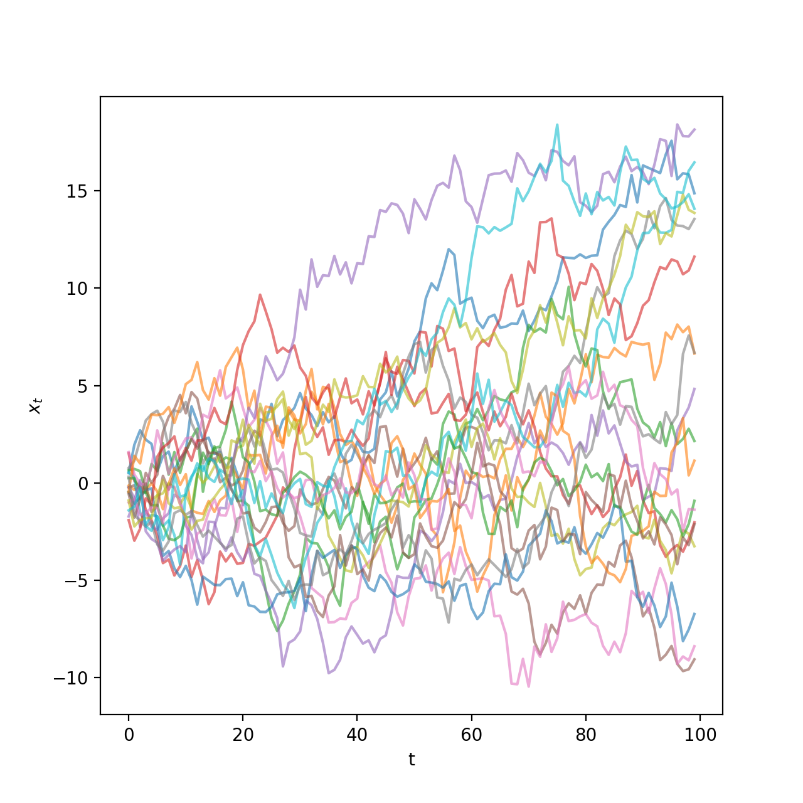
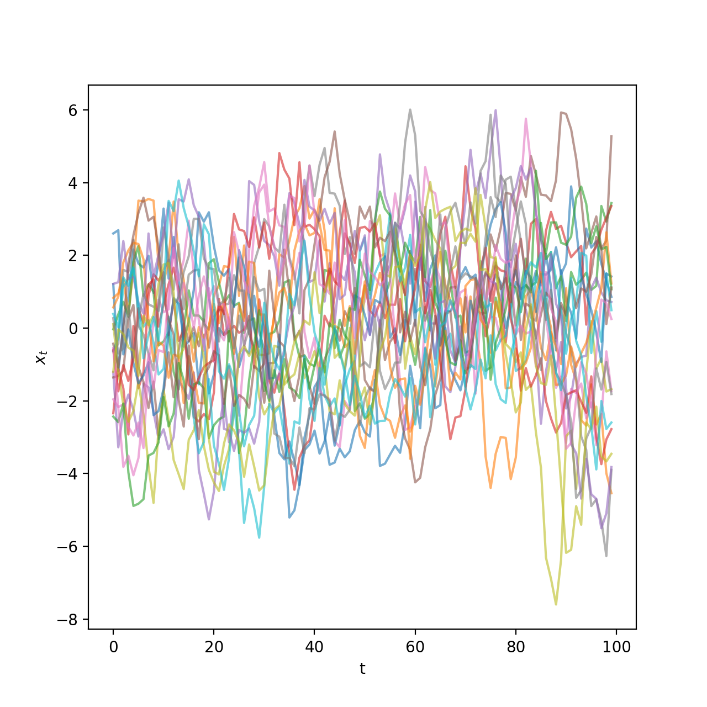
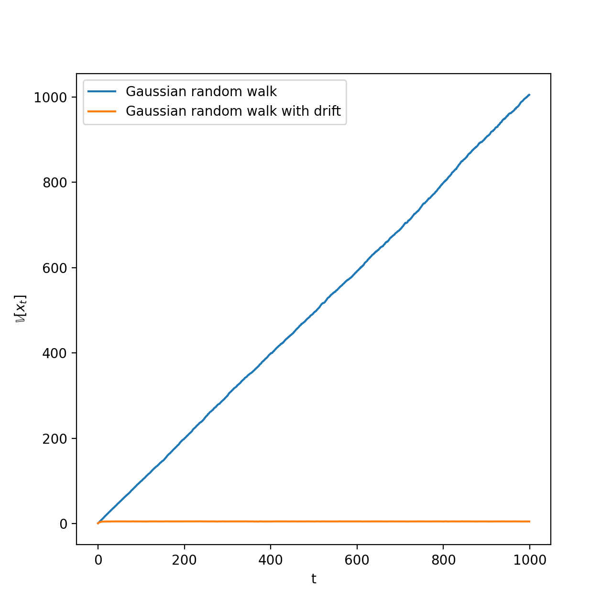
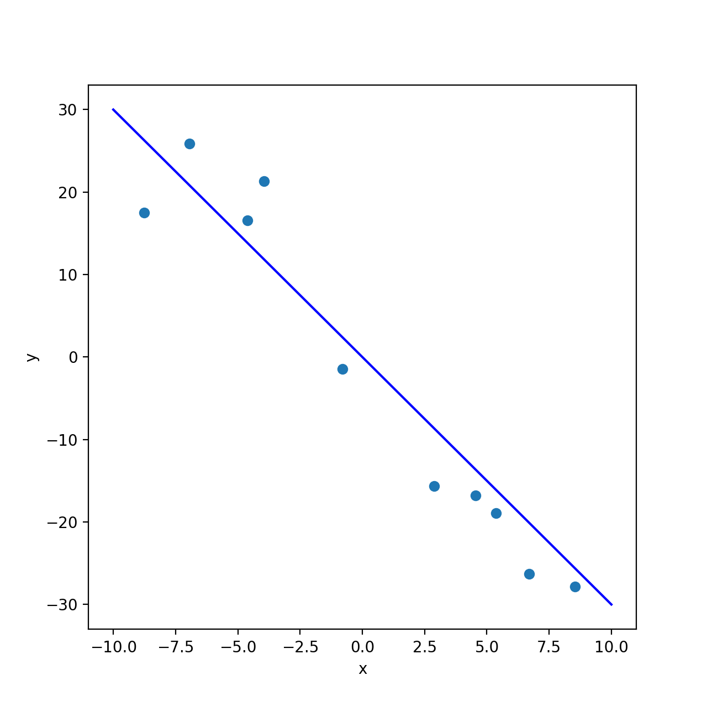
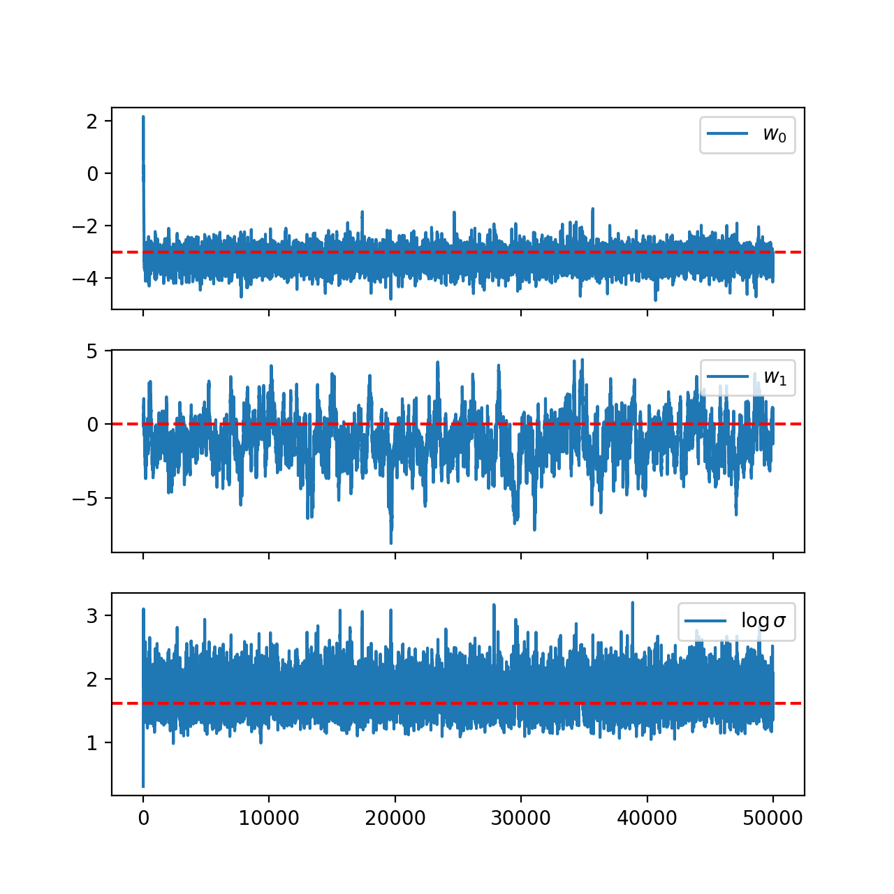
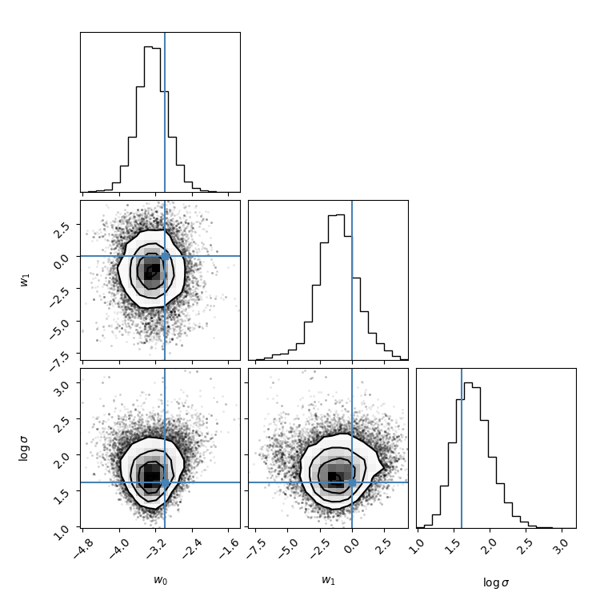
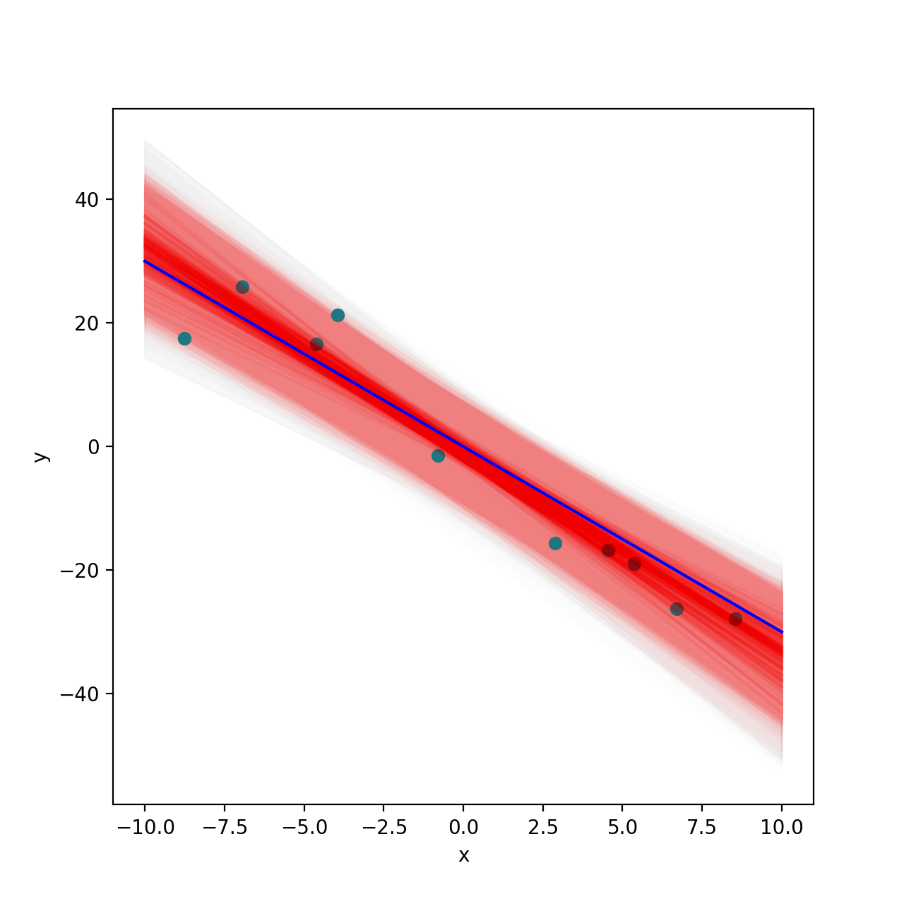
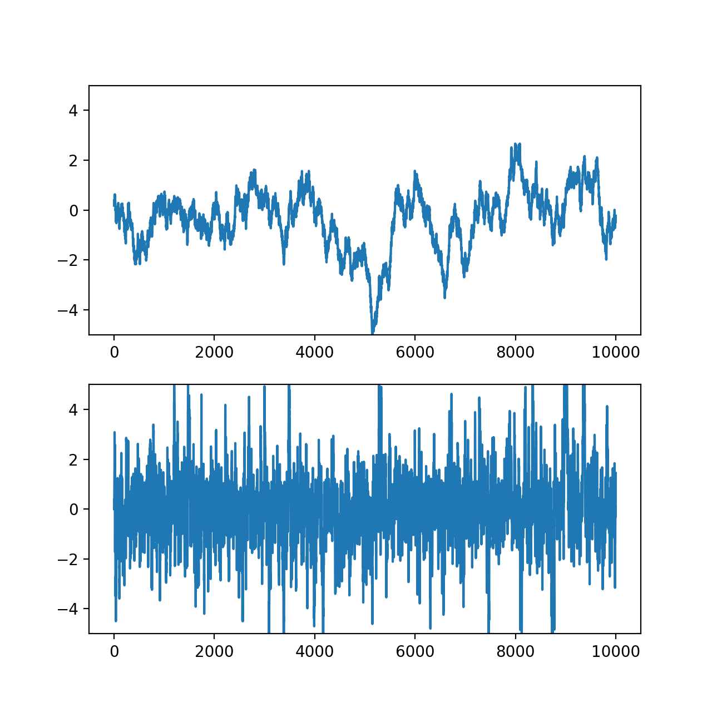
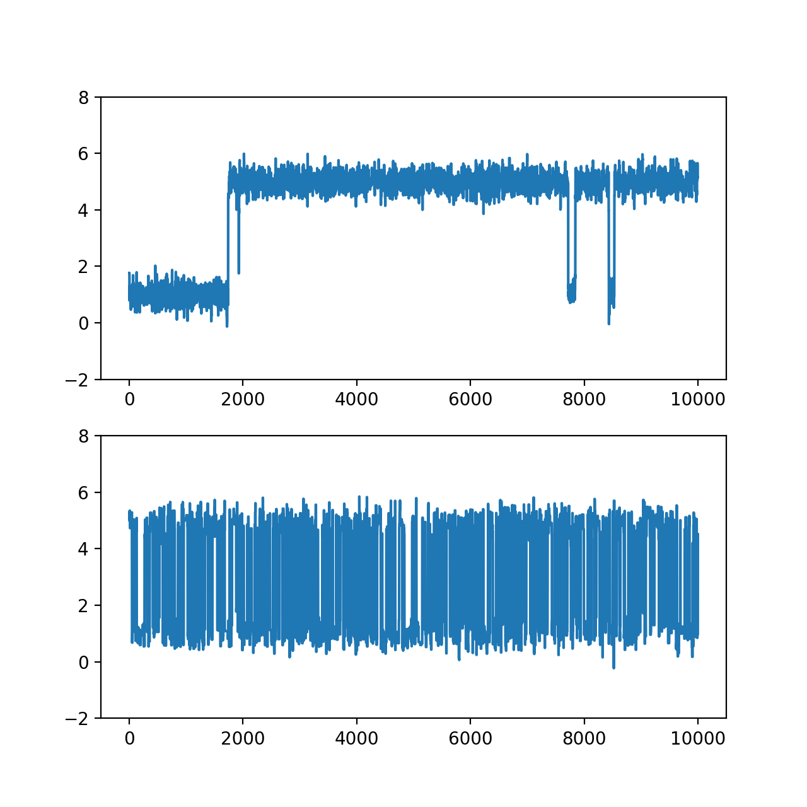
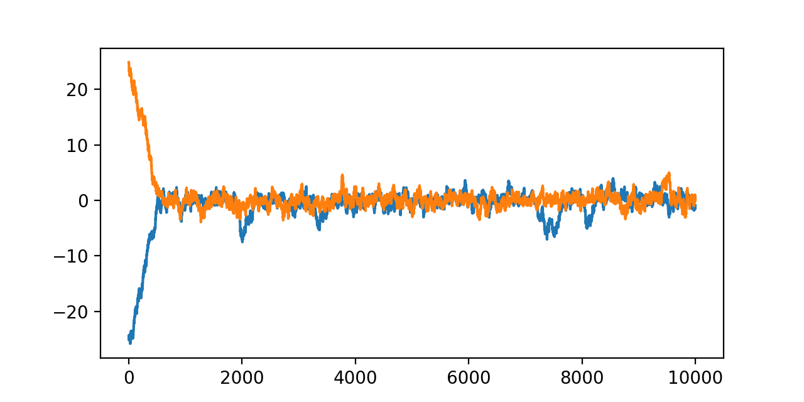

class: middle, center, title-slide

# Foundations of Data Science

Lecture 6: Markov chain Monte Carlo

  
Prof. Gilles Louppe 
[g.louppe@uliege.be](g.louppe@uliege.be)

???

XXX Modern MCMC methods? HMC, NUTS, etc.

---

class: middle

.center.width-10[]

How to sample from a distribution $p(x)$ for which we can only evaluate an unnormalized version $\tilde{p}(x)$ of its density?

Use cases:
- Generating data points $x$ from a generative model $p(x)$.
- Computing expectations $\mathbb{E}_{p(x)}[f(x)]$ or integrals $\int f(x) p(x) dx$.
- Computing posterior distributions $p(z \mid x)$ in Bayesian inference.

---

class: middle 

# Markov chain Monte Carlo

---

class: middle

.center[]

## Markov chains

A Markov chain is a sequence of random variables $X\_1, X\_2, \ldots$ that assumes the conditional independence of $X\_{t+1}$ and $X\_{1:t-1}$ given $X\_t$.

It follows that the joint distribution of $X\_1, \ldots, X\_T$ can be factorized as
$$p(x\_1, \ldots, x\_T) = p(x\_1) \prod\_{t=1}^{T-1} p(x\_{t+1} \mid x\_t),$$
where $p(x\_1)$ is the .bold[initial distribution] and $p(x\_{t+1} \mid x\_t)$ is the .bold[transition model].

---

class: middle

When the transition model does not depend on $t$, i.e., $p(x\_{t+1} \mid x\_t) = p(x' \mid x)$ for all $t$, the Markov chain is said to be .bold[time-homogeneous].

---

class: middle

## Example: Gaussian random walk

.center.width-60[]

.center[
    
Gaussian random walk with $p(x\_1) = \mathcal{N}(x\_1 | 0, 1)$ and transition model $p(x\_{t+1} \mid x\_t) = \mathcal{N}(x\_{t+1} | x\_t, \sigma^2)$.

]

---

class: middle

## Stationary distributions

A stationary distribution $\pi$ is a distribution that remains unchanged when passed through the transition model. 

Formally, $\pi(x)$ is stationary for the transition model $p(x' \mid x)$ if
$$\pi(x') = \int \pi(x) p(x' \mid x) dx.$$

Therefore, if $x\_t \sim \pi(x)$, then $x\_{t+1} \sim \pi(x)$.

---

class: middle

## Example: Gaussian random walk (continued)

.center.width-60[]

.center[

The Gaussian random walk does not have a stationary distribution since its variance increases indefinitely over time.

]

---

class: middle

## Example: Gaussian random walk with drift

.center.width-60[]

.center[

Gaussian random walk with $p(x\_1) = \mathcal{N}(x\_1 | 0, 1)$ and transition model $p(x\_{t+1} \mid x\_t) = \mathcal{N}(x\_{t+1} | x\_t - \kappa(x\_t - \mu), \sigma^2)$.

]

---

class: middle

.center.width-60[]

.center[

The Gaussian random walk with drift has a stationary distribution $\pi(x) = \mathcal{N}(x | \mu, \frac{\sigma^2}{2\kappa})$.

]

---

class: middle

## Regularity conditions

A markov chain is said to be:
- .bold[irreducible] if any state $x'$ can be reached from any state $x$, i.e., for any $x$, $x'$, there exists $t$ such that $p(x\_t = x' \mid x\_1 = x) > 0$.
- .bold[aperiodic] if there is no deterministic cycle, i.e., for all $x$, the greatest common divisor of the set $\{t : p(x\_t = x \mid x\_1 = x) > 0\}$ is 1.
- for discrete state spaces, .bold[positive recurrent] if the expected return time to any state is finite; for continuous state spaces, .bold[Harris recurrent] if the chain returns to any set $A$ with positive measure infinitely often with probability 1.

???

- Irreducibility ensures that the chain can explore the entire state space and does not get stuck in a subset of states.
- Aperiodicity ensures that the chain does not get trapped in cycles, which would prevent convergence to a stationary distribution.
- Recurrence is the most technical condition. Intuitively, it prevents the chain from "drifting away" to infinity. Without it, you could have an "improper" stationary distribution that doesn't integrate to 1.

---

class: middle

## Basic limit theorem for Markov chains

.italic[Theorem]. If a time-homogeneous Markov chain is irreducible, aperiodic, and (positive/Harris) recurrent, then it satisfies the following properties:

- (Existence and uniqueness) There exists a .bold[unique] stationary distribution $\pi$;
- (Convergence) For any initial distribution of $p(x\_1)$, $p(x\_t) \to \pi(x)$ as $t \to \infty$;
- (Ergodic theorem) For any function $f$ with $\mathbb{E}\_{\pi}[|f(x)|] < \infty$, $$\lim\_{T \to \infty} \frac{1}{T} \sum\_{t=1}^T f(x\_t) = \mathbb{E}\_{\pi}[f(x)]$$ almost surely.

.italic[Proof]. (Omitted and beyond scope.)

???

The three conditions each play a role:
- Irreducibility → uniqueness
- Aperiodicity → convergence (not oscillation)
- Recurrence → proper distribution (integrates to 1)

---

class: middle

.success[This result implies that if a Markov chain satisfies the regularity conditions, then it has a unique stationary distribution and converges to it regardless of the initial distribution.]

.alert[However, the theorem does not provide a method to construct a Markov chain with a desired stationary distribution, nor does it specify the rate of convergence to the stationary distribution.]

---

class: middle 

.center.width-10[]

## Detailed balance

A transition model $p(x' \mid x)$ satisfies detailed balance with respect to a distribution $\pi$ if
$$\pi(x) p(x' \mid x) = \pi(x') p(x \mid x')$$
for all $x$, $x'$.

???

Intuitively, detailed balance means that the flow of probability from $x$ to $x'$ is equal to the flow from $x'$ to $x$ when the system is in equilibrium (i.e., when the distribution of states is given by $\pi$).

---

class: middle

.italic[Proposition]. If a transition model $p(x' \mid x)$ satisfies detailed balance with respect to a distribution $\pi$, then $\pi$ is a stationary distribution of $p(x' \mid x)$.

.italic[Proof]. Integrating both sides of the detailed balance equation over $x$, we get
$$\begin{aligned}
\int \pi(x) p(x' \mid x) dx &= \int \pi(x') p(x \mid x') dx \\\\
&= \pi(x') \int p(x \mid x') dx \\\\
&= \pi(x').
\end{aligned}$$

---

class: middle

The detailed balance condition is a .bold[sufficient] but not necessary condition for stationarity.

However, it is often easier to verify than the stationarity condition, especially when constructing Markov chains with a desired stationary distribution.

---

class: middle

## Metropolis-Hastings

The Metropolis-Hastings algorithm is a procedure for sampling from a target distribution $\pi(x)$, given only an unnormalized version $\tilde{\pi}(x)$ of its density.

The core idea is to construct a Markov chain whose stationary distribution matches the target distribution $\pi(x)$.

---

class: middle

The Metropolis-Hastings algorithm proceeds as follows:

1. Given the current state $x\_t$, propose a new state $x' \sim q(x' \mid x\_t)$ using a proposal distribution $q(x' \mid x\_t)$.
2. Compute the acceptance ratio
$$\alpha(x' \mid x\_t) = \min\\left(\frac{\tilde{\pi}(x') q(x\_t \mid x')}{\tilde{\pi}(x\_t) q(x' \mid x\_t)}, 1\right).$$
3. Accept the proposed state $x'$ with probability $\alpha(x' \mid x\_t)$. If accepted, set $x\_{t+1} = x'$. Otherwise, set $x\_{t+1} = x\_t$.
4. Repeat steps 1-3 for a large number of iterations.

This process generates a sequence of samples $x\_1, x\_2, \ldots$ that form a Markov chain.

---

class: middle

.italic[Proposition]. The Metropolis-Hastings algorithm constructs a Markov chain whose stationary distribution is $\pi(x)$.

.italic[Proof]. The transition model of the Markov chain is given by
$$p(x' \mid x) = \begin{cases}
q(x' \mid x) \alpha(x' \mid x) & \text{if } x' \neq x, \\\\
r(x) & \text{if } x' = x,
\end{cases}$$
where $r(x) = 1 - \int q(x' \mid x) \alpha(x' \mid x) dx'$ is the probability of rejecting the proposal and staying at the current state.

---

class: middle

To show that $\pi(x)$ is stationary, we verify the detailed balance condition for $x' \neq x$:
$$\begin{aligned}
\tilde{\pi}(x) p(x' \mid x) &= \tilde{\pi}(x) q(x' \mid x) \alpha(x' \mid x) \\\\
&= \tilde{\pi}(x) q(x' \mid x) \min\\left(\frac{\tilde{\pi}(x') q(x \mid x')}{\tilde{\pi}(x) q(x' \mid x)}, 1\right) \\\\
&= \min( \tilde{\pi}(x) q(x' \mid x), \tilde{\pi}(x') q(x \mid x') ) \\\\
&= \tilde{\pi}(x') q(x \mid x') \min\\left(\frac{\tilde{\pi}(x) q(x' \mid x)}{\tilde{\pi}(x') q(x \mid x')}, 1\right) \\\\
&= \tilde{\pi}(x') p(x \mid x').
\end{aligned}$$
Since $\pi(x) = \frac{\tilde{\pi}(x)}{Z}$ for some normalization constant $Z$, the detailed balance condition also holds for $\pi(x)$. Hence, $\pi(x)$ is a stationary distribution of the Markov chain.

For $x' = x$, detailed balance holds trivially.

---

class: middle

.italic[Proposition]. The Markov chain constructed by the Metropolis-Hastings algorithm satisfies the regularity conditions under appropriate conditions on $q$.

.italic[Sketch of proof]:
- Aperiodicity: The chain can stay at the same state when proposals are rejected, so $p(x|x) > 0$. This breaks any periodic cycles.

- Irreducibility: If the proposal $q$ has appropriate support, then for any $x, x'$ where $\pi(x), \pi(x') > 0$, there exists a sequence of proposals with positive probability connecting them.

- Recurrence: If $\pi$ is a proper probability distribution, the chain is positive/Harris recurrent. (Proof beyond scope)

These conditions ensure convergence to $\pi(x)$ by the basic limit theorem.

???

For irreducibility: We don't need q(x'|x) > 0 for ALL pairs. We just need the proposal to be able to reach all regions where π > 0, possibly through multiple steps.

---

class: middle

## Proposal distributions

The efficiency of the Metropolis-Hastings algorithm heavily depends on the choice of the proposal distribution $q(x' \mid x)$.

Common choices include:
- .bold[Random walk]: $q(x' \mid x) = \mathcal{N}(x' | x, \sigma^2 I)$ for continuous state spaces. 
  Simple and general, but efficiency depends on tuning $\sigma$ 
  (optimal acceptance rate: ~20-40%).
  
- .bold[Langevin]: $q(x' \mid x) = \mathcal{N}(x' | x + \frac{\epsilon^2}{2} \nabla \log \tilde{\pi}(x), \epsilon^2 I)$, 
  which uses gradient information to guide proposals toward high-probability regions. 
  Requires differentiable $\tilde{\pi}(x)$.

- .bold[Independence]: $q(x' \mid x) = q(x')$, independent of current state.
  Can be efficient if $q(x')$ closely approximates $\pi(x)$.

???

Random walk: Most common in practice. The σ parameter controls exploration speed.
Langevin: Drift term pushes toward high probability - like "gradient ascent + noise"
Independence: Useful when you have a good initial guess (e.g., Laplace approximation)

---

class: middle

## Beyond Metropolis-Hastings

While Metropolis-Hastings is foundational, several extensions improve efficiency:

- .bold[Hamiltonian Monte Carlo (HMC)]: Uses Hamiltonian dynamics to propose 
  new states, enabling larger, informed jumps through parameter space. 
  Requires gradient $\nabla \log \pi(x)$.

- .bold[No-U-Turn Sampler (NUTS)]: An adaptive variant of HMC that automatically 
  tunes trajectory length, eliminating manual parameter tuning.
  Default sampler in Stan and PyMC.

- .bold[Gibbs sampling]: Updates variables one at a time from conditional 
  distributions. A special case of MH with acceptance probability = 1 
  when conditionals are tractable.

.center[.italic[These advanced methods are widely used in practice and build on MH principles!]]

---

class: middle, center

Run the first part of `nb06b-mcmc.ipynb` to see Metropolis-Hastings in action.

---

class: middle

# Bayesian inference with MCMC

---

class: middle

## Bayesian inference with MCMC

In Bayesian inference, we are often interested in computing the posterior distribution $$p(z, \theta \mid x) = \frac{p(x \mid z, \theta) p(z, \theta)}{p(x)}$$ of latent variables $z$ and parameters $\theta$ given observed data $x$.

.alert[The posterior density is often .bold[intractable] due to the marginal density $p(x) = \int p(x \mid z, \theta) p(z, \theta) dz d\theta$.]

---

class: middle

.center.width-10[]

MCMC methods, such as Metropolis-Hastings, can be used to generate samples from the posterior distribution $p(z, \theta \mid x)$ even when the marginal density $p(x)$ is intractable.

Since MCMC methods only require an unnormalized density $\tilde{p}$, .bold[we can use the joint tractable density $p(x, z, \theta) = p(x \mid z, \theta) p(z, \theta)$] as the target distribution.

---

class: middle

## Example: Bayesian linear regression

Consider a data set of $N$ observations $x = \\{(x\_i, y\_i)\\}\_{i=1}^N$, where $x\_i \in \mathbb{R}^d$ are input features and $y\_i \in \mathbb{R}$ are target values.
.center.width-60[]

---

class: middle

.center[]

We model the conditional distribution of $y$ given $x$ using a Bayesian linear regression model $$p(y \mid x, w, \log \sigma) p(w) p(\log \sigma),$$ where $p(y \mid x, w, \log \sigma) = \mathcal{N}(y \mid w^T x, \sigma^2)$ is the likelihood, $p(w) = \mathcal{N}(w \mid 0, \tau\_1^2 I)$ is the prior over weights $w$, $p(\log \sigma) = \mathcal{N}(\log \sigma \mid 0, \tau\_2^2)$ is the prior over the log-noise standard deviation, and $\tau\_1, \tau\_2$ are hyperparameters.

---

class: middle

The target distribution is the posterior $p(w, \log \sigma \mid \\{x\_i, y\_i\\}\_{i=1}^N)$, which is proportional to the joint density 
$$\begin{aligned}
& p(\\{y\_i\\}\_{i=1}^N \mid \\{x\_i\\}\_{i=1}^N, w, \log \sigma) p(w) p(\log \sigma) \\\\
&= \left( \prod\_{i=1}^N p(y\_i \mid x\_i, w, \log \sigma) \right) p(w) p(\log \sigma).
\end{aligned}$$

We can use Metropolis-Hastings to sample from this posterior distribution using the joint density as the unnormalized target density.

---

class: middle

.center.width-70[]
.center[Markov chain traces for $w\_0$, $w\_1$, and $\log \sigma$ using Metropolis-Hastings.]

---

class: middle

.center.width-70[]
.center[Posterior samples visualized using a corner plot.]

---

class: middle

.center.width-70[]
.center[Posterior predictive distribution.]

---

class: middle

.center.width-10[]

## Diagnostics for MCMC

MCMC algorithms produce only approximate samples from the target distribution. It is important to assess the quality of these samples using diagnostics in terms of .bold[convergence], .bold[mixing] and .bold[autocorrelation].

---

class: middle

.bold[Trace plots] of the Markov chains can reveal mixing, autocorrelation, and convergence issues:

- High autocorrelation is indicated by chains that exhibit strong correlations between successive samples.
- Poor mixing is indicated by chains that explore the state space slowly or get stuck in certain regions.
- When running multiple chains, lack of convergence is indicated by chains that do not overlap or converge to the same distribution.

---

class: middle

.center.width-70[]
.center[High vs. low autocorrelation. For highly autocorrelated chains,   mixing is poor and effective sample size is low.]

---

class: middle

.center.width-70[]
.center[Poor vs. good mixing for a multimodal target. Poor mixing can be due to small proposal steps or energy barriers between modes.]

---

class: middle

.center.width-70[]
.center[Two chains run on the same target but initialized differently.   Traces show convergence to a same distribution.]

---

class: middle

## Acceptance rate

The first quantitative diagnostic to monitor is the .bold[acceptance rate], defined as the fraction of proposed samples that are accepted.

- A very low acceptance rate (e.g., < 10%) indicates that the proposal distribution is making too large jumps, leading to many rejections.
- A very high acceptance rate (e.g., > 80%) suggests that the proposal distribution is making too small jumps, resulting in slow exploration of the state space.
- An optimal acceptance rate often lies between 20% and 40%, depending on the dimensionality of the target distribution.

---

class: middle

## Effective Sample Size

Quantitatively, the .bold[effective sample size] 
$$\text{ESS} = \frac{T}{1 + 2\sum\_{k=1}^{\infty} \rho\_k}$$ 
accounts for autocorrelation in MCMC samples, where $T$ is the number of samples in the chain and 
$$\rho\_k = \frac{\text{Cov}(X\_t, X\_{t+k})}{\text{Var}(X\_t)}$$ 
is the .bold[autocorrelation at lag $k$] computed over the samples.

A higher ESS indicates more independent samples and better mixing.

---

class: middle

## Integrated Autocorrelation Time

The .bold[integrated autocorrelation time] 
$$\tau\_{\text{int}} = 1 + 2\sum\_{k=1}^{\infty} \rho\_k$$ 
quantifies the number of correlated samples equivalent to one independent sample.

A smaller $\tau\_{\text{int}}$ indicates better mixing and more efficient sampling.

.success[Note that $\text{ESS} = \frac{T}{\tau\_{\text{int}}}$.]

---

class: middle

## Gelman-Rubin Statistic

The .bold[Gelman-Rubin statistic] $\hat{R}$ serves as a convergence diagnostic when running $M$ chains in parallel, each with $T$ samples (after burn-in). 
Let 
$$W = \frac{1}{M} \sum\_{m=1}^M s\_m^2$$ 
be the within-chain variance, where $s\_m^2$ is the sample variance of chain $m$, and 
$$B = \frac{T}{M-1} \sum_{m=1}^M (\bar{x}\_m - \bar{x})^2$$ 
be the between-chain variance, where $\bar{x}\_m$ is the sample mean of chain $m$ and $\bar{x}$ is the overall mean across chains. 
Then, 
$$\hat{R} = \sqrt{\frac{\frac{T-1}{T} W + \frac{1}{T} B}{W}}.$$

---

class: middle

Typically,
- values of $\hat{R}$ approximately 1 indicate convergence across chains;
- values greater than 1.1 suggest lack of convergence.

---

class: end-slide, center
count: false

The end.
