class: middle, center, title-slide

# Foundations of Data Science

Lecture 7: Expectation-Maximization

  
Prof. Gilles Louppe 
[g.louppe@uliege.be](g.louppe@uliege.be)

---

class: middle

.center.width-10[]

The Old Faithful geyser in Yellowstone National Park (USA) is famous for its frequent and predictable eruptions of hot water and steam.

---

class: middle, black-slide

.center[
<iframe width="640" height="400" src="https://www.youtube.com/embed/Qxf3xzirBrs?cc_load_policy=1&hl=en&version=3" frameborder="0" allowfullscreen></iframe>
]

---

class: middle

.center.width-70[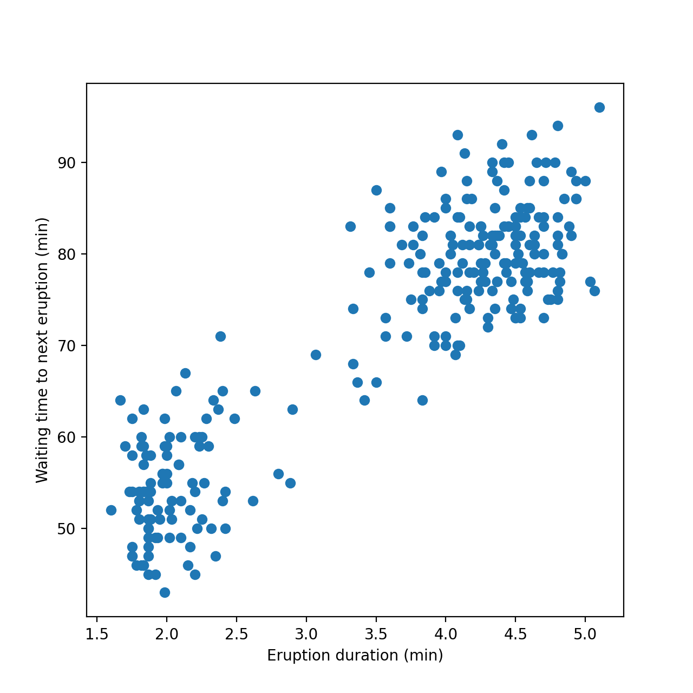]

---

class: middle

## 2-component GMM

The observed data $\\{ x\_n \in \mathbb{R}^2 \\}\_{n=1}^N$ can be modeled as being generated from a mixture of two Gaussian distributions, with latents $z\_n \in \\{1, 2\\}$ labeling observation membership and hyper-parameters $\pi, \mu = (\\mu\_1, \\mu\_2), \sigma^2 = (\\sigma\_1^2, \\sigma\_2^2)$ defining the mixture proportions, means and variances of the Gaussian components.

.center[]

---

class: middle

## How to fit the model parameters?

The marginal log-likelihood of the observed data is
$$\\begin{aligned}
\log p(\\{x\_n\\}\_{n=1}^N | \pi, \mu, \sigma^2) &= \log \prod\_{n=1}^N p(x\_n | \pi, \mu, \sigma^2) \\\\
&= \log \prod\_{n=1}^N \sum\_{z\_n=1}^2 p(x\_n, z\_n | \pi, \mu, \sigma^2) \\\\
&= \sum\_{n=1}^N \log \sum\_{z\_n=1}^2 p(x\_n | z\_n, \mu, \sigma^2) p(z\_n | \pi),
\end{aligned}$$
where
- $p(x\_n | z\_n = k, \mu, \sigma^2) = \mathcal{N}(x\_n | \mu\_k, \sigma\_k^2 I)$
- $p(z\_n = k | \pi) = \pi\_k$ for $k = 1, 2$.

---

class: middle

.center.width-10[]

Direct maximization of the marginal log-likelihood w.r.t. parameters $\\theta = (\\pi, \\mu, \\sigma^2)$ is difficult.
- The objective is non-convex.
- No closed-form solution.
- Numerically unstable.

.alert[More generally, latent variable models lead to log-likelihoods involving sums or integrals inside the logarithm. As their domain grows, these sums/integrals .bold[become intractable to even just evaluate], let alone optimize.]

---

class: middle

## If we knew the latent variables...

If the latent $\\{ z\_n \\}\_{n=1}^N$ were known, the complete-data log-likelihood would be
$$\\begin{aligned}
\log p(\\{x\_n, z\_n\\}\_{n=1}^N | \pi, \mu, \sigma^2) &= \log \prod\_{n=1}^N p(x\_n, z\_n | \pi, \mu, \sigma^2) \\\\
&= \log \prod\_{n=1}^N p(x\_n | \mu\_{z\_n}, \sigma^2\_{z\_n}) p(z\_n | \pi) \\\\
&= \sum\_{n=1}^N \log p(x\_n | \mu\_{z\_n}, \sigma^2\_{z\_n}) + \sum\_{n=1}^N \log p(z\_n | \pi).
\end{aligned}$$

The evaluation of the log-likelihood becomes tractable, and so does its optimization.

---

class: middle

For the Gaussian mixture model, differentiating the complete-data log-likelihood with respect to the parameters and setting to zero would even yield closed-form expressions for the maximum likelihood estimates:

- $\mu\_k = \frac{1}{N\_k} \sum\_{\\{n: z\_n = k\\}} x\_n$
- $\sigma\_k^2 = \frac{1}{N\_k} \sum\_{\\{n: z\_n = k\\}} |x\_n - \mu\_k|^2$
- $\pi\_k = \frac{N\_k}{N}$

where $N\_k = \sum\_{n=1}^N \mathbb{1}(z\_n = k)$.

---

class: middle

.center.width-10[]

.center[What if we alternate between guessing the latent variables  and optimizing the hyperparameters?]

---

class: middle

# Expectation-Maximization

---

class: middle

.center[]

Assume a generic latent variable model $p(x, z | \theta)$ where $\theta$ are parameters mediating the joint distribution.

---

class: middle

## Evidence lower bound 

The marginal log-likelihood for a single observation $x$ can be rewritten as
$$\\begin{aligned}
\log p(x | \theta) &= \log \int p(x, z | \theta) \, dz \\\\
&= \log \int q(z) \frac{p(x, z | \theta)}{q(z)} \, dz \\\\
&= \log \mathbb{E}\_{q(z)} \left[\frac{p(x, z | \theta)}{q(z)}\right],
\end{aligned}$$
where $q(z)$ is any valid probability distribution over the latent variable $z$.

---

class: middle

By Jensen's inequality, the log-likelihood can be lower-bounded as
$$\\begin{aligned}
\log p(x | \theta) &\geq \mathbb{E}\_{q(z)} \left[\log \frac{p(x, z | \theta)}{q(z)}\right] = \mathcal{L}(q, \theta),
\end{aligned}$$
where $\mathcal{L}(q, \theta)$ is known as the .bold[evidence lower bound objective] (ELBO).

---

class: middle

The ELBO can first be rewritten as
$$\\begin{aligned}
\mathcal{L}(q, \theta) &= \mathbb{E}\_{q(z)} \left[\log \frac{p(x, z | \theta)}{q(z)}\right] \\\\
&= \mathbb{E}\_{q(z)} \left[\log \frac{p(x | z, \theta) p(z | \theta)}{q(z)}\right] \\\\
&= \mathbb{E}\_{q(z)} \left[\log p(x | z, \theta)\right] - \text{KL}(q(z) || p(z | \theta)),
\end{aligned}$$
where $\text{KL}(q(z) || p(z | \theta)) = \mathbb{E}\_{q(z)} \left[\log \frac{q(z)}{p(z | \theta)}\right]$ is the Kullback-Leibler divergence between distributions $q(z)$ and $p(z | \theta)$.

This expression highlights the trade-off between fitting the data well (first term) and keeping the variational distribution $q(z)$ close to the prior $p(z | \theta)$ (second term).

---

class: middle

By factorizing the joint in the other way, the ELBO can also be rewritten as
$$\\begin{aligned}
\mathcal{L}(q, \theta) &= \mathbb{E}\_{q(z)} \left[\log \frac{p(x, z | \theta)}{q(z)}\right] \\\\
&= \mathbb{E}\_{q(z)} \left[\log \frac{p(z | x, \theta) p(x | \theta)}{q(z)}\right] \\\\
&= \log p(x | \theta) - \text{KL}(q(z) || p(z | x, \theta)).
\end{aligned}$$
Therefore,
$$\log p(x | \theta) = \mathcal{L}(q, \theta) + \text{KL}(q(z) || p(z | x, \theta)).$$

This decomposition reveals that the ELBO is a lower bound on the log-likelihood, with a gap measured by the KL divergence between the variational distribution $q(z)$ and the posterior distribution $p(z | x, \theta)$.

---

class: middle

.center.width-70[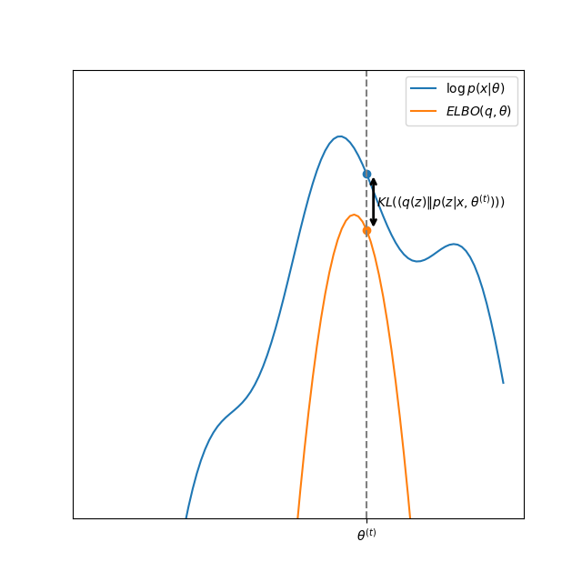]
The KL gap $\text{KL}(q(z) || p(z | x, \theta))$ between the log-likelihood $\log p(x | \theta)$ and the ELBO $\mathcal{L}(q, \theta)$ measures the tightness of the bound. (Sketch.)

---

class: middle

.center.width-70[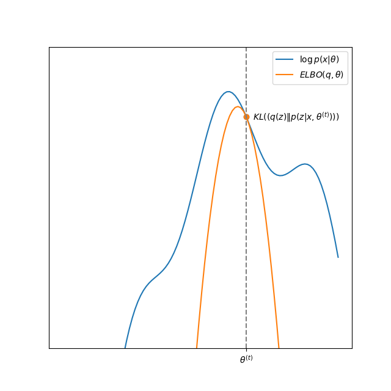]
The ELBO is tight when $q(z) = p(z | x, \theta)$. Maximizing the ELBO is then equivalent to maximizing the log-likelihood $\log p(x | \theta)$.

---

class: middle

## Expectation-Maximization algorithm

The EM algorithm maintains parameter estimates $\theta^{(t)}$ at iteration $t$ and a variational distribution $q^{(t)}(z)$ over the latent variables. It iteratively maximizes the ELBO by alternating between two steps:
- E-step: maximize the ELBO $\mathcal{L}(q, \theta^{(t)})$ w.r.t. $q$ while keeping $\theta^{(t)}$ fixed.
- M-step: maximize the ELBO $\mathcal{L}(q^{(t+1)}, \theta)$ w.r.t. $\theta$ while keeping $q^{(t+1)}(z)$ fixed.

---

class: middle

The E-step consists in solving
$$q^{(t+1)} = \arg\max\_q \mathcal{L}(q, \theta^{(t)})$$
which is achieved by setting $q$ to the posterior distribution
$$q^{(t+1)}(z) = p(z | x, \theta^{(t)})$$.

.italic[Proof.] From the decomposition of the log-likelihood, we have
$$\mathcal{L}(q, \theta^{(t)}) = \log p(x | \theta^{(t)}) - \text{KL}(q(z) || p(z | x, \theta^{(t)})).$$
Since the log-likelihood term $\log p(x | \theta^{(t)})$ does not depend on $q$, maximizing the ELBO w.r.t. $q$ is equivalent to minimizing the KL divergence $\text{KL}(q(z) || p(z | x, \theta^{(t)}))$. The KL divergence is minimized when $q(z) = p(z | x, \theta^{(t)})$. □

---

class: middle

The M-step consists in solving
$$\theta^{(t+1)} = \arg\max\_\theta \mathcal{L}(q^{(t+1)}, \theta)$$
which can be rewritten as
$$
\begin{aligned}
\theta^{(t+1)} &= \arg\max\_\theta \mathbb{E}\_{q^{(t+1)}(z)} \left[\log \frac{p(x, z | \theta)}{q^{(t+1)}(z)}\right] \\\\
&= \arg\max\_\theta \mathbb{E}\_{q^{(t+1)}(z)} \left[\log p(x, z | \theta)\right] - \mathbb{E}\_{q^{(t+1)}(z)} \left[\log q^{(t+1)}(z)\right] \\\\
&= \arg\max\_\theta \mathbb{E}\_{q^{(t+1)}(z)} \left[\log p(x, z | \theta)\right]
\end{aligned}
$$
since the entropy term $H(q^{(t+1)}(z)) = \mathbb{E}\_{q^{(t+1)}(z)} \left[- \log q^{(t+1)}(z)\right]$ does not depend on $\theta$.

Depending on the model, this maximization can sometimes be done in closed-form. Otherwise, numerical optimization algorithms can be used.

---

class: middle

Finally, to initialize the algorithm, we need to set initial parameters $\theta^{(0)}$, which can be done randomly or based on prior knowledge.

---

class: middle

.center.width-70[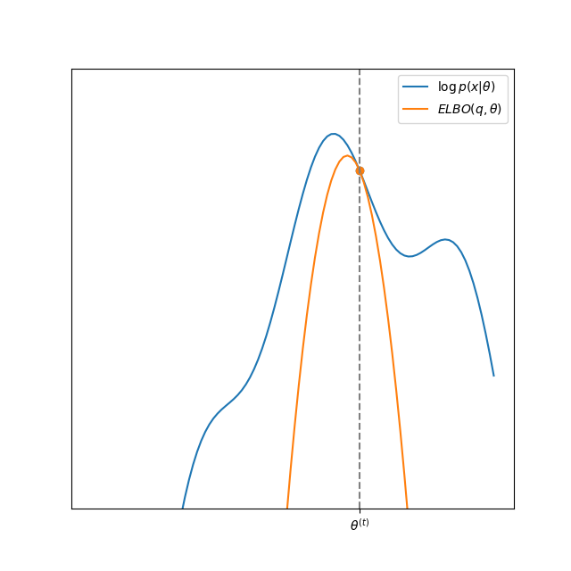]

---

class: middle
count: false

.center.width-70[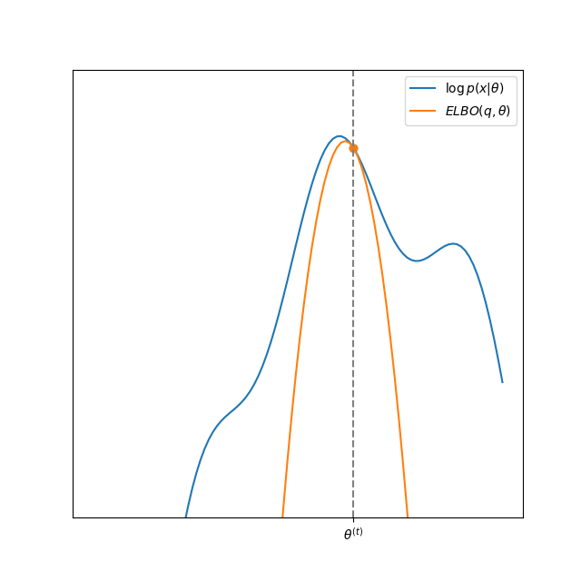]

---

class: middle
count: false

.center.width-70[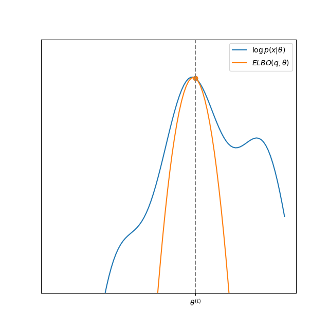]

---

class: middle

.italic[Proposition.] The EM algorithm monotonically increases the marginal log-likelihood at each iteration, i.e.,
$$\log p(x | \theta^{(t)}) \leq \log p(x | \theta^{(t+1)})$$
for all $t \geq 0$.

.italic[Proof.] Assume we have parameter estimates $\theta^{(t)}$ at iteration $t$.
$$\begin{aligned}
\log p(x | \theta^{(t)}) &= \mathcal{L}(q^{(t+1)}, \theta^{(t)}) + \text{KL}(q^{(t+1)}(z) || p(z | x, \theta^{(t)})) \\\\
&= \mathcal{L}(q^{(t+1)}, \theta^{(t)}) \\\\
&\leq \mathcal{L}(q^{(t+1)}, \theta^{(t+1)}) \\\\
&\leq \log p(x | \theta^{(t+1)}),
\end{aligned}$$
where the second equality holds since the E-step sets $q^{(t+1)} = p(z|x,\theta^{(t)})$, making the KL gap zero; the first inequality follows from the M-step optimization; and the last inequality holds because the ELBO is always a lower bound on the log-likelihood. □

---

class: middle

## EM for the Old Faithful Geyser model

For the Gaussian mixture model introduced earlier, the E-step consists in computing the posterior distribution over the latent variables:
$$\begin{aligned}
q^{(t+1)}(z\_n = k) &= p(z\_n = k | x\_n, \pi^{(t)}, \mu^{(t)}, \sigma^{2(t)}) \\\\
&= \frac{p(x\_n | z\_n = k, \mu^{(t)}, \sigma^{2(t)}) p(z\_n = k | \pi^{(t)})}{\sum\_{j=1}^2 p(x\_n | z\_n = j, \mu^{(t)}, \sigma^{2(t)}) p(z\_n = j | \pi^{(t)})} \\\\
&= \frac{\pi\_k^{(t)} \mathcal{N}(x\_n | \mu\_k^{(t)}, \sigma\_k^{2(t)} I)}{\sum\_{j=1}^2 \pi\_j^{(t)} \mathcal{N}(x\_n | \mu\_j^{(t)}, \sigma\_j^{2(t)} I)}
\end{aligned}$$
for $k = 1, 2$ and $n = 1, \ldots, N$.

---

class: middle

The M-step consists in updating the parameters as
$$\begin{aligned}
\mu\_k^{(t+1)} &= \frac{\sum\_{n=1}^N q^{(t+1)}(z\_n = k) x\_n}{\sum\_{n=1}^N q^{(t+1)}(z\_n = k)} \\\\
\sigma\_k^{2(t+1)} &= \frac{\sum\_{n=1}^N q^{(t+1)}(z\_n = k) |x\_n - \mu\_k^{(t+1)}|^2}{\sum\_{n=1}^N q^{(t+1)}(z\_n = k)} \\\\
\pi\_k^{(t+1)} &= \frac{1}{N} \sum\_{n=1}^N q^{(t+1)}(z\_n = k)
\end{aligned}$$
for $k = 1, 2$, which follows differentiating the expected complete-data log-likelihood and setting to zero.

---

class: middle

.center.width-70[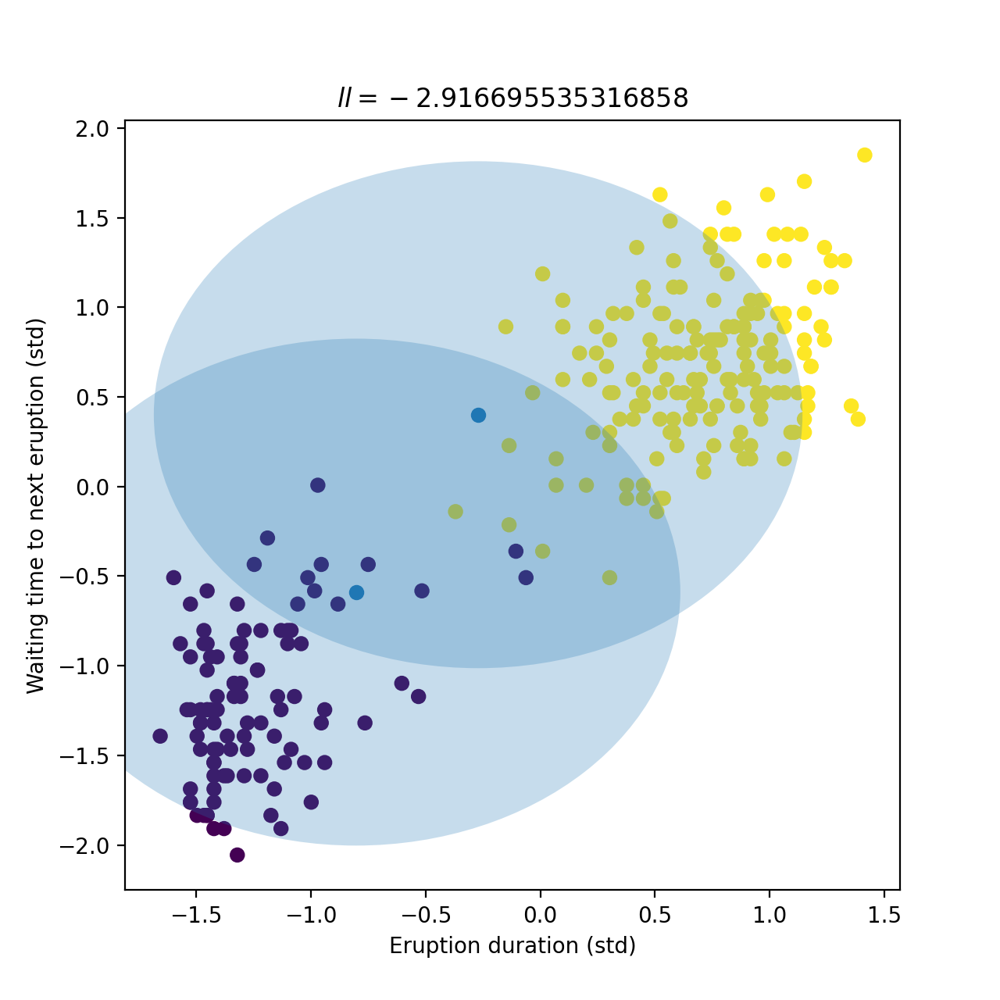]

---

class: middle
count: false

.center.width-70[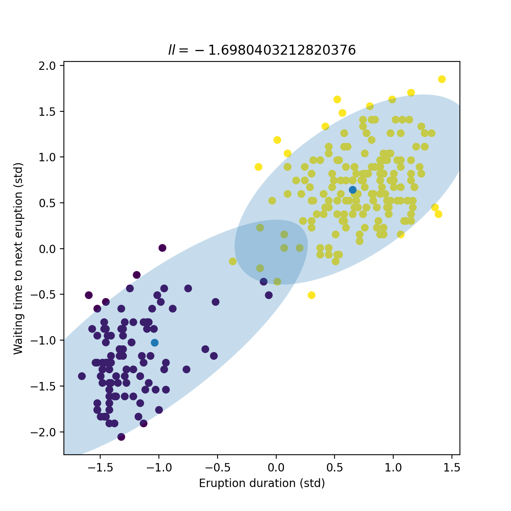]

---

class: middle
count: false

.center.width-70[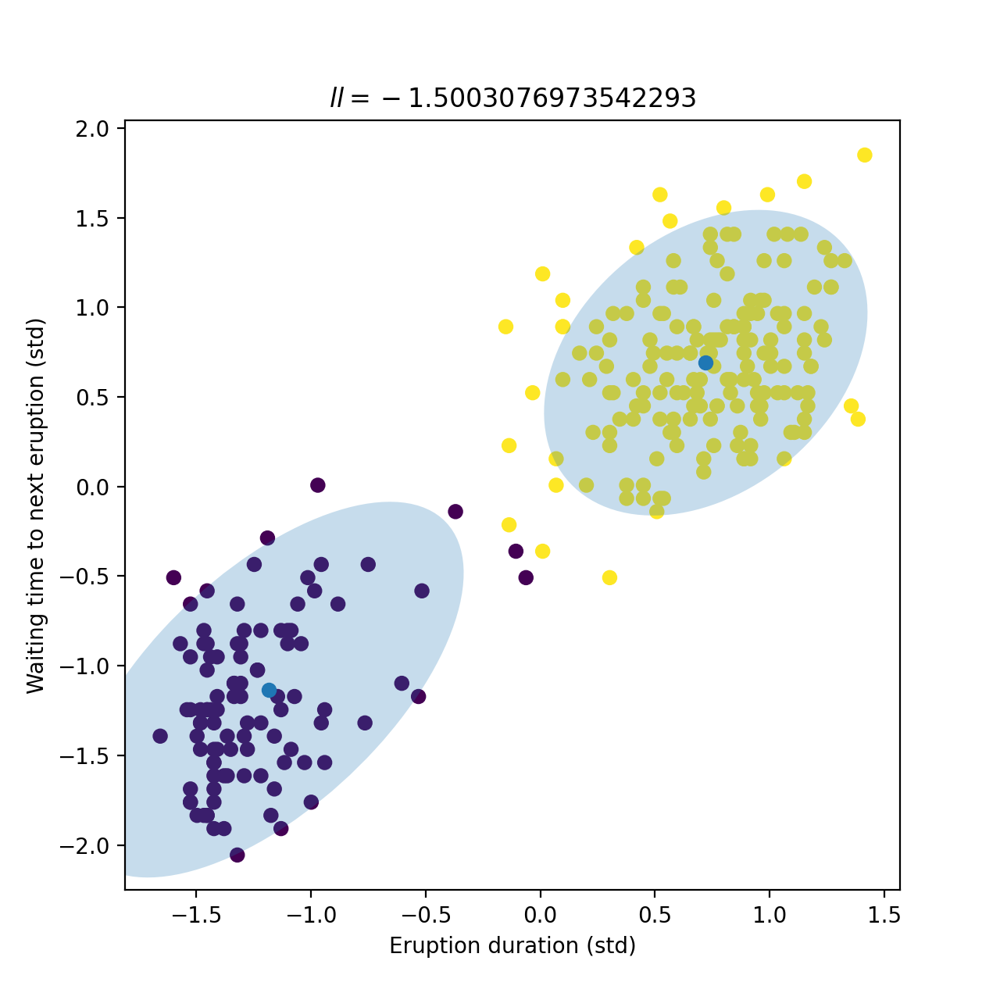]

---

class: middle
count: false

.center.width-70[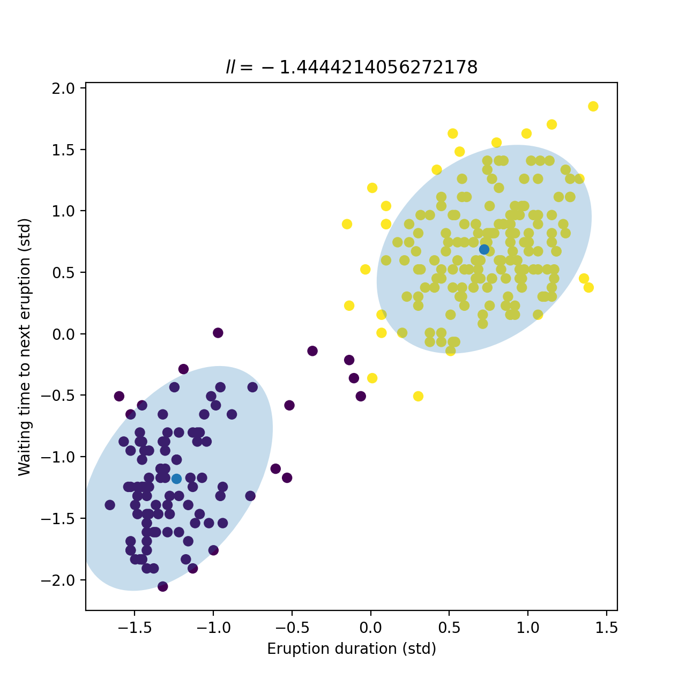]

---

class: middle
count: false

.center.width-70[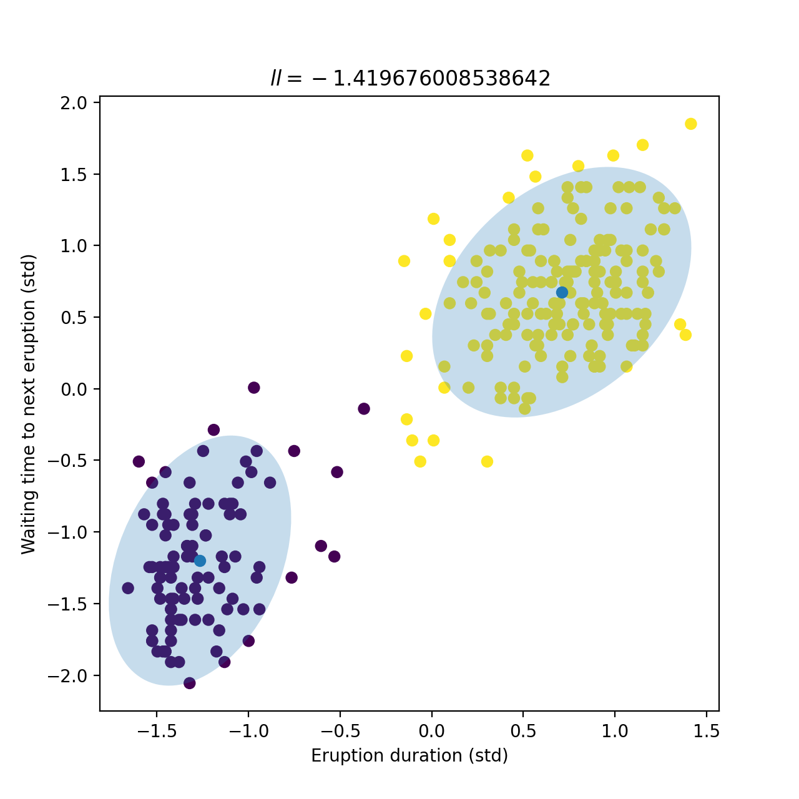]

---

class: middle

.center[]

## Empirical Bayes

In hierarchical Bayesian models, model parameters $\theta$ are treated as random variables with prior distribution $p(\theta | \eta)$, where $\eta$ are hyper-parameters with their own hyper-prior $p(\eta)$.

A full Bayesian treatment to obtain $p(\theta | x)$ would require integrating out both the latent variables $z$ and the hyper-parameters $\eta$, thus computing
$$p(\theta | x) = \iint p(\theta, z, \eta | x) \, dz \, d\eta.$$
This is often intractable.

---

class: middle

An alternative is to use an .bold[empirical Bayes] approach, which consists in approximating $p(\theta) = \int p(\theta | \eta) p(\eta) \, d\eta$ by a point estimate $p(\theta | \hat{\eta})$, where
$$\hat{\eta} = \arg\max\_\eta p(x | \eta) = \arg\max\_\eta \iint p(x, z | \theta) p(\theta | \eta) \, dz \, d\theta.$$
Put otherwise, empirical Bayes consists in estimating the prior $p(\theta)$ over model parameters from the data.

.alert[While empirical Bayes is unorthodox from a fully Bayesian perspective, it can lead to good practical results and is used in many applications.]

---

class: middle

The maximization can be performed using the EM algorithm by treating both the latent variables $z$ and the model parameters $\theta$ as unobserved data. 
- E-step: compute the posterior distribution over both latents and parameters
$$q^{(t+1)}(z, \theta) = p(z, \theta | x, \eta^{(t)}).$$
- M-step: update the hyper-parameters as
$$\eta^{(t+1)} = \arg\max\_\\eta \mathbb{E}\_{q^{(t+1)}(z, \theta)} \left[\log p(x, z | \theta) + \log p(\theta | \eta)\right].$$

---

class: middle

## Learning diffusion priors by EM (Rozet et al, 2024)

EM can also be used to learn complex prior distributions parameterized by deep generative models, such as diffusion models, from noisy and incomplete observations only.

.center.width-90[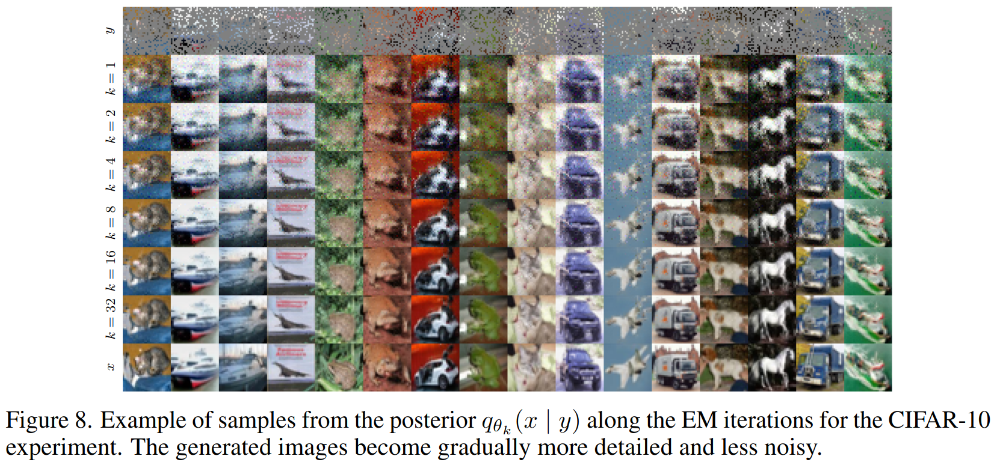]

.footnote[Credits: [Rozet et al](https://arxiv.org/abs/2405.13712) (arXiv:2405.13712), 2024.]

---

class: middle

.center.width-90[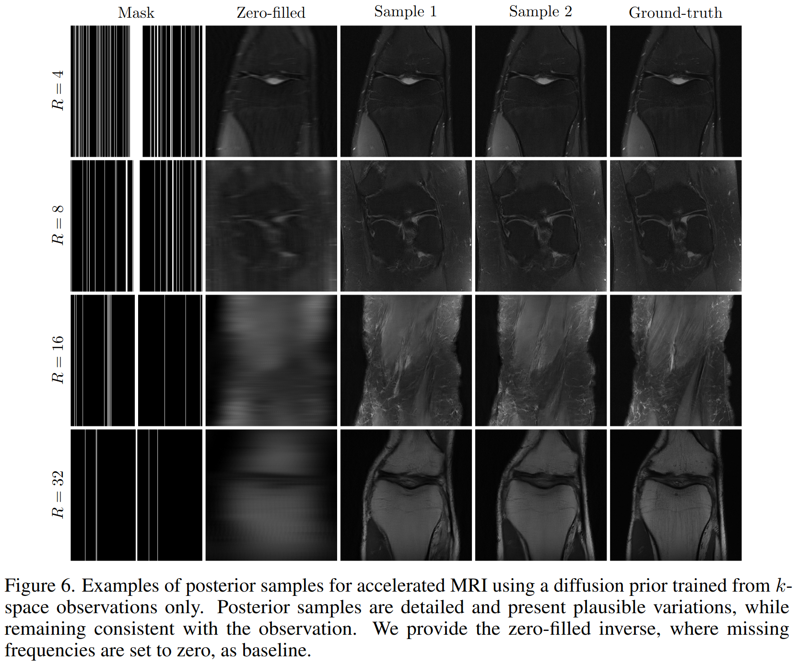]

.footnote[Credits: [Rozet et al](https://arxiv.org/abs/2405.13712) (arXiv:2405.13712), 2024.]

---

class: end-slide, center
count: false

The end.
