class: middle, center, title-slide

# Foundations of Data Science

Lecture 8: Variational inference

  
Prof. Gilles Louppe 
[g.louppe@uliege.be](g.louppe@uliege.be)

???

XXX better motivate each step of the functional derivation of CAVI
XXX develop sbi a bit more (cavi takes a lot of place in comparison)
XXX include calibration diagnostics!

---

class: middle

.center[]

Without loss of generality, we consider latent variable models $p(z, x) = p(z) p(x|z)$ with observed variables $x$ and latent variables $z$. 

We want to compute the posterior distribution
$$p(z|x) = \frac{p(z) p(x|z)}{p(x)}$$
but the marginal likelihood $p(x) = \int p(z) p(x|z) dz$ is intractable.

---

class: middle

# Variational inference

---

class: middle

We previously studied MCMC methods that provide asymptotically exact samples from the posterior distribution when the distribution is known up to a normalizing constant.

An alternative to MCMC methods is to cast posterior inference as .bold[optimization].

 
.center.width-10[]

---

class: middle

## Problem statement

We consider a variational family $\mathcal{Q}$ of tractable distributions over the latent variables $z$. We want to find the variational distribution $q \in \mathcal{Q}$ that is closest to the true posterior distribution $p(z|x)$, 
$$q^* = \arg\min\_{q \in \mathcal{Q}} \text{KL}(p(z|x) || q(z)),$$
where $\text{KL}(p(z|x) || q(z))$ is the forward Kullback-Leibler divergence.

---

class: middle

Unfortunately, the forward KL divergence $$\text{KL}(p(z|x) || q(z)) = \mathbb{E}_{p(z|x)} \left[ \log \frac{p(z|x)}{q(z)} \right]$$ is not tractable since it requires samples from the true posterior $p(z|x)$ if we want to estimate the expectation.

Instead, we minimize the .bold[reverse KL divergence] $$\text{KL}(q(z) || p(z|x)) = \mathbb{E}_{q(z)} \left[ \log \frac{q(z)}{p(z|x)} \right]$$ where the expectation is taken with respect to the variational distribution $q(z)$, which we can sample from.

---

class: middle

.center.width-100[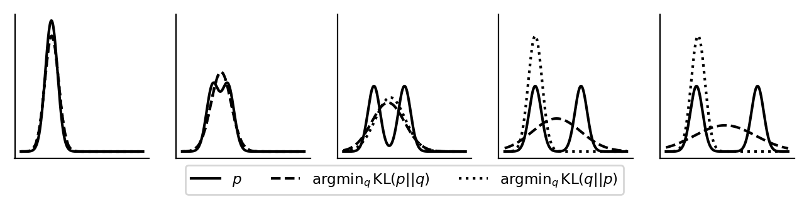]

.center[Minimizing the forward KL divergence is mode-covering,  while minimizing the reverse KL divergence is mode-seeking.]

---

class: middle

## Evidence lower bound (ELBO)

As for EM, we can re-express the optimization problem in terms of the evidence lower bound as
$$\begin{aligned}
\text{KL}(q(z) || p(z|x)) &= \mathbb{E}\_{q(z)} \left[ \log \frac{q(z)}{p(z|x)} \right] \\\\
&= \mathbb{E}\_{q(z)} \left[ \log q(z) \right] - \mathbb{E}\_{q(z)} \left[ \log p(z | x) \right] \\\\
&= \mathbb{E}\_{q(z)} \left[ \log q(z) \right] - \mathbb{E}\_{q(z)} \left[ \log p(z, x) \right] + \log p(x) \\\\
&= \mathbb{E}\_{q(z)} \left[ \log \frac{q(z)}{p(z, x)} \right] + \log p(x) \\\\
&= -\mathcal{L}(q) + \log p(x),
\end{aligned}$$
where $\mathcal{L}(q) = \mathbb{E}_{q(z)} \left[ \log \frac{p(z, x)}{q(z)} \right]$ is the ELBO.

Therefore, minimizing the reverse KL divergence is equivalent to maximizing the ELBO.

---

class: middle

## Mean-field variational inference

The mean-field approximation consists in choosing a variational family where the latent variables $z = (z\_1, \ldots, z\_m)$ are independent under the variational distribution. That is,
$$q(z) = \prod\_{j=1}^m q\_j(z\_j).$$

.alert[This assumption is often unrealistic, as the target posterior distribution would typically exhibit complex dependencies between the latent variables. However, it can lead to tractable inference algorithms.]

---

class: middle

## Coordinate ascent variational inference (CAVI)

Under the mean-field assumption, we can derive .bold[coordinate ascent updates] for each factor $q\_j(z\_j)$ by maximizing the ELBO with respect to $q\_j(z\_j)$ while keeping the other factors fixed.

.italic[Proposition.] The optimal factor $q^\*\_j(z\_j)$ that maximizes the ELBO is given by
$$q^\*\_j(z\_j) \propto \exp\left( \mathbb{E}\_{q\_{-j}(z\_{-j})} \left[ \log p(z, x) \right] \right),$$
where $z\_{-j}$ denotes all latent variables except $z\_j$ and $q\_{-j}(z\_{-j})$ is the product of all factors except $q\_j(z\_j)$, all of which are kept fixed.

---

class: middle

.italic[Proof.] The ELBO can be written as
$$\begin{aligned}
\mathcal{L}(q) &= \mathbb{E}\_{q(z)} \left[ \log p(z, x) - \log q(z) \right] \\\\
&= \mathbb{E}\_{q(z)} \left[ \log p(z, x) \right] - \sum\_{j=1}^m \mathbb{E}\_{q\_j(z\_j)}[\log q\_j(z\_j)].
\end{aligned}$$

Focusing on the $j$-th factor while keeping the others fixed, we have
$$\begin{aligned}
\mathcal{L}(q\_j) &= \mathbb{E}\_{q\_j(z\_j)} \left[ \mathbb{E}\_{q\_{-j}(z\_{-j})} \left[ \log p(z, x) \right] \right] - \mathbb{E}\_{q\_j(z\_j)}[\log q\_j(z\_j)] + \text{const},
\end{aligned}$$
which we aim to maximize with respect to $q\_j(z\_j)$.

By the method of Lagrange multipliers, we introduce a multiplier $\lambda$ and consider the functional
$$\mathcal{L}(q\_j, \lambda) = \mathcal{L}(q\_j) - \lambda \left( \int q\_j(z\_j) dz\_j - 1 \right)$$ where the constraint ensures that $q\_j(z\_j)$ integrates to $1$.

---

class: middle

The functional derivative of $\mathcal{L}(q\_j, \lambda)$ with respect to $q\_j(z\_j)$ is given by
$$\begin{aligned}
&\frac{\delta \mathcal{L}(q\_j, \lambda)}{\delta q\_j(z\_j)} \\\\
&= \frac{\delta \mathcal{L}(q\_j)}{\delta q\_j(z\_j)} - \lambda \frac{\delta}{\delta q\_j(z\_j)} \left( \int q\_j(z\_j) dz\_j - 1 \right) \\\\
&= \frac{\delta \mathcal{L}(q\_j)}{\delta q\_j(z\_j)} - \lambda \\\\
&= \frac{\delta}{\delta q\_j(z\_j)} \left( \mathbb{E}\_{q\_j(z\_j)} \left[ \mathbb{E}\_{q\_{-j}(z\_{-j})} \left[ \log p(z, x) \right] \right] - \mathbb{E}\_{q\_j(z\_j)}[\log q\_j(z\_j)] \right) - \lambda \\\\
&= \frac{\delta}{\delta q\_j(z\_j)} \left( \int q\_j(z\_j) \mathbb{E}\_{q\_{-j}(z\_{-j})} \left[ \log p(z, x) \right] dz\_j - \int q\_j(z\_j) \log q\_j(z\_j) dz\_j \right) - \lambda \\\\
&= \mathbb{E}\_{q\_{-j}(z\_{-j})} \left[ \log p(z, x) \right] - \log q\_j(z\_j) - 1 - \lambda.
\end{aligned}$$

Setting this derivative to zero and rearranging terms yields
$$\log q^\*\_j(z\_j) = \mathbb{E}\_{q\_{-j}(z\_{-j})} \left[ \log p(z, x) \right] -1 -\lambda,$$
where the value of $\lambda$ is determined by the normalization constraint $\int q^\*\_j(z\_j) dz\_j = 1$ (i.e., from $\frac{\partial \mathcal{L}}{\partial \lambda} = 0$). 

---

class: middle

Finally, taking the exponential of both sides gives
$$q^\*\_j(z\_j) \propto \exp\left( \mathbb{E}\_{q\_{-j}(z\_{-j})} \left[ \log p(z, x) \right] \right).$$

This optimal factor maximizes the ELBO with respect to $q\_j(z\_j)$ while keeping the other factors fixed. 

Therefore, it can be used in a coordinate ascent algorithm to iteratively update each factor until convergence, leading to the .bold[coordinate ascent variational inference] algorithm.

---

class: middle

.center.width-10[]

## Example: Matrix factorization 

We assume we have observed a matrix of movie ratings $R \in \mathbb{R}^{N \times M}$, where $R\_{ij}$ is the rating given by user $i$ to movie $j$, $N$ is the number of users and $M$ is the number of movies. Most entries of $R$ are missing and we want to predict them.

---

class: middle

We model the ratings $R\_{ij}$ using a latent variable model with latent user and movie factors, such that
$$\begin{aligned}
u\_i \sim \mathcal{N}(0, \sigma\_u^2 I), \\\\
v\_j \sim \mathcal{N}(0, \sigma\_v^2 I), \\\\
R\_{ij} | u\_i, v\_j \sim \mathcal{N}(u\_i^T v\_j, \sigma^2),
\end{aligned}$$
where $u\_i \in \mathbb{R}^K$ and $v\_j \in \mathbb{R}^K$ are latent factors for user $i$ and movie $j$, respectively, and $\sigma^2$ is the observation noise variance.

We want to approximate the posterior distribution $p(\\{u\_i\\}, \\{v\_j\\} | R)$ over the latent factors given the observed ratings.

---

class: middle

We choose a mean-field variational family where the latent factors are independent under the variational distribution, i.e.,
$$q(\\{u\_i\\}, \\{v\_j\\}) = \prod\_{i=1}^N q(u\_i) \prod\_{j=1}^M q(v\_j).$$

Due to Gaussian-Gaussian conjugacy, each optimal factor will be Gaussian:
$$\begin{aligned}
q(u\_i) = \mathcal{N}(u\_i | \\mu\_{u\_i}, \Sigma\_{u\_i}), \\\\
q(v\_j) = \mathcal{N}(v\_j | \\mu\_{v\_j}, \Sigma\_{v\_j}).
\end{aligned}$$

---

class: middle

Let $q\_{-u\_i}(\\{u\_{i'}\\}, \\{v\_j\\})$ denote the product of all factors except $q(u\_i)$. The coordinate ascent update is
$$q^*(u\_i) \propto \exp\left( \mathbb{E}\_{q\_{-u\_i}} \left[ \log p(\\{u\_i\\}, \\{v\_j\\}, R) \right] \right).$$

The joint log-probability factorizes as
$$\begin{aligned}
\log p(\{u\_i\}, \{v\_j\}, R) &= \sum\_{i=1}^N \log p(u\_i) + \sum\_{j=1}^M \log p(v\_j) + \sum\_{(i,j) \in \mathcal{O}} \log p(R\_{ij} | u\_i, v\_j) \\\\
&= \log p(u\_i) + \sum\_{j \in \mathcal{O}\_i} \log p(R\_{ij} | u\_i, v\_j) + \text{const w.r.t. } u\_i \\\\
&= -\frac{1}{2\sigma\_u^2} \|u\_i\|^2 - \frac{1}{2\sigma^2} \sum\_{j \in \mathcal{O}\_i} (R\_{ij} - u\_i^T v\_j)^2 + \text{const}
\end{aligned}$$
where $\mathcal{O}$ denotes the set of observed entries $(i,j)$ and $\mathcal{O}\_i = \\{j : (i,j) \in \mathcal{O}\\}$.

---

class: middle

Taking the expectation over $q\_{-u\_i}$, we have
$$\begin{aligned}
\mathbb{E}\_{q\_{-u\_i}}[\log p(\{u\_i\}, \{v\_j\}, R)] &= -\frac{1}{2\sigma\_u^2} \|u\_i\|^2 - \frac{1}{2\sigma^2} \sum\_{j \in \mathcal{O}\_i} \mathbb{E}\_{q(v\_j)}\left[(R\_{ij} - u\_i^T v\_j)^2\right] + \text{const}.
\end{aligned}$$

Expanding the squared term inside the expectation yields
$$\begin{aligned}
\mathbb{E}\_{q(v\_j)}\left[(R\_{ij} - u\_i^T v\_j)^2\right] &= R\_{ij}^2 - 2R\_{ij} u\_i^T \mu\_{v\_j} + u\_i^T (\mu\_{v\_j}\mu\_{v\_j}^T + \Sigma\_{v\_j}) u\_i,
\end{aligned}$$
where $\mu\_{v\_j}$ and $\Sigma\_{v\_j}$ are the mean and covariance of $q(v\_j)$.

---

class: middle

Substituting back and absorbing $R\_{ij}^2$, we get
$$\begin{aligned}
&\mathbb{E}\_{q\_{-u\_i}}[\log p(\{u\_i\}, \{v\_j\}, R)] \\\\
&= -\frac{1}{2\sigma\_u^2} \|u\_i\|^2 - \frac{1}{2\sigma^2} \sum\_{j \in \mathcal{O}\_i} \left[- 2R\_{ij} u\_i^T \mu\_{v\_j} + u\_i^T (\mu\_{v\_j}\mu\_{v\_j}^T + \Sigma\_{v\_j}) u\_i\right] + \text{const}.
\end{aligned}$$

Collecting terms quadratic and linear in $u\_i$, we have
$$\begin{aligned}
&\mathbb{E}\_{q\_{-u\_i}}[\log p(\{u\_i\}, \{v\_j\}, R)] \\\\
&= -\frac{1}{2} u\_i^T \left[\frac{1}{\sigma\_u^2}I + \frac{1}{\sigma^2}\sum\_{j \in \mathcal{O}\_i} (\mu\_{v\_j}\mu\_{v\_j}^T + \Sigma\_{v\_j})\right] u\_i + u\_i^T \left[\frac{1}{\sigma^2}\sum\_{j \in \mathcal{O}\_i} R\_{ij} \mu\_{v\_j}\right] + \text{const}.
\end{aligned}$$

---

class: middle

We can identify this expression as the log of a Gaussian distribution in $u\_i$ with covariance and mean given by
$$\begin{aligned}
\Sigma\_{u\_i} &= \left[\frac{1}{\sigma\_u^2}I + \frac{1}{\sigma^2}\sum\_{j \in \mathcal{O}\_i} (\mu\_{v\_j}\mu\_{v\_j}^T + \Sigma\_{v\_j})\right]^{-1}, \\\\
\mu\_{u\_i} &= \Sigma\_{u\_i} \left[\frac{1}{\sigma^2}\sum\_{j \in \mathcal{O}\_i} R\_{ij} \mu\_{v\_j}\right].
\end{aligned}$$

By symmetry, the updates for $q(v\_j)$ are similar and defined as
$$\begin{aligned}
\Sigma\_{v\_j} &= \left[\frac{1}{\sigma\_v^2}I + \frac{1}{\sigma^2}\sum\_{i \in \mathcal{O}\_j} (\mu\_{u\_i}\mu\_{u\_i}^T + \Sigma\_{u\_i})\right]^{-1}, \\\\
\mu\_{v\_j} &= \Sigma\_{v\_j} \left[\frac{1}{\sigma^2}\sum\_{i \in \mathcal{O}\_j} R\_{ij} \mu\_{u\_i}\right],
\end{aligned}$$
where $\mathcal{O}\_j = \\{i : (i,j) \in \mathcal{O}\\}$.

???

Identifying the Gaussian:

Recall that the log of a Gaussian $\mathcal{N}(x | \mu, \Sigma)$ has the form:
$$\log \mathcal{N}(x | \mu, \Sigma) = -\frac{1}{2}(x-\mu)^T\Sigma^{-1}(x-\mu) + \text{const}$$

Expanding:
$$= -\frac{1}{2}x^T\Sigma^{-1}x + x^T\Sigma^{-1}\mu + \text{const}$$

Strategy: Match our expression to this pattern to identify $\Sigma\_{u\_i}$ and $\mu\_{u\_i}$.

We have a quadratic term in $u\_i$ and a linear term in $u\_i$ → it's a Gaussian!

---

class: middle

In summary, CAVI for matrix factorization can be implemented as follows:

- Initialize the variational parameters $\\{\\mu\_{u\_i}, \Sigma\_{u\_i}\\}$ and $\\{\\mu\_{v\_j}, \Sigma\_{v\_j}\\}$ randomly.
- Repeat until convergence:
  - For each user $i = 1, \ldots, N$, update $\Sigma\_{u\_i}$ and $\mu\_{u\_i}$ using the derived formulas.
  - For each movie $j = 1, \ldots, M$, update $\Sigma\_{v\_j}$ and $\mu\_{v\_j}$ using the derived formulas.

---

class: middle, center

(Step-by-step code example in `nb08-cavi.ipynb`.)

---

class: middle

.center.width-70[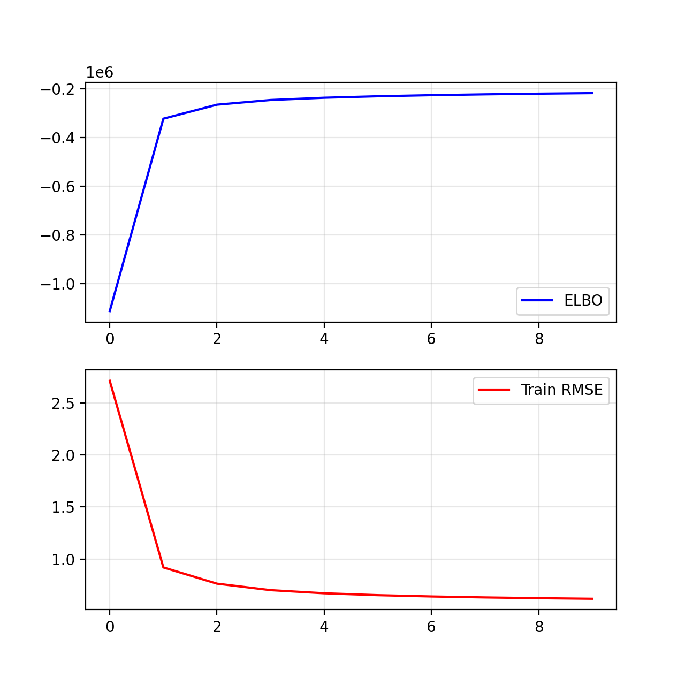]

---

class: middle

.center.width-70[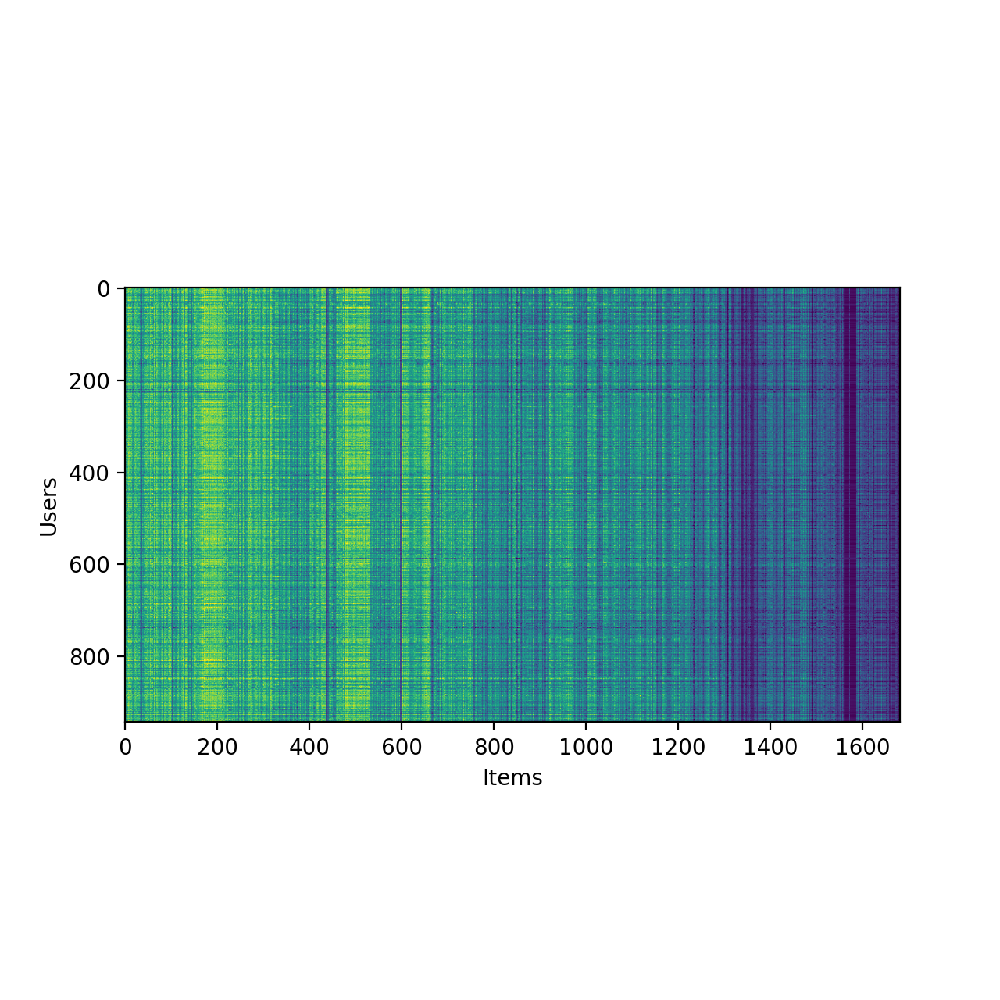]

.center[Predicted ratings matrix (using biclustering for visualization).]

---

class: middle

.center.width-10[]

## Strengths and weaknesses 

- CAVI provides a general framework for variational inference under the mean-field assumption.
- CAVI requires .bold[closed-form expressions for the coordinate updates]. This is only possible for certain models (e.g., conditionally conjugate models). Their derivation can be .bold[tedious] and .bold[error-prone].
- CAVI is restricted to mean-field variational families, which may be too simplistic to capture the true posterior distribution.

---

class: middle

## Automatic differentiation variational inference (ADVI)

ADVI is a .bold[black-box variational inference] method that overcomes the limitations of CAVI by leveraging automatic differentiation and stochastic optimization. 

---

class: middle

.center.width-70[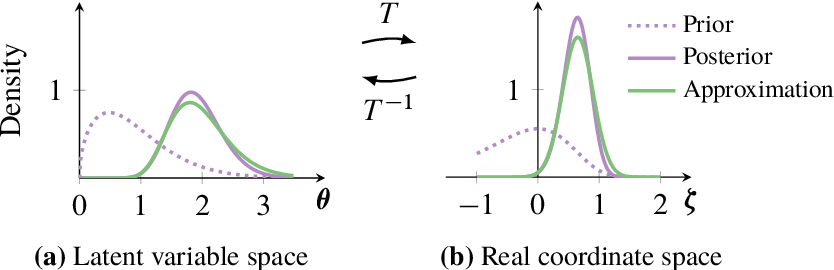]

Since latent variables may be constrained (e.g., positive or bounded), the first step in ADVI is to transform the latent variables $z$ to an unconstrained space using a differentiable bijection $$T: \text{supp}(z) \to \mathbb{R}^m,$$
such that $\zeta = T(z)$ are unconstrained variables in $\mathbb{R}^m$.

By the change of variables theorem, the joint distribution in the unconstrained space is given by
$$p(\zeta, x) = p(T^{-1}(\zeta), x) \left| \det J\_{T^{-1}}(\zeta) \right|,$$
where $J\_{T^{-1}}(\zeta) = \frac{dT^{-1}(\zeta)}{d\zeta}$ is the Jacobian  of the inverse transformation.

.footnote[Credits: [Kucukelbir et al](https://arxiv.org/abs/1603.00788), 2016.]

---

class: middle

.center.width-40[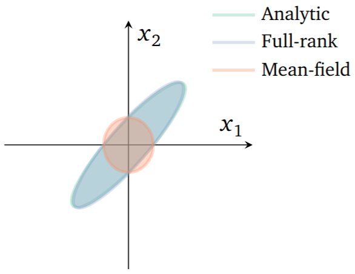]

We then define a variational family $q(\zeta; \phi)$ in the unconstrained space, parameterized by variational parameters $\phi$.

Common choices include:
- Mean-field Gaussian: $q(\zeta; \phi) = \mathcal{N}(\zeta | \mu, \text{diag}(\sigma^2)) = \prod\_{i=1}^m \mathcal{N}(\zeta\_i | \mu\_i, \sigma\_i^2)$ with $\phi = (\mu \in \mathbb{R}^m, \sigma \in \mathbb{R}^m)$;
- Full-rank Gaussian: $q(\zeta; \phi) = \mathcal{N}(\zeta | \mu, \Sigma=LL^T)$ with $\phi = (\mu \in \mathbb{R}^m, L \in \mathbb{R}^{m(m+1)/2})$, where $L$ is the Cholesky factor of $\Sigma$.

.footnote[Credits: [Kucukelbir et al](https://arxiv.org/abs/1603.00788), 2016.]

---

class: middle

Finally, ADVI proceeds by maximizing the ELBO with respect to the variational parameters $\phi$ using stochastic gradient ascent. The ELBO in the unconstrained space is given by
$$\mathcal{L}(\phi) = \mathbb{E}\_{q(\zeta; \phi)} \left[ \log p(T^{-1}(\zeta), x) + \log \left| \det J\_{T^{-1}}(\zeta) \right| - \log q(\zeta; \phi) \right].$$

---

class: middle

To compute gradients of the ELBO with respect to $\phi$, we can use the .bold[reparameterization trick] to express the expectation over $q(\zeta; \phi)$ in terms of a fixed distribution independent of $\phi$.

If $\zeta = g(\epsilon; \phi)$ with $\epsilon \sim p(\epsilon)$, then
$$\mathcal{L}(\phi) = \mathbb{E}\_{p(\epsilon)} \left[ \log p(T^{-1}(g(\epsilon; \phi)), x) + \log \left| \det J\_{T^{-1}}(g(\epsilon; \phi)) \right| - \log q(g(\epsilon; \phi); \phi) \right].$$

In particular, for a Gaussian variational family, we can write $\zeta = \mu + L \epsilon$ where $L$ is the Cholesky factor of $\Sigma$ and $\epsilon \sim \mathcal{N}(0, I)$.

.center.width-70[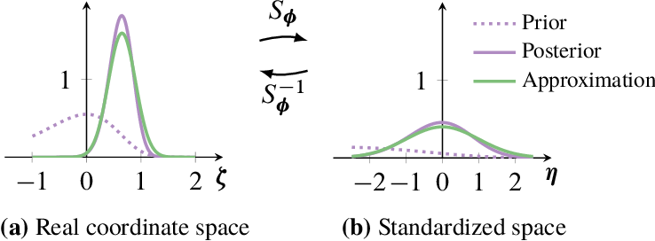]

.footnote[Credits: [Kucukelbir et al](https://arxiv.org/abs/1603.00788), 2016.]

---

class: middle

In this form, we can compute unbiased estimates of the gradient of the ELBO with respect to $\phi$ using Monte Carlo sampling and automatic differentiation,
$$\begin{aligned}
&\nabla\_\phi \mathcal{L}(\phi) \\\\
&\approx \frac{1}{B} \sum\_{i=1}^B \nabla\_\phi \left[ \log p(T^{-1}(g(\epsilon\_i; \phi)), x) + \log \left| \det J\_{T^{-1}}(g(\epsilon\_i; \phi)) \right| - \log q(g(\epsilon\_i; \phi); \phi) \right]
\end{aligned}$$
where $\epsilon\_i \sim p(\epsilon)$.

Finally, these gradient estimates can be used in a stochastic optimization algorithm to maximize the ELBO and learn the variational parameters $\phi$.

---

class: middle

## Example: The Pitcher's example (from Lecture 1)

(Step-by-step code example in `nb08-advi.ipynb`.)

---

class: middle

.center.width-10[]

## Strengths and weaknesses 

- ADVI does not require closed-form updates.
- ADVI does not require mean-field assumptions.
- ADVI relies on automatic differentiation and stochastic optimization, which avoids tedious derivations.
- ADVI is limited by the choice of variational family (e.g., Gaussian), which may not capture complex posterior distributions.

---

class: middle

# Amortized variational inference

---

class: middle

In all previous examples, we considered variational inference for a single observation $x$. In practice, we often have a dataset of $N$ observations $\mathbf{d} = \\{x\_1, \ldots, x\_N\\}$ and want to perform inference for each observation.

A naive approach would be to run variational inference separately for each observation, which can be computationally expensive.

---

class: middle

## Amortized variational inference

Amortized variational inference addresses this issue by learning a shared inference model that maps each observation $x\_i$ to its corresponding variational distribution $q(z | x\_i)$.

Mathematically, this can be done by parameterizing $q(z | x\_i)$ as $$q(z | f(x\_i; \varphi)),$$
where $f(x; \varphi)$ is a function with shared parameters $\varphi$ that takes an observation $x$ as input and outputs the parameters of the variational distribution for the latent variables $z$.

---

class: middle

The parameters $\varphi$ of the inference model could be learned by maximizing the ELBO averaged over the dataset. 

However, because we want to amortize inference, we can rewrite the objective as the minimization of the expected forward KL divergence over the observations,
$$\varphi^* = \arg\min\_\varphi \mathbb{E}\_{p(x)} \left[ \text{KL}(p(z|x) || q(z | f(x; \varphi))) \right].$$

---

class: middle

While the forward KL divergence was previously inaccessible due to the lack of samples from the true posterior, in the amortized setting we can use samples from the joint distribution $p(z, x)$ to estimate the expected KL divergence!

$$\begin{aligned}
\mathbb{E}\_{p(x)} \left[ \text{KL}(p(z|x) || q(z | f(x; \varphi))) \right] &= \mathbb{E}\_{p(x)} \left[ \mathbb{E}\_{p(z|x)} \left[ \log \frac{p(z|x)}{q(z | f(x; \varphi))} \right] \right] \\\\
&= \mathbb{E}\_{p(x, z)} \left[ \log \frac{p(z|x)}{q(z | f(x; \varphi))} \right] \\\\
&= -\mathbb{E}\_{p(x, z)} \left[ \log q(z | f(x; \varphi)) \right] + \text{const}.
\end{aligned}$$

In other words, we can learn the inference model by maximizing the expected posterior log-density under the joint distribution! 

---

class: middle

## Neural posterior estimation (NPE)

Neural posterior estimation is an amortized variational inference method where the inference model is parameterized using neural networks.

.center.width-100[]

.footnote[Credits: Adapted from [Deistler et al](https://arxiv.org/abs/2508.12939), 2025.]

---

class: middle

The variational distribution can be defined in different ways, such as
- $q(z | f(x; \varphi))$, using a simple distribution (e.g., Gaussian) and a .bold[neural network]  $f(x; \varphi)$ that outputs the parameters of the variational distribution given an observation $x$,
- or as $q(z | f(x; \varphi); \phi)$ using a flexible density estimator, such as (conditional) .bold[normalizing flows], with parameters $\phi$, and a neural network $f(x; \varphi)$ that outputs a sufficient statistic of $x$.

---

class: middle

For training, we can generate samples from the joint distribution $p(z, x)$ by first sampling $z \sim p(z)$ from the prior and then sampling $x \sim p(x|z)$ from the likelihood.

The parameters $\varphi$ (and $\phi$ if applicable) can then be learned by maximizing the expected posterior log-density using stochastic gradient ascent,
$$\begin{aligned}
\varphi^\*, \phi^\* &= \arg\max\_{\varphi, \phi} \mathbb{E}\_{p(x, z)} \left[ \log q(z | f(x; \varphi); \phi) \right]. 
\end{aligned}$$

---

class: middle

.center.width-10[]

## Strengths and weaknesses

- NPE leverages neural networks to learn flexible inference models that can capture complex posterior distributions.
- NPE only requires samples from the joint distribution $p(z, x)$, making it applicable to a large class of models.
- NPE amortizes inference across multiple observations, making inference as fast as a forward pass through the neural network. However, this comes at the cost of an upfront training phase. 

---

class: middle

## Simulation-based inference

NPE is an example of simulation-based inference (SBI) methods, which are designed for scenarios where the likelihood $p(x|z)$ (resp. $p(x|\theta)$) is intractable but we can still generate samples from the joint distribution $p(z, x)$ (resp. $p(\theta, x)$) using a simulator.

SBI algorithms are a major evolution in Bayesian inference, enabling posterior inference in complex models where traditional methods fail, .bold[without simplifying assumptions].

---

class: middle

Alternative simulation-based inference algorithms include:
- Neural likelihood estimation (NLE): learns a surrogate likelihood model $q(x | \theta; \phi)$ using samples from $p(\theta, x)$, then performs inference using standard methods (e.g., MCMC, VI) with the surrogate likelihood.
- Neural ratio estimation (NRE): learns a likelihood-to-evidence ratio model $r(x, \theta; \phi) = \frac{p(x|\theta)}{p(x)}$ using samples from $p(\theta, x)$, then performs inference using standard methods with the learned ratio.
- Neural score estimation (NSE): learns a score function model $s(\theta | x; \phi) = \nabla_\theta \log p(\theta | x; \phi)$ using samples from $p(\theta, x)$, then performs inference using score-based methods.

These methods are not variational inference methods per se, but they share the same goal of approximating the posterior distribution in complex models.

---

class: middle

# Examples and case studies

---

class: middle, black-slide

.avatars[]

## Exoplanet atmosphere characterization 

.center.width-80[]

.center[What are the atmospheres of exoplanets made of?  How do they form and evolve? Do they host life?]

.footnote[Credits: [NSA/JPL-Caltech](https://www.nasa.gov/topics/universe/features/exoplanet20100203-b.html), 2010.]

???

As an example of a low-dimensional inverse problem, let me tell you about some of the work we have done on exoplanet atmosphere characterization.

When an exoplanet transits in front of its star, a tiny fraction of the starlight passes through the planet's atmosphere before reaching us. By analyzing the spectrum of this light, we can infer the composition and properties of the atmosphere.

Understanding the atmosphere of an exoplanet is in turn quite important, as it can tell us about the planet's formation and evolution and its potential for habitability.

---

class: middle, black-slide

.center.width-50[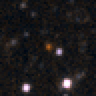]

.center[WISE 1738+2732, a brown dwarf 25 light-years away.]

???

The object we studied is WISE 1738+2732, a brown dwarf located about 25 light-years away.

It was observed with the JWST telescope, which provided us with a high-quality spectrum of its atmosphere.

This brown dwarf is interesting because its temperature is similar to that of some exoplanets, making it a good proxy for studying exoplanet atmospheres. It is also interesting because it is cool enough to have complex molecules like water vapor, methane, or ammonia.

---

class: middle

.avatars[]

.center.width-90[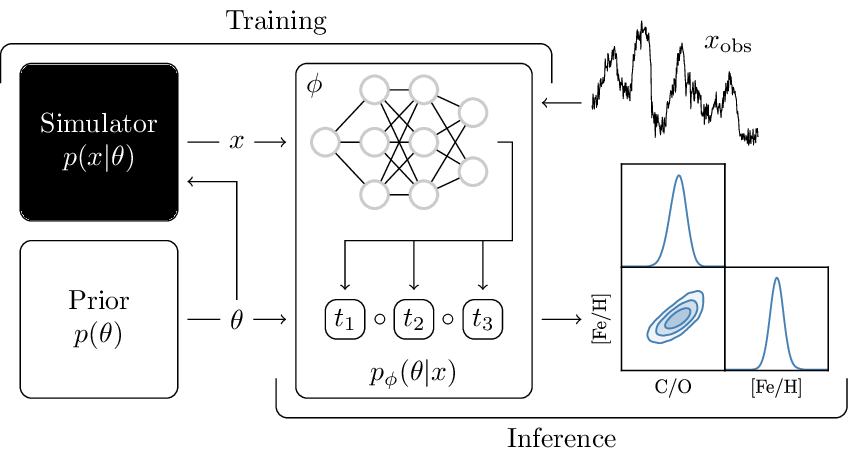]

Using .bold[Neural Posterior Estimation] (NPE), we approximate the posterior distribution $p(\theta|x)$ of atmospheric parameters $\theta$ with a .bold[normalizing flow] trained on pairs $(\theta, x)$ simulated from a physical model of exoplanet atmospheres.

.footnote[Credits: [Vasist et al](https://arxiv.org/abs/2301.06575), 2023 (arXiv:2301.06575).]

???

To analyze the JWST spectrum, we used a simulation-based inference method called Neural Posterior Estimation (NPE).

NPE uses a normalizing flow, which is a type of deep generative model, to approximate the posterior distribution $p(\theta|x)$ of atmospheric parameters $\theta$ given the observed spectrum $x$.

The normalizing flow is trained on pairs $(\theta, x)$ simulated from a physical model of exoplanet atmospheres. This allows us to learn a flexible and accurate approximation of the posterior distribution, which we can then use to infer the atmospheric parameters from the observed spectrum.
.
---

class: middle

.avatars[]

.grid[
.kol-3-5[  .width-100[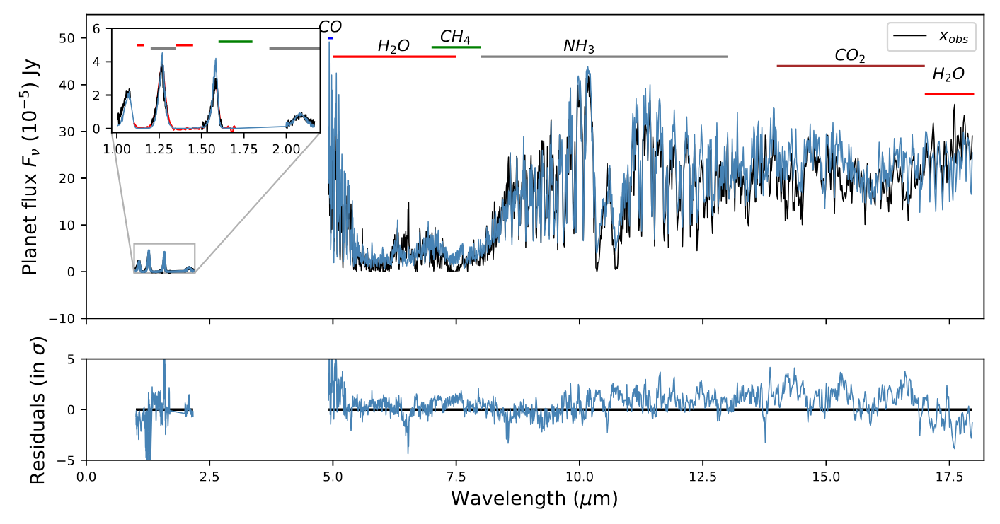]]
.kol-2-5[.width-100[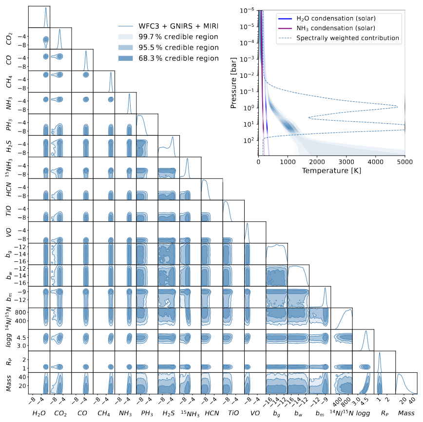]]
]

.center[Panchromatic characterization of WISE 1738+2732 using JWST/MIRI.]

.footnote[Credits: [Vasist et al](https://arxiv.org/abs/2507.12264), 2025 (arXiv:2507.12264).]

???

The results of our analysis are quite interesting.

The left panel shows the observed spectrum of WISE 1738+2732 in black, along with the best-fit in blue. The model fits the data quite well, capturing the main features of the spectrum.

The right panel shows the posterior distribution of the atmospheric parameters $\theta$ inferred from the spectrum. While this posterior plot can look intimidating, it is actually telling us a lot about the physics and chemistry of this world:
- The atmosphere contains water vapor, methane, ammonia, carbon monoxide, and carbon dioxide
- The detection of carbon monoxide and carbon dioxide is a surprise, as these molecules were not expected to be present in such a cold atmosphere: this suggests that non-equilibrium chemistry is at play. 
- In turn, this disequilibrium chemistry tells us about atmospheric mixing and transport processes that shape planetary evolution.

There is much more to say, but I will stop here. If you are interested, please check out our study! The point is: all these scientific insights were made possible by our ability to perform Bayesian inference in a complex, high-dimensional, and non-linear model of exoplanet atmospheres.

---

class: middle

.avatars[]

## Representation learning for cytometry data

.center.width-100[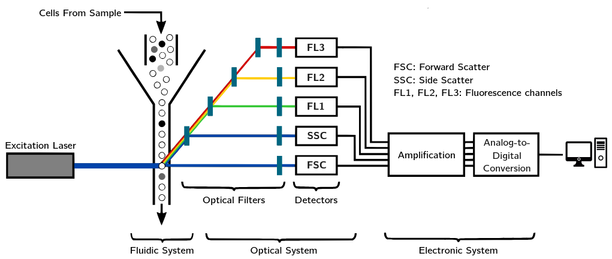]

Flow cytometry is used to measure the chemical characteristics of cells as they flow in a fluid stream through a beam of light. It is used across biology and medicine for immune profiling, disease diagnosis, and drug development.

---

class: middle

.avatars[]

.center.width-100[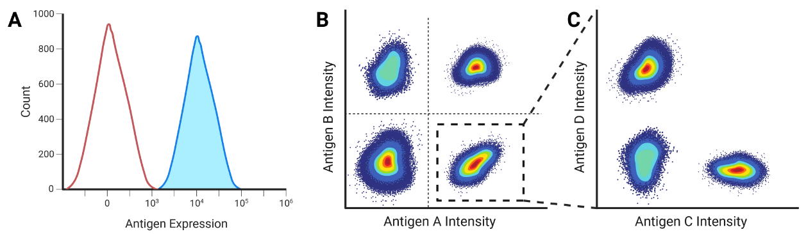]

However, analyzing flow cytometry data can be challenging due to the high dimensionality and complexity of the data. Traditional methods often rely on manual gating, which is time-consuming and subjective.

---

class: middle

.avatars[]

To automate the classification of cells and the discovery of new cell populations, we consider a latent variable model of cell populations
$$\begin{aligned}
p\_{\theta,\beta,\pi}(x, z, c) &= p\_{\theta}(x | z) p\_{\beta}(z | c) p\_{\pi}(c), \\\\
p\_{\pi}(c) &= \text{Categorical}(c | \pi), \\\\
p\_{\beta}(z | c) &= \mathcal{N}(z | \mu\_\beta(c), \text{diag}(\sigma^2\_\beta(c))), \\\\
p\_{\theta}(x | z) &= \mathcal{N}(x | \mu\_\theta(z), \text{diag}(\sigma^2\_\theta(z))),
\end{aligned}$$
where $x$ are the observed cell measurements, $z$ are latent representations of cells, and $c$ are discrete cell population memberships.

We use .bold[deep neural networks] to parameterize the functions $\mu\_\theta(z)$, $\sigma^2\_\theta(z)$, $\mu\_\beta(c)$, and $\sigma^2\_\beta(c)$ and rely on .bold[amortized variational inference] to learn the model parameters and infer the latent variables.

---

class: middle

.avatars[]

.center.width-100[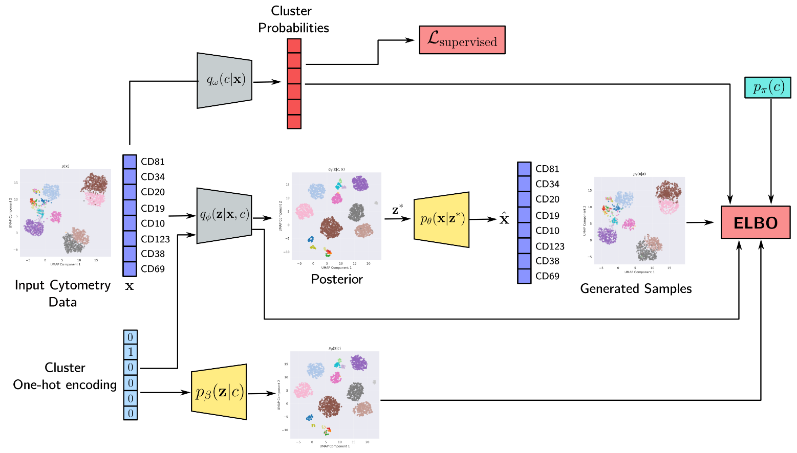]

---

class: end-slide, center
count: false

The end.

---

class: middle 

## Change of variables

.center.width-80[]

Assume $p(\mathbf{z})$ is a uniformly distributed unit cube in $\mathbb{R}^3$ and $\mathbf{x} = f(\mathbf{z}) = 2\mathbf{z}$.
Since the total probability mass must be conserved, 
$$p(\mathbf{x})=p(\mathbf{x}=f(\mathbf{z})) = p(\mathbf{z})\frac{V\_\mathbf{z}}{V\_\mathbf{x}}=p(\mathbf{z}) \frac{1}{8},$$
where $\frac{1}{8} = \left| \det \left( \begin{matrix}
2 & 0 & 0 \\\\ 
0 & 2 & 0 \\\\
0 & 0 & 2
\end{matrix} \right)\right|^{-1}$ represents the inverse determinant of the Jacobian of the linear transformation $f$.

???

Motivate that picking a parametric family of distributions is not always easy. We want something more flexible.

---

class: middle

What if $f$ is non-linear?

.center.width-70[]

.footnote[Image credits: Simon J.D. Prince, [Understanding Deep Learning](https://udlbook.github.io/udlbook/), 2023.]

---

class: middle

## Change of variables theorem

If $f$ is non-linear,
- the Jacobian $J\_f(\mathbf{z})$ of $\mathbf{x} = f(\mathbf{z})$ represents the infinitesimal linear transformation in the neighborhood of $\mathbf{z}$;
- if the function is a bijective map, then the mass must be conserved locally.

Therefore, the local change of density yields
$$p(\mathbf{x}=f(\mathbf{z})) = p(\mathbf{z})\left| \det J\_f(\mathbf{z}) \right|^{-1}.$$

Similarly, for $g = f^{-1}$, we have $$p(\mathbf{x})=p(\mathbf{z}=g(\mathbf{x}))\left| \det J\_g(\mathbf{x}) \right|.$$

???

The Jacobian matrix of a function f: R^n -> R^m at a point z in R^n is an m x n matrix that represents the linear transformation induced by the function at that point. Geometrically, the Jacobian matrix can be thought of as a matrix of partial derivatives that describes how the function locally stretches or shrinks areas and volumes in the vicinity of the point z.

The determinant of the Jacobian matrix of f at z has a geometric interpretation as the factor by which the function locally scales areas or volumes. Specifically, if the determinant is positive, then the function locally expands areas and volumes, while if it is negative, the function locally contracts areas and volumes. The absolute value of the determinant gives the factor by which the function scales the areas or volumes.

---

class: middle

## Normalizing flows

A normalizing flow is a sequence of invertible transformations $f\_k$ that map a simple distribution $p\_0$ to a more complex distribution $p\_K$. Each transformation $f\_k$ is parameterized by an invertible neural network.

.center.width-100[]

By the change of variables formula, the log-likelihood of a sample $x$ is given by
$$\log p(\mathbf{x}) = \log p(\mathbf{z}\_0) - \sum\_{k=1}^K \log \left| \det J\_{f\_k}(\mathbf{z}\_{k-1}) \right|.$$
