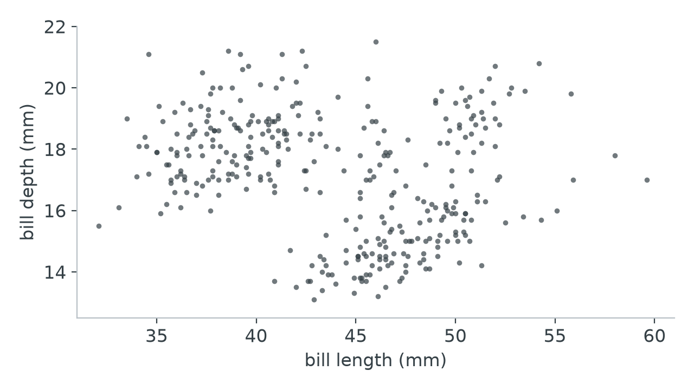
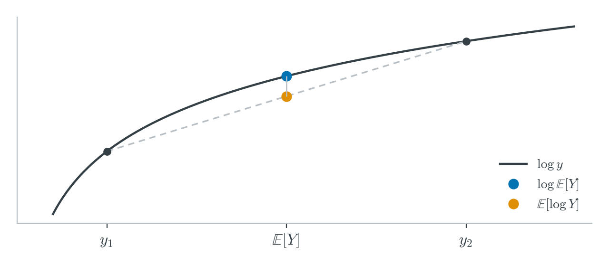
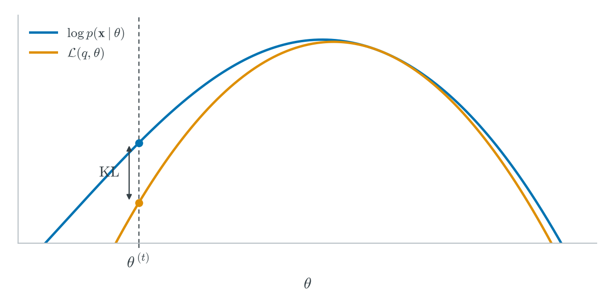
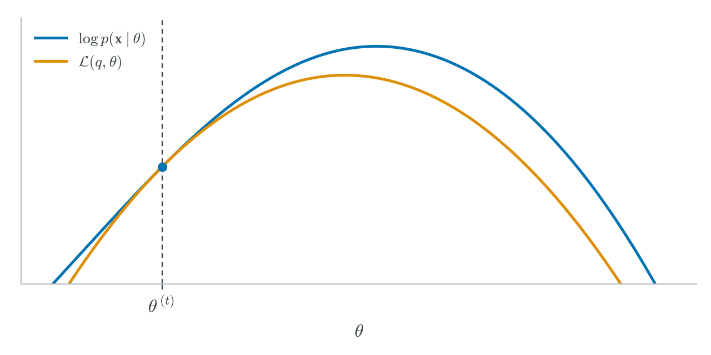
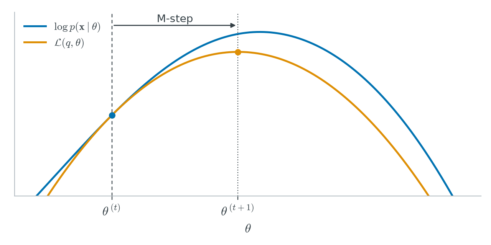
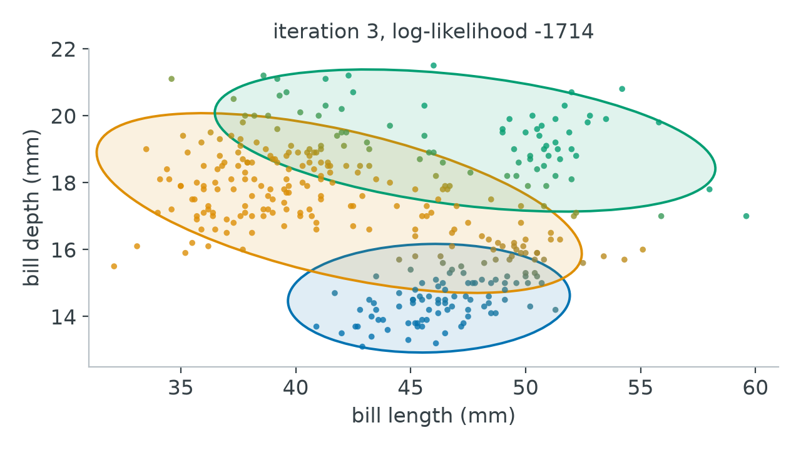
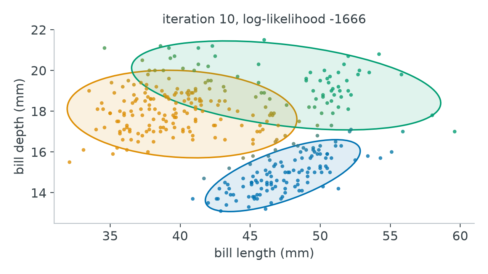
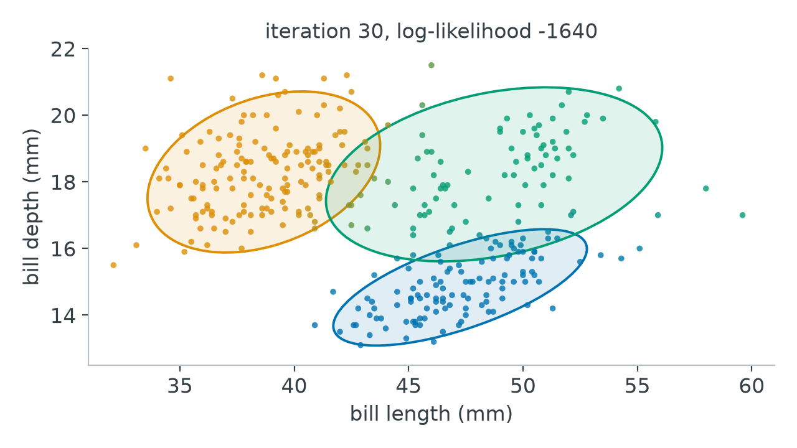
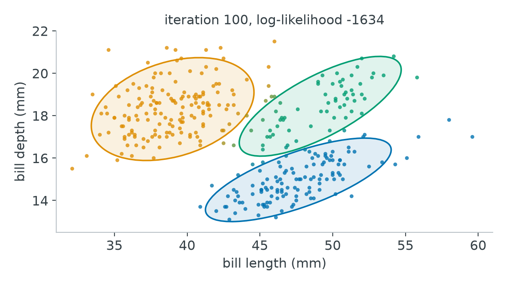

class: middle, center, title-slide

# Foundations of Data Science

Lecture 8: Expectation-maximization

  
Prof. Gilles Louppe 
[g.louppe@uliege.be](mailto:g.louppe@uliege.be)

---

class: middle

.center.width-70[]

.question[How many groups are there, and which penguin belongs to which?]

---

class: middle

## Gaussian mixture model

We model the bills $\mathbf{x}\_i \in \mathbb{R}^2$ as a mixture of $K = 3$ Gaussian components, with latent variables $z\_i \in \\{1, \ldots, K\\}$ labelling the component of each penguin,
$$\begin{aligned}
p(z\_i = k \mid \theta) &= \pi\_k, \\\\
p(\mathbf{x}\_i \mid z\_i = k, \theta) &= \mathcal{N}(\mathbf{x}\_i \mid \boldsymbol{\mu}\_k, \boldsymbol{\Sigma}\_k),
\end{aligned}$$
where the parameters $\theta = (\boldsymbol{\pi}, \boldsymbol{\mu}\_{1:K}, \boldsymbol{\Sigma}\_{1:K})$ are the weights, means and covariances of the components.

.center.width-50[]

---

class: middle

## Maximum likelihood

Summing out the latent variables gives the log-likelihood
$$\begin{aligned}
\log p(\mathbf{x}\_{1:N} \mid \theta) &= \sum\_{i=1}^N \log \sum\_{k=1}^K p(\mathbf{x}\_i, z\_i = k \mid \theta) \\\\
&= \sum\_{i=1}^N \log \sum\_{k=1}^K \pi\_k \mathcal{N}(\mathbf{x}\_i \mid \boldsymbol{\mu}\_k, \boldsymbol{\Sigma}\_k).
\end{aligned}$$
Its maximum has no closed-form solution.

.alert[More generally, latent variable models have sums or integrals inside the logarithm, which are often intractable even to evaluate.]

---

class: middle

## If the components were known...

With the $z\_i$ known, the complete-data log-likelihood splits into one term per component,
$$\log p(\mathbf{x}\_{1:N}, z\_{1:N} \mid \theta) = \sum\_{i=1}^N \log \pi\_{z\_i} + \sum\_{i=1}^N \log \mathcal{N}(\mathbf{x}\_i \mid \boldsymbol{\mu}\_{z\_i}, \boldsymbol{\Sigma}\_{z\_i}).$$
Setting its gradients to zero gives the mean, the covariance and the fraction of the $N\_k$ penguins in each component,
$$\begin{aligned}
\boldsymbol{\mu}\_k &= \frac{1}{N\_k} \sum\_{i : z\_i = k} \mathbf{x}\_i, \\\\
\boldsymbol{\Sigma}\_k &= \frac{1}{N\_k} \sum\_{i : z\_i = k} (\mathbf{x}\_i - \boldsymbol{\mu}\_k)(\mathbf{x}\_i - \boldsymbol{\mu}\_k)^T, \\\\
\pi\_k &= \frac{N\_k}{N}.
\end{aligned}$$

---

class: middle

.center.width-10[]

.center[What if we alternate between inferring the latent variables  and fitting the parameters?]

---

class: middle

# Expectation-maximization

---

class: middle

.center.width-50[]

Consider a latent variable model $p(\mathbf{x}, \mathbf{z} \mid \theta)$. We look for the maximum likelihood estimate
$$\hat{\theta} = \arg\max\_\theta \log p(\mathbf{x} \mid \theta), \quad \text{with } p(\mathbf{x} \mid \theta) = \int p(\mathbf{x}, \mathbf{z} \mid \theta) d\mathbf{z}.$$

---

class: middle

## Jensen's inequality

Since the logarithm is concave, .bold[Jensen's inequality] gives
$$\log \mathbb{E}[Y] \geq \mathbb{E}[\log Y]$$
for any positive random variable $Y$, with equality when $Y$ is constant.

.center.width-70[]

.center[$Y$ takes the values $y\_1$ and $y\_2$ with probability 1/2 each.  The mean of the logarithms lies on the chord, below the logarithm of the mean.]

---

class: middle

## Kullback-Leibler divergence

Recall the Kullback-Leibler divergence between two distributions $q$ and $p$,
$$\text{KL}(q \\| p) = \mathbb{E}\_{q(\mathbf{z})}\left[\log \frac{q(\mathbf{z})}{p(\mathbf{z})}\right].$$
It is nonnegative, and zero only when $q = p$, since by Jensen's inequality
$$-\text{KL}(q \\| p) = \mathbb{E}\_{q}\left[\log \frac{p(\mathbf{z})}{q(\mathbf{z})}\right] \leq \log \mathbb{E}\_{q}\left[\frac{p(\mathbf{z})}{q(\mathbf{z})}\right] = \log 1 = 0.$$

.center.width-70[]

---

class: middle

## Evidence lower bound

For any distribution $q(\mathbf{z})$,
$$\begin{aligned}
\log p(\mathbf{x} \mid \theta) &= \log \mathbb{E}\_{q(\mathbf{z})}\left[\frac{p(\mathbf{x}, \mathbf{z} \mid \theta)}{q(\mathbf{z})}\right] \\\\
&\geq \mathbb{E}\_{q(\mathbf{z})}\left[\log \frac{p(\mathbf{x}, \mathbf{z} \mid \theta)}{q(\mathbf{z})}\right] = \mathcal{L}(q, \theta),
\end{aligned}$$
where $\mathcal{L}(q, \theta)$ is the .bold[evidence lower bound] (ELBO).

Writing $p(\mathbf{x}, \mathbf{z} \mid \theta) = p(\mathbf{z} \mid \mathbf{x}, \theta) p(\mathbf{x} \mid \theta)$ gives
$$\log p(\mathbf{x} \mid \theta) = \mathcal{L}(q, \theta) + \text{KL}(q(\mathbf{z}) \\| p(\mathbf{z} \mid \mathbf{x}, \theta)).$$
The gap is zero when $q$ is the posterior $p(\mathbf{z} \mid \mathbf{x}, \theta)$.

---

class: middle

.center.width-70[]

.center[For $q$ other than the posterior at $\theta^{(t)}$, the ELBO lies below the log-likelihood.]

---

class: middle

.center.width-70[]

.center[With $q$ set to the posterior at $\theta^{(t)}$, the gap at $\theta^{(t)}$ vanishes.]

---

class: middle

## Expectation-maximization algorithm

EM maximizes the ELBO over $q$ and $\theta$ in turn. Starting from $\theta^{(0)}$, it repeats
- .bold[E-step]: $q^{(t+1)} = \arg\max\_q \mathcal{L}(q, \theta^{(t)})$,
- .bold[M-step]: $\theta^{(t+1)} = \arg\max\_\theta \mathcal{L}(q^{(t+1)}, \theta)$.

---

class: middle

The E-step sets $q$ to the posterior,
$$q^{(t+1)}(\mathbf{z}) = p(\mathbf{z} \mid \mathbf{x}, \theta^{(t)}).$$
.italic[Proof.] $\mathcal{L}(q, \theta^{(t)}) = \log p(\mathbf{x} \mid \theta^{(t)}) - \text{KL}(q(\mathbf{z}) \\| p(\mathbf{z} \mid \mathbf{x}, \theta^{(t)}))$, and only the KL divergence depends on $q$. □

The M-step maximizes the expected complete-data log-likelihood,
$$\theta^{(t+1)} = \arg\max\_\theta \mathbb{E}\_{q^{(t+1)}(\mathbf{z})}\left[\log p(\mathbf{x}, \mathbf{z} \mid \theta)\right].$$
.italic[Proof.] $\mathcal{L}(q^{(t+1)}, \theta) = \mathbb{E}\_{q^{(t+1)}}\left[\log p(\mathbf{x}, \mathbf{z} \mid \theta)\right] - \mathbb{E}\_{q^{(t+1)}}\left[\log q^{(t+1)}(\mathbf{z})\right]$, and the second term does not depend on $\theta$. □

---

class: middle

.center.width-70[]

.center[The M-step moves $\theta^{(t)}$ to the maximum of the ELBO, $\theta^{(t+1)}$.]

---

class: middle

.center.width-70[]

.center[The next E-step closes the gap at $\theta^{(t+1)}$, where the log-likelihood is higher.]

---

class: middle

.italic[Proposition.] EM never decreases the log-likelihood,
$$\log p(\mathbf{x} \mid \theta^{(t)}) \leq \log p(\mathbf{x} \mid \theta^{(t+1)}) \quad \text{for all } t \geq 0.$$

.italic[Proof.]
$$\begin{aligned}
\log p(\mathbf{x} \mid \theta^{(t)}) &= \mathcal{L}(q^{(t+1)}, \theta^{(t)}) && \text{(the E-step closes the gap)} \\\\
&\leq \mathcal{L}(q^{(t+1)}, \theta^{(t+1)}) && \text{(the M-step maximizes over } \theta\text{)} \\\\
&\leq \log p(\mathbf{x} \mid \theta^{(t+1)}) && \text{(the ELBO is a lower bound)}. \quad □
\end{aligned}$$

---

class: middle

## EM for the Gaussian mixture

The E-step computes the .bold[responsibility] of component $k$ for penguin $i$,
$$r\_{ik} = q^{(t+1)}(z\_i = k) = \frac{\pi\_k \mathcal{N}(\mathbf{x}\_i \mid \boldsymbol{\mu}\_k, \boldsymbol{\Sigma}\_k)}{\sum\_{j=1}^K \pi\_j \mathcal{N}(\mathbf{x}\_i \mid \boldsymbol{\mu}\_j, \boldsymbol{\Sigma}\_j)},$$
with the parameters $\theta^{(t)}$.

---

class: middle

The M-step maximizes
$$\sum\_{i=1}^N \sum\_{k=1}^K r\_{ik} \left[\log \pi\_k + \log \mathcal{N}(\mathbf{x}\_i \mid \boldsymbol{\mu}\_k, \boldsymbol{\Sigma}\_k)\right],$$
which gives the estimates for known components, with each penguin weighted by $r\_{ik}$ and $N\_k = \sum\_{i} r\_{ik}$,
$$\begin{aligned}
\boldsymbol{\mu}\_k^{(t+1)} &= \frac{1}{N\_k} \sum\_{i=1}^N r\_{ik} \mathbf{x}\_i, \\\\
\boldsymbol{\Sigma}\_k^{(t+1)} &= \frac{1}{N\_k} \sum\_{i=1}^N r\_{ik} (\mathbf{x}\_i - \boldsymbol{\mu}\_k^{(t+1)})(\mathbf{x}\_i - \boldsymbol{\mu}\_k^{(t+1)})^T, \\\\
\pi\_k^{(t+1)} &= \frac{N\_k}{N}.
\end{aligned}$$

---

class: middle

.center.width-70[]

.center[Each penguin is coloured by its responsibilities,  each component drawn at two standard deviations.]

---

class: middle
count: false

.center.width-70[]

.center[Each penguin is coloured by its responsibilities,  each component drawn at two standard deviations.]

---

class: middle
count: false

.center.width-70[]

.center[Each penguin is coloured by its responsibilities,  each component drawn at two standard deviations.]

---

class: middle
count: false

.center.width-70[]

.center[Each penguin is coloured by its responsibilities,  each component drawn at two standard deviations.]

---

class: middle
count: false

.center.width-70[]

.center[Each penguin is coloured by its responsibilities,  each component drawn at two standard deviations.]

---

class: middle
count: false

.center.width-70[]

.center[Each penguin is coloured by its responsibilities.  The three components match the species of 96% of the penguins.]

---

class: middle

.center.width-90[]

.center[Two runs of EM from different initial values. The second stops at a local maximum.  In practice, EM is run from several initial values, and the best run is kept.]

---

class: middle

## Empirical Bayes

In a Bayesian model, the prior $p(\theta \mid \alpha)$ has hyperparameters $\alpha$. .bold[Empirical Bayes] estimates them from the data, as
$$\hat{\alpha} = \arg\max\_\alpha p(\mathbf{x} \mid \alpha) = \arg\max\_\alpha \iint p(\mathbf{x}, \mathbf{z} \mid \theta) p(\theta \mid \alpha) d\mathbf{z} d\theta,$$
and uses the prior $p(\theta \mid \hat{\alpha})$.

.alert[The data are used twice, to set the prior and to update it. Empirical Bayes is unorthodox from a Bayesian perspective, but often works well in practice.]

---

class: middle

.center.width-50[]

EM applies, with both $\mathbf{z}$ and $\theta$ as latent variables.
- E-step: $q^{(t+1)}(\mathbf{z}, \theta) = p(\mathbf{z}, \theta \mid \mathbf{x}, \alpha^{(t)})$.
- M-step: $\alpha^{(t+1)} = \arg\max\_\alpha \mathbb{E}\_{q^{(t+1)}(\theta)}\left[\log p(\theta \mid \alpha)\right]$.

---

class: middle

## Learning diffusion priors by EM

EM can learn a prior given by a diffusion model, from noisy and incomplete observations only.

.center.width-90[]

.footnote[Credits: [Rozet et al](https://arxiv.org/abs/2405.13712), 2024.]

---

class: middle

.center.width-90[]

.footnote[Credits: [Rozet et al](https://arxiv.org/abs/2405.13712), 2024.]

---

class: middle

## Beyond EM

The E-step needs the exact posterior $p(\mathbf{z} \mid \mathbf{x}, \theta)$. When it is intractable, the ELBO can still be maximized over a family of simpler distributions $q$. This is .bold[variational inference].

---

class: end-slide, center
count: false

The end.
