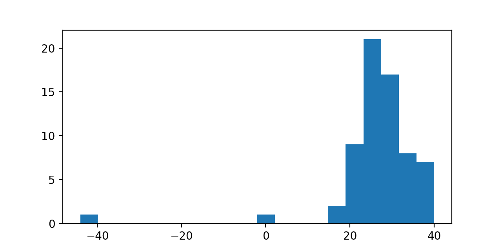
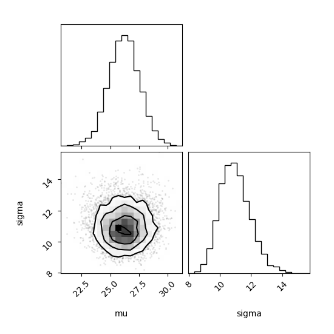
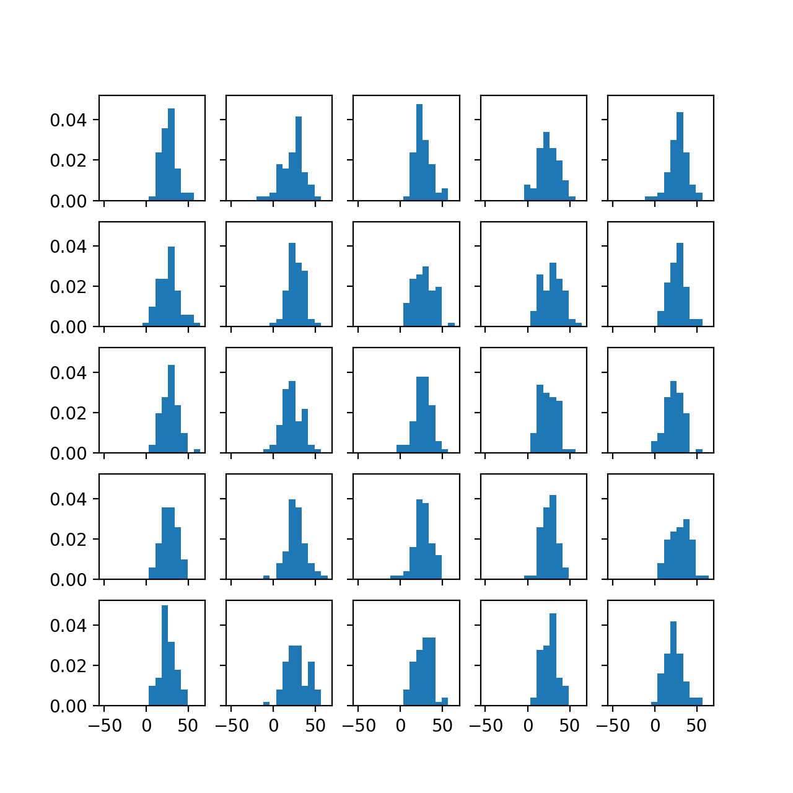
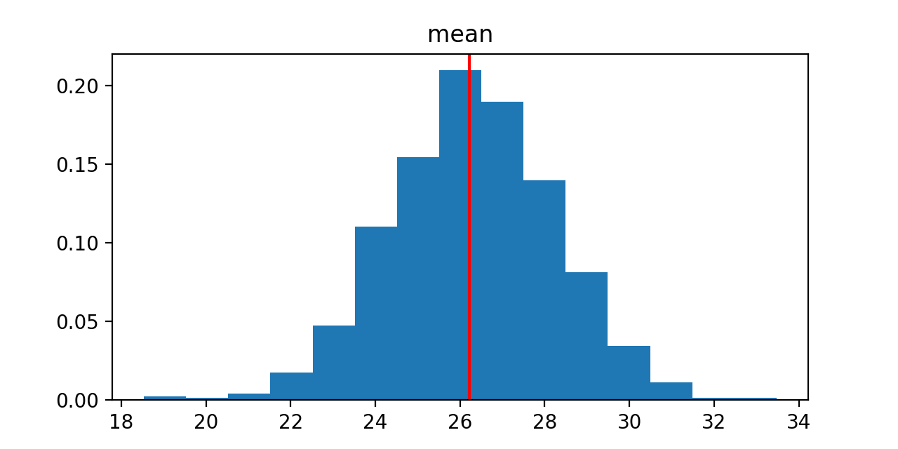
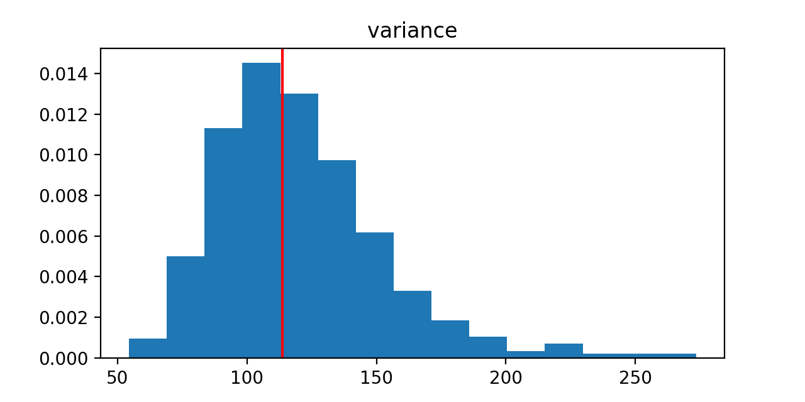
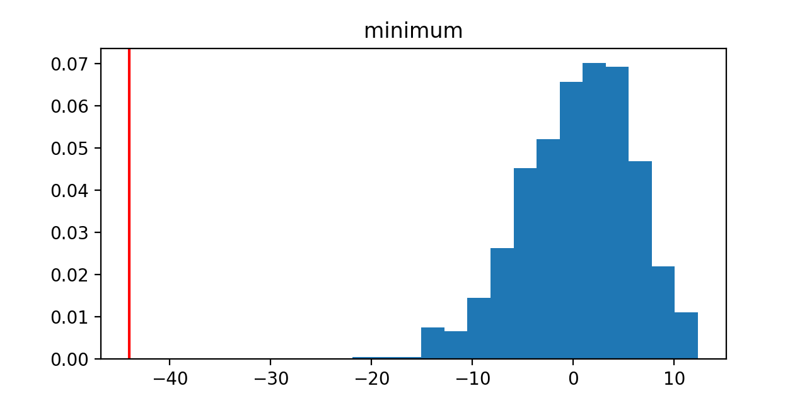
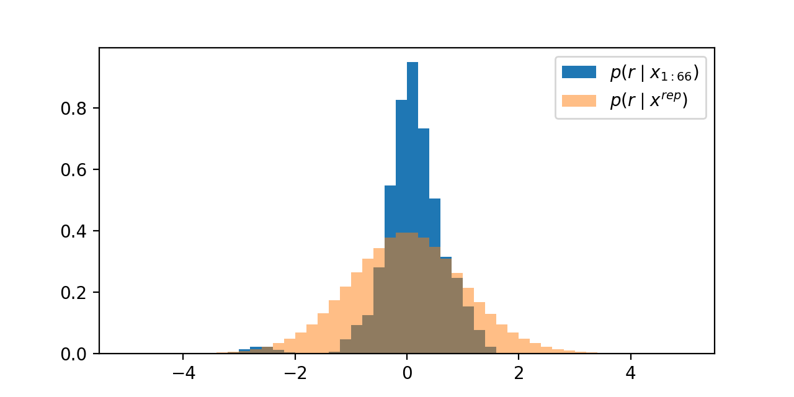
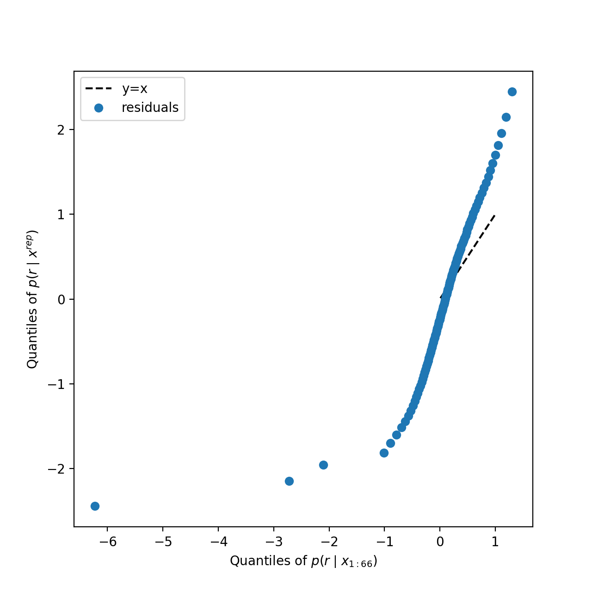
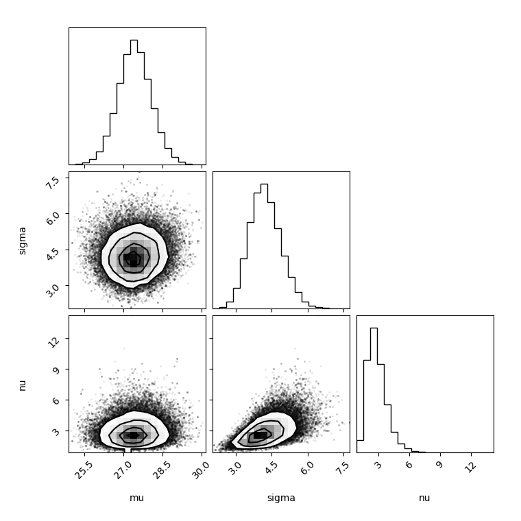
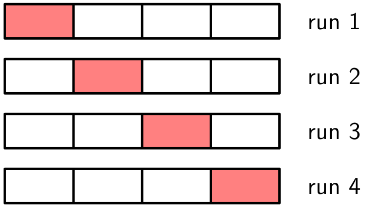

class: middle, center, title-slide

# Foundations of Data Science

Lecture 9: Model criticism and comparison

  
Prof. Gilles Louppe 
[g.louppe@uliege.be](g.louppe@uliege.be)

???

XXX add an example of the Occam's razor effect

---

class: middle, black-slide

.center[
<iframe width="640" height="400" src="https://www.youtube.com/embed/LIxvQMhttq4?cc_load_policy=1&hl=en&version=3" frameborder="0" allowfullscreen></iframe>
]

.center[If it (a model) disagrees with experiment, it is wrong.  In that simple statement is the key to science. -- Richard Feynman]

---

class: middle

# Model checking 

---

class: middle

## Newcomb's experiment (1882)

In a famous experiment, Simon Newcomb measured the speed of light using a rotating octagonal mirror. He collected 66 measurements of the time taken by light to travel a known distance.
.center.width-100[]
.center[Histogram of Newcomb's measurements of the speed of light  (in deviations from 24800 nanoseconds).]

---

class: middle

We consider a simple Gaussian model for these measurements:

.center[]

$$\begin{aligned}
\mu &\sim \mathcal{U}(-1000, 1000) \\\\
\sigma &\sim \mathcal{U}(0.1, 1000) \\\\
x_n &\sim \mathcal{N}(\mu, \sigma^2) \\quad \text{for } n=1,\ldots,66.
\end{aligned}$$

---

class: middle

Using MCMC, we obtain samples from the posterior $p(\mu, \sigma \mid x\_{1:N})$:
.center.width-70[]

---

class: middle

From the samples, we can estimate the speed of light (in deviations from 24800 nanoseconds) as the empirical mean of the posterior samples of $\mu$,
$$ \hat{\mu} = \frac{1}{M} \sum_{m=1}^M \mu^{(m)} = 26.20949771717204 \text{ nanoseconds}. $$

.alert[Reporting this many digits is misleading, as it suggests a precision that is not supported by the data or model. Do not report more digits than justified by the uncertainty in the estimate $\hat{\mu}$!]

---

class: middle

## Credible intervals

In the Bayesian framework, .bold[credible intervals] provide a way to quantify uncertainty in parameter estimates. 

Assuming a joint model $p(\theta, x)$ over parameters $\theta$ and data $x$, a credible interval at level $1 - \alpha$ is an interval $[a, b]$ such that
$$ P(a \leq \theta \leq b \mid x) = 1 - \alpha. $$
The highest posterior density (HPD) interval is a common choice, defined as the narrowest interval containing $1 - \alpha$ of the posterior probability.

---

class: middle

For our speed of light estimate, a 95% credible interval would be computed from the posterior samples of $\mu$ as the interval between the 2.5th and 97.5th percentiles of the samples, yielding
$$ [\mu\_{2.5\%}, \mu\_{97.5\%}] = (23.71, 28.89). $$

.alert[Note that credible intervals capture our Bayesian uncertainty about parameter estimates given the data $x$, unlike .bold[Frequentist confidence intervals] which would capture the variability of estimates across hypothetical repeated samples, assuming the parameters are fixed but unknown.]

---

class: middle

## Posterior predictive checks

The posterior predictive distribution is the distribution
$$ p(x^{\text{rep}} \mid x) = \int p(x^{\text{rep}} \mid \theta) p(\theta \mid x) d\theta$$
of replicated data $x^{\text{rep}}$ given observed data $x$.

.success[If our model is a good fit to the data, then replicated data $x^{\text{rep}}$ drawn from the posterior predictive distribution should resemble the observed data $x$: .bold[posterior predictive checks] involve comparing the observed data to replicated datasets simulated from the posterior predictive distribution.]

---

class: middle

In our example, we generate replicated datasets by 
- sampling parameters $(\mu^{(m)}, \sigma^{(m)}) \sim p(\mu, \sigma \mid x\_{1:N})$ from the posterior, 
- and simulating new data points $x_n^{\text{rep}(m)} \sim \mathcal{N}(\mu^{(m)}, \sigma^{2(m)})$ for $n=1,\ldots,N$ and $m=1,\ldots,M$.

---

class: middle

.center.width-70[]
.center[Histograms of 25 replicated datasets drawn  from the posterior predictive distribution.]

---

class: middle

To quantify specific aspects of the model fit, we can also compare .bold[summary statistics] $T(x)$ of the observed data to the distribution $p(T(x^{\text{rep}}))$ of those statistics computed on replicated datasets.

---

class: middle

.center.width-60[]
.center.width-60[]

For our Gaussian model, posterior predictive distributions of the mean and variance of replicated datasets are consistent with the observed statistics, indicating a good fit in terms of location and spread.

---

class: middle

.center.width-60[]

For the minimum statistic, however, the situation is different. The observed statistic is poorly captured, indicating a potential model misfit.

---

class: middle

Beyond visual checks, we can also quantify whether the observed statistics are extreme under the posterior predictive distribution, using .bold[Bayesian p-values] defined as
$$P(T(x^{\text{rep}}) \geq T(x) \mid x) = \int P(T(x^{\text{rep}}) \geq T(x) \mid \theta) p(\theta \mid x) d\theta.$$
A Bayesian p-value close to 0 or 1 indicates a poor model fit for the statistic $T$.

.alert[Note that Bayesian p-values differ from Frequentist p-values, as they account for uncertainty in parameters via the posterior distribution, whereas Frequentist p-values condition on fixed parameter values.]

---

class: middle

For our example, we find the following Bayesian p-values:
- Mean: 0.513
- Variance: 0.528
- Minimum: 1.0

The extreme p-value for the minimum statistic confirms the poor fit of our Gaussian model to the lower tail of the data. 

---

class: middle

## Residual analysis

When we have multiple observations $x\_{1:N}$, another way to assess model fit is through .bold[residual analysis].
Assuming the model is composed of a deterministic function plus additive noise, i.e.,
$$ x\_n = f(\theta) + \sigma\epsilon\_n,$$
where $\sigma$ is a scale parameter and $\epsilon\_n \sim p(\epsilon)$, (standardized) .bold[residuals] are defined as
$$ r\_n = \frac{x\_n - f(\theta)}{\sigma} $$
for $n=1,\ldots,N$ and $\theta \sim p(\theta \mid x\_{1:N})$.

---

class: middle

If the model is appropriate, the distribution of residuals $p(r \mid x\_{1:N})$ for the observed data should match the distribution $p(r \mid x^{\text{rep}})$ of residuals for replicated data.

If the posterior is concentrated, then residuals should approximately follow the noise distribution $p(\epsilon)$.

---

class: middle

For our Gaussian model, standardized residuals are computed as
$$r\_n = \frac{x\_n - \mu}{\sigma},$$
for $n=1,\ldots,66$ and $\mu, \sigma \sim p(\mu, \sigma \mid x\_{1:66})$.

.center.width-70[]

---

class: middle

A .bold[quantile-quantile (Q-Q) plot] compares the quantiles of two distributions.

In our context, a Q-Q plot can be used to compare the distribution of residuals for the observed data to the distribution of residuals for replicated data. Systematic deviations from the diagonal line indicate model misfit.

---

class: middle

.center.width-70[]
.center[Deviations from the diagonal line indicate model misfit, particularly in the lower tail.]

---

class: middle

.center.width-10[]

In summary, model checking provides a principled way to assess model fit by comparing observed data to data simulated from the model, using both visualizations and summary statistics.

It is meant to reveal .bold[model misspecifications]     and failures, guiding us towards better models.

---

class: middle

# Model comparison

---

class: middle

We now assume an alternative .italic[t]-location-scale model for Newcomb's data to account for the heavy tails observed in the measurements:

.center[]

$$\begin{aligned}
\mu &\sim \mathcal{U}(-1000, 1000) \\\\
\sigma &\sim \mathcal{U}(0.1, 1000) \\\\
\nu &\sim \text{Gamma}(2, 0.1) \\\\
\epsilon\_n &\sim t_{\nu} \\\\
x\_n &= \mu + \sigma \epsilon\_n \\quad \text{for } n=1,\ldots,66.
\end{aligned}$$

---

class: middle

Again, we use MCMC to obtain samples from the posterior $p(\mu, \sigma, \nu \mid x\_{1:N})$ under this new model.
.center.width-70[]

---

class: middle

## Bayes factors

Assume we have two competing models, $\mathcal{M}\_1$ and $\mathcal{M}\_2$. As good Bayesian citizens, we also assign prior probabilities to each model, $p(\mathcal{M}\_1)$ and $p(\mathcal{M}\_2)$.

The Bayesian approach to model comparison then consists in comparing the posterior probabilities of each model given the data $x$,
$$\begin{aligned}
\frac{p(\mathcal{M}\_1 \mid x)}{p(\mathcal{M}\_2 \mid x)} &= \frac{p(x \mid \mathcal{M}\_1)}{p(x \mid \mathcal{M}\_2)} \frac{p(\mathcal{M}\_1)}{p(\mathcal{M}\_2)}
\end{aligned}$$
where the first term on the right-hand side is called the .bold[Bayes factor] $\text{BF}\_{1,2}$.

---

class: middle

The Bayes factor quantifies how much more likely the observed data is under one model compared to another.  If $\text{BF}\_{1,2} > 1$, the data favors model $\mathcal{M}\_1$ over $\mathcal{M}\_2$, and vice versa.

A common scale for interpreting Bayes factors is:
- 1 to 3: Weak evidence
- 3 to 10: Moderate evidence
- 10+: Strong evidence

.success[For Newcomb's data, we find that $\log \text{BF}\_{t, \text{Gaussian}} \approx 30$, indicating strong evidence in favor of the .italic[t]-location-scale model over the Gaussian model.]

---

class: middle

In practice, evaluating Bayes factors requires computing the .bold[marginal likelihoods] $$p(x \mid \mathcal{M}\_i) = \int p(x \mid \theta, \mathcal{M}\_i) p(\theta \mid \mathcal{M}\_i) d\theta,$$ which is typically challenging, even for simple models.

---

class: middle

One practical approach to approximate the marginal likelihood is the .bold[Laplace approximation].

Let $\hat{\theta} = \arg\max\_{\theta} p(\theta \mid x, \mathcal{M})$ be the MAP estimate. The Laplace approximation approximates the posterior as
$$p(\theta \mid x, \mathcal{M}) \approx \mathcal{N}(\theta \mid \hat{\theta}, \Sigma)$$
where $\Sigma$ is the inverse Hessian of $-\log p(\theta \mid x, \mathcal{M})$ evaluated at $\hat{\theta}$.

---

class: middle

Using this approximation, the marginal likelihood can be approximated as
$$\begin{aligned}
p(x \mid \mathcal{M}) &= \int p(x \mid \theta, \mathcal{M}) p(\theta \mid \mathcal{M}) d\theta \\\\
&\approx p(x \mid \hat{\theta}, \mathcal{M}) p(\hat{\theta} \mid \mathcal{M}) (2\pi)^{d/2} |\Sigma|^{1/2}
\end{aligned}$$
where $(2\pi)^{d/2} |\Sigma|^{1/2}$ is the volume of the Gaussian approximation and $d$ is the dimension of $\theta$.

---

class: middle

.center.width-10[]

Finally, Bayes factors inherently penalize model complexity. More complex models spread prior mass over larger parameter spaces, resulting in lower marginal likelihoods unless the data strongly supports the added complexity. This automatic penalization is the .bold[Bayesian Occam's razor] effect.

---

class: middle

## Cross-validation

An alternative approach to model comparison is .bold[cross-validation], which estimates the predictive performance of models on held-out data.

Assume we have a dataset $x\_{1:N}$ and we want to evaluate how well a model $\mathcal{M}$ predicts unseen data.

---

class: middle

The most common form of cross-validation is .bold[k-fold cross-validation], where the data $x\_{1:N}$ is partitioned into $k$ equally sized folds of $N/k$ observations each. 

Each fold is used once as a validation set while the remaining $k-1$ folds form the training set. The predictive performance is averaged over the $k$ folds.

 

.center.width-50[]

---

class: middle

A built-in performance metric for Bayesian models is the .bold[expected log predictive density (ELPD)], defined as
$$\mathbb{E}\_{p\_{\text{true}}(x')}[\log p(x' | x)]$$
where $p\_{\text{true}}(x')$ is the true data-generating distribution and $p(x' | x)$ is the posterior predictive distribution given observed data $x$ (those in the training set).

ELPD ideally combines with cross-validation, as held-out data can be used to estimate the expectation.

.success[For Newcomb's data, using 5-fold cross-validation, we find that the ELPD for the .italic[t]-location-scale model (EPLD=$-48$) is higher than that of the Gaussian model (EPLD=$-68$), confirming its superior predictive performance.]

---

class: end-slide, center
count: false

The end.
